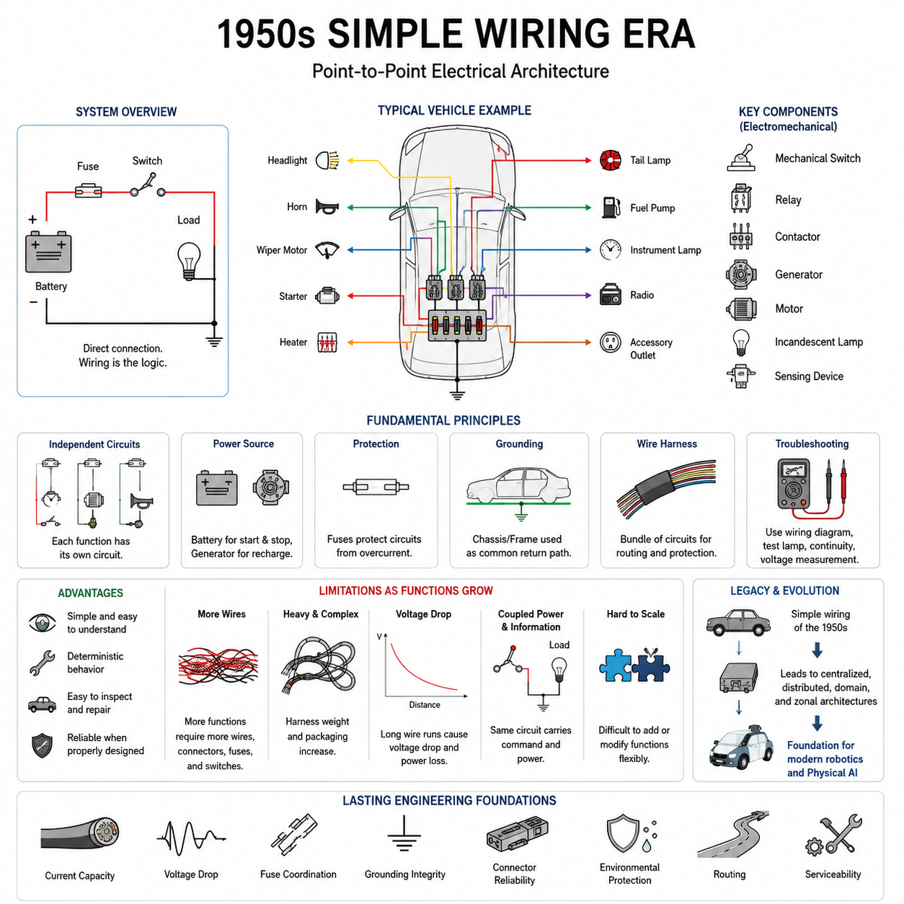
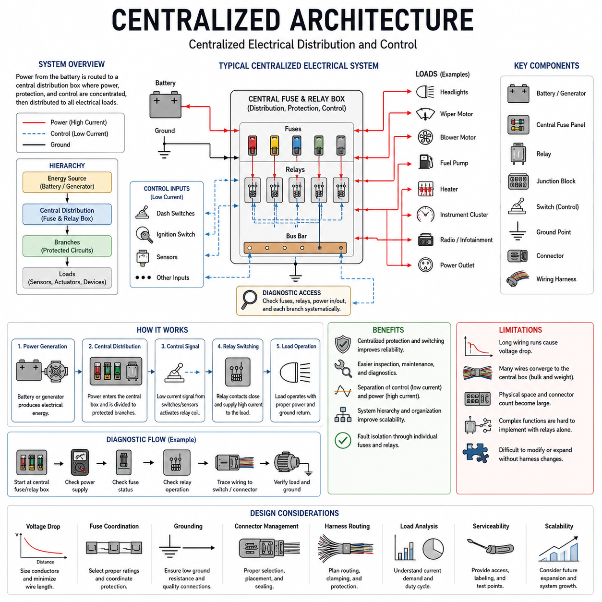
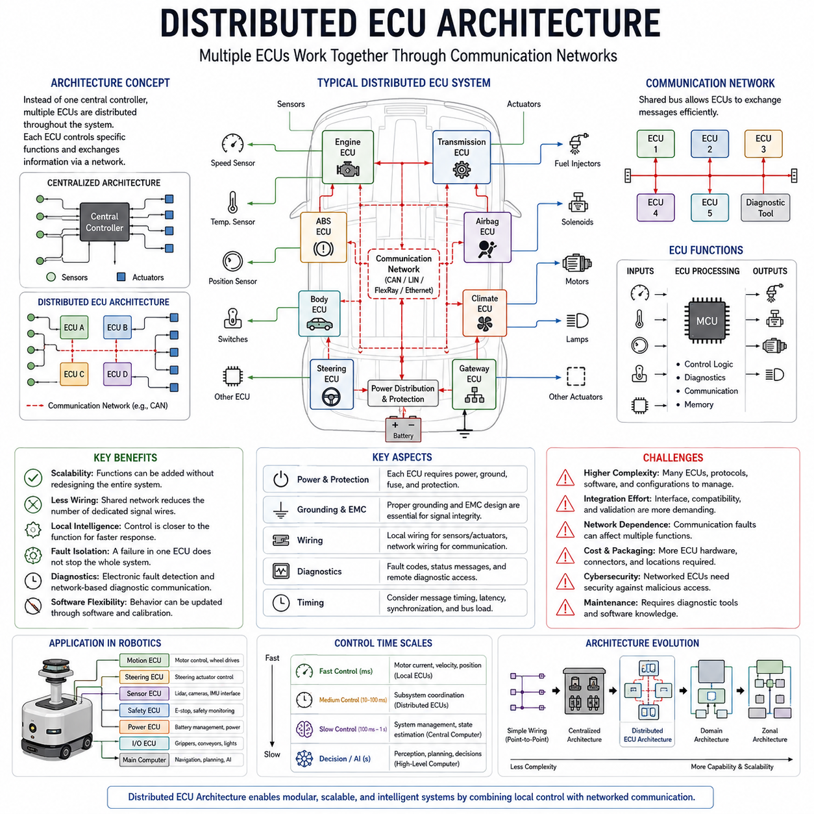
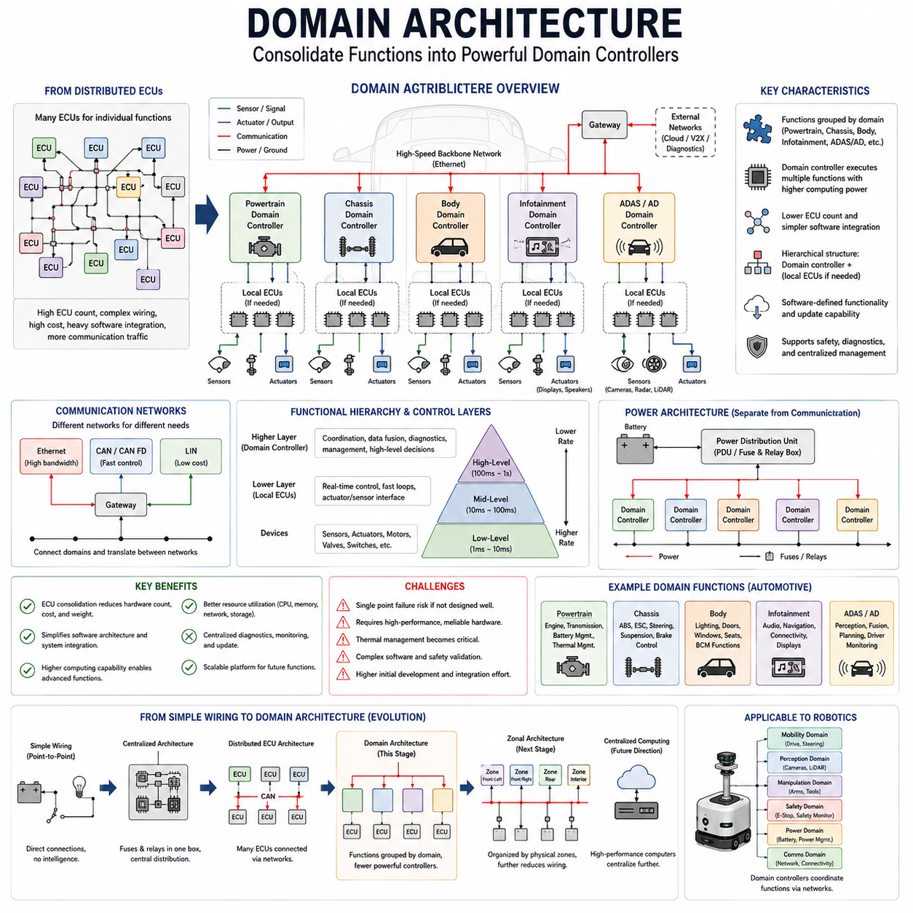
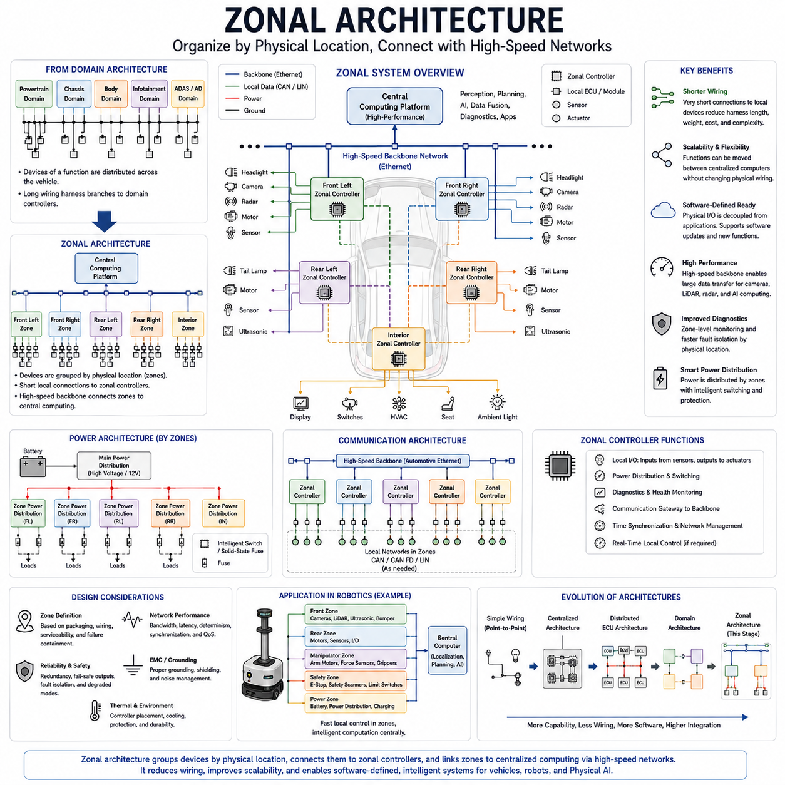
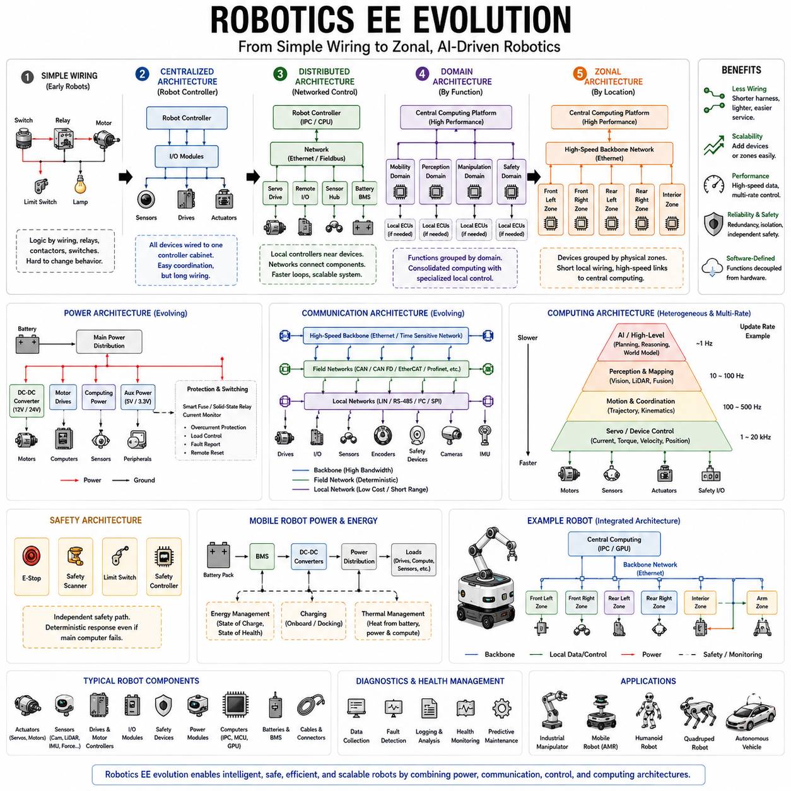

**Volume 01. Electrical Architecture Fundamentals**

# Chapter 01. History of EE Architecture

## 01.01. 1950s Simple Wiring Era

{width="7.268055555555556in" height="7.268055555555556in"}

1950년대는 전기 아키텍처(Electrical Architecture)가 단순한 지점 간 배선(Point-to-Point Wiring)을 중심으로 구성되던 시대였다. 전기 시스템(Electrical System)의 규모는 비교적 작았으며, 대부분의 기능은 전원(Power Source), 스위치(Switch), 부하(Load), 접지(Ground)를 전용 전선으로 직접 연결하여 구현되었다. 전자 제어 장치(ECU), 디지털 네트워크(Digital Network), 소프트웨어 정의 기능(Software-Defined Function)은 존재하지 않았다.

일반적인 전기 기능(Electrical Function)은 하나의 부품에서 다른 부품으로 연결된 실제 전선을 따라가면서 이해할 수 있었다. 운전자나 기계 작업자가 스위치(Switch)를 작동시키면 전류(Electrical Current)가 램프(Lamp), 모터(Motor), 솔레노이드(Solenoid), 히터(Heater) 또는 다른 부하(Load)로 직접 흘렀다. 따라서 배선(Wiring) 자체가 물리적 연결과 전기 시스템의 기능 논리(Functional Logic) 상당 부분을 동시에 표현하였다.

이러한 아키텍처는 전기기계 기술(Electromechanical Technology)의 영향을 크게 받았다. 기계식 스위치(Mechanical Switch), 릴레이(Relay), 접촉기(Contactor), 발전기(Generator), 모터(Motor), 백열등(Incandescent Lamp), 기본적인 감지 장치(Sensing Device)가 주요 구성 요소였다. 릴레이는 비교적 작은 제어 전류(Control Current)를 이용하여 더 큰 부하 전류(Load Current)를 전환함으로써 조작 장치와 고전력 회로(High-Power Circuit)를 분리할 수 있게 하였다.

전기 기능(Electrical Function)은 일반적으로 서로 독립되어 있었다. 조명 회로(Lighting Circuit)는 자체적인 스위치, 퓨즈(Fuse), 전선, 램프로 구성될 수 있었으며, 경적(Horn), 시동 장치(Starter), 와이퍼 모터(Wiper Motor), 보조 장치는 각각 별도의 전용 회로를 사용하였다. 기능 사이에 교환해야 하는 정보가 거의 없었기 때문에 통신 네트워크(Communication Network)나 중앙집중식 전자 처리(Centralized Electronic Processing)의 필요성도 제한적이었다.

배터리(Battery)와 발전기(Generator)는 많은 이동형 전기 시스템(Mobile Electrical System)의 기반을 형성하였다. 배터리는 엔진이 정지된 상태에서 에너지를 공급하고 시동과 같은 고전류 부하(High-Current Load)를 지원했으며, 발전기는 운전 중 전기 에너지를 다시 공급하였다. 당시에는 현대의 차량, 로봇, 자동화 기계와 비교하여 전기 부하의 수가 적었기 때문에 전력 분배(Power Distribution) 역시 비교적 단순하였다.

그러나 회로 보호(Circuit Protection)는 당시에도 필수적이었다. 중요한 분기 회로에는 퓨즈(Fuse)를 배치하여 단락(Short Circuit)이나 과부하(Overload)로 과도한 전류가 발생할 경우 배선이 과열되기 전에 해당 전기 경로를 차단하였다. 이를 통해 전력 분배는 도체 허용 용량(Conductor Capacity), 부하 특성(Load Characteristics), 보호 장치(Protection Device)와 함께 설계되어야 한다는 기본적인 아키텍처 원칙이 형성되었다.

접지(Grounding) 방식도 비교적 단순하였다. 차량과 많은 기계에서는 금속 차체(Chassis) 또는 프레임(Frame)을 공통 전기 귀환 경로(Common Electrical Return Path)로 활용하여 별도의 귀환 배선(Return Wiring)을 줄일 수 있었다. 이러한 방식은 비용과 와이어 하니스(Wire Harness)의 복잡성을 줄였지만, 안정적인 전기 성능을 위해서는 양호한 기계적 접속, 적절한 접지 지점(Grounding Point), 부식(Corrosion) 방지가 중요하였다.

당시의 와이어 하니스(Wire Harness)는 기본적으로 여러 개의 개별 회로를 설치와 기계적 보호를 위해 하나로 묶은 구조였다. 하니스 엔지니어링(Harness Engineering)은 주로 도체 크기(Conductor Size), 절연(Insulation), 배선 경로(Routing), 단자 처리(Termination), 마모 방지(Abrasion Protection), 정비성(Serviceability)에 집중하였다. 따라서 아키텍처는 전자 네트워크나 소프트웨어를 통해 추상화되기보다 기계의 물리적 배치와 직접적으로 연결되어 있었다.

고장 진단(Troubleshooting) 역시 이러한 물리적 아키텍처를 반영하였다. 기술자는 일반적으로 배선도(Wiring Diagram), 테스트 램프(Test Lamp), 연속성 측정(Continuity Measurement), 전압 측정(Voltage Measurement)을 사용하여 개별 회로의 고장을 추적하였다. 전원에서 시작하여 퓨즈와 스위치를 거쳐 부하까지 전기 경로를 따라가고, 이후 접지로 연결되는 귀환 경로를 점검함으로써 많은 고장을 찾아낼 수 있었다.

단순한 지점 간 배선(Point-to-Point Wiring)은 여러 가지 장점을 제공하였다. 회로의 개념적 구조가 명확하고 동작이 일반적으로 결정론적(Deterministic)이었으며, 개별 고장을 복잡한 진단 장비 없이도 이해할 수 있는 경우가 많았다. 기본적인 전기 지식과 배선도를 갖춘 기술자는 시스템의 상당 부분을 직접 검사하고 손상된 전선, 단자(Terminal), 스위치, 릴레이를 수리할 수 있었다.

그러나 전기 기능이 증가하면서 동일한 아키텍처는 점차 비효율적으로 변하였다. 새로운 기능을 추가할 때마다 추가적인 스위치, 전선, 커넥터(Connector), 보호 장치, 배선 공간이 필요할 수 있었다. 따라서 기능의 증가와 함께 하니스 중량(Harness Mass)과 패키징 복잡성(Packaging Complexity)이 전기 연결의 수에 거의 비례하여 증가하였으며, 이는 이후 더욱 중요한 확장성 한계(Scalability Limitation)가 되었다.

긴 배선 구간(Long Wire Run)은 전기공학적 제약도 발생시켰다. 모든 도체에는 저항(Resistance)이 존재하기 때문에 전원이나 제어 스위치에서 멀리 떨어진 고전류 부하에서는 상당한 전압 강하(Voltage Drop)가 발생할 수 있었다. 따라서 특히 모터와 같은 고부하 장치에서 과도한 손실, 발열, 성능 저하를 방지하려면 적절한 도체 크기와 릴레이 배치(Relay Placement)가 필요하였다.

이러한 아키텍처에서는 정보(Information)와 전력(Electrical Power)의 분리가 거의 이루어지지 않았다. 스위치가 특정 기능의 전류를 직접 전달하면서 부하를 제어하는 경우가 많았다. 현대 시스템은 일반적으로 저전력 명령(Low-Power Command)을 디지털 정보(Digital Information)로 전달하고 로컬 제어기(Local Controller)가 실제 부하를 동작시키지만, 단순 배선 시대에는 명령 전달과 전력 스위칭(Power Switching)이 동일한 회로 안에서 결합되는 경우가 일반적이었다.

이러한 차이는 전기전자 아키텍처(Electrical and Electronic Architecture)의 역사적 발전을 이해하는 데 중요하다. 시스템에 더 많은 기능이 추가되면서 모든 명령을 모든 부하에 직접 배선하는 방식은 점점 더 복잡해졌다. 이후 등장한 중앙집중식 제어(Centralized Control), 전자 모듈(Electronic Module), 분산 제어기(Distributed Controller), 통신 버스(Communication Bus), 도메인 제어기(Domain Controller), 조널 아키텍처(Zonal Architecture)는 이러한 직접 배선 방식의 확장성 한계를 해결하기 위한 발전 과정으로 이해할 수 있다.

시스템 엔지니어링(System Engineering)의 관점에서 보면 1950년대의 아키텍처는 기능적 관계(Functional Relationship)를 대부분 물리적으로 구현한 구조라고 볼 수 있다. 스위치, 릴레이, 부하, 퓨즈, 전선의 위치와 연결 방식이 시스템의 동작을 직접 결정하였다. 기능을 변경하려면 하드웨어 연결을 변경해야 하는 경우가 많았지만, 현대 아키텍처에서는 전자 장치, 구성 설정(Configuration), 통신, 소프트웨어를 통해 시스템 동작을 변경할 수 있다.

단순 배선 시대는 기술이 크게 발전한 오늘날에도 여전히 중요한 여러 엔지니어링 분야의 기반을 확립하였다. 전류 허용 용량(Current Capacity), 전압 강하(Voltage Drop), 퓨즈 협조(Fuse Coordination), 접지 건전성(Grounding Integrity), 커넥터 신뢰성(Connector Reliability), 환경 보호(Environmental Protection), 배선 경로(Routing), 정비성(Serviceability)은 현대 전기 시스템에서도 여전히 핵심적인 설계 요소이다.

로보틱스(Robotics)의 관점에서 이 역사적 단계는 전기 아키텍처의 발전을 이해하기 위한 유용한 기준점을 제공한다. 단순한 기계는 오늘날에도 스위치, 릴레이, 모터, 센서(Sensor), 전용 배선으로 구성할 수 있지만, 자율성(Autonomy)이 증가하면 컴퓨팅(Computing), 통신(Communication), 센싱(Sensing), 안전(Safety), 지능형 제어(Intelligent Control)가 필요해진다. 이러한 계층이 추가될수록 전기 아키텍처는 개별 회로의 집합에서 전력과 정보가 상호 연결된 시스템으로 발전한다.

현대의 피지컬 AI(Physical AI) 시스템은 계산 능력 측면에서 1950년대와 비교할 수 없을 정도로 발전했지만, 실제 물리적 동작은 결국 센서, 프로세서(Processor), 통신 장치, 모터 드라이브(Motor Drive), 액추에이터(Actuator)에 에너지를 전달하는 전기 경로에 의존한다. 따라서 단순 배선 시대를 이해하면 고도화된 지능 역시 안정적으로 전력과 신호를 전달하는 기반 전기 아키텍처 위에서만 동작할 수 있다는 원칙을 명확하게 이해할 수 있다.

따라서 이 시대의 역사적 중요성은 단순히 아키텍처가 원시적이었다는 데 있는 것이 아니라, 전기 시스템 조직의 가장 기본적인 형태를 보여준다는 데 있다. 기능(Function), 배선(Wiring), 보호(Protection), 스위칭(Switching), 부하(Load)가 직접 연결되어 그 관계를 쉽게 확인할 수 있었다. 이후의 중앙집중식 아키텍처(Centralized Architecture), 분산 아키텍처(Distributed Architecture), 도메인 아키텍처(Domain Architecture), 조널 아키텍처(Zonal Architecture)는 이러한 직접적인 물리적 관계의 한계를 극복하면서 점진적으로 추상화(Abstraction)를 도입한 발전 과정이라고 할 수 있다.

## 01.02. Centralized Architecture

{width="7.268055555555556in" height="7.268055555555556in"}

중앙집중식 아키텍처(Centralized Architecture)는 전기 시스템(Electrical System)이 순수한 독립형 지점 간 회로(Point-to-Point Circuit)만으로 처리하기에는 지나치게 복잡해지면서 등장하였다. 모든 기능을 각각 독립된 배선 경로(Wiring Path)로 동작시키는 대신, 설계자는 스위칭(Switching), 보호(Protection), 제어(Control) 기능을 중앙 위치에 집중시키기 시작하였다. 이는 단순 배선(Simple Wiring)과 이후의 분산 전자 제어(Distributed Electronic Control) 사이의 중간적인 아키텍처 발전 단계가 되었다.

중앙집중식 전기 시스템(Centralized Electrical System)에서는 배터리(Battery)나 발전기(Generator)의 전력이 일반적으로 중앙 분배 지점(Central Distribution Point)으로 전달된 후 개별 부하(Load)로 분배된다. 퓨즈 패널(Fuse Panel), 릴레이 박스(Relay Box), 정션 블록(Junction Block), 중앙 제어 어셈블리(Centralized Control Assembly)가 중요한 아키텍처 구성 요소가 되었다. 이를 통해 전력을 분배하고 보호하며 스위칭하고 진단할 수 있는 체계적인 중앙 위치가 마련되었다.

중앙집중화(Centralization)가 반드시 하나의 전자 컴퓨터가 전체 시스템을 제어한다는 의미는 아니다. 초기의 중앙집중식 아키텍처는 디지털 방식이라기보다 주로 전기적(Electrical) 또는 전기기계적(Electromechanical) 방식이었다. 릴레이(Relay), 스위치(Switch), 퓨즈(Fuse), 배선 논리(Wiring Logic)가 여전히 대부분의 기능을 구현했지만, 이러한 구성 요소가 시스템 전체에 독립적으로 흩어지는 대신 공통 분배 및 제어 위치를 중심으로 구성되었다.

중앙 퓨즈 및 릴레이 박스(Central Fuse and Relay Box)는 이러한 아키텍처 원리를 대표하는 중요한 사례가 되었다. 배터리 전력은 비교적 적은 수의 대용량 도체(High-Capacity Conductor)를 통해 박스로 입력되고, 이후 여러 개의 보호된 분기 회로(Protected Branch Circuit)로 나뉠 수 있었다. 개별 퓨즈는 특정 회로를 보호하고, 릴레이는 운전자 스위치에 전체 부하 전류를 통과시키지 않고도 저전류 제어 신호(Low-Current Control Signal)를 이용해 고전류 부하를 스위칭할 수 있게 하였다.

이러한 구성은 제어(Control)와 전력(Power)의 분리를 향상시켰다. 예를 들어 대시보드 스위치(Dashboard Switch)는 릴레이 코일(Relay Coil)을 작동시키는 데 필요한 작은 전류만 전달하고, 릴레이 접점(Relay Contact)이 램프(Lamp), 모터(Motor), 히터(Heater) 또는 기타 부하에 공급되는 더 큰 전류를 제어할 수 있었다. 이에 따라 스위치의 전기적 부담이 감소하고 고전류 전력 분배 경로(High-Current Power Distribution Path)의 배치 유연성이 향상되었다.

중앙집중식 아키텍처는 전기 시스템에 더욱 명확한 계층 구조(Hierarchy)를 도입하였다. 배터리와 충전 시스템(Charging System)이 기본 에너지원(Primary Energy Source)을 구성하고, 중앙 분배 하드웨어(Central Distribution Hardware)가 중간 계층을 형성하며, 개별 전기 부하가 최종단(Endpoint)에 위치하였다. 이에 따라 엔지니어는 기계를 서로 무관한 회로의 집합이 아니라 체계적으로 구성된 전력 분배 및 제어 시스템(Power Distribution and Control System)으로 바라보기 시작하였다.

그 결과 와이어 하니스 설계(Wire Harness Design)도 더욱 구조화되었다. 하니스 분기(Harness Branch)는 중앙 정션 또는 분배 위치에서 시작하여 서로 다른 물리적 영역에 배치된 여러 부하 그룹으로 확장될 수 있었다. 이를 통해 전기 패키징(Electrical Packaging)이 보다 체계화되었지만, 신호와 전력을 중앙 구성 요소와 원격 장치 사이에서 전달해야 했기 때문에 여전히 긴 배선 구간(Long Wiring Run)이 필요하였다.

따라서 중앙집중화는 일부 형태의 복잡성을 줄이는 동시에 새로운 복잡성을 발생시켰다. 퓨즈와 릴레이를 한곳에 집중시키면 검사와 유지보수(Maintenance)가 간단해졌지만, 하나의 대형 중앙 위치에 많은 전선과 커넥터(Connector)가 집중될 수 있었다. 전기 기능의 수가 증가하면서 중앙 정션 영역(Central Junction Area)의 밀도가 높아졌고, 하니스의 배선 경로(Routing), 식별(Identification), 커넥터 할당(Connector Allocation), 기계적 보호(Mechanical Protection)를 더욱 신중하게 설계해야 했다.

이 아키텍처는 회로 보호(Circuit Protection) 측면에서도 중요한 장점을 제공하였다. 여러 분기 회로가 명확하게 정의된 분배 위치에서 시작되므로 엔지니어는 퓨즈 정격(Fuse Rating)과 회로 할당(Circuit Assignment)을 보다 체계적으로 구성할 수 있었다. 고장을 개별 보호 분기로 격리함으로써 하나의 단락(Short Circuit)이 모든 전기 기능을 정지시키는 것을 방지하면서 과전류와 열 손상으로부터 도체를 보호할 수 있었다.

접지(Grounding) 역시 아키텍처의 기본적인 요소로 유지되었다. 차체(Chassis) 또는 프레임 접지(Frame Grounding)는 계속해서 공통 귀환 경로(Common Return Path)를 제공할 수 있었으며, 높은 전기적 신뢰성이 필요한 경우에는 전용 접지 도체(Dedicated Ground Conductor)를 사용할 수 있었다. 부하의 수가 증가하면서 접지 저항(Ground Resistance), 공유 귀환 전류(Shared Return Current), 연결 품질(Connection Quality), 접지 위치 사이의 전압 차이를 더욱 신중하게 고려해야 했다.

진단 절차(Diagnostic Procedure) 역시 중앙집중식 구성의 이점을 얻었다. 기술자는 중앙 퓨즈 또는 릴레이 위치에서 고장 진단(Troubleshooting)을 시작하여 특정 분기 회로에 전력이 정상적으로 공급되는지 확인할 수 있었다. 이후 스위치, 커넥터, 배선, 부하 방향으로 회로를 추적할 수 있었다. 이는 완전히 독립적인 배선 구조를 하나씩 탐색하는 방식보다 더욱 체계적인 진단 경로(Diagnostic Path)를 제공하였다.

그러나 중앙집중식 아키텍처는 여전히 물리적 배선(Physical Wiring)에 크게 의존하였다. 원격에 위치한 모든 램프, 모터, 센서(Sensor), 스위치, 액추에이터(Actuator)는 중앙 또는 중간 위치까지 전기적으로 연결되어야 했다. 기능이 증가함에 따라 도체와 커넥터 단자(Connector Terminal)의 수가 증가했고, 결과적으로 하니스가 무거워지고 배선 다발이 커지면서 차량과 기계 내부의 패키징이 점차 어려워졌다.

전압 강하(Voltage Drop) 역시 중요한 한계로 남아 있었다. 중앙집중식 전력 분배(Centralized Power Distribution)는 분배 지점과 전기 부하 사이에 상당한 배선 거리를 발생시킬 수 있었다. 중앙 박스에서 멀리 위치한 고전류 장치는 적절한 전압을 유지하기 위해 충분히 큰 도체가 필요했다. 따라서 하니스 길이, 도체 저항(Conductor Resistance), 커넥터 저항(Connector Resistance), 전류 요구량(Current Demand), 접지 품질(Grounding Quality)이 점점 중요한 설계 변수(Design Parameter)가 되었다.

전기 시스템에 더욱 정교한 기능적 상호작용(Functional Interaction)이 요구되면서 또 다른 한계가 나타났다. 릴레이와 하드와이어드 논리(Hardwired Logic)는 단순한 스위칭 관계를 구현하는 데 효과적이었지만, 복잡한 동작을 구현하려면 배선과 전기기계 구성 요소의 조합도 더욱 복잡해졌다. 기능을 변경하려면 단순한 소프트웨어 변경이 아니라 하니스 연결, 릴레이 구성, 스위치 또는 물리적 회로 설계를 수정해야 하는 경우가 많았다.

전자 제어 장치(Electronic Control Unit)의 발전은 이러한 상황을 점진적으로 변화시켰다. 전자 제어기는 여러 입력 신호(Input Signal)를 수신하고 전자적으로 제어 논리(Control Logic)를 실행하며 여러 출력(Output)을 명령할 수 있었다. 따라서 중앙집중식 전자 제어(Centralized Electronic Control)는 중앙집중식 전력 분배의 중요한 확장 단계가 되었으며, 하드와이어드 기능 논리의 일부를 프로그램 가능하거나 전자적으로 구현된 의사결정(Decision-Making)으로 대체하였다.

그러나 하나의 중앙집중식 제어기(Centralized Controller) 역시 확장성 제약(Scalability Constraint)에 직면하였다. 더 많은 센서와 액추에이터가 연결될수록 제어기는 더 많은 입력 및 출력 채널(Input and Output Channel), 커넥터 핀(Connector Pin), 전용 배선을 필요로 했다. 긴 센서 및 액추에이터 연결이 중앙 제어기로 집중되면서 대형 하니스 번들이 형성되었고, 패키징, 정비성(Serviceability), 전자기 적합성(Electromagnetic Compatibility), 시스템 확장 측면에서 실질적인 한계가 발생하였다.

이러한 한계는 결국 분산 ECU 아키텍처(Distributed ECU Architecture)로의 전환을 촉진하였으며, 이는 전기 아키텍처의 역사적 발전 과정에서 다음 단계에 해당한다. 모든 기능을 하나의 중앙 제어 위치에 직접 연결하는 대신, 분산 시스템(Distributed System)은 특정 기능과 가까운 위치에 전자 제어기를 배치하고 제어기들이 통신 네트워크(Communication Network)를 통해 서로 정보를 교환하도록 구성한다.

중앙집중식 아키텍처의 역사적 중요성은 시스템 수준의 조직화(System-Level Organization)를 도입했다는 점에 있다. 전기 시스템은 더 이상 단순한 직접 회로들의 집합이 아니었으며, 에너지 생성(Energy Generation), 전력 분배(Power Distribution), 보호(Protection), 제어(Control), 배선(Wiring), 부하(Load)를 위한 명확한 계층을 갖기 시작하였다. 이러한 계층적 사고(Hierarchical Thinking)는 이후 자동차, 산업, 로보틱스(Robotics), 피지컬 AI(Physical AI) 전기 아키텍처의 중요한 기반이 되었다.

로보틱스에서도 동일한 아키텍처 개념을 쉽게 확인할 수 있다. 비교적 단순한 로봇은 중앙 배터리(Central Battery), 메인 퓨즈(Main Fuse), 비상 차단 장치(Emergency Disconnect), 전력 분배 장치(Power Distribution Unit), 제어기(Controller), 그리고 모터, 센서 및 보조 장치에 전력을 공급하는 여러 분기 회로로 구성될 수 있다. 현대의 구현 방식은 정교한 전자 기술을 사용하지만, 전력과 제어 자원을 중앙 위치를 중심으로 구성한다는 기본 개념은 여전히 중요하다.

현대 아키텍처는 분산 제어기(Distributed Controller), 통신 네트워크, 도메인 제어기(Domain Controller), 조널 제어기(Zonal Controller), 고성능 컴퓨팅(High-Performance Computing)을 통해 이 단계보다 훨씬 발전하였다. 그럼에도 중앙집중식 아키텍처는 직접적인 물리 배선에서 구조화된 시스템 아키텍처(Structured System Architecture)로 전환되는 중요한 기반을 확립하였다. 전기 시스템의 복잡성이 증가하면 단순히 개별 회로를 추가하는 것이 아니라 전력, 보호, 제어, 진단, 연결성(Connectivity)을 체계적으로 구성해야 한다는 원칙을 보여주었다.

## 01.03. Distributed ECU Architecture

{width="7.268055555555556in" height="7.268055555555556in"}

분산 ECU 아키텍처(Distributed ECU Architecture)는 센서(Sensor), 액추에이터(Actuator), 전자 제어 기능(Electronically Controlled Function)의 수가 증가하면서 중앙집중식 전기 시스템(Centralized Electrical System)을 효율적으로 확장하기 어려워짐에 따라 등장하였다. 모든 신호와 제어 배선을 하나의 중앙 제어기로 연결하는 대신, 여러 전자 제어 장치(Electronic Control Unit, ECU)를 차량이나 기계 전체에 분산 배치하고 특정 기능이나 서브시스템(Subsystem)을 담당하도록 구성하였다.

전자 제어 장치(ECU)는 입력 신호(Input Signal)를 수신하고 제어 논리(Control Logic)를 실행한 후 연결된 장치에 출력(Output)을 생성하는 임베디드 전자 제어기(Embedded Electronic Controller)이다. 일반적인 입력은 스위치, 위치 센서(Position Sensor), 온도 센서(Temperature Sensor), 속도 센서(Speed Sensor), 다른 ECU 등에서 전달될 수 있다. 출력은 릴레이(Relay), 솔레노이드(Solenoid), 모터(Motor), 밸브(Valve), 램프(Lamp), 기타 액추에이터를 제어할 수 있으며, 이를 통해 전기적 동작을 전적으로 하드와이어드 논리(Hardwired Logic)에 의존하지 않고 전자적으로 구현할 수 있게 되었다.

이러한 변화의 핵심은 지능(Intelligence)을 개별 기능에 더욱 가까운 위치로 이동시킨 것이다. 모든 센서와 액추에이터 연결을 하나의 중앙 지점으로 보내는 대신, 특정 서브시스템을 제어하는 ECU를 해당 기능과 가까운 위치에 설치할 수 있었다. 로컬 배선(Local Wiring)은 센서와 액추에이터를 ECU에 연결하고, 통신 네트워크(Communication Network)는 여러 ECU가 전체 시스템의 협조 동작에 필요한 정보를 서로 교환할 수 있도록 하였다.

이러한 방식은 로컬 전기 연결(Local Electrical Connection)과 네트워크 통신(Network Communication)을 구분하게 만들었다. 하나의 ECU가 측정한 센서 값을 해당 정보가 필요한 모든 제어기까지 각각 전용 배선으로 연결할 필요가 없어졌다. ECU가 측정값을 전자 데이터(Electronic Data)로 변환하여 공유 통신 버스(Shared Communication Bus)를 통해 전송하면 여러 제어기가 동일한 정보를 수신하여 사용할 수 있었다.

자동차 시스템(Automotive System)은 분산 ECU 발전을 촉진한 주요 분야가 되었다. 엔진 제어(Engine Control), 변속기 제어(Transmission Control), 제동(Braking), 차체 전장(Body Electronics), 계기 시스템(Instrumentation), 공조 제어(Climate Control), 조향(Steering) 등의 기능에 점차 전용 전자 제어기가 적용되었다. 각 ECU는 자신의 기능 요구사항에 맞게 최적화되면서 동시에 더 큰 차량 수준의 전기전자 아키텍처(Electrical and Electronic Architecture)에 참여할 수 있었다.

따라서 통신 네트워크는 분산 제어(Distributed Control)의 실질적인 확장을 위해 필수적인 요소가 되었다. 일반적으로 CAN으로 알려진 제어기 영역 네트워크(Controller Area Network, CAN)와 같은 기술을 통해 많은 ECU가 수많은 전용 지점 간 신호 배선 대신 하나의 공유 네트워크(Shared Network)를 통해 메시지를 교환할 수 있었다. 이를 통해 일부 배선 요구량을 줄이면서 여러 서브시스템의 정보를 필요로 하는 협조 기능(Coordinated Function)을 구현할 수 있었다.

통신 버스(Communication Bus)의 도입은 아키텍처에서 배선의 의미도 변화시켰다. 초기 시스템에서는 전선이 주로 개별 전기 기능을 직접적으로 나타냈지만, 분산 시스템에서는 네트워크 배선(Network Wiring)이 점차 인코딩된 정보(Encoded Information)를 전달하는 역할을 담당하였다. 적은 수의 통신 도체(Communication Conductor)를 통해 여러 종류의 신호, 명령, 상태 메시지(Status Message), 진단 데이터(Diagnostic Data)를 전자 제어기 사이에서 전달할 수 있게 되었다.

분산 ECU는 개별 제어기에 프로세서(Processor), 메모리(Memory), 입출력 인터페이스(Input and Output Interface), 임베디드 소프트웨어(Embedded Software)가 포함되면서 더욱 정교한 제어 알고리즘(Control Algorithm)을 구현할 수 있게 하였다. 기능적 동작은 물리적인 회로 연결만이 아니라 점차 소프트웨어에 의해 정의되었으며, 전체 전기 하니스를 재설계하지 않고도 캘리브레이션 파라미터(Calibration Parameter)와 제어 전략(Control Strategy)을 변경할 수 있어 엔지니어링 유연성이 향상되었다.

이러한 소프트웨어 기반 제어(Software-Based Control)는 전기 아키텍처와 소프트웨어 아키텍처(Software Architecture) 사이에 새로운 관계를 형성하였다. 하드웨어는 여전히 전력 공급, 물리적 인터페이스, 신호 무결성(Signal Integrity), 통신 연결성을 결정했지만, 구성 요소가 어떻게 동작하는지는 점차 소프트웨어가 결정하였다. 이에 따라 전기전자 아키텍처는 배선 중심의 분야에서 하드웨어, 통신, 소프트웨어를 함께 조정하는 시스템 엔지니어링(System Engineering)으로 발전하였다.

제어 기능이 분산되었더라도 전력 분배(Power Distribution)는 여전히 필요하였다. 모든 ECU에는 적절한 전원 공급(Power Supply), 접지 연결(Ground Connection), 회로 보호(Circuit Protection), 로컬 센서 및 액추에이터와 연결되는 전기 인터페이스(Electrical Interface)가 필요했다. 따라서 분산 아키텍처는 기존의 전기공학적 요구사항을 제거하지 않았으며, 퓨즈 협조(Fuse Coordination), 전압 강하(Voltage Drop), 접지(Grounding), 커넥터 신뢰성(Connector Reliability), 하니스 라우팅(Harness Routing), 환경 보호(Environmental Protection)는 계속해서 기본적인 설계 요소로 유지되었다.

전자 제어기와 통신 네트워크가 증가하면서 접지와 전자기 적합성(Electromagnetic Compatibility, EMC)의 중요성도 더욱 커졌다. 접지 전위차(Ground Potential Difference), 모터와 액추에이터의 스위칭 노이즈(Switching Noise), 전자기 간섭(Electromagnetic Interference, EMI), 불량한 커넥터 인터페이스는 민감한 전자 신호를 방해할 수 있었다. 따라서 전기 아키텍처는 시스템 전체에서 안정적인 전력 공급뿐만 아니라 신뢰성 있는 정보 전달도 지원해야 했다.

진단(Diagnostics) 방식도 크게 변화하였다. ECU는 입력, 출력, 내부 상태(Internal State), 통신 상태(Communication Status)를 모니터링하여 고장을 전자적으로 감지할 수 있었다. 진단 정보는 고장 코드(Fault Code) 형태로 저장하거나 네트워크를 통해 진단 장비(Diagnostic Equipment)로 전송할 수 있었다. 이에 따라 고장 진단은 단순한 물리적 연속성 시험(Continuity Testing)에서 전기, 전자, 통신, 소프트웨어를 결합한 진단 방식으로 발전하기 시작하였다.

분산 아키텍처는 고장 격리(Fault Isolation) 측면에서도 장점을 제공하였다. 시스템 설계와 기능적 의존 관계(Functional Dependency)에 따라 하나의 ECU나 로컬 서브시스템에 고장이 발생하더라도 반드시 전체 시스템을 정지시킬 필요는 없었다. 엔지니어는 기능을 제어 가능한 서브시스템으로 구분하고 적절한 고장 대응 동작(Fallback Behavior)을 정의할 수 있었다. 이러한 원리는 이후 안전 관련 자동차, 산업, 로봇 시스템에서 더욱 중요해졌다.

그러나 분산화(Distribution)는 새로운 형태의 복잡성을 가져왔다. 많은 ECU로 구성된 시스템에서는 통신 프로토콜(Communication Protocol), 메시지 정의(Message Definition), 타이밍 요구사항(Timing Requirement), 네트워크 관리(Network Management), 소프트웨어 구성(Software Configuration), 진단, 제어기 간 호환성을 함께 관리해야 했다. 서로 독립적으로 개발된 수십 개의 전자 모듈이 하나의 아키텍처에 포함될 수 있었기 때문에 시스템 통합(System Integration)은 이전 중앙집중식 시스템의 전기적 통합보다 훨씬 복잡해졌다.

ECU 자체의 수가 증가하는 것도 결국 확장성 문제(Scalability Problem)가 되었다. 새로운 기능을 추가할 때마다 별도의 제어기, 커넥터, 장착 위치(Mounting Location), 전원 연결, 통신 인터페이스, 소프트웨어 구성 요소가 추가되는 경우가 많았다. 네트워크 통신을 통해 전용 신호 배선을 줄일 수 있었지만, 많은 ECU는 하드웨어 비용, 패키징 요구사항, 소프트웨어 의존성(Software Dependency), 네트워크 트래픽(Network Traffic), 통합 작업을 증가시켰다.

타이밍(Timing) 역시 중요한 아키텍처 설계 요소가 되었다. 로컬 제어 기능은 빠르고 결정론적인 응답(Deterministic Response)을 요구할 수 있지만, 다른 정보는 상대적으로 느린 통신을 허용할 수 있다. 따라서 설계자는 샘플링 주기(Sampling Rate), 메시지 주기(Message Period), 통신 지연(Communication Latency), 버스 사용률(Bus Utilization), 동기화(Synchronization)를 고려해야 했다. 전기 아키텍처는 더 이상 전류가 어디로 흐르는지만이 아니라 정보가 언제 도착하고 여러 제어기가 어떻게 동작을 조정하는지도 다루게 되었다.

로보틱스(Robotics)에서도 분산 ECU 원리는 직접적으로 적용될 수 있다. 이동 로봇(Mobile Robot)은 모터 드라이브(Motor Drive), 조향(Steering), 배터리 관리(Battery Management), 안전 장치(Safety Device), 매니퓰레이터(Manipulator), 센서 인터페이스(Sensor Interface), 보조 장치를 위한 별도의 제어기를 포함할 수 있다. 로컬 제어기는 빠른 저수준 제어 루프(Low-Level Control Loop)를 실행하고 상위 컴퓨터(Higher-Level Computer)는 통신 네트워크를 통해 명령과 상태 정보를 교환할 수 있다.

이러한 분리는 제어가 서로 다른 시간 척도(Time Scale)에서 동작할 때 특히 중요하다. 모터 제어기(Motor Controller)는 중앙 컴퓨터가 인지(Perception), 계획(Planning), 지능형 의사결정(Intelligent Decision-Making)을 수행하는 속도보다 훨씬 빠르게 전류(Current), 속도(Velocity), 위치(Position)를 제어할 수 있다. 분산 제어는 시간에 민감한 액추에이터 동작을 로컬에서 처리하면서 상위 컴퓨팅 시스템이 구조화된 통신 인터페이스를 통해 전체 로봇의 동작을 조정하도록 한다.

그러나 시스템 규모가 계속 증가하면서 모든 기능에 별도의 ECU를 할당하는 방식은 점차 비효율적으로 변하였다. 이에 따라 제조업체는 서로 관련된 제어기들을 더 큰 기능 그룹(Functional Group)으로 통합하기 시작했고, 이는 도메인 아키텍처(Domain Architecture)로 발전하였다. 엔진, 섀시(Chassis), 차체(Body), 인포테인먼트(Infotainment), 자율주행(Autonomous Driving) 등의 기능을 독립 ECU 수를 계속 증가시키는 대신 더욱 강력한 도메인 제어기(Domain Controller)를 중심으로 구성할 수 있게 되었다.

따라서 분산 ECU 아키텍처는 단순 배선(Simple Wiring)에서 현대의 지능형 전기 시스템(Intelligent Electrical System)으로 발전하는 과정에서 핵심적인 단계이다. 전기 아키텍처를 중앙의 물리적 연결 구조에서 서로 협력하는 전자 제어기의 네트워크(Network of Cooperating Electronic Controllers)로 변화시켰다. 중앙집중식 아키텍처에서 분산 ECU, 도메인(Domain), 조널(Zonal), 로보틱스 아키텍처로 이어지는 역사적 발전 과정은 점차 소프트웨어 정의(Software-Defined) 및 피지컬 AI(Physical AI) 시스템으로 발전하는 구조적 기반을 제공한다.

## 01.04. Domain Architecture

{width="7.268055555555556in" height="7.268055555555556in"}

도메인 아키텍처(Domain Architecture)는 차량과 점점 복잡해지는 기계 시스템에서 분산 전자 제어 장치(Electronic Control Unit, ECU)가 급격하게 증가하면서 발생한 문제를 해결하기 위해 등장하였다. 분산 ECU 시스템(Distributed ECU System)은 로컬 지능(Local Intelligence)과 모듈성(Modularity)을 제공했지만, 개별 기능마다 별도의 제어기를 추가하면서 하드웨어 수, 배선, 소프트웨어 의존성(Software Dependency), 네트워크 트래픽(Network Traffic), 시스템 통합(System Integration) 작업이 증가하였다. 도메인 아키텍처는 관련 기능들을 더욱 강력한 도메인 제어기(Domain Controller)를 중심으로 통합하여 이러한 문제를 해결하고자 하였다.

도메인(Domain)은 유사한 시스템 책임을 공유하는 기능들의 논리적 그룹(Logical Group)을 의미한다. 자동차 분야의 대표적인 도메인에는 파워트레인(Powertrain), 섀시(Chassis), 차체(Body), 인포테인먼트(Infotainment), 첨단 운전자 보조 시스템(Advanced Driver Assistance System) 또는 자율주행(Autonomous Driving) 등이 포함될 수 있다. 각각의 개별 기능에 완전히 독립적인 ECU를 할당하는 대신 여러 관련 기능을 더 높은 컴퓨팅 성능과 광범위한 책임을 가진 도메인 제어기가 통합적으로 조정할 수 있다.

따라서 도메인 제어기(Domain Controller)는 아키텍처의 주요 노드(Architectural Node)가 된다. 이전에는 여러 소형 ECU에 분산되어 있던 소프트웨어를 실행하고, 로컬 장치를 조정하며, 여러 센서의 정보를 처리하고, 다른 도메인 제어기와 통신할 수 있다. 구현 방식에 따라 특수한 실시간 제어(Real-Time Control)를 담당하는 일부 로컬 ECU는 유지하면서 상위 수준의 처리와 조정 기능은 도메인 제어기에 통합할 수 있다.

이러한 아키텍처는 단순히 여러 개의 소형 제어기를 몇 개의 대형 컴퓨터로 대체하는 것을 의미하지 않는다. 여기에는 기능적 계층 구조(Functional Hierarchy)가 도입된다. 결정론적 응답(Deterministic Response)이 필요한 모터, 액추에이터(Actuator), 센서(Sensor), 안전 장치(Safety Device) 근처에는 저수준 제어기(Low-Level Controller)를 유지하고, 도메인 제어기는 서브시스템 조정(Subsystem Coordination), 데이터 처리, 진단(Diagnostics), 상위 수준의 의사결정 논리(Decision Logic)를 담당할 수 있다. 따라서 서로 다른 컴퓨팅 계층은 각각의 타이밍 및 기능 요구사항에 적합한 작업을 수행한다.

도메인 제어기들이 기능 영역의 경계를 넘어 정보를 교환해야 하므로 통신 네트워크(Communication Network)의 중요성은 더욱 증가한다. 대역폭(Bandwidth), 지연 시간(Latency), 비용(Cost), 결정성(Determinism) 요구사항에 따라 CAN, CAN FD, LIN, 자동차 이더넷(Automotive Ethernet) 등이 하나의 아키텍처에서 함께 사용될 수 있다. 게이트웨이(Gateway)는 서로 다른 네트워크를 연결하고 필요한 경우 통신을 변환하며 도메인 사이의 정보 흐름을 제어할 수 있다.

특히 카메라(Camera), 레이더(Radar), 라이다(LiDAR), 디스플레이(Display), 고성능 컴퓨팅(High-Performance Computing)을 포함하는 도메인에서는 고대역폭 통신(High-Bandwidth Communication)의 도입이 중요하다. 기존의 제어 네트워크(Control Network)는 많은 명령과 상태 신호를 전달하는 데 효과적이지만, 센서가 많은 응용 분야에서는 훨씬 큰 데이터가 발생할 수 있다. 따라서 전기 아키텍처가 인지(Perception), 자율성(Autonomy), 소프트웨어 정의 기능(Software-Defined Functionality)으로 발전하면서 이더넷 기반 통신(Ethernet-Based Communication)의 중요성이 증가한다.

컴퓨팅 기능이 통합되더라도 전력 분배(Power Distribution)는 정보 통신(Information Communication)과 구조적으로 다른 역할을 유지한다. 도메인 제어기, 로컬 ECU, 센서, 통신 장치, 액추에이터에는 여전히 적절한 전압 레일(Voltage Rail), 접지(Grounding), 회로 보호(Circuit Protection), 커넥터(Connector), 배선(Wiring)이 필요하다. 따라서 도메인 아키텍처는 제어와 정보의 구성을 변화시키지만 물리적 시스템을 구성하는 기본적인 전기공학 요구사항을 제거하지는 않는다.

도메인 아키텍처의 주요 장점 중 하나는 ECU 통합(ECU Consolidation)이다. 이전에 여러 개의 독립적인 제어기가 필요했던 기능들이 컴퓨팅 자원(Computing Resource), 메모리(Memory), 통신 인터페이스(Communication Interface), 진단 기능, 소프트웨어 인프라(Software Infrastructure)를 공유할 수 있다. 이를 통해 제어기의 과도한 증가를 줄이고 패키징(Packaging)의 일부 측면을 단순화할 수 있지만, 도메인 제어기 자체는 더욱 강력하고 복잡해지며 열 관리(Thermal Management)의 요구가 증가하고 전체 시스템에서 더욱 중요한 구성 요소가 된다.

이러한 모델에서는 소프트웨어 아키텍처(Software Architecture)의 중요성도 더욱 커진다. 강력한 도메인 제어기는 이전에 서로 다른 물리적 ECU에 속했던 여러 소프트웨어 애플리케이션(Application)과 서비스(Service)를 실행할 수 있다. 이에 따라 하드웨어와 소프트웨어 기능 사이의 결합도가 낮아지고, 소프트웨어 재사용(Software Reuse), 중앙집중식 업데이트(Centralized Update), 통합 진단(Coordinated Diagnostics), 사용 가능한 컴퓨팅 자원에 대한 유연한 기능 배치가 가능해진다.

이러한 변화는 소프트웨어 정의 시스템(Software-Defined System)의 발전도 지원한다. 기능이 강력한 컴퓨팅 플랫폼에서 실행되는 소프트웨어를 중심으로 구현되면 모든 물리 회로를 다시 설계하지 않고도 시스템의 동작을 변경하거나 확장할 수 있다. 기반 하드웨어, 인터페이스, 안전 요구사항(Safety Requirement), 컴퓨팅 자원이 이를 지원한다면 소프트웨어 업데이트(Software Update), 구성 변경(Configuration Change), 캘리브레이션(Calibration), 새로운 알고리즘을 통해 시스템 기능을 확장할 수 있다.

그러나 통합(Consolidation)은 새로운 신뢰성 문제(Reliability Challenge)를 발생시킨다. 여러 기능이 하나의 도메인 제어기에 의존하면 해당 제어기의 고장이 하나의 전용 ECU 고장보다 시스템의 더 넓은 영역에 영향을 미칠 수 있다. 따라서 엔지니어는 중요 기능을 위해 고장 격리(Fault Containment), 이중화(Redundancy), 감시 메커니즘(Watchdog Mechanism), 성능 저하 운전 모드(Degraded Operating Mode), 전원 독립성(Power Independence), 통신 가용성(Communication Availability), 적절한 안전 아키텍처(Safety Architecture)를 고려해야 한다.

따라서 기능 안전(Functional Safety)은 도메인 설계와 밀접하게 연결된다. 안전 관련 기능을 단순히 컴퓨팅 효율만을 기준으로 통합할 수는 없다. 고장 모드(Failure Mode), 독립성 요구사항(Independence Requirement), 타이밍 보장(Timing Guarantee), 진단 범위(Diagnostic Coverage), 고장 대응 전략(Fallback Strategy)을 함께 고려해야 한다. 상위 수준의 조정 기능이 도메인 제어기에 통합되더라도 일부 안전 필수 저수준 제어(Safety-Critical Low-Level Control)는 분산된 상태로 유지될 수 있다.

타이밍(Timing) 역시 중요한 고려사항이다. 모터 전류 제어(Motor Current Control)나 액추에이터 안정화(Actuator Stabilization)는 매우 빠른 주기로 동작할 수 있지만, 도메인 수준의 조정은 상대적으로 느린 주기로 동작할 수 있다. 인지와 계획(Planning) 역시 서로 다른 계산 주기를 가질 수 있다. 따라서 잘 설계된 도메인 아키텍처는 모든 작업을 동일한 속도로 실행하려 하지 않고 시간에 민감한 로컬 제어와 계산량이 많은 상위 수준 처리를 분리한다.

로보틱스(Robotics)에서는 기존 자동차의 기능 분류를 넘어 도메인 개념을 적용할 수 있다. 이동 로봇(Mobile Robot)은 기능을 이동성(Mobility), 인지(Perception), 안전(Safety), 조작(Manipulation), 에너지(Energy), 통신(Communication) 등의 도메인으로 구성할 수 있다. 이동성 도메인은 조향과 휠 제어(Wheel Control)를 조정하고, 인지 도메인은 카메라와 라이다를 처리하며, 안전 도메인은 비상 정지(Emergency Stop), 안전 센서, 동작 허가(Motion Permission)를 독립적으로 감독할 수 있다.

이러한 로봇에서 로컬 모터 제어기(Local Motor Controller)는 빠른 전류, 속도(Velocity), 위치(Position) 제어 루프를 유지하고, 이동성 도메인 제어기(Mobility Domain Controller)는 차량의 전체 움직임을 조정할 수 있다. 인지 컴퓨터(Perception Computer)는 고대역폭 센서 정보를 처리하고, 상위 수준 컴퓨팅 플랫폼(Higher-Level Computing Platform)은 위치 추정(Localization), 계획, 내비게이션(Navigation), AI 추론(AI Reasoning)을 수행할 수 있다. 따라서 도메인 아키텍처는 분산 임베디드 제어(Distributed Embedded Control)와 점차 강력해지는 중앙 컴퓨팅(Centralized Computing)을 연결하는 유용한 구조를 제공한다.

진단 역시 더욱 계층적인 구조(Hierarchical Structure)로 발전한다. 로컬 장치는 구성 요소 수준의 고장을 감지하고, 도메인 제어기는 진단 정보를 통합하여 서브시스템의 상태를 평가할 수 있다. 이후 상위 시스템은 여러 도메인의 정보를 결합하여 전체 시스템 상태(System Status)를 판단할 수 있다. 이러한 계층적 진단 구조는 유지보수(Maintenance), 고장 위치 식별(Fault Localization), 소프트웨어 모니터링(Software Monitoring), 더욱 발전된 상태 관리(Health Management) 전략을 지원한다.

여러 장점에도 불구하고 도메인 아키텍처는 여전히 시스템을 물리적 위치(Physical Location)보다 기능(Function)을 중심으로 구성한다. 하나의 도메인에 속한 구성 요소가 차량이나 로봇 전체에 분산되어 있을 수 있기 때문에 멀리 떨어진 센서와 액추에이터를 해당 도메인 제어기까지 연결하는 배선이 필요하다. 따라서 도메인 통합을 통해 ECU 수를 줄일 수 있지만 긴 하니스 경로(Long Harness Route)나 물리적 배선 복잡성(Physical Wiring Complexity)이 반드시 제거되는 것은 아니다.

전기 장치, 센서, 컴퓨팅 자원이 계속 증가하면서 이러한 한계는 더욱 중요해졌다. 설계자는 기능적 도메인만을 기준으로 하는 대신 물리적 구역(Physical Zone)을 중심으로 구성되는 아키텍처를 고려하기 시작하였다. 조널 제어기(Zonal Controller)는 주변 장치의 로컬 전력 및 신호 연결을 수집하고 고속 백본 네트워크(High-Speed Backbone Network)를 통해 중앙 컴퓨팅 자원과 통신함으로써 긴 지점 간 하니스 연결(Point-to-Point Harness Connection)을 줄일 수 있다.

따라서 도메인 아키텍처는 전기 아키텍처의 역사적 발전 순서에서 중요한 위치를 차지한다. 단순 배선(Simple Wiring)은 중앙집중식 아키텍처(Centralized Architecture), 분산 ECU 아키텍처(Distributed ECU Architecture), 도메인 아키텍처(Domain Architecture), 그리고 조널 아키텍처(Zonal Architecture)로 발전하였다. 각각의 전환은 기능 증가, 배선 복잡성, 컴퓨팅 요구량, 통신 요구사항, 소프트웨어 통합으로 인해 발생하는 한계를 해결하기 위한 과정이었다.

도메인 아키텍처의 중요성은 단순히 ECU의 수를 줄이는 것 이상에 있다. 개별 기능에 전용으로 할당되던 하드웨어에서 서로 관련된 여러 기능을 담당하는 통합 컴퓨팅 플랫폼(Consolidated Computing Platform)으로 전환되는 것을 의미한다. 이에 따라 전기 아키텍처는 전력, 네트워킹(Networking), 컴퓨팅, 소프트웨어, 안전, 열 관리, 진단, 물리적 통합(Physical Integration)을 함께 고려해야 하는 통합 설계 문제로 발전한다.

현대 로보틱스와 피지컬 AI(Physical AI)에서도 이러한 아키텍처 원리는 매우 중요하다. 지능형 기계(Intelligent Machine)는 빠른 로컬 액추에이터 제어, 신뢰할 수 있는 안전 기능, 고대역폭 인지(High-Bandwidth Perception), 대규모 컴퓨팅 자원, 상위 수준 AI 추론을 필요로 한다. 도메인 중심의 구성(Domain-Oriented Organization)은 이러한 책임을 체계적으로 분리하면서 공통 시스템 아키텍처를 통해 서로 정보를 교환할 수 있는 구조를 제공한다.

궁극적으로 도메인 아키텍처는 중앙집중식 고성능 컴퓨팅(Centralized High-Performance Computing)과 소프트웨어 정의 기계(Software-Defined Machine)로 발전하기 위한 중요한 단계이다. 다수의 독립 ECU에서 발생하는 기능적 분산과 복잡성을 줄이면서 필요한 부분에서는 분산 제어(Distributed Control)를 유지한다. 그러나 기능 중심 배선(Function-Oriented Wiring)에 대한 의존성이 여전히 존재하기 때문에 다음 단계인 조널 구성(Zonal Organization)과 더욱 중앙집중화된 컴퓨팅으로의 아키텍처 전환이 필요하게 되었다.

## 01.05. Zonal Architecture

{width="7.268055555555556in" height="7.268055555555556in"}

조널 아키텍처(Zonal Architecture)는 전기전자 시스템(Electrical and Electronic System)을 주로 기능(Function)에 따라 구성하던 방식에서 물리적 위치(Physical Location)를 중심으로 구성하는 방식으로 전환되는 중요한 단계이다. 도메인 아키텍처(Domain Architecture)에서는 하나의 기능에 속한 센서(Sensor)와 액추에이터(Actuator)가 기계 전체에 분산되어 있더라도 동일한 도메인 제어기(Domain Controller)에 연결될 수 있다. 반면 조널 아키텍처는 물리적으로 가까운 전기 장치들을 로컬 조널 제어기(Zonal Controller)를 중심으로 그룹화하여 기능별로 길게 연결되는 배선을 줄인다.

존(Zone)은 차량, 로봇 또는 기계에서 정의된 물리적 영역(Physical Region)을 의미한다. 시스템의 크기와 형상에 따라 전방 좌측(Front-Left), 전방 우측(Front-Right), 후방 좌측(Rear-Left), 후방 우측(Rear-Right), 내부(Interior), 상부(Upper), 하부(Lower) 또는 기타 실질적인 설치 영역으로 구분할 수 있다. 각 영역에 있는 센서, 액추에이터, 스위치(Switch), 조명 장치(Lighting Device), 기타 전기 구성 요소는 멀리 떨어진 기능 제어기 대신 가장 가까운 조널 제어기에 연결될 수 있다.

조널 제어기는 로컬 전기 및 통신 집선 지점(Local Electrical and Communication Aggregation Point)의 역할을 한다. 주변 장치를 위한 입출력 인터페이스(Input and Output Interface)를 제공하고, 센서 신호를 수집하며, 로컬 액추에이터를 제어하고, 전력을 분배하거나 스위칭하며, 진단(Diagnostics)을 수행하고, 중앙집중식 컴퓨팅 플랫폼(Centralized Computing Platform)과 데이터를 교환할 수 있다. 이를 통해 물리적 연결 관리, 전자 제어, 네트워크 통신(Network Communication)을 전략적으로 선정된 위치에서 통합할 수 있다.

이러한 방식은 와이어 하니스 토폴로지(Wire Harness Topology)를 근본적으로 변화시킨다. 기존의 분산형 또는 도메인 중심 시스템에서는 장치를 다른 위치에 있는 기능별 ECU와 연결하기 위해 긴 하니스 분기(Long Harness Branch)가 필요할 수 있다. 조널 시스템에서는 로컬 장치가 일반적으로 가장 가까운 존까지 비교적 짧은 배선으로 연결된다. 이후 조널 제어기들은 훨씬 적은 수의 고용량 백본 통신(High-Capacity Backbone Communication) 및 전력 연결을 통해 서로 연결된다.

따라서 하니스 감소(Harness Reduction)는 조널 아키텍처를 도입하는 가장 강력한 이유 중 하나이다. 짧아진 로컬 분기(Local Branch)를 통해 전체 도체 길이(Conductor Length), 하니스 중량(Harness Mass), 커넥터 복잡성(Connector Complexity), 배선 혼잡(Routing Congestion), 설치 작업을 줄일 수 있다. 이러한 장점은 현대 시스템에 많은 센서, 액추에이터, 전자 모듈(Electronic Module), 카메라(Camera), 조명 장치, 지능형 주변 장치(Intelligent Peripheral)가 추가될수록 더욱 중요해진다.

조널 아키텍처는 물리적 연결성(Physical Connectivity)과 기능적 소프트웨어 구성(Functional Software Organization)을 분리하는 역할도 한다. 동일한 물리적 존에 위치한 카메라와 조명 모듈은 완전히 다른 기능적 애플리케이션에 속하더라도 같은 조널 제어기에 연결될 수 있다. 이후 해당 데이터는 백본 네트워크(Backbone Network)를 통해 관련 인지(Perception), 차체 제어(Body Control), 안전(Safety), 진단 소프트웨어가 실행되는 컴퓨팅 플랫폼으로 전달될 수 있다.

이러한 분리는 소프트웨어 정의 시스템(Software-Defined System)의 유연성을 높인다. 기능이 더 이상 전용 ECU의 물리적 위치와 직접적으로 일치할 필요가 없다. 고성능 컴퓨터(High-Performance Computer)는 애플리케이션을 중앙에서 실행하고, 조널 제어기는 물리 세계(Physical World)와 연결되는 표준화된 인터페이스(Standardized Interface)를 제공할 수 있다. 이에 따라 전기 아키텍처는 중앙집중식 컴퓨팅 자원과 연결된 분산 입출력 인프라(Distributed Input-Output Infrastructure)의 형태로 발전하기 시작한다.

고속 통신 네트워크(High-Speed Communication Network)는 이러한 모델의 핵심 요소이다. 자동차 이더넷(Automotive Ethernet)과 관련 이더넷 기반 기술(Ethernet-Based Technology)은 중앙 컴퓨터가 여러 존과 대량의 정보를 교환해야 하기 때문에 백본 통신에 특히 적합하다. CAN, CAN FD, LIN 또는 기타 네트워크 역시 대역폭(Bandwidth), 결정성(Determinism), 강건성(Robustness), 비용 특성이 적절한 영역에서는 로컬 통신으로 계속 사용될 수 있다.

백본 네트워크는 단순히 높은 대역폭만 제공해서는 안 된다. 통신 지연(Communication Latency), 결정성, 동기화(Synchronization), 서비스 품질(Quality of Service), 이중화(Redundancy), 고장 격리(Fault Isolation), 네트워크 관리(Network Management)가 중요한 시스템 수준의 고려사항이 된다. 안전 관련 명령은 진단 정보나 고대역폭 센서 데이터와 서로 다른 타이밍과 신뢰성 요구사항을 가질 수 있으므로 세심한 통신 아키텍처와 트래픽 엔지니어링(Traffic Engineering)이 필요하다.

전력 분배(Power Distribution) 역시 물리적 존과 더욱 밀접하게 연계될 수 있다. 하나의 중앙 퓨즈 박스(Central Fuse Box)에서 멀리 떨어진 모든 부하까지 개별 전력 회로를 연결하는 대신, 주요 전력 분배 경로를 통해 각 조널 위치까지 전력을 공급한 후 로컬에서 다시 분배할 수 있다. 지능형 전력 스위칭(Intelligent Power Switching)과 전자식 보호(Electronic Protection)를 적용하면 조널 제어기 또는 관련 전력 모듈(Power Module)이 개별 로컬 분기 회로를 모니터링하고 제어할 수 있다.

이를 통해 더욱 지능적인 전기 보호(Intelligent Electrical Protection)를 구현할 수 있다. 기존 퓨즈(Fuse)는 주로 과전류를 차단하지만, 지능형 반도체 스위칭(Intelligent Solid-State Switching)은 전류를 측정하고 비정상 부하를 식별하며 개별 회로를 차단하고 진단 정보를 보고할 수 있다. 또한 제어된 조건에서 선택된 기능을 복구할 수도 있다. 따라서 조널 아키텍처는 이전 아키텍처보다 전력 분배, 보호, 통신, 진단을 더욱 긴밀하게 통합할 수 있다.

아키텍처가 단순화되더라도 접지(Grounding)는 여전히 매우 중요하다. 고전류 액추에이터(High-Current Actuator), 민감한 센서, 통신 인터페이스, 컴퓨팅 장비가 동일한 물리적 영역에 존재하면서 서로 매우 다른 전기적 특성을 가질 수 있다. 엔지니어는 전력 무결성(Power Integrity)과 신호 무결성(Signal Integrity)을 모두 유지하기 위해 접지 경로, 전압 오프셋(Voltage Offset), 귀환 전류(Return Current), 전자기 간섭(Electromagnetic Interference), 차폐(Shielding), 커넥터 설계를 신중하게 관리해야 한다.

조널 제어기 자체도 중요한 엔지니어링 구성 요소가 된다. 여러 통신 인터페이스, 다수의 로컬 입출력 채널(Local Input and Output Channel), 전력 스위칭 기능, 프로세싱 자원(Processing Resource), 진단 기능, 환경 보호(Environmental Protection), 실시간 동작(Real-Time Behavior)이 필요할 수 있다. 많은 로컬 연결을 집선하기 때문에 신뢰성(Reliability), 열 설계(Thermal Design), 커넥터 용량, 소프트웨어 아키텍처, 고장 격리 전략을 신중하게 고려해야 한다.

기능 안전(Functional Safety) 역시 설계에 영향을 미친다. 하나의 조널 제어기에 고장이 발생하면 서로 다른 기능에 속하면서 물리적으로 가까이 위치한 여러 장치가 동시에 영향을 받을 수 있다. 따라서 물리적 그룹화가 허용할 수 없는 공통 원인 고장(Common-Cause Failure)을 발생시키지 않도록 설계해야 한다. 중요 시스템에서는 이중화 전원 경로(Redundant Power Path), 통신 링크, 독립 안전 채널(Independent Safety Channel), 페일세이프 출력(Fail-Safe Output), 감시 메커니즘(Monitoring Mechanism), 성능 저하 운전 모드(Degraded Operating Mode)가 필요할 수 있다.

따라서 조널 아키텍처를 완전한 중앙집중화(Complete Centralization)로 이해해서는 안 된다. 필요한 경우 빠른 로컬 제어(Fast Local Control)는 액추에이터 가까이에 유지될 수 있다. 모터 드라이브(Motor Drive), 서보 제어기(Servo Controller), 배터리 관리 제어기(Battery Management Controller), 안전 제어기(Safety Controller)는 여전히 전용 실시간 기능을 수행할 수 있다. 조널 계층은 주로 물리적 연결을 재구성하고 이러한 장치와 상위 컴퓨팅 시스템 사이의 효율적인 접근 경로를 제공한다.

이러한 구분은 로보틱스(Robotics)에서 특히 중요하다. 로봇의 휠 모터 제어기(Wheel Motor Controller)는 빠른 전류 및 속도 제어 루프를 실행하고, 엣지 컴퓨터(Edge Computer)는 상대적으로 느린 주기로 위치 추정(Localization), 인지, 계획(Planning), AI 추론(AI Inference)을 수행할 수 있다. 조널 제어기는 주변 센서, 액추에이터, 안전 인터페이스, 보조 장치를 연결하고 이더넷(Ethernet) 또는 다른 백본을 통해 이러한 물리적 존을 메인 컴퓨팅 플랫폼(Main Computing Platform)에 연결할 수 있다.

예를 들어 이동 로봇(Mobile Robot)은 물리적 설계에 따라 전방(Front), 후방(Rear), 좌측(Left), 우측(Right), 센서 마스트(Sensor Mast), 매니퓰레이터(Manipulator) 등의 존으로 구성할 수 있다. 정확한 조닝 전략(Zoning Strategy)은 단순한 기하학적 대칭이 아니라 패키징, 배선, 정비성(Serviceability), 전력 요구량(Power Demand), 통신 요구사항, 고장 격리를 기준으로 결정해야 한다. 따라서 존의 경계는 단순한 물리적 구분이 아니라 엔지니어링 최적화 문제(Engineering Optimization Problem)이다.

진단은 이러한 구성으로부터 상당한 이점을 얻을 수 있다. 조널 제어기는 로컬 공급 전압(Local Supply Voltage), 전류 소비(Current Consumption), 통신 상태(Communication Status), 커넥터 인터페이스, 연결된 장치를 모니터링할 수 있다. 이후 고장 정보를 백본을 통해 중앙 진단 소프트웨어(Centralized Diagnostic Software)로 전달할 수 있다. 이를 통해 개별 물리적 연결에서 각 존을 거쳐 전체 기계에 이르는 계층적인 상태 가시성(Hierarchical Visibility)을 확보할 수 있다.

전기적 고장을 특정 물리적 영역과 연결할 수 있기 때문에 정비성 역시 향상될 수 있다. 하니스 분기가 짧아져 교체가 쉬워질 수 있고, 중앙 진단 소프트웨어는 비정상 장치나 회로가 존재하는 존을 식별할 수 있다. 그러나 이러한 장점을 확보하려면 체계적인 커넥터 설계, 라벨링(Labeling), 네트워크 진단(Network Diagnostics), 소프트웨어 구성(Software Configuration), 물리적 접근성(Physical Accessibility)이 함께 확보되어야 한다.

조널 아키텍처로의 전환은 중앙집중식 고성능 컴퓨팅(Centralized High-Performance Computing)의 발전도 지원한다. 물리적 입출력 연결이 각 존을 통해 집선되면 많은 기능적 애플리케이션을 전용 ECU에서 중앙 컴퓨터로 이동시킬 수 있다. 이를 통해 컴퓨팅 자원을 더욱 효율적으로 공유할 수 있으며, 소프트웨어 정의 차량(Software-Defined Vehicle), 첨단 로보틱스(Advanced Robotics), 자율 시스템(Autonomous System), 피지컬 AI(Physical AI)를 위한 아키텍처 기반을 제공한다.

피지컬 AI 시스템에서는 인지와 지능형 의사결정(Intelligent Decision-Making)에 대규모 중앙 GPU 또는 가속기(Accelerator) 자원이 필요할 수 있는 반면 물리적 제어는 분산된 상태로 유지될 수 있기 때문에 이러한 구성이 특히 유용하다. 카메라, 라이다(LiDAR), 레이더(Radar), 관성 측정 장치(Inertial Measurement Unit, IMU), 안전 장치, 모터 및 기타 하드웨어는 적절한 로컬 인터페이스를 통해 연결되고, 고대역폭 네트워크는 물리적 존과 AI 컴퓨팅 플랫폼 사이에서 필요한 정보를 전달할 수 있다.

따라서 역사적 발전 과정은 물리적 배선(Physical Wiring), 기능적 제어(Functional Control), 컴퓨팅(Computing)이 점진적으로 분리되는 과정으로 이해할 수 있다. 단순 배선(Simple Wiring)은 기능을 직접 연결했고, 중앙집중식 아키텍처(Centralized Architecture)는 전기 분배를 집중시켰으며, 분산 ECU 아키텍처(Distributed ECU Architecture)는 개별 기능 주변에 지능을 배치하였다. 도메인 아키텍처는 관련 기능을 통합했고, 조널 아키텍처는 물리적 위치를 기준으로 연결성을 재구성하면서 컴퓨팅이 더욱 중앙집중화될 수 있도록 한다.

따라서 조널 아키텍처는 단순히 전선의 수를 줄이기 위한 방법 이상의 의미를 가진다. 로컬 물리 인터페이스(Local Physical Interface), 고속 네트워킹(High-Speed Networking), 중앙집중식 컴퓨팅, 소프트웨어 정의 기능(Software-Defined Function), 지능형 전력 분배(Intelligent Power Distribution)가 함께 동작하는 미래 전기전자 시스템의 구조적 기반을 의미한다. 로보틱스와 피지컬 AI에서는 물리적 기계와 이를 인지하고 추론하며 계획하고 전체 동작을 조정하는 점차 중앙집중화된 지능(Centralized Intelligence)을 연결하는 중요한 아키텍처적 가교 역할을 한다.

## 01.06. Robotics EE Evolution

{width="7.268055555555556in" height="7.268055555555556in"}

로보틱스 전기전자 아키텍처(Robotics Electrical and Electronic Architecture)는 직접 배선(Direct Wiring), 릴레이(Relay), 스위치(Switch), 모터(Motor), 기본 센서(Basic Sensor)를 중심으로 구성된 비교적 단순한 기계에서 분산 제어(Distributed Control), 통신 네트워크(Communication Network), 고성능 컴퓨팅(High-Performance Computing), 지능형 소프트웨어(Intelligent Software)가 결합된 고도로 상호 연결된 시스템으로 발전하였다. 이러한 발전은 단순 배선(Simple Wiring), 중앙집중식(Centralized), 분산형(Distributed), 도메인(Domain), 조널(Zonal) 아키텍처로 이어지는 전반적인 발전 과정과 일치한다.

초기의 로봇 기계(Robotic Machine)는 명령과 물리적 동작 사이의 직접적인 전기적 관계에 크게 의존하였다. 스위치, 릴레이, 접촉기(Contactor), 리미트 스위치(Limit Switch), 모터 회로(Motor Circuit)가 제어 논리(Control Logic)의 상당 부분을 구현하였다. 따라서 전기 설계는 물리적 배선과 밀접하게 연결되어 있었으며, 로봇의 동작을 변경하려면 소프트웨어보다 회로, 구성 요소 또는 기계적 스위칭 구조를 변경해야 하는 경우가 많았다.

전자 제어기(Electronic Controller)의 도입은 이러한 관계를 근본적으로 변화시켰다. 전용 제어 전자 장치(Dedicated Control Electronics)는 모든 논리적 관계를 배선으로 구현하지 않고도 센서 입력을 수신하고 제어 알고리즘(Control Algorithm)을 실행하며 액추에이터 명령(Actuator Command)을 생성할 수 있었다. 모터 제어, 위치 제어(Position Regulation), 순차 제어(Sequence Control), 인터록(Interlocking), 기계 감시(Machine Supervision)가 점차 전자적 기능으로 전환되면서 프로그래밍 가능한 로봇 시스템(Programmable Robotic System)의 기반이 형성되었다.

이후 중앙집중식 로봇 제어기(Centralized Robot Controller)는 계산, 프로그램 실행, 모션 조정(Motion Coordination), 기계 인터페이스를 하나의 위치에서 제공할 수 있었기 때문에 널리 사용되었다. 센서와 액추에이터는 입출력 인터페이스(Input and Output Interface)를 통해 중앙 제어기에 연결되고, 서보 증폭기(Servo Amplifier)는 모터에 제어된 전력을 공급하였다. 이러한 구조는 기능적 조정을 단순화했지만 제어반(Controller Cabinet)과 실제 로봇 사이에 상당한 배선이 필요할 수 있었다.

로봇의 관절(Joint), 센서, 안전 장치(Safety Device), 보조 장비가 증가하면서 분산 제어 방식이 점점 더 유리해졌다. 로컬 모터 드라이브(Local Motor Drive), 원격 입출력 모듈(Remote I/O Module), 센서 인터페이스, 배터리 제어기(Battery Controller), 전용 임베디드 제어기(Embedded Controller)를 관리 대상 장치 가까이에 배치할 수 있었다. 이후 통신 네트워크를 통해 이러한 분산 구성 요소를 주 로봇 제어기 또는 산업용 컴퓨터(Industrial Computer)에 연결하였다.

이러한 변화는 물리적 제어 루프(Physical Control Loop)와 상위 수준의 조정(Higher-Level Coordination)을 분리하였다. 서보 드라이브(Servo Drive)는 모터의 전류(Current), 토크(Torque), 속도(Velocity), 위치(Position)를 높은 업데이트 속도로 로컬에서 제어할 수 있고, 메인 로봇 제어기는 다른 주기로 모션 궤적(Motion Trajectory)을 생성하고 여러 축을 조정할 수 있다. 따라서 아키텍처는 서로 다른 컴퓨팅 장치가 서로 다른 제어 시간 척도(Control Time Scale)를 담당하는 자연스러운 계층 구조(Hierarchical Structure)로 발전하였다.

산업용 통신 기술(Industrial Communication Technology)은 이러한 전환을 더욱 가속하였다. 모든 신호에 전용 제어 배선을 제공하는 대신 네트워크에 연결된 장치들이 공유 통신 링크(Shared Communication Link)를 통해 명령, 측정값, 상태 정보(Status Information), 진단 정보(Diagnostic Information)를 교환할 수 있게 되었다. 필드버스(Fieldbus)와 이후의 산업용 이더넷(Industrial Ethernet)은 제어기, 드라이브, 원격 입출력, 센서 및 기타 자동화 장비 사이에서 점차 결정론적인 통신(Deterministic Communication)을 가능하게 하였다.

이에 따라 로봇 전기 아키텍처는 전력 네트워크(Power Network)와 정보 네트워크(Information Network)를 통합하는 구조로 발전하였다. 고전류 전기 경로(High-Current Electrical Path)는 모터, 드라이브, 컴퓨터, 보조 장비에 전력을 공급하고, 통신 네트워크는 제어 및 상태 정보를 전달한다. 두 인프라는 서로 다른 목적을 수행하지만 통신 신뢰성이 안정적인 전력, 접지(Grounding), 커넥터(Connector), 차폐(Shielding), 전자기 적합성(Electromagnetic Compatibility, EMC)에 의존하기 때문에 함께 설계되어야 한다.

모바일 로보틱스(Mobile Robotics)는 추가적인 아키텍처 요구사항을 만들어냈다. 시설 전원에서 지속적으로 전력을 공급받는 고정형 산업용 로봇과 달리 자율 이동 로봇(Autonomous Mobile Robot)은 온보드 배터리(Onboard Battery), 전력 변환(Power Conversion), 충전 인터페이스(Charging Interface), 에너지 관리(Energy Management)에 크게 의존한다. 따라서 전기 아키텍처는 제한된 온보드 에너지 예산(Energy Budget) 안에서 추진, 컴퓨팅, 센싱(Sensing), 통신, 안전, 보조 부하를 조정해야 한다.

배터리 관리 시스템(Battery Management System), DC-DC 컨버터(DC-DC Converter), 모터 드라이브, 전력 분배 장치(Power Distribution Unit), 회로 보호(Circuit Protection), 비상 차단 장치(Emergency Disconnect Device)는 모바일 로봇 아키텍처의 주요 구성 요소가 되었다. 각 서브시스템은 서로 다른 전압 레벨(Voltage Level)을 요구할 수 있으며, 모터의 과도 부하(Transient Load)와 컴퓨팅 부하는 동적인 전력 수요를 발생시킨다. 따라서 전기 설계는 단순한 연결을 넘어 에너지 생성, 변환, 분배, 보호, 모니터링을 포함하는 전체 시스템으로 확장되었다.

인지 시스템(Perception System)의 급속한 확장은 또 다른 중요한 전환을 가져왔다. 현대 로봇에는 카메라(Camera), 라이다(LiDAR), 레이더(Radar), 관성 측정 장치(Inertial Measurement Unit, IMU), 엔코더(Encoder), 힘 센서(Force Sensor), 근접 센서(Proximity Sensor) 등 다양한 센서가 포함될 수 있다. 이들은 서로 다른 대역폭(Bandwidth), 지연 시간(Latency), 동기화(Synchronization), 전력 요구사항을 가지므로 전기 아키텍처는 기존 실시간 제어 트래픽과 대용량 인지 데이터를 동시에 지원해야 한다.

이에 따라 컴퓨팅 아키텍처(Computing Architecture)도 함께 발전하였다. 마이크로컨트롤러(Microcontroller)와 임베디드 제어기는 결정론적인 저수준 기능(Low-Level Function)에 적합하고, CPU, GPU, 특수 가속기(Specialized Accelerator)는 위치 추정(Localization), 매핑(Mapping), 컴퓨터 비전(Computer Vision), 계획(Planning), AI 추론(AI Inference)에 필요한 계산 자원을 제공한다. 따라서 현대 로봇 시스템은 하나의 프로세서가 모든 작업을 수행하기보다 이기종 컴퓨팅(Heterogeneous Computing)을 사용한다.

이러한 구조는 다중 주기 아키텍처(Multi-Rate Architecture)를 형성한다. 모터 전류 제어는 매우 빠르게 실행될 수 있고, 모션 제어(Motion Control)는 또 다른 주기로 동작하며, 센서 처리는 초당 수십 회에서 수백 회 수행될 수 있다. 상위 수준의 계획이나 AI 추론은 이보다 느린 주기로 실행될 수 있다. 전기 및 통신 아키텍처는 로봇 전체가 하나의 공통 처리 주기로 동작하도록 강제하지 않으면서 이러한 계층들이 서로 협력할 수 있도록 해야 한다.

안전 아키텍처(Safety Architecture) 역시 기능 제어와 함께 발전하였다. 비상 정지(Emergency Stop), 안전 스캐너(Safety Scanner), 리미트 스위치, 안전 모터 제어(Safe Motor Control), 보호 장치(Protective Device), 안전 제어기(Safety Controller)는 단순히 상위 AI 소프트웨어에 의존할 수 없다. 안전 관련 전기 경로는 주 컴퓨팅 또는 인지 시스템이 고장 나더라도 위험한 움직임을 정지시킬 수 있도록 독립적인 모니터링(Independent Monitoring)과 결정론적인 응답을 요구하는 경우가 많다.

ROS와 이후의 ROS 2의 등장은 로보틱스에서 소프트웨어 및 통신 아키텍처의 중요성을 더욱 강조하였다. 로봇 기능은 특정 전기 회로에 영구적으로 결합되는 대신 구조화된 데이터(Structured Data)를 교환하는 소프트웨어 구성 요소(Software Component)로 구성될 수 있게 되었다. 그러나 소프트웨어 계층(Software Layer)은 여전히 물리적 네트워크, 컴퓨팅 하드웨어, 타이밍 동작(Timing Behavior), 전력 가용성(Power Availability), 센서 및 액추에이터와의 신뢰성 있는 인터페이스에 의존한다.

로봇 시스템이 더 크고 강력해지면서 자동차의 도메인 아키텍처(Domain Architecture)와 유사한 개념도 적용할 수 있게 되었다. 이동성(Mobility), 인지(Perception), 조작(Manipulation), 안전(Safety), 에너지(Energy), 통신(Communication)을 기능적 도메인(Functional Domain)으로 구성할 수 있다. 강력한 컴퓨터가 각 도메인을 조정하면서 특수한 로컬 제어기는 결정론적인 장치 수준 작업(Device-Level Task)을 계속 수행하여 통합과 분산 실시간 제어 사이의 균형을 제공할 수 있다.

조널 개념(Zonal Concept)은 또 다른 발전 방향을 제공한다. 모든 물리 장치를 기능만을 기준으로 선택된 제어기까지 연결하는 대신, 물리적으로 가까운 센서, 액추에이터, 입출력 장치를 로컬 존(Local Zone)을 통해 연결할 수 있다. 이후 고속 백본 네트워크(High-Speed Backbone Network)를 이용해 각 존을 중앙 컴퓨팅 자원(Central Computing Resource)에 연결한다. 이 방식은 대형 이동 로봇, 매니퓰레이터(Manipulator), 사족보행 로봇(Quadruped), 휴머노이드(Humanoid), 자율주행 차량(Autonomous Vehicle)에서 하니스 길이를 줄이고 물리적 통합을 개선할 수 있다.

피지컬 AI(Physical AI)로의 발전은 이러한 계층 구조의 중요성을 더욱 증가시킨다. AI 컴퓨팅은 인지, 월드 모델링(World Modeling), 의미적 추론(Semantic Reasoning), 계획, 학습 기반 의사결정(Learned Decision-Making)을 수행할 수 있지만, 액추에이터 수준의 제어는 여전히 엄격한 타이밍과 안정성 요구사항을 충족해야 한다. 따라서 아키텍처는 비교적 느린 지능형 의사결정 계층(Intelligent Decision Layer)과 물리적 하드웨어 가까이에서 동작하는 훨씬 빠른 결정론적 제어 루프(Deterministic Control Loop)를 연결해야 한다.

따라서 현대의 지능형 로봇(Intelligent Robot)은 상호작용하는 여러 전기 및 컴퓨팅 계층으로 이해할 수 있다. 전력 시스템(Power System)은 에너지를 공급하고, 임베디드 제어기는 빠른 물리 제어를 유지하며, 통신 네트워크는 상태와 명령을 교환한다. 엣지 컴퓨터(Edge Computer)는 인지와 계획을 처리하고, AI 시스템은 더욱 정교한 상황 해석과 의사결정을 생성한다. 안전 메커니즘(Safety Mechanism)은 이러한 계층들을 감독하고 필요한 경우 물리적 동작을 제한한다.

진단(Diagnostics) 역시 이러한 아키텍처와 함께 발전하였다. 초기 로봇은 주로 전기적 측정과 회로 검사를 통해 진단되었지만, 현대 시스템은 제어기 고장, 통신 오류(Communication Error), 센서 상태, 전력 상태(Power Condition), 열 상태(Thermal State), 소프트웨어 이벤트(Software Event), 액추에이터 상태를 보고할 수 있다. 진단 정보는 개별 장치에서 서브시스템을 거쳐 시스템 수준의 모니터링 기능으로 통합될 수 있다.

이에 따라 정비성(Serviceability)과 모듈성(Modularity)은 부차적인 고려사항이 아니라 아키텍처 요구사항으로 발전하였다. 많은 센서, 드라이브, 컴퓨팅 모듈, 하니스 분기를 포함하는 로봇은 구성 요소를 효율적으로 격리하고 교체하며 설정하고 시험할 수 있어야 한다. 표준화된 인터페이스(Standardized Interface)와 모듈형 전기 경계(Modular Electrical Boundary)는 유지보수 작업을 줄이고 센싱 및 컴퓨팅 기술이 발전함에 따라 시스템을 업그레이드할 수 있도록 지원한다.

더 넓은 로보틱스 전기 엔지니어링(Robotics Electrical Engineering) 구조는 이러한 전문화의 확대를 반영한다. 와이어 하니스(Wire Harness), 커넥터, 보호 장치(Protection Device), 접지 및 EMC, 통신, 캘리브레이션(Calibration), 배터리, 안전, 인지 하드웨어(Perception Hardware), 컴퓨팅 플랫폼, 이동 로봇, 매니퓰레이터, 자율주행 차량, 사족보행 로봇, 휴머노이드 등을 위한 전문 엔지니어링 영역이 필요하다. 따라서 현대 로봇 EE 아키텍처는 이러한 여러 분야를 연결하는 통합 프레임워크(Integration Framework)의 역할을 한다.

로보틱스 EE의 발전(Robotics EE Evolution)은 궁극적으로 배선 중심 기계(Wiring-Centered Machine)에서 지능형 물리 시스템(Intelligent Physical System)을 위한 전력 및 정보 플랫폼(Power-and-Information Platform)으로 전환되는 과정으로 볼 수 있다. 직접 회로는 프로그래밍 가능한 제어기로 발전했고, 제어기는 분산되고 네트워크화되었으며, 컴퓨팅은 계층화되는 동시에 점차 중앙집중화되었다. 물리적 연결은 모듈형 및 조널 구성으로 발전했으며, 각 단계는 더 많은 기능을 가능하게 하는 동시에 통합, 타이밍, 신뢰성, 안전, 소프트웨어에 대한 새로운 요구사항을 만들어냈다.

피지컬 AI에서 이러한 역사적 발전은 하나의 기본적인 아키텍처 원칙을 확립한다. 지능(Intelligence)은 컴퓨팅을 물리 세계와 연결하는 전기 시스템과 분리될 수 없다. AI는 로봇이 무엇을 인지하고 예측하며 수행해야 하는지를 결정할 수 있지만, 그러한 의사결정을 신뢰할 수 있는 물리적 동작(Reliable Physical Behavior)으로 변환하는 전력, 통신, 센싱 인터페이스, 결정론적 제어, 보호, 액추에이터 경로(Actuator Pathway)를 제공하는 것은 전기 아키텍처이다.
