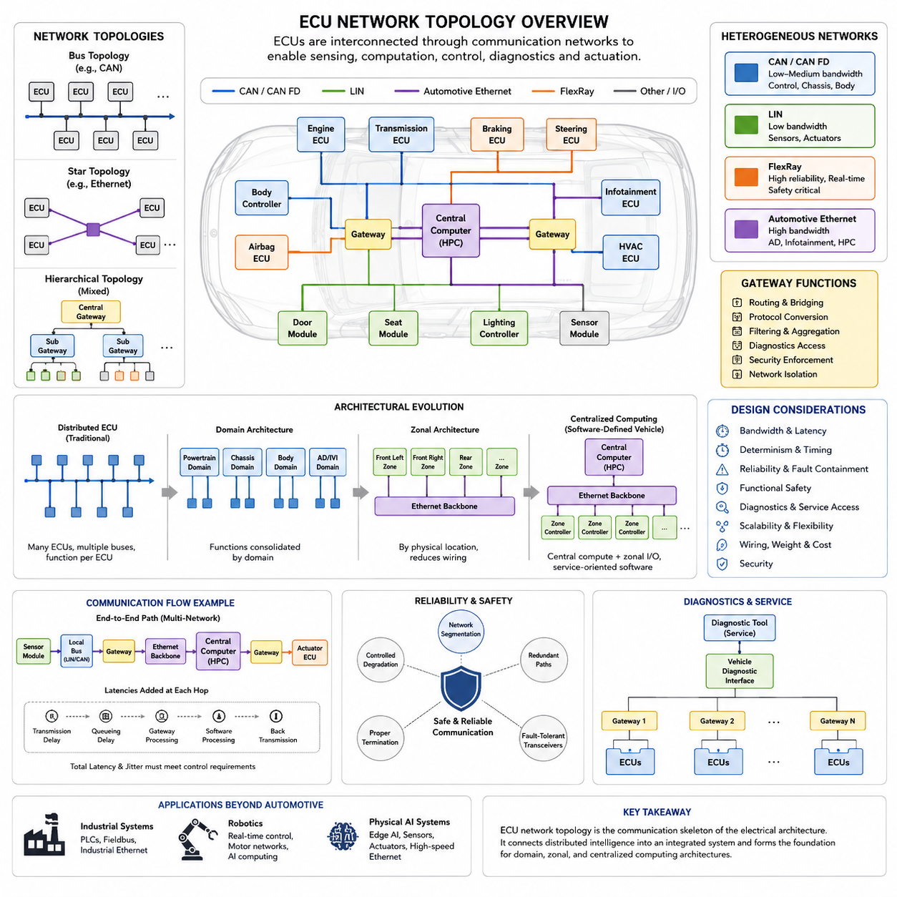
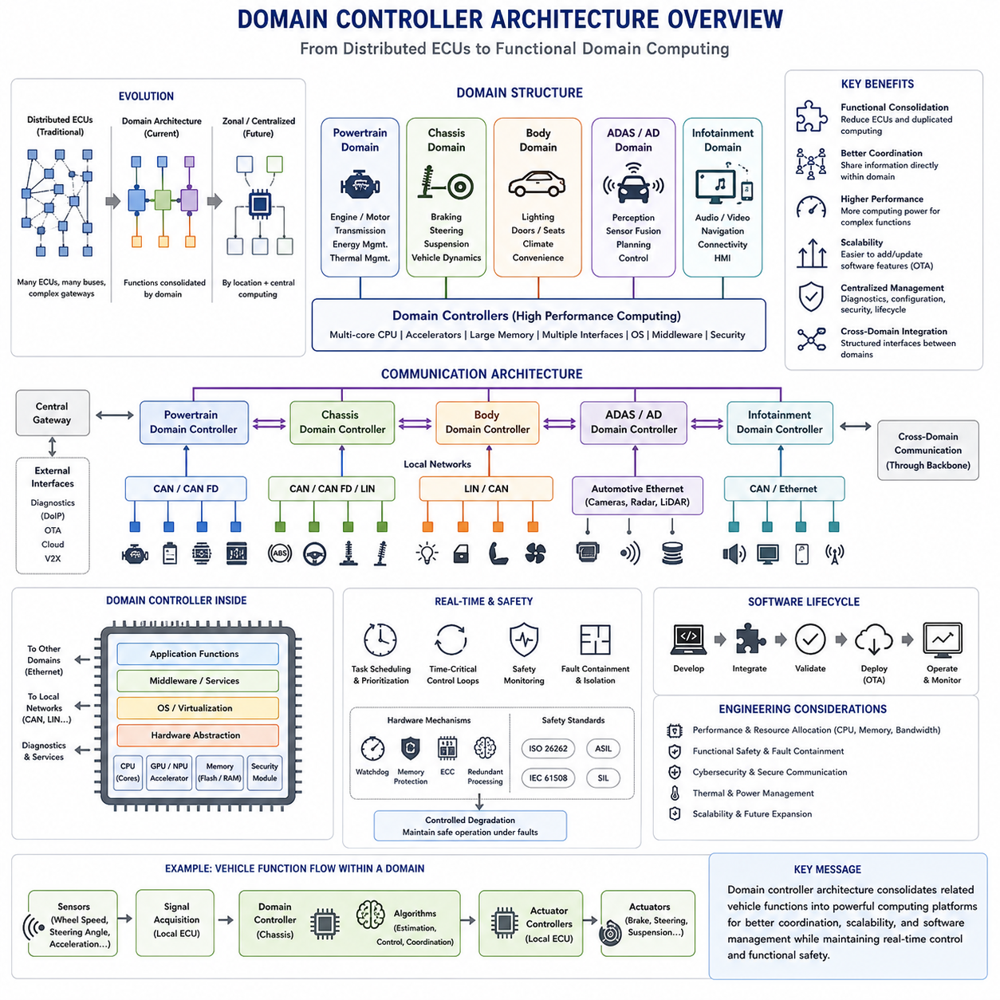
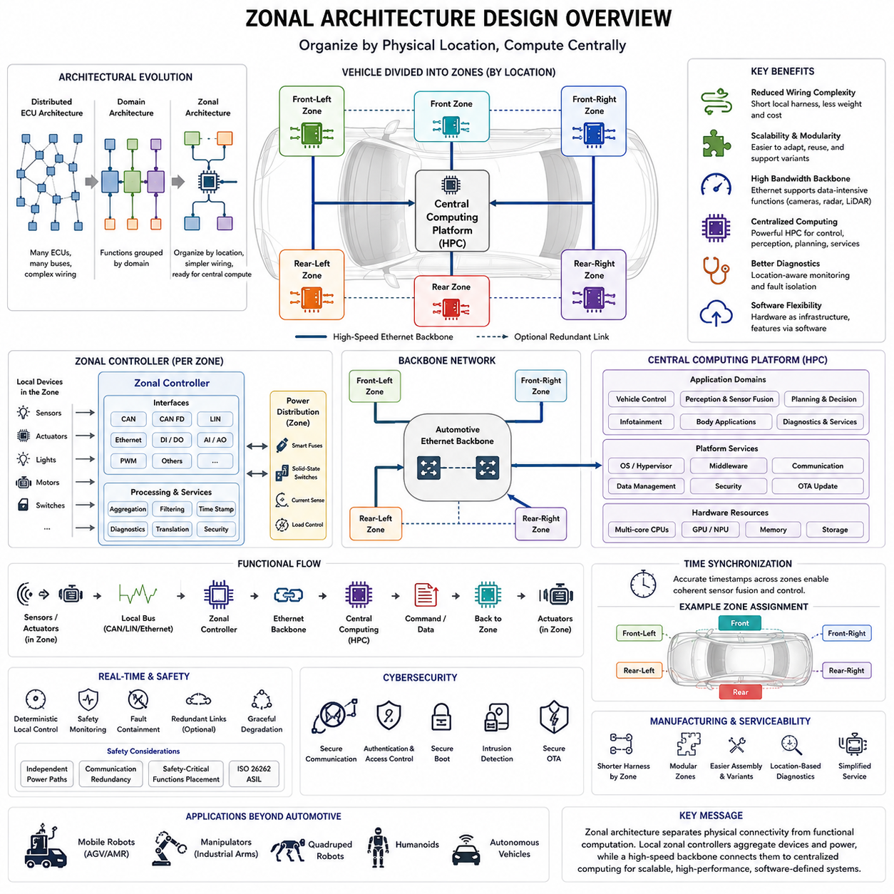
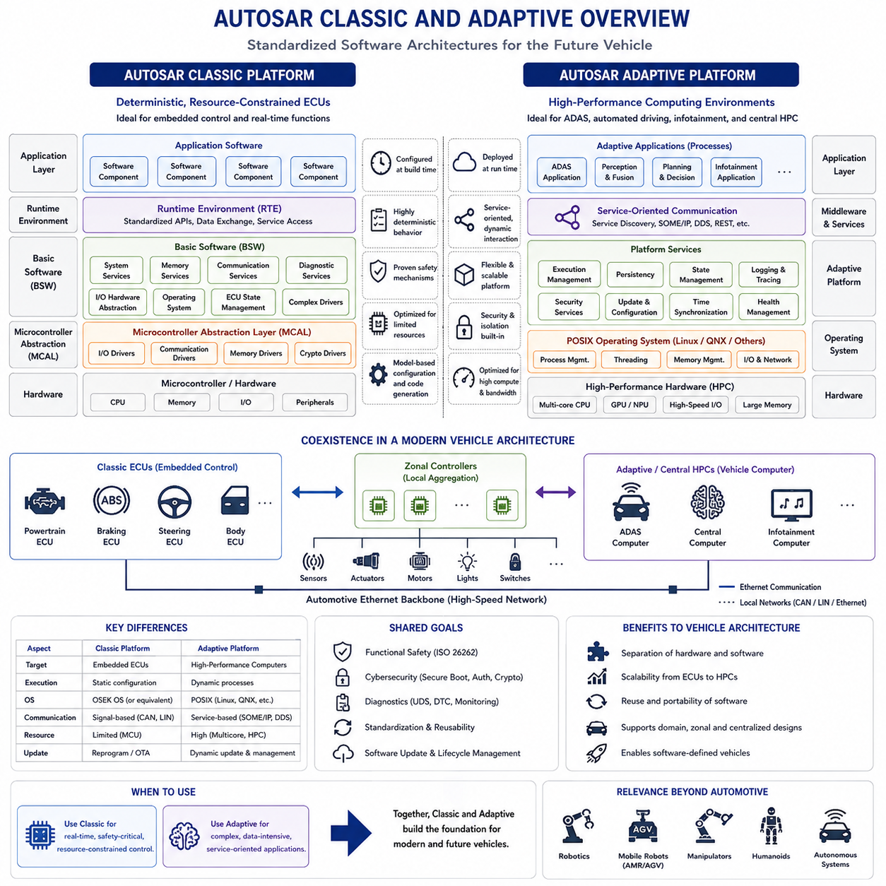
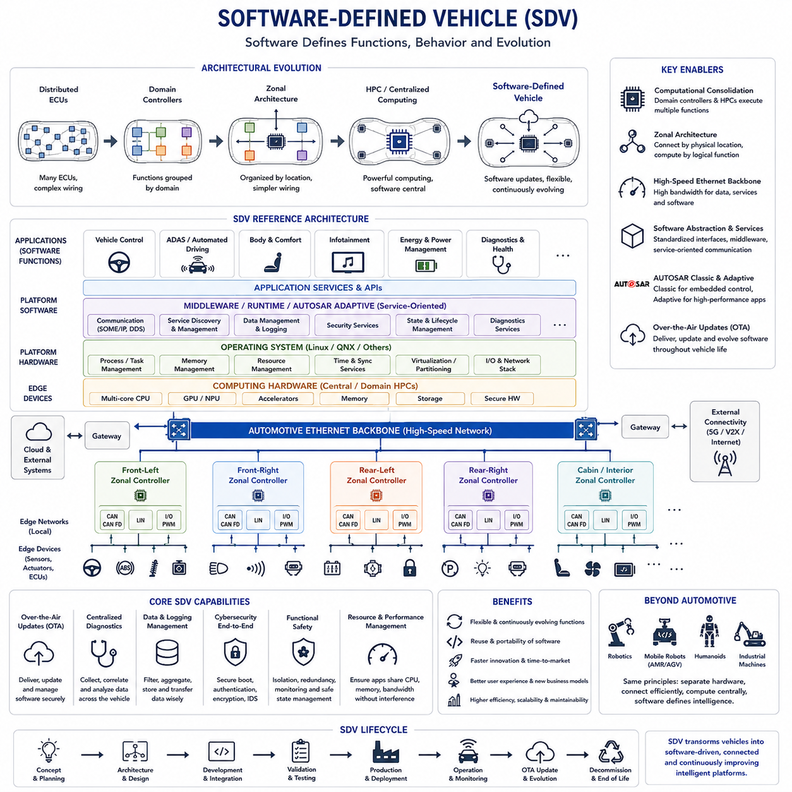
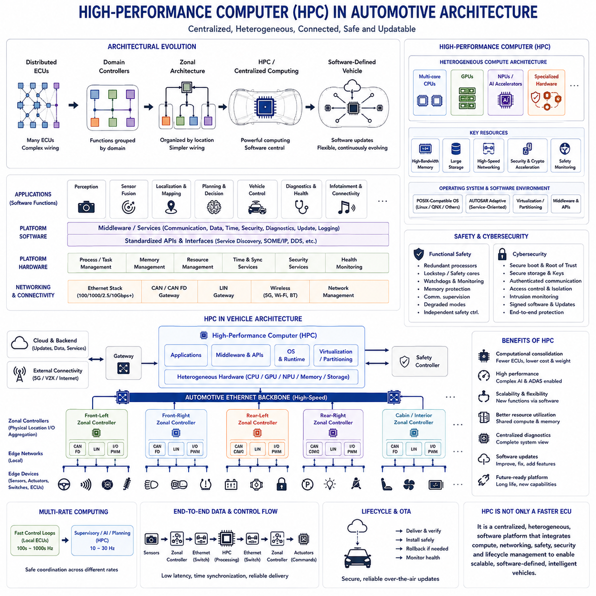

**Volume 01. Electrical Architecture Fundamentals**

# Chapter 02. Automotive Electrical Architecture

## 02.01. ECU Network Topology

{width="7.268055555555556in" height="7.268055555555556in"}

ECU 네트워크 토폴로지(ECU Network Topology)는 센싱(Sensing), 연산(Computation), 제어(Control), 진단(Diagnostics), 액추에이션(Actuation)이 하나의 통합된 전기 시스템(Electrical System)으로 동작할 수 있도록 전자 제어 장치(Electronic Control Unit, ECU)를 물리적·논리적으로 연결하는 구조를 정의한다. 제공된 구성에서 이 주제는 도메인 컨트롤러(Domain Controller), 조널 아키텍처(Zonal Architecture), AUTOSAR, 소프트웨어 정의 차량(Software-Defined Vehicle), 고성능 컴퓨팅(High-Performance Computing)을 다루기 전에 자동차 전기 아키텍처(Automotive Electrical Architecture)의 출발점 역할을 한다.

전통적인 차량은 일반적으로 개별 컨트롤러(Controller)가 비교적 특정한 기능을 담당하는 분산 ECU 아키텍처(Distributed ECU Architecture)를 사용한다. 엔진 ECU(Engine ECU), 변속기 컨트롤러(Transmission Controller), 바디 컨트롤러(Body Controller), 에어백 컨트롤러(Airbag Controller), 제동 컨트롤러(Braking Controller), 조향 컨트롤러(Steering Controller), 다양한 편의 기능 컨트롤러가 독립적으로 동작하면서 통신 네트워크(Communication Network)를 통해 정보를 교환한다. 따라서 토폴로지(Topology)는 독립적인 임베디드 제어 시스템(Embedded Control System)을 하나로 연결하는 구조적 프레임워크(Structural Framework)가 된다.

가장 단순한 개념적 토폴로지는 공유 버스(Shared Bus)이다. 여러 ECU가 동일한 통신 매체(Communication Medium)에 연결되고 정의된 중재(Arbitration) 및 주소 지정(Addressing) 규칙에 따라 메시지를 교환한다. CAN은 이러한 구조를 대표하는 기술로, 각 ECU 사이에 전용 일대일 배선을 구성하지 않고도 여러 컨트롤러가 하나의 공통 차동 신호선(Differential Pair)을 통해 통신할 수 있다. 이를 통해 개별 기능을 직접 배선으로 연결하는 방식보다 와이어 하니스(Wire Harness)의 복잡성을 크게 줄일 수 있다.

버스 토폴로지(Bus Topology)는 효율적이지만 ECU가 추가될 때마다 네트워크 부하(Network Load), 메시지 상호작용(Message Interaction), 진단 복잡성(Diagnostic Complexity), 고장 전파(Fault Propagation) 가능성이 증가한다. 따라서 엔지니어는 통신 대역폭(Communication Bandwidth), 메시지 주기(Message Frequency), 지연시간(Latency), 버스 사용률(Bus Utilization), 전기적 종단(Electrical Termination), 고장 동작(Failure Behavior)을 평가해야 한다. 진단 트래픽과 상태 정보, 낮은 우선순위 메시지가 동일한 통신 채널을 사용하더라도 중요한 제어 메시지는 예측 가능한 시간 내에 목적지에 도달해야 한다.

자동차 네트워크(Automotive Network)는 일반적으로 하나의 버스만으로 구성되지 않는다. 각 서브시스템(Subsystem)은 대역폭(Bandwidth), 결정성(Determinism), 비용(Cost), 안전성(Safety), 물리적 구현(Physical Implementation)에 서로 다른 요구사항을 가진다. 저비용 장치는 LIN을 사용할 수 있고, 일반적인 임베디드 컨트롤러(Embedded Controller)는 CAN을 사용하며, 더 높은 데이터 전송률이 필요한 제어 네트워크는 CAN FD를 사용할 수 있다. 카메라(Camera)나 고성능 컴퓨팅 플랫폼(High-Performance Computing Platform)은 자동차 이더넷(Automotive Ethernet)을 필요로 할 수 있다. 따라서 전체 차량 토폴로지는 여러 통신 기술로 구성된 이기종 네트워크(Heterogeneous Network)가 된다.

게이트웨이(Gateway)는 이러한 이기종 네트워크 세그먼트(Heterogeneous Network Segment)를 서로 연결하고 필요한 정보를 선택적으로 전달한다. 게이트웨이는 하나의 CAN 네트워크에서 신호를 수신하고 해당 정보를 해석하거나 라우팅(Routing)하여 다른 네트워크 또는 이더넷 백본(Ethernet Backbone)으로 전달할 수 있다. 또한 프로토콜 변환(Protocol Conversion), 필터링(Filtering), 진단(Diagnostics), 보안 적용(Security Enforcement), 트래픽 관리(Traffic Management), 네트워크 격리(Network Isolation)를 수행할 수 있으므로 게이트웨이의 배치는 단순한 배선 문제가 아니라 중요한 아키텍처 설계 결정이다.

기능적 분할(Functional Segmentation)은 전통적으로 파워트레인(Powertrain), 섀시(Chassis), 바디(Body), 인포테인먼트(Infotainment), 진단(Diagnostics)과 같은 여러 네트워크를 만들어 왔다. 제동 ECU(Braking ECU)와 조향 ECU(Steering ECU)는 섀시 네트워크(Chassis Network)에서 높은 우선순위의 동적 정보를 교환할 수 있으며, 도어 모듈(Door Module)과 조명 컨트롤러(Lighting Controller)는 서로 다른 성능 요구사항을 가진 바디 네트워크(Body Network)에서 동작할 수 있다. 이러한 분리는 모든 컨트롤러가 동일한 통신 자원을 경쟁하는 것을 방지하고 기능 요구사항에 맞게 네트워크 특성을 최적화할 수 있도록 한다.

물리적 토폴로지(Physical Topology)와 논리적 토폴로지(Logical Topology)는 구분해야 한다. 두 ECU가 물리적으로 동일한 배선 세그먼트에 연결되어 있더라도 소프트웨어(Software)는 어떤 메시지를 수신하고 송신하며 무시할지를 결정한다. 반대로 서로 다른 물리적 버스에 위치한 컨트롤러도 게이트웨이 라우팅(Gateway Routing)을 통해 동일한 차량 기능에 참여할 수 있다. 따라서 효과적인 아키텍처를 설계하려면 배선 경로(Wiring Path), 통신 프로토콜(Communication Protocol), 메시지 데이터베이스(Message Database), 소프트웨어 인터페이스(Software Interface), 기능적 의존성(Functional Dependency)을 함께 고려해야 한다.

네트워크 토폴로지는 와이어 하니스 설계(Wire Harness Design)에 큰 영향을 준다. 분산 아키텍처(Distributed Architecture)는 ECU를 센서(Sensor)와 액추에이터(Actuator) 가까이에 배치하여 일부 로컬 배선(Local Wiring)을 줄일 수 있지만, 많은 컨트롤러와 통신 분기(Communication Branch)는 커넥터(Connector), 스플라이스(Splice), 하니스 경로(Harness Route), 설치 복잡성을 증가시킬 수 있다. 따라서 하니스 중량(Harness Mass), 패키징 체적(Packaging Volume), 커넥터 수(Connector Count), 전자기 적합성(Electromagnetic Compatibility, EMC), 정비 접근성(Service Accessibility), 제조 비용(Manufacturing Cost)은 단순한 후속 설계 요소가 아니라 아키텍처 변수(Architectural Variable)가 된다.

신뢰성(Reliability) 역시 토폴로지 수준에서 고려해야 한다. 공유 통신 세그먼트(Shared Communication Segment)는 단락(Short Circuit), 트랜시버 고장(Transceiver Failure), 배선 고장(Wiring Fault), 오작동 노드(Malfunctioning Node)가 여러 컨트롤러의 통신을 동시에 방해할 경우 공통 고장점(Common Failure Point)이 될 수 있다. 설계자는 네트워크 분할(Network Segmentation), 이중화 통신 경로(Redundant Communication Path), 보호된 게이트웨이(Protected Gateway), 고장 허용 트랜시버(Fault-Tolerant Transceiver), 적절한 종단(Termination), 진단 모니터링(Diagnostic Monitoring), 제어된 성능 저하 전략(Controlled Degradation Strategy)을 통해 이러한 위험을 줄일 수 있다.

토폴로지 설계(Topology Design)는 기능 안전(Functional Safety)과 밀접하게 관련된다. 개별 ECU가 정상적으로 동작하더라도 통신 고장은 제어 기능에 영향을 줄 수 있기 때문이다. 따라서 안전 분석(Safety Analysis)은 메시지 손실(Lost Message), 메시지 지연(Delayed Message), 정보 손상(Corrupted Information), 의도하지 않은 송신(Unintended Transmission), 네트워크 분리(Network Partitioning), 컨트롤러 간 통신 의존성(Communication Dependency)을 검토한다. 안전 관련 기능에는 독립적인 모니터링(Independent Monitoring), 이중화 신호(Redundant Signal), 전용 채널(Dedicated Channel), 또는 통신을 신뢰할 수 없을 때 적용되는 정의된 폴백 동작(Fallback Behavior)이 필요할 수 있다.

진단(Diagnostics)은 네트워크에 또 하나의 논리적 계층(Logical Layer)을 추가한다. 서비스 도구(Service Tool)는 ECU와 통신하여 진단 고장 코드(Diagnostic Trouble Code)를 읽고, 파라미터(Parameter)를 확인하며, 테스트를 실행하고, 캘리브레이션(Calibration) 관련 작업이나 소프트웨어 업데이트(Software Update)를 수행해야 한다. 진단 접근은 중앙 인터페이스(Central Interface)를 통해 시작되어 게이트웨이를 거쳐 개별 컨트롤러까지 전달될 수 있다. 따라서 네트워크 토폴로지는 정상 운전 중의 통신뿐만 아니라 엔지니어링, 제조 시스템, 서비스 장비가 분산된 전자 기능에 접근하는 방식까지 결정한다.

차량 기능이 점차 소프트웨어 중심(Software-Intensive)으로 발전하면서 기존의 분산 ECU 네트워크는 확장성(Scalability)의 한계에 직면한다. 새로운 기능을 추가하면 여러 컨트롤러 사이에 새로운 신호 의존성(Signal Dependency)이 발생하여 통합(Integration)과 검증(Verification)의 복잡성이 증가한다. 결국 차량 아키텍처에는 여러 버스와 게이트웨이를 통해 연결된 수십 개 이상의 ECU가 포함될 수 있으며, 소프트웨어 기능은 원래 개별 부품을 기준으로 정의되었던 하드웨어 경계(Hardware Boundary)를 넘어 분산된다.

도메인 아키텍처(Domain Architecture)는 이러한 복잡성의 일부를 해결하기 위해 기능 영역에 따라 연산 자원을 통합한다. 모든 기능마다 별도의 ECU를 배치하는 대신 강력한 도메인 컨트롤러(Domain Controller)가 섀시, 바디, 파워트레인, 자율주행 시스템(Autonomous Driving System) 등의 기능 그룹을 조정한다. 기존 ECU는 네트워크의 엣지(Edge)에 남아 있을 수 있지만 전체 구조는 보다 계층적인 형태로 변화한다. 이러한 전환은 ECU 네트워크 토폴로지 다음에 도메인 컨트롤러 아키텍처가 이어지는 이유를 설명한다.

조널 아키텍처(Zonal Architecture)는 차량 기능보다는 물리적 위치(Physical Location)를 기준으로 토폴로지를 재구성한다. 전방 좌측, 전방 우측, 후방 또는 기타 영역의 조널 컨트롤러(Zonal Controller)가 주변 센서와 액추에이터를 통합하고 이를 고속 백본(High-Speed Backbone)에 연결한다. 이를 통해 긴 일대일 배선(Point-to-Point Wiring)을 줄이고 하니스 구성을 단순화할 수 있다. 기능 소프트웨어는 중앙 집중형 컴퓨팅 자원(Centralized Computing Resource)에서 실행되고, 조널 컨트롤러는 로컬 전기 및 통신 인터페이스(Local Electrical and Communication Interface)를 제공할 수 있다.

자동차 이더넷(Automotive Ethernet)은 중앙 집중형 인지(Centralized Perception), 고성능 컴퓨팅(High-Performance Computing), 소프트웨어 업데이트, 데이터 집약적 센서(Data-Intensive Sensor)가 기존 제어 버스보다 훨씬 높은 대역폭을 요구하면서 새로운 아키텍처의 백본으로 점차 활용되고 있다. 그렇다고 CAN과 LIN이 반드시 사라지는 것은 아니다. 이들은 게이트웨이나 조널 컨트롤러를 통해 연결되는 로컬 네트워크(Local Network)로 계속 사용될 수 있다. 따라서 토폴로지는 이더넷 백본과 임베디드 필드 네트워크(Embedded Field Network)를 결합하는 계층적 구조로 발전한다.

여러 네트워크 기술이 하나의 제어 경로(Control Path)에서 협력할 경우 시간적 동작(Timing Behavior)이 특히 중요해진다. 센서 측정값은 로컬 버스를 지나 게이트웨이를 통과하고 이더넷 백본으로 들어가 중앙 컴퓨터(Central Computer)에 도달한 후, 다시 제어 명령(Control Command)으로 변환되어 다른 네트워크를 통해 돌아올 수 있다. 각 전송, 큐(Queue), 게이트웨이, 소프트웨어 태스크(Software Task)는 지연시간(Latency)과 지터(Jitter)를 발생시킨다. 따라서 네트워크 토폴로지는 명목상의 대역폭만으로 평가해서는 안 되며 종단 간 제어 타이밍(End-to-End Control Timing)과 함께 설계해야 한다.

현대적인 ECU 토폴로지는 소프트웨어 정의 차량(Software-Defined Vehicle)을 구현하기 위한 통신 기반도 제공한다. 중앙 컴퓨팅(Central Computing), 표준화된 인터페이스(Standardized Interface), 서비스 지향 통신(Service-Oriented Communication), 무선 소프트웨어 업데이트(Over-the-Air Update, OTA), 여러 물리적 장치에 걸쳐 실행되는 소프트웨어 기능을 구현하려면 하드웨어 경계를 넘어 정보를 안정적으로 전달할 수 있는 네트워크가 필요하다. 이에 따라 전기 아키텍처는 단순히 상호 연결된 컨트롤러의 집합에서 통신 인프라가 핵심 시스템 자원이 되는 분산 컴퓨팅 플랫폼(Distributed Computing Platform)으로 발전한다.

로보틱스(Robotics)와 피지컬 AI(Physical AI) 시스템에서도 동일한 아키텍처 원리가 적용된다. 다만 구성요소는 자동차 ECU 대신 모터 컨트롤러(Motor Controller), 안전 컨트롤러(Safety Controller), 센서 모듈(Sensor Module), 엣지 컴퓨터(Edge Computer), AI 컴퓨터(AI Computer) 등으로 불릴 수 있다. 저수준 결정론적 제어(Low-Level Deterministic Control)는 로컬 실시간 네트워크(Local Real-Time Network)에 유지하면서 인지(Perception)와 AI 연산은 높은 대역폭의 이더넷 연결을 사용할 수 있다. 이러한 구조는 자동차, 산업, 로보틱스, 통신, 컴퓨팅, 피지컬 AI 전기 아키텍처를 구분하면서도 서로 연결하는 기본 원리가 된다.

따라서 잘 설계된 ECU 네트워크 토폴로지는 물리적 배선(Physical Wiring), 통신 성능(Communication Performance), 연산 분산(Computational Distribution), 고장 격리(Fault Containment), 안전성(Safety), 진단(Diagnostics), 확장성(Scalability), 비용(Cost) 사이의 균형을 유지해야 한다. 이는 단순히 어떤 컨트롤러가 어디에 연결되어 있는지를 보여주는 연결도가 아니다. ECU 네트워크 토폴로지는 분산된 전자 지능(Distributed Electronic Intelligence)을 하나의 통합 시스템으로 동작하게 하는 전기 아키텍처의 통신 골격(Communication Skeleton)이며, 이후 도메인 아키텍처, 조널 아키텍처, 중앙 집중형 컴퓨팅 아키텍처(Centralized Computing Architecture)로 발전하기 위한 기반을 제공한다.

## 02.02. Domain Controller Architecture

{width="7.268055555555556in" height="7.268055555555556in"}

도메인 컨트롤러 아키텍처(Domain Controller Architecture)는 고도로 분산된 ECU 네트워크(Distributed ECU Network)에서 통합된 차량 컴퓨팅(Consolidated Vehicle Computing)으로 전환하는 중요한 단계이다. 거의 모든 기능에 별도의 전자 제어 장치(Electronic Control Unit, ECU)를 할당하는 대신, 서로 관련된 기능을 기능 도메인(Functional Domain)으로 그룹화하고 더 강력한 도메인 컨트롤러(Domain Controller)가 이를 통합 관리한다. 대표적인 도메인에는 파워트레인(Powertrain), 섀시(Chassis), 바디(Body), 인포테인먼트(Infotainment), 첨단 운전자 보조 시스템(Advanced Driver Assistance System, ADAS)이 있으며, 이러한 구조는 기존 분산 ECU와 이후의 조널(Zonal) 또는 중앙집중형 아키텍처(Centralized Architecture) 사이의 계층적 아키텍처를 형성한다.

전통적인 분산 아키텍처(Distributed Architecture)에서는 개별 ECU가 특정 부품이나 기능을 중심으로 설계되는 경우가 많다. 엔진 컨트롤러(Engine Controller)는 연소를 관리하고, 변속기 컨트롤러(Transmission Controller)는 변속 동작을 관리하며, 제동 컨트롤러(Braking Controller)는 제동 기능을 담당한다. 또한 바디 컨트롤러(Body Controller)는 도어, 조명, 시트 및 기타 장치를 제어한다. 차량 기능이 증가하면 이러한 방식은 수십 개의 컨트롤러, 여러 통신 버스(Communication Bus), 복잡한 게이트웨이(Gateway), 중복된 컴퓨팅 자원(Computing Resource), 그리고 점점 복잡해지는 소프트웨어 의존성(Software Dependency)을 발생시킬 수 있다.

도메인 아키텍처(Domain Architecture)는 개별 부품 중심의 구성 원칙을 기능 그룹(Functional Group) 중심으로 변경한다. 유사한 역할을 공유하는 컨트롤러와 소프트웨어 기능은 하나의 공통 도메인에 할당된다. 예를 들어 섀시 도메인(Chassis Domain)은 제동, 조향, 서스펜션(Suspension), 차량 동역학(Vehicle Dynamics) 기능을 통합 관리할 수 있으며, 바디 도메인(Body Domain)은 조명, 도어, 시트, 공조 관련 인터페이스(Climate-Related Interface), 편의 시스템(Convenience System)을 관리할 수 있다. 도메인 컨트롤러는 해당 기능 영역의 주요 연산 및 통신 조정자(Computational and Communication Coordinator)가 된다.

도메인 컨트롤러(Domain Controller)는 일반적인 단일 기능 ECU(Single-Function ECU)보다 훨씬 높은 처리 성능을 제공한다. 멀티코어 CPU(Multicore CPU), 하드웨어 가속기(Hardware Accelerator), 더 큰 메모리 자원(Memory Resource), 여러 통신 인터페이스(Communication Interface), 정교한 소프트웨어 플랫폼(Software Platform)을 포함할 수 있다. 이러한 추가 성능을 통해 기존에 서로 독립적으로 동작했던 여러 기능을 하나의 컴퓨팅 플랫폼에서 실행하면서 차량 전체의 다른 컨트롤러와 통신, 진단, 보안, 모니터링 및 협조 제어를 수행할 수 있다.

기능 통합(Functional Consolidation)은 도메인 아키텍처의 주요 장점 중 하나이다. 기존에 서로 다른 ECU에서 실행되던 여러 제어 알고리즘(Control Algorithm)을 하나의 도메인 컨트롤러로 이동시켜 중복 프로세서를 줄이고 정보를 보다 직접적으로 공유할 수 있다. 센서, 액추에이터(Actuator), 전력 전자 장치(Power Electronics), 실시간 인터페이스(Real-Time Interface)가 여전히 로컬 전자장치를 필요로 하기 때문에 일부 주변 ECU(Peripheral ECU)는 유지될 수 있지만, 상위 수준 연산이 도메인 컨트롤러로 이동하면서 이들의 역할은 단순화될 수 있다.

섀시 도메인(Chassis Domain)은 기능 통합이 시스템 협조 제어(System Coordination)를 어떻게 개선할 수 있는지를 잘 보여준다. 제동, 조향, 서스펜션, 트랙션(Traction) 기능은 모두 차량 운동(Vehicle Motion)에 의존하며 휠 속도(Wheel Speed), 가속도(Acceleration), 조향각(Steering Angle), 추정 차량 상태(Estimated Vehicle State)와 같은 공통 정보를 필요로 하는 경우가 많다. 이러한 기능을 섀시 도메인 컨트롤러에서 통합 관리하면 정보가 여러 ECU와 네트워크 경계를 반복해서 통과하지 않고 내부 소프트웨어 인터페이스(Internal Software Interface)를 통해 교환될 수 있다.

파워트레인 도메인(Powertrain Domain)도 엔진 또는 전기 모터 제어(Electric Motor Control), 변속기 동작, 에너지 관리(Energy Management), 회생 제동 연계(Regenerative Braking Interaction), 열 관리(Thermal Management)와 같은 추진 관련 기능을 통합 관리할 수 있다. 전동화 차량(Electrified Vehicle)에서는 배터리 시스템(Battery System), 인버터(Inverter), 모터(Motor), 충전 장치(Charging Equipment), 열 관리 시스템 사이의 관계가 더욱 긴밀해진다. 도메인 수준 연산(Domain-Level Computing)은 이러한 상호작용을 통합 관리하면서 로컬 컨트롤러가 시간에 민감한 장치 제어(Time-Critical Device Control)를 계속 수행하도록 할 수 있다.

바디 전장(Body Electronics)은 많은 기능이 비교적 낮은 연산 성능을 요구하면서도 차량 전체에 분산된 수많은 전기 장치를 포함하기 때문에 자연스럽게 하나의 기능 도메인을 구성한다. 도어 모듈(Door Module), 조명 시스템(Lighting System), 시트, 윈도(Window), 와이퍼(Wiper), 공조 인터페이스(Climate Interface), 접근 시스템(Access System)은 바디 도메인 컨트롤러와 통신할 수 있다. 상위 제어 로직(Supervisory Logic)을 통합하면 분산된 소프트웨어 동작을 줄이고 진단, 구성 관리(Configuration Management), 보안, 차량 전체 기능 관리에 보다 일관된 인터페이스를 제공할 수 있다.

첨단 운전자 보조 시스템(Advanced Driver Assistance System, ADAS)과 자동화 주행(Automated Driving) 기능은 특히 높은 연산 성능을 요구하는 도메인을 형성한다. 카메라(Camera), 레이더(Radar), 라이다(LiDAR), 초음파 센서(Ultrasonic Sensor), 위치 추정 시스템(Localization System), 차량 상태 정보는 많은 데이터를 생성하며, 이를 인지(Perception), 센서 융합(Sensor Fusion), 예측(Prediction), 계획(Planning), 제어(Control)에 활용해야 한다. 따라서 ADAS 도메인 컨트롤러는 일반적인 자동차 ECU보다 훨씬 높은 연산 성능과 통신 대역폭(Communication Bandwidth)을 요구하는 경우가 많다.

컴퓨팅 구조가 변화함에 따라 통신 아키텍처(Communication Architecture)도 함께 변화한다. 기존 CAN, LIN, CAN FD 네트워크는 로컬 ECU, 센서, 액추에이터를 계속 연결할 수 있으며, 도메인 컨트롤러 사이에는 보다 높은 대역폭의 네트워크가 사용될 수 있다. 자동차 이더넷(Automotive Ethernet)은 대규모 데이터를 전송하고 강력한 컴퓨팅 플랫폼을 연결하는 데 점점 중요해진다. 게이트웨이는 기존 버스(Legacy Bus)와 도메인 수준 네트워크를 연결하여 서로 독립된 버스의 집합이 아닌 계층적 통신 구조(Hierarchical Communication Structure)를 형성할 수 있다.

도메인 컨트롤러는 게이트웨이 기능(Gateway Function)을 함께 수행할 수도 있다. 여러 로컬 네트워크와 연결되고 다른 도메인과 정보를 교환하기 때문에 메시지 라우팅(Message Routing), 프로토콜 변환(Protocol Translation), 트래픽 필터링(Traffic Filtering), 보안 정책 적용(Security Policy Enforcement), 네트워크 고장 격리(Network Fault Isolation)를 수행할 수 있다. 연산 기능과 게이트웨이 기능을 통합하면 아키텍처를 단순화할 수 있지만, 여러 책임이 하나의 컨트롤러에 집중되므로 컨트롤러 고장의 영향이 증가할 가능성을 신중하게 분석해야 한다.

여러 기능이 통합되더라도 실시간 동작(Real-Time Behavior)은 여전히 필수적이다. 강력한 프로세서를 사용한다고 해서 자동으로 결정론적 제어(Deterministic Control)가 보장되는 것은 아니다. 서로 다른 주기, 우선순위, 안전 요구사항을 가진 소프트웨어 태스크(Software Task)가 동시에 실행되어야 하며 통신 지연시간과 운영체제 스케줄링(Operating-System Scheduling) 역시 제한된 범위에서 유지되어야 한다. 따라서 시간 임계 제어 루프(Time-Critical Control Loop)는 전용 마이크로컨트롤러(Microcontroller) 또는 로컬 액추에이터 컨트롤러에 유지하고, 상대적으로 느린 상위 제어, 협조 제어, 상태 추정(Estimation), 계획 기능은 도메인 컨트롤러에서 실행할 수 있다.

기능 통합이 증가하면서 기능 안전(Functional Safety)은 더욱 복잡해진다. 여러 차량 기능이 하나의 컴퓨팅 플랫폼을 공유하면 단일 하드웨어 또는 소프트웨어 고장이 여러 기능에 동시에 영향을 미칠 수 있다. 따라서 도메인 컨트롤러에는 메모리 보호(Memory Protection), 태스크 격리(Task Isolation), 워치독 감시(Watchdog Supervision), 안전 모니터링(Safety Monitoring), 이중화 연산(Redundant Processing), 고장 격리(Fault Containment), 제어된 성능 저하(Controlled Degradation)와 같은 메커니즘이 필요하다. 하드웨어와 소프트웨어 아키텍처는 서로 다른 안전 요구사항을 가진 기능 사이에서 고장이 통제되지 않은 상태로 전파되지 않도록 설계되어야 한다.

도메인 컨트롤러가 공유 하드웨어에서 여러 애플리케이션(Application)을 실행하기 때문에 소프트웨어 아키텍처(Software Architecture)의 중요성도 증가한다. 표준화된 미들웨어(Middleware), 운영체제(Operating System), 통신 서비스(Communication Service), 하드웨어 추상화(Hardware Abstraction), 진단(Diagnostics), 애플리케이션 인터페이스(Application Interface)를 통해 소프트웨어 기능을 특정 전자 부품으로부터 분리할 수 있다. 이러한 아키텍처 방향은 이후 자동차 전기 아키텍처에서 다루는 AUTOSAR Classic 및 AUTOSAR Adaptive와 자연스럽게 연결된다.

도메인 컨트롤러는 소프트웨어 수명주기 관리(Software Lifecycle Management)도 개선할 수 있다. 많은 독립 ECU를 각각 업데이트하는 대신 관련 소프트웨어 기능을 더 적은 수의 강력한 컴퓨팅 플랫폼을 통해 관리할 수 있다. 중앙집중형 진단(Centralized Diagnostics), 구성 관리, 보안 부팅(Secure Boot), 소프트웨어 인증(Software Authentication), 로깅(Logging), 무선 소프트웨어 업데이트(Over-the-Air Update, OTA)를 보다 체계적으로 관리할 수 있다. 그러나 소프트웨어 패키지가 커지고 기능 통합도가 증가하면서 엄격한 버전 관리(Version Management), 사이버보안(Cybersecurity), 검증(Validation), 롤백 전략(Rollback Strategy)도 필요하다.

또 다른 장점은 기능 간 통합(Cross-Functional Integration)의 향상이다. 현대 차량의 기능은 하나의 전통적인 서브시스템에 완전히 속하지 않는 경우가 많다. 적응형 크루즈 컨트롤(Adaptive Cruise Control), 안정성 제어(Stability Control), 에너지 최적화(Energy Optimization), 자동 주차(Automated Parking), 자율주행(Autonomous Driving)은 여러 기능 영역의 정보를 필요로 할 수 있다. 도메인 컨트롤러는 이러한 영역 사이에 구조화된 인터페이스(Structured Interface)를 제공하여 모든 개별 ECU가 서로 직접 통신하지 않더라도 복잡한 기능이 다양한 차량 상태 정보를 통합하여 활용할 수 있도록 한다.

그러나 도메인 아키텍처가 배선 복잡성(Wiring Complexity)을 완전히 제거하는 것은 아니다. 기능 도메인은 논리적 그룹(Logical Group)인 반면 센서와 액추에이터는 차량 전체에 물리적으로 분산되어 있다. 예를 들어 전륜 휠 센서(Front Wheel Sensor)와 후륜 휠 센서(Rear Wheel Sensor)는 동일한 섀시 도메인에 속할 수 있지만 물리적으로는 수 미터 떨어져 있을 수 있다. 따라서 도메인 통합은 컴퓨팅의 분산성을 줄일 수 있지만 물리적으로 분산된 장치와 기능 중심 컨트롤러 사이에는 여전히 긴 배선 경로가 필요할 수 있다.

이러한 한계는 이후 조널 아키텍처(Zonal Architecture)로 전환하게 되는 중요한 동기가 된다. 조널 컨트롤러(Zonal Controller)는 기능적 책임보다는 물리적 위치에 따라 전기 인터페이스를 그룹화한다. 주변 센서와 액추에이터는 가장 가까운 존(Zone)에 연결되고 소프트웨어 기능은 중앙집중형 또는 고성능 컴퓨터(High-Performance Computer)에서 실행된다. 따라서 도메인 아키텍처는 중간 진화 단계(Intermediate Evolutionary Stage)로 이해할 수 있다. 먼저 기능을 기준으로 연산을 통합하고, 이후의 아키텍처에서는 연산을 더욱 중앙화하면서 물리적 연결 구조를 위치 중심으로 재구성한다.

도메인 아키텍처는 엔지니어링 개발 프로세스(Engineering Development Process)에도 변화를 가져온다. 여러 기능이 공통 자원을 공유하기 때문에 하드웨어, 소프트웨어, 네트워크, 진단, 안전, 사이버보안, 시스템 엔지니어링(System Engineering)을 함께 설계해야 한다. 프로세서 사용률(Processor Utilization), 메모리 대역폭(Memory Bandwidth), 통신 부하(Communication Load), 시작 시간(Startup Timing), 열적 동작(Thermal Behavior), 전력 소비(Power Consumption), 고장 격리는 시스템 수준의 설계 변수가 된다. 따라서 자원 할당(Resource Allocation)은 개별 ECU별로 독립적으로 최적화하는 대신 전체 도메인을 기준으로 계획해야 한다.

로보틱스(Robotics)와 피지컬 AI(Physical AI) 시스템에서도 도메인 컨트롤러라는 용어를 명시적으로 사용하지 않더라도 유사한 원리를 적용할 수 있다. 모션 제어(Motion Control), 인지(Perception), 안전(Safety), 매니퓰레이션(Manipulation), 내비게이션(Navigation), AI 연산(AI Computing)을 기능별 컴퓨팅 도메인으로 구성할 수 있다. 로컬 모터 컨트롤러(Local Motor Controller)는 빠르고 결정론적인 제어 루프를 유지하고, 더 강력한 엣지 컴퓨터(Edge Computer)는 인지, 계획, 시스템 수준 동작을 통합 관리할 수 있다. 이는 로보틱스, 통신, 센서, 컴퓨팅, 피지컬 AI 아키텍처를 서로 연결된 엔지니어링 계층으로 다루는 전체 전기 아키텍처 구조와 연결된다.

따라서 도메인 컨트롤러 아키텍처(Domain Controller Architecture)는 단순히 여러 ECU를 하나의 더 큰 컴퓨터로 교체하는 것을 의미하지 않는다. 이는 차량 기능을 분할하는 방식, 소프트웨어를 배치하는 방식, 통신을 구성하는 방식, 공유 컴퓨팅 자원을 관리하는 방식을 변화시킨다. 서로 관련된 기능을 통합하면서 필요한 로컬 제어(Local Control)를 유지함으로써 분산 ECU 네트워크에서 조널 아키텍처, 고성능 컴퓨터(High-Performance Computer, HPC), 궁극적으로 소프트웨어 정의 차량 아키텍처(Software-Defined Vehicle Architecture)로 발전하기 위한 연결 단계 역할을 한다.

## 02.03. Zonal Architecture Design

{width="7.268055555555556in" height="7.268055555555556in"}

조널 아키텍처 설계(Zonal Architecture Design)는 차량의 전기·전자 시스템(Electrical and Electronic System)을 주로 기능적 책임(Functional Responsibility)이 아니라 물리적 위치(Physical Location)를 기준으로 재구성하는 방식이다. 센서와 액추에이터(Actuator)를 멀리 떨어진 기능별 ECU에 연결하는 대신 주변의 조널 컨트롤러(Zonal Controller)에 연결한다. 조널 컨트롤러는 로컬 전기 인터페이스(Local Electrical Interface)를 통합하고 고속 백본(High-Speed Backbone)을 통해 중앙집중형 컴퓨팅 자원(Centralized Computing Resource)과 통신함으로써 소프트웨어 정의 차량(Software-Defined Vehicle)과 중앙집중형 고성능 컴퓨팅(Centralized High-Performance Computing)으로 발전하기 위한 중요한 아키텍처 단계를 형성한다.

전통적인 분산 ECU 아키텍처(Distributed ECU Architecture)는 일반적으로 개별 컨트롤러를 특정 부품이나 기능에 할당하며, 도메인 아키텍처(Domain Architecture)는 관련 기능을 파워트레인(Powertrain), 섀시(Chassis), 바디(Body), 인포테인먼트(Infotainment), 첨단 운전자 보조 시스템(Advanced Driver Assistance System, ADAS) 등의 도메인으로 통합한다. 두 방식 모두 기능적 구성을 중심으로 한다. 조널 아키텍처는 여기에 다른 원칙을 도입하여 센서, 액추에이터, 통신 인터페이스, 전기 연결의 종단 위치를 결정할 때 물리적 위치를 주요 기준으로 사용한다.

차량은 개념적으로 전방 좌측(Front-Left), 전방 우측(Front-Right), 후방 좌측(Rear-Left), 후방 우측(Rear-Right), 전방(Front), 후방(Rear), 실내(Cabin) 등의 존(Zone)으로 나눌 수 있다. 정확한 존의 수와 경계는 차량 크기, 패키징(Packaging), 전기 부하(Electrical Load), 안전 요구사항(Safety Requirement), 제조사의 설계 전략에 따라 달라진다. 각 영역에 배치된 조널 컨트롤러는 주변 장치에 통신, 입출력(Input/Output), 진단(Diagnostics), 경우에 따라 전력 분배(Power Distribution) 인터페이스까지 제공하여 차량 전체를 가로지르는 긴 전용 배선의 필요성을 줄인다.

배선 복잡성(Wiring Complexity)의 감소는 조널 설계를 도입하는 가장 강력한 이유 중 하나이다. 기능 중심 아키텍처에서는 차량 후방에 물리적으로 위치한 센서가 해당 기능 도메인에 속한 컨트롤러까지 긴 배선으로 연결되어야 할 수 있다. 조널 방식에서는 해당 센서를 짧은 로컬 하니스(Local Harness)를 통해 가장 가까운 조널 컨트롤러에 연결할 수 있다. 이후 센서 정보는 디지털 방식으로 백본을 통해 해당 정보를 필요로 하는 컴퓨팅 기능으로 전달된다.

이러한 방식은 물리적 연결성(Physical Connectivity)과 소프트웨어 기능(Software Functionality)을 분리한다. 동일한 물리적 영역에 위치한 휠 속도 센서(Wheel-Speed Sensor), 조명 장치(Lighting Unit), 주차 센서(Parking Sensor), 온도 센서(Temperature Sensor), 액추에이터는 서로 완전히 다른 차량 기능에 속하더라도 동일한 조널 컨트롤러에 연결될 수 있다. 조널 컨트롤러는 이러한 장치에 대한 물리적 접근을 제공하고, 중앙집중형 소프트웨어(Centralized Software)는 각 정보를 어떻게 해석하고 어떤 애플리케이션(Application)이 사용할 것인지를 결정한다.

따라서 조널 컨트롤러는 엣지 장치(Edge Device)와 중앙 컴퓨팅(Central Computing) 사이의 지능형 집선 지점(Intelligent Aggregation Point)으로 동작한다. CAN, CAN FD, LIN, 이더넷(Ethernet), 개별 디지털 입력(Discrete Digital Input), 아날로그 입력(Analog Input), PWM 인터페이스 등 다양한 로컬 연결을 지원할 수 있다. 이기종 인터페이스(Heterogeneous Interface)에서 들어오는 정보는 수집, 필터링, 타임스탬프(Timestamp) 부여, 진단, 변환 또는 차량 백본으로 전달될 수 있다. 이를 통해 기존의 저비용 인터페이스와 새로운 고대역폭 네트워크(High-Bandwidth Network)가 함께 사용될 수 있다.

자동차 이더넷(Automotive Ethernet)은 백본이 여러 존과 중앙 컴퓨터 사이의 정보를 전달해야 하기 때문에 조널 아키텍처에서 특히 중요하다. 많은 독립적인 CAN 또는 LIN 버스를 차량 전체에 길게 배치하는 대신 로컬 버스를 조널 컨트롤러에서 종단하고 통합된 트래픽(Aggregated Traffic)을 이더넷을 통해 전달할 수 있다. 높은 백본 대역폭(Backbone Bandwidth)은 카메라(Camera), 레이더(Radar), 라이다(LiDAR), 진단, 소프트웨어 업데이트, 그리고 점차 데이터 집약적으로 발전하는 차량 기능도 지원한다.

중앙 컴퓨팅 플랫폼(Central Computing Platform)은 기존에 많은 ECU 또는 도메인 컨트롤러에 분산되어 있던 기능을 수행한다. 아키텍처에 따라 하나 또는 여러 개의 고성능 컴퓨터(High-Performance Computer, HPC)가 차량 제어, 인지(Perception), 센서 융합(Sensor Fusion), 계획(Planning), 인포테인먼트, 바디 애플리케이션(Body Application), 상위 관리 기능(Supervisory Function)을 실행할 수 있다. 조널 컨트롤러는 로컬 연결과 선택적인 실시간 동작을 담당하고, 중앙 컴퓨터는 점차 상위 수준의 차량 동작을 결정한다.

이러한 역할 분담이 모든 제어 루프(Control Loop)를 중앙 컴퓨터로 이동해야 한다는 의미는 아니다. 모터 드라이브(Motor Drive), 제동 인터페이스(Braking Interface), 조향 액추에이터(Steering Actuator), 전력 전자 장치(Power Electronics), 안전 관련 장치(Safety-Related Device)는 중앙 애플리케이션보다 훨씬 높은 주파수에서 결정론적 제어(Deterministic Control)를 수행해야 할 수 있다. 빠른 로컬 제어 루프는 전용 마이크로컨트롤러(Microcontroller) 또는 액추에이터 컨트롤러에 유지하고, 조널 계층과 중앙 계층은 적절한 주기로 명령, 상태, 제한 조건, 진단 정보를 교환할 수 있다.

전력 분배(Power Distribution) 역시 조널 아키텍처와 밀접하게 결합될 수 있다. 조널 컨트롤러는 주변 부하에 전력을 공급하는 지능형 전력 분배 전자장치(Intelligent Power Distribution Electronics)와 통합되거나 가까운 위치에 배치될 수 있다. 전자식 퓨즈(Electronic Fuse), 솔리드 스테이트 스위치(Solid-State Switch), 전류 측정(Current Measurement), 부하 진단(Load Diagnostics), 프로그래밍 가능한 전력 제어(Programmable Power Control)를 활용하면 기존 릴레이와 퓨즈의 복잡성을 줄일 수 있다. 따라서 조널 설계는 통신 배선뿐만 아니라 전기 전력 분배 구조도 물리적 영역을 중심으로 재구성할 수 있다.

많은 기능이 존과 중앙 컴퓨터 사이의 통신에 의존하기 때문에 백본은 핵심적인 아키텍처 자원(Architectural Resource)이 된다. 엔지니어는 대역폭(Bandwidth), 지연시간(Latency), 지터(Jitter), 트래픽 우선순위(Traffic Prioritization), 동기화(Synchronization), 혼잡(Congestion), 고장 동작(Failure Behavior)을 평가해야 한다. 높은 명목 데이터 전송률만으로는 충분하지 않다. 센서, 로컬 네트워크, 조널 컨트롤러, 백본 스위치(Backbone Switch), 중앙 소프트웨어, 액추에이터 인터페이스를 거치는 전체 종단 간 타이밍(End-to-End Timing)이 제어 요구사항을 만족해야 한다.

분산된 센서와 컨트롤러가 동일한 중앙집중형 연산에 참여하면서 시간 동기화(Time Synchronization)의 중요성도 증가한다. 카메라 프레임(Camera Frame), 레이더 측정값(Radar Measurement), 휠 속도, 관성 측정값(Inertial Measurement), 액추에이터 상태는 서로 다른 물리적 존에서 생성될 수 있다. 정확한 타임스탬프를 사용하면 중앙 컴퓨터가 일관된 차량 상태(Coherent Vehicle State)를 재구성할 수 있다. 따라서 네트워크 타이밍(Network Timing)과 클록 동기화(Clock Synchronization)는 인지, 센서 융합, 제어, 진단, 시스템 검증(System Validation)의 일부가 된다.

기능 통합에 따라 고장 전파(Failure Propagation)의 특성이 달라지므로 기능 안전(Functional Safety)을 신중하게 고려해야 한다. 하나의 조널 컨트롤러가 고장 나면 동일한 물리적 영역에 위치한 서로 다른 여러 장치가 동시에 연결 해제될 수 있으며, 백본 고장은 여러 존 사이의 통신에 영향을 줄 수 있다. 따라서 설계자는 이중화 링크(Redundant Link), 독립 전원 경로(Independent Power Path), 고장 격리(Fault Containment), 안전 모니터링(Safety Monitoring), 성능 저하 운전 모드(Degraded Operating Mode), 통신 이중화(Communication Redundancy), 그리고 안전 중요 기능의 로컬 및 중앙 컨트롤러 간 적절한 할당을 분석해야 한다.

조널 아키텍처가 높은 수준으로 연결된 컴퓨팅 시스템을 형성하기 때문에 사이버보안(Cybersecurity)의 중요성도 더욱 커진다. 백본 인터페이스 또는 중앙 컴퓨터가 침해되면 여러 차량 기능에 접근할 가능성이 발생할 수 있다. 따라서 보안 통신(Secure Communication), 인증(Authentication), 보안 부팅(Secure Boot), 하드웨어 보안 메커니즘(Hardware Security Mechanism), 네트워크 분할(Network Segmentation), 접근 제어(Access Control), 침입 모니터링(Intrusion Monitoring), 보호된 소프트웨어 업데이트(Protected Software Update)를 네트워크 설계 이후에 추가하는 것이 아니라 처음부터 아키텍처에 통합해야 한다.

진단(Diagnostics) 역시 이러한 구조를 통해 상당한 이점을 얻을 수 있다. 중앙집중형 진단 소프트웨어(Centralized Diagnostic Software)는 백본을 통해 조널 컨트롤러 및 연결된 장치와 통신하여 차량 전체의 전기적 상태를 구조적으로 파악할 수 있다. 조널 컨트롤러는 로컬 통신 고장, 센서 연결 해제, 단락(Short Circuit), 비정상 전류(Abnormal Current), 전압 상태(Voltage Condition), 장치 가용성(Device Availability)을 모니터링할 수 있으므로 진단 정보를 물리적 위치와 기능적 동작 모두에 연계할 수 있다.

물리적 인터페이스를 일관성 있게 구성하면 조널 아키텍처는 제조(Manufacturing)와 정비성(Serviceability)도 향상시킬 수 있다. 하니스 구간(Harness Section)을 차량 영역별로 설계할 수 있으며 모듈화된 존(Modular Zone)은 다양한 조립 사양을 단순화할 수 있다. 특정 영역의 전기 부하나 센서가 변경되더라도 차량 전체의 기능별 배선 경로를 광범위하게 재설계하지 않고 해당 영역 중심으로 변경할 수 있다. 이러한 모듈성(Modularity)은 플랫폼 재사용(Platform Reuse)과 다양한 차량 구성을 지원할 수 있다.

그러나 조널 아키텍처가 모든 종류의 복잡성을 자동으로 감소시키는 것은 아니다. 조널 컨트롤러에는 다양한 이기종 인터페이스, 많은 커넥터 용량(Connector Capacity), 강력한 전력 관리(Power Management), 정교한 소프트웨어, 신중한 열 설계(Thermal Design)가 필요하다. 중앙 컴퓨터와 이더넷 스위치는 시스템에서 매우 중요한 구성요소가 될 수 있다. 따라서 시스템 복잡성은 많은 독립 ECU와 긴 하니스 분기에서 더 적은 수이지만 더욱 강력한 컴퓨팅, 네트워킹, 조널 장치로 이동한다고 이해해야 한다.

이러한 아키텍처의 장점을 충분히 활용하려면 소프트웨어 추상화(Software Abstraction)가 필수적이다. 필요하지 않은 경우 애플리케이션은 특정 센서가 어떤 존에 물리적으로 연결되어 있는지 알 필요가 없어야 한다. 미들웨어(Middleware)와 표준화된 인터페이스(Standardized Interface)는 물리적 배선과 독립적으로 신호(Signal), 서비스(Service), 데이터 객체(Data Object)를 제공할 수 있다. 이를 통해 애플리케이션 로직(Application Logic)이 변경될 때마다 전기적 토폴로지(Electrical Topology)를 함께 변경하지 않고도 소프트웨어 기능을 발전시킬 수 있다.

하드웨어 위치(Hardware Location)와 소프트웨어 기능의 이러한 분리는 소프트웨어 정의 차량(Software-Defined Vehicle)의 핵심적인 특성이다. 하드웨어 자원은 점차 재사용 가능한 인프라(Reusable Infrastructure)가 되고, 차량의 동작은 중앙 컴퓨터에서 실행되는 소프트웨어 서비스(Software Service)를 통해 구현될 수 있다. 모든 새로운 기능마다 전용 ECU를 추가하지 않고도 기능을 업데이트하고 확장하거나 재구성할 수 있다. 따라서 조널 아키텍처는 높은 수준의 소프트웨어 유연성(Software Flexibility)을 가능하게 하는 전기 및 통신 기반을 제공한다.

분산 ECU 아키텍처에서 도메인 아키텍처를 거쳐 조널 아키텍처로 발전하는 과정은 모든 기존 구조가 즉시 교체되는 과정으로 이해해서는 안 된다. 실제 차량에는 세 가지 방식의 요소가 동시에 존재할 수 있다. 기존 ECU가 개별 장치를 제어하고, 도메인 컨트롤러가 특정 기능 그룹을 통합 관리하며, 조널 컨트롤러가 로컬 인터페이스를 집선하고, 중앙 컴퓨터가 고급 애플리케이션을 실행할 수 있다. 따라서 이러한 전환은 일반적으로 점진적으로 이루어지며 비용, 안전, 기존 시스템(Legacy System), 제품 개발 주기(Product Cycle)의 제약을 받는다.

로보틱스(Robotics)와 피지컬 AI(Physical AI) 시스템에서도 조널 원칙(Zonal Principle)을 모바일 로봇(Mobile Robot), 매니퓰레이터(Manipulator), 사족보행 로봇(Quadruped), 휴머노이드(Humanoid), 자율주행 차량(Autonomous Vehicle)에 적용할 수 있다. 센서, 관절 전자장치(Joint Electronics), 모터 컨트롤러(Motor Controller), 안전 장치(Safety Device), 전력 인터페이스(Power Interface)를 물리적 영역별로 그룹화하고 이더넷을 통해 각 존을 엣지 AI 컴퓨터(Edge AI Computer)에 연결할 수 있다. 로컬 컨트롤러는 빠른 장치 수준 동작(Device-Level Operation)을 유지하고 중앙 컴퓨팅은 인지, 계획, 추론(Reasoning), 협조 동작(Coordinated Behavior)을 수행한다.

따라서 조널 아키텍처 설계(Zonal Architecture Design)는 단순히 여러 ECU를 조널 컨트롤러로 교체하는 것을 의미하지 않는다. 이는 물리적 장치 연결(Physical Device Connectivity)과 기능적 연산(Functional Computation)을 분리함으로써 배선, 통신, 전력 분배, 컴퓨팅, 소프트웨어 사이의 관계를 재구성한다. 로컬 집선(Local Aggregation), 고속 백본 통신(High-Speed Backbone Communication), 중앙집중형 처리(Centralized Processing), 그리고 필요한 실시간 엣지 제어(Real-Time Edge Control)를 적절하게 유지함으로써 고성능 컴퓨터와 소프트웨어 정의 차량 아키텍처를 위한 확장 가능한 기반(Scalable Foundation)을 제공한다.

## 02.04. AUTOSAR Classic and Adaptive

{width="7.268055555555556in" height="7.268055555555556in"}

AUTOSAR는 자동차 전자 제어 장치(Electronic Control Unit, ECU)를 위한 표준화된 소프트웨어 아키텍처(Standardized Software Architecture)를 제공하며, 차량 소프트웨어를 애플리케이션 기능(Application Function), 통신 서비스(Communication Service), 운영체제 기능(Operating-System Function), 하드웨어 종속 구현(Hardware-Specific Implementation)으로 보다 명확하게 분리하여 개발할 수 있도록 한다. 자동차 전기 아키텍처(Automotive Electrical Architecture)가 분산 ECU에서 도메인 컨트롤러(Domain Controller), 조널 시스템(Zonal System), 고성능 컴퓨터(High-Performance Computer), 소프트웨어 정의 차량(Software-Defined Vehicle)으로 발전하면서 AUTOSAR의 중요성도 더욱 커진다.

AUTOSAR는 일반적으로 두 개의 주요 플랫폼인 AUTOSAR 클래식 플랫폼(AUTOSAR Classic Platform)과 AUTOSAR 어댑티브 플랫폼(AUTOSAR Adaptive Platform)으로 구분된다. 이 두 플랫폼은 단순히 구형과 신형의 교체 관계가 아니라 서로 다른 종류의 자동차 컴퓨팅을 대상으로 한다. 클래식(Classic)은 주로 자원이 제한되고 결정론적 제어(Deterministic Control)가 필요한 깊이 내장형(Deeply Embedded) ECU를 위해 설계되며, 어댑티브(Adaptive)는 동적 소프트웨어(Dynamic Software), 서비스 지향 통신(Service-Oriented Communication), 보다 유연한 애플리케이션 실행(Application Execution)이 필요한 고성능 컴퓨팅 환경을 대상으로 한다.

AUTOSAR 클래식 플랫폼(AUTOSAR Classic Platform)은 전통적인 마이크로컨트롤러 기반 ECU(Microcontroller-Based ECU)와 밀접하게 연관된다. 이러한 컨트롤러는 파워트레인 제어(Powertrain Control), 바디 전장(Body Electronics), 제동 인터페이스(Braking Interface), 조향 제어(Steering Control), 액추에이터 관리(Actuator Management)와 같이 예측 가능한 타이밍이 필요한 임베디드 동작을 수행한다. 소프트웨어와 하드웨어 구성은 일반적으로 배포 전에 정의되므로 시스템 동작, 통신, 메모리 사용량, 태스크 스케줄링(Task Scheduling)을 높은 결정성(Determinism)을 갖도록 설계할 수 있다.

클래식 AUTOSAR(Classic AUTOSAR)의 핵심 개념 중 하나는 애플리케이션 소프트웨어(Application Software)와 하위 하드웨어(Underlying Hardware)를 분리하는 것이다. 애플리케이션 기능은 소프트웨어 컴포넌트(Software Component)를 통해 구현되며, 표준화된 인터페이스(Standardized Interface)를 사용하여 특정 마이크로컨트롤러, 통신 주변장치(Communication Peripheral), ECU 하드웨어에 대한 직접적인 의존성을 줄인다. 이를 통해 애플리케이션 로직(Application Logic)을 각각의 저수준 하드웨어 구현에 강하게 결합하지 않고 정의된 인터페이스를 중심으로 개발할 수 있으므로 이식성(Portability)과 재사용성(Reusability)이 향상된다.

런타임 환경(Runtime Environment, RTE)은 애플리케이션 소프트웨어 컴포넌트와 하위 소프트웨어 계층 사이에서 추상화 및 통신 계층(Abstraction and Communication Layer)의 역할을 수행한다. 애플리케이션의 관점에서 RTE는 데이터를 교환하고 서비스를 이용하기 위한 표준화된 메커니즘을 제공한다. 이를 통해 각 소프트웨어 컴포넌트가 CAN 통신, 메모리 드라이버(Memory Driver), 운영체제 스케줄링(Operating-System Scheduling), 하드웨어 레지스터(Hardware Register)의 세부 구현을 직접 이해하지 않고도 서로 상호작용할 수 있다.

RTE 아래에는 ECU에 필요한 표준화된 인프라를 제공하는 기본 소프트웨어(Basic Software, BSW)가 위치한다. 여기에는 통신(Communication), 진단(Diagnostics), 메모리 관리(Memory Management), 운영체제 기능(Operating-System Function), ECU 상태 관리(ECU State Management), 하드웨어 관련 인터페이스가 포함된다. 기본 소프트웨어는 계층적으로 구성되어 애플리케이션 기능이 하위 마이크로컨트롤러와 주변장치 구현으로부터 비교적 독립적으로 유지되면서도 필요한 임베디드 시스템 기능에 접근할 수 있도록 한다.

마이크로컨트롤러 추상화 계층(Microcontroller Abstraction Layer, MCAL)은 디지털 입출력(Digital I/O), 아날로그 변환(Analog Conversion), 타이머(Timer), 통신 주변장치, 메모리 장치와 같은 하드웨어 자원에 대한 저수준 인터페이스를 제공한다. 그 상위의 ECU 추상화 계층(ECU Abstraction Layer)과 서비스 계층(Service Layer)은 점차 하드웨어에 독립적인 기능을 제공한다. 이러한 계층 구조를 통해 클래식 AUTOSAR는 하드웨어 종속적인 임베디드 소프트웨어를 보다 표준화된 플랫폼으로 구성하고 그 위에 재사용 가능한 자동차 애플리케이션을 구축할 수 있도록 한다.

클래식 AUTOSAR는 구성 중심(Configuration-Oriented)의 특성이 강하다. ECU 기능, 통신 관계, 소프트웨어 컴포넌트, 태스크(Task), 신호(Signal), 하드웨어 자원은 개발 과정에서 광범위하게 정의되며 생성된 구성 데이터(Configuration Data)를 사용하여 최종 소프트웨어를 구축한다. 이러한 방식은 자원이 제한되고 예측 가능한 실행이 중요한 임베디드 컨트롤러에 적합하다. 결과적으로 시스템 구조는 비교적 정적(Static)이지만 이러한 정적 구조는 결정론적 동작과 상세한 엔지니어링 분석을 지원한다.

AUTOSAR 어댑티브 플랫폼(AUTOSAR Adaptive Platform)은 이와 다른 컴퓨팅 환경을 대상으로 한다. 현대적인 첨단 운전자 보조 시스템(Advanced Driver Assistance System, ADAS), 자동화 주행(Automated Driving), 중앙집중형 차량 컴퓨팅(Centralized Vehicle Computing), 기타 데이터 집약적 기능은 멀티코어 프로세서(Multicore Processor), 대용량 메모리, 고대역폭 네트워크(High-Bandwidth Network), 복잡한 운영체제를 필요로 한다. 애플리케이션은 동적으로 시작, 종료, 업데이트 또는 상호작용해야 할 수 있다. 따라서 어댑티브는 자동차에서 요구되는 신뢰성, 안전성, 수명주기 관리(Lifecycle Management)를 유지하면서 현대적인 분산 컴퓨팅(Distributed Computing)에 가까운 아키텍처 개념을 사용한다.

어댑티브 애플리케이션(Adaptive Application)은 클래식 방식의 정적으로 구성된 임베디드 태스크와 달리 일반적으로 POSIX 호환 운영 환경(POSIX-Compatible Operating Environment)에서 실행되는 프로세스(Process)로 구현된다. 이를 통해 보다 풍부한 운영체제 서비스, 프로세스 격리(Process Isolation), 동적 애플리케이션 관리(Dynamic Application Management), 유연한 배포(Deployment)가 가능해진다. 이러한 기능은 많은 복잡한 소프트웨어 애플리케이션이 강력한 컴퓨팅 자원을 공유해야 하는 도메인 컨트롤러와 고성능 컴퓨터(High-Performance Computer, HPC)에 특히 적합하다.

서비스 지향 통신(Service-Oriented Communication)은 어댑티브 AUTOSAR의 주요 특징이다. 미리 정해진 ECU 사이에서 고정된 신호를 교환하는 방식만을 중심으로 통신을 설계하는 대신, 애플리케이션이 표준화된 인터페이스를 통해 서비스(Service)를 제공하고 사용할 수 있다. 서비스 검색(Service Discovery)을 통해 소프트웨어는 런타임(Runtime)에 사용 가능한 서비스를 식별할 수 있으며, 애플리케이션을 특정 물리적 컨트롤러 위치에 영구적으로 종속시키는 대신 논리적 서비스(Logical Service)를 통해 상호작용하도록 지원한다.

자동차 이더넷(Automotive Ethernet)은 이러한 서비스 지향 아키텍처와 자연스럽게 결합된다. 고성능 컴퓨터는 인지 결과(Perception Result), 차량 상태(Vehicle State), 진단 정보, 지도(Map), 계획 정보(Planning Information) 및 기타 복잡한 데이터셋을 교환할 수 있으며, 이러한 데이터는 기존 신호 중심 네트워크(Signal-Oriented Network)의 실용적인 범위를 넘어설 수 있다. SOME/IP와 같은 기술은 이더넷 기반 서비스 통신(Service-Based Communication)을 지원하여 도메인, 조널, 중앙집중형 컴퓨팅 환경 사이에서 애플리케이션이 구조화된 정보를 교환할 수 있도록 한다.

클래식 AUTOSAR와 어댑티브 AUTOSAR는 동일한 차량 안에서 함께 존재할 수 있다. 모터 컨트롤러(Motor Controller), 제동 ECU(Braking ECU), 바디 컨트롤러(Body Controller) 또는 기타 깊이 내장형 장치는 클래식 AUTOSAR를 사용할 수 있고, ADAS 컴퓨터나 중앙 HPC는 어댑티브 AUTOSAR를 사용할 수 있다. 통신 게이트웨이(Communication Gateway)와 표준화된 네트워크 기술이 이러한 환경을 연결한다. 따라서 차량은 모든 컨트롤러를 하나의 소프트웨어 플랫폼으로 통일하는 대신 결정론적 임베디드 제어와 유연한 고성능 컴퓨팅을 결합할 수 있다.

이러한 공존은 컴퓨팅 요구사항(Computing Requirement)에 따라 소프트웨어 플랫폼을 선택해야 한다는 중요한 아키텍처 원칙을 보여준다. 제한된 메모리와 엄격한 타이밍 제약을 가진 빠른 저수준 제어 루프(Low-Level Control Loop)는 멀티코어 프로세서에서 실행되는 인지, 계획, 데이터 처리, 서비스 지향 애플리케이션과 근본적으로 다른 요구사항을 가진다. 클래식과 어댑티브는 이러한 서로 다른 실행 환경을 위한 상호 보완적인 메커니즘을 제공하면서 차량 수준의 통합을 지원한다.

기능 안전(Functional Safety)은 두 환경 모두에서 중요하지만 구현 전략에는 차이가 있다. 클래식 시스템은 세밀하게 구성된 태스크, 메모리 보호(Memory Protection), 워치독(Watchdog), 통신 감시(Communication Supervision), 결정론적 실행을 활용할 수 있다. 어댑티브 시스템은 프로세스 격리, 애플리케이션 수명주기 감시(Application Lifecycle Supervision), 플랫폼 상태 관리(Platform Health Management), 보안 통신(Secure Communication), 복잡한 컴퓨팅 환경 내부의 고장을 통제하는 메커니즘을 필요로 한다. 따라서 안전 아키텍처(Safety Architecture)는 소프트웨어와 하드웨어 경계 전체에 걸쳐 구성되어야 한다.

현대 차량 소프트웨어가 점점 더 연결된 네트워크를 통해 통신하기 때문에 사이버보안(Cybersecurity) 역시 핵심 요소가 되었다. 보안 부팅(Secure Boot), 인증(Authentication), 보호된 통신(Protected Communication), 접근 제어(Access Control), 보안 저장소(Secure Storage), 소프트웨어 무결성(Software Integrity), 제어된 업데이트(Controlled Update) 메커니즘을 통해 임베디드 ECU와 고성능 컴퓨터를 모두 보호해야 한다. 차량의 외부 연결성과 무선 소프트웨어 업데이트(Over-the-Air, OTA) 기능이 확대되면서 사이버보안은 소프트웨어 아키텍처 및 차량 수명주기 관리와 분리할 수 없는 요소가 된다.

진단(Diagnostics)은 단순한 외부 서비스 기능으로만 취급되지 않고 전체 소프트웨어 아키텍처에 통합된다. ECU 소프트웨어는 고장을 감지하고, 진단 정보를 저장하며, 동작 상태를 보고하고, 서비스 절차(Service Procedure)를 지원해야 한다. 중앙집중형 아키텍처가 확대되면서 클래식 ECU의 진단 정보는 게이트웨이를 통해 어댑티브 또는 중앙 컴퓨팅 플랫폼으로 전달될 수 있으며, 차량 전체 모니터링(Vehicle-Wide Monitoring)과 진단 애플리케이션을 통해 보다 통합적인 시스템 상태를 파악할 수 있다.

소프트웨어 업데이트(Software Update)는 전통적인 임베디드 시스템과 새로운 차량 컴퓨팅 환경 사이의 또 다른 차이를 보여준다. 클래식 ECU는 일반적으로 엄격하게 관리되는 소프트웨어 이미지(Software Image)와 구성으로 동작하지만 재프로그래밍(Reprogramming)과 OTA 메커니즘을 지원할 수 있다. 어댑티브 환경은 보다 동적인 소프트웨어 수명주기 관리를 위해 설계되어 중앙집중형 컴퓨팅 플랫폼에서 복잡한 애플리케이션을 배포, 업데이트, 활성화, 비활성화하고 관리하는 것이 보다 용이하다.

AUTOSAR와 조널 아키텍처(Zonal Architecture)의 관계는 특히 중요하다. 조널 컨트롤러(Zonal Controller)가 결정론적인 로컬 입출력(Local I/O), 통신, 전력 제어(Power Control), 액추에이터 인터페이스를 제공한다면 클래식 방식의 임베디드 소프트웨어를 유지할 수 있다. 중앙 HPC는 차량 수준 서비스, 인지, 계획, 진단, 애플리케이션 관리를 위해 어댑티브 방식의 소프트웨어를 사용할 수 있다. 이더넷은 물리적으로 분산된 존(Zone)과 논리적으로 중앙화된 소프트웨어 기능을 연결하는 통신 백본(Communication Backbone)을 제공한다.

AUTOSAR는 차량 기능과 개별 하드웨어 장치 사이의 직접적인 결합을 줄여 소프트웨어 정의 차량(Software-Defined Vehicle)으로의 전환을 지원한다. 표준 인터페이스, 통신 추상화(Communication Abstraction), 미들웨어(Middleware), 서비스 지향 상호작용(Service-Oriented Interaction), 수명주기 관리를 통해 소프트웨어는 물리적 ECU 경계로부터 점차 독립될 수 있다. 이를 통해 모든 전자 서브시스템을 다시 설계하지 않고도 기능 통합, 소프트웨어 재사용, 사양 관리(Variant Management), 차량 기능의 지속적인 발전을 보다 효율적으로 수행할 수 있다.

로보틱스(Robotics)와 피지컬 AI(Physical AI)에서도 AUTOSAR 자체를 사용하지 않더라도 이러한 아키텍처 개념은 적용될 수 있다. 로봇 역시 결정론적인 모터 및 안전 제어(Deterministic Motor and Safety Control)를 상위 수준의 인지, 계획, AI 연산과 분리할 수 있다. 마이크로컨트롤러 기반 장치 컨트롤러는 클래식 시스템이 담당하는 역할과 유사하며, 강력한 엣지 컴퓨터(Edge Computer)는 어댑티브 컴퓨팅 환경과 유사하다. 표준화된 인터페이스와 이더넷 통신은 서로 다른 실시간 요구사항을 유지하면서 이러한 계층을 연결할 수 있다.

따라서 AUTOSAR 클래식(AUTOSAR Classic)과 어댑티브(AUTOSAR Adaptive)는 서로 다른 자동차 컴퓨팅 계층을 위한 상호 보완적인 소프트웨어 아키텍처 플랫폼으로 이해해야 한다. 클래식은 깊이 내장형 제어를 위한 구조화되고 결정론적이며 자원 효율적인 소프트웨어 환경을 제공하고, 어댑티브는 고성능 컴퓨팅을 위한 유연한 서비스 지향 실행 환경을 제공한다. 두 플랫폼은 함께 분산 ECU에서 도메인 및 조널 시스템을 거쳐 중앙집중형 소프트웨어 정의 차량 컴퓨팅으로 발전하는 자동차 전기·전자 아키텍처를 지원한다.

## 02.05. Software Defined Vehicle

{width="7.268055555555556in" height="7.268055555555556in"}

소프트웨어 정의 차량(Software-Defined Vehicle, SDV)은 차량의 기능, 동작, 구성(Configuration), 수명주기 동안의 발전(Lifecycle Evolution)이 개별 하드웨어 컨트롤러에 영구적으로 고정되기보다 점차 소프트웨어에 의해 결정되는 자동차 아키텍처(Automotive Architecture)이다. 제공된 구조에서 소프트웨어 정의 차량은 ECU 네트워크(ECU Network), 도메인 컨트롤러(Domain Controller), 조널 설계(Zonal Design), AUTOSAR에 이어 위치하며, 자연스럽게 고성능 컴퓨터(High-Performance Computer, HPC) 아키텍처로 연결된다.

전통적인 차량은 새로운 기능이 추가될 때마다 전자 제어 장치(Electronic Control Unit, ECU)를 추가하는 방식으로 발전해 왔다. 각 ECU는 일반적으로 전용 하드웨어, 임베디드 소프트웨어(Embedded Software), 통신 인터페이스, 특정 차량 기능을 하나로 결합하였다. 기능이 증가하면서 차량에는 많은 컨트롤러와 복잡한 의존성이 축적되었다. 소프트웨어 정의 차량 아키텍처는 이러한 관계를 변화시켜 컴퓨팅, 네트워킹, 전기 하드웨어를 점차 소프트웨어 정의 기능이 실행되는 재사용 가능한 인프라(Reusable Infrastructure)로 활용한다.

이러한 전환은 컴퓨팅 통합(Computational Consolidation)에 크게 의존한다. 수십 개의 독립적인 ECU에 애플리케이션 로직(Application Logic)을 분산시키는 대신 도메인 컨트롤러와 중앙집중형 고성능 컴퓨터가 공유 컴퓨팅 플랫폼(Shared Computing Platform)에서 여러 차량 기능을 실행할 수 있다. 결정론적 제어(Deterministic Control)나 직접적인 전기 인터페이스가 필요한 위치에는 로컬 컨트롤러(Local Controller)가 유지되지만, 상위 수준 기능은 공통 차량 플랫폼으로 관리할 수 있는 중앙집중형 컴퓨팅 자원으로 점차 이동한다.

조널 아키텍처(Zonal Architecture)는 물리적 연결성(Physical Connectivity)과 기능적 연산(Functional Computation)을 분리함으로써 이러한 접근 방식을 보완한다. 센서, 액추에이터(Actuator), 스위치(Switch), 전기 부하(Electrical Load)는 물리적 위치에 따라 주변의 조널 컨트롤러(Zonal Controller)에 연결되고, 소프트웨어 기능은 논리적 요구사항(Logical Requirement)에 따라 중앙 컴퓨터에서 실행된다. 따라서 새로운 소프트웨어 기능을 추가하거나 변경할 때 반드시 새로운 전용 ECU를 추가하거나 차량 전체의 긴 기능별 배선 경로를 다시 설계할 필요가 없어진다.

중앙집중형 소프트웨어가 차량 전체에 분산된 정보에 접근해야 하므로 고속 통신 백본(High-Speed Communication Backbone)은 필수적이다. 자동차 이더넷(Automotive Ethernet)은 조널 컨트롤러, 도메인 컨트롤러, 게이트웨이(Gateway), 센서, 고성능 컴퓨터를 연결할 수 있으며, 로컬 CAN, CAN FD, LIN 네트워크는 적절한 임베디드 장치에 계속 사용될 수 있다. 따라서 차량 네트워크는 신호(Signal), 서비스(Service), 센서 데이터, 명령(Command), 진단 정보, 소프트웨어 관련 정보를 전달하는 컴퓨팅 인프라로 발전한다.

소프트웨어 추상화(Software Abstraction)는 소프트웨어 정의 차량의 핵심 원칙이다. 애플리케이션은 특정 하드웨어 레지스터(Hardware Register), 통신 채널, 물리적 ECU 위치에 직접 의존하는 대신 표준화된 인터페이스(Standardized Interface)와 서비스를 통해 상호작용해야 한다. 미들웨어(Middleware), 운영체제(Operating System), 하드웨어 추상화 계층(Hardware Abstraction Layer), 통신 서비스, 표준화된 API는 애플리케이션 소프트웨어와 하위 전자장치 사이의 경계를 형성하여 이식성(Portability), 재사용성(Reusability), 통합성(Integration), 하드웨어 독립성(Hardware Independence)을 향상시킨다.

서비스 지향 아키텍처(Service-Oriented Architecture)는 소프트웨어 기능 사이의 직접적인 결합을 더욱 감소시킨다. 특정 ECU가 고정된 네트워크 위치에서 항상 미리 정의된 신호를 제공한다고 가정하는 대신 애플리케이션은 논리적 서비스(Logical Service)를 제공하고 사용할 수 있다. 서비스 검색(Service Discovery)과 표준화된 통신을 통해 기능은 정의된 인터페이스를 중심으로 상호작용할 수 있으며, 차량 하드웨어와 소프트웨어 구성이 발전함에 따라 애플리케이션을 서로 다른 컴퓨팅 플랫폼으로 재배치하기가 쉬워진다.

AUTOSAR 클래식(AUTOSAR Classic)과 AUTOSAR 어댑티브(AUTOSAR Adaptive)는 서로 다른 소프트웨어 환경이 이러한 아키텍처 내부에서 어떻게 공존할 수 있는지를 보여준다. 클래식 AUTOSAR는 결정론적인 마이크로컨트롤러 기반 제어 기능에 적합하며, 어댑티브 AUTOSAR는 고성능의 프로세스 지향(Process-Oriented), 서비스 기반(Service-Based) 애플리케이션을 지원한다. 따라서 소프트웨어 정의 차량은 엣지(Edge)의 신뢰성 높은 임베디드 제어를 유지하면서 도메인 컨트롤러와 중앙 컴퓨팅 플랫폼에 유연한 소프트웨어 실행 환경을 도입할 수 있다.

많은 애플리케이션이 공통 하드웨어 자원을 공유하기 때문에 운영체제와 미들웨어는 전략적으로 중요한 요소가 된다. 이들은 프로세스 또는 태스크 관리(Task Management), 통신, 메모리 관리(Memory Management), 진단(Diagnostics), 보안(Security), 타이밍 서비스(Timing Service), 하드웨어 추상화, 자원 격리(Resource Isolation)를 제공해야 한다. 중앙 컴퓨터에서는 가상화(Virtualization) 또는 파티셔닝(Partitioning)을 통해 서로 다른 성능, 안전, 수명주기 요구사항을 가진 애플리케이션을 동일한 물리적 컴퓨팅 플랫폼에서 실행하면서 서로 분리할 수 있다.

무선 소프트웨어 업데이트(Over-the-Air Update, OTA)는 소프트웨어 정의 차량과 관련된 가장 대표적인 기능 중 하나이다. 차량이 제조된 이후에도 소프트웨어를 배포하여 결함을 수정하고, 알고리즘을 개선하며, 지도(Map)를 업데이트하고, 인터페이스를 변경하거나, 진단 기능을 향상시키고, 지원되는 새로운 기능을 추가할 수 있다. OTA 기능은 차량을 생산 시점에 대부분의 기능이 고정되는 제품에서 운용 수명주기 전체에 걸쳐 소프트웨어가 지속적으로 발전할 수 있는 시스템으로 변화시킨다.

그러나 OTA 업데이트는 단순한 무선 통신 링크 이상의 아키텍처를 요구한다. 안전한 소프트웨어 배포(Secure Software Distribution), 패키지 검증(Package Verification), 호환성 확인(Compatibility Checking), 제어된 설치(Controlled Installation), 버전 관리(Version Management), 롤백(Rollback), 복구(Recovery), 업데이트 상태 모니터링(Update Status Monitoring)을 지원해야 한다. 업데이트로 인해 안전 중요 컨트롤러(Safety-Critical Controller)가 서로 일관되지 않은 상태에 놓여서는 안 된다. 따라서 차량 소프트웨어 구성은 서로 관련 없는 ECU 펌웨어 버전의 집합이 아니라 시스템 수준에서 관리되는 자산(System-Level Asset)이 된다.

중앙집중형 진단(Centralized Diagnostics)도 중요한 기능을 제공한다. 전통적인 진단은 개별 ECU와 진단 고장 코드(Diagnostic Trouble Code, DTC)에 집중하는 경우가 많았지만, 소프트웨어 정의 아키텍처에서는 컨트롤러, 네트워크, 센서, 컴퓨팅 플랫폼, 소프트웨어 서비스에서 발생하는 정보를 통합할 수 있다. 중앙 로깅(Central Logging)과 상태 모니터링(Health Monitoring)을 통해 시스템 동작을 보다 완전하게 파악하고 고장 상관관계 분석(Fault Correlation), 소프트웨어 성능 분석, 예지 정비(Predictive Maintenance), 서비스 엔지니어링(Service Engineering)을 향상시킬 수 있다.

데이터 관리(Data Management) 역시 중요한 아키텍처 책임이 된다. 카메라(Camera), 레이더(Radar), 라이다(LiDAR), 차량 상태 센서, 컨트롤러, 소프트웨어 서비스는 대량의 운용 정보를 생성할 수 있다. 모든 데이터를 저장하거나 전송할 필요는 없으므로 차량에는 필터링(Filtering), 집계(Aggregation), 우선순위 설정(Prioritization), 로깅, 보존(Retention), 통제된 외부 전송(Controlled External Transfer)을 위한 메커니즘이 필요하다. 따라서 데이터 아키텍처(Data Architecture)는 컴퓨팅 및 통신 아키텍처와 함께 설계되어야 한다.

외부 시스템으로부터 소프트웨어를 수신하고 데이터를 교환할 수 있는 차량은 독립적인 임베디드 시스템보다 공격 표면(Attack Surface)이 넓어지기 때문에 사이버보안(Cybersecurity)이 핵심 요소가 된다. 보안 부팅(Secure Boot), 하드웨어 신뢰점(Hardware Root of Trust), 암호학적 인증(Cryptographic Authentication), 접근 제어(Access Control), 암호화 통신(Encrypted Communication), 침입 탐지(Intrusion Detection), 소프트웨어 서명(Software Signing), 보호된 저장소(Protected Storage), 안전한 업데이트 메커니즘이 함께 동작해야 한다. 보안은 클라우드 인터페이스부터 중앙 컴퓨터와 차량 네트워크를 거쳐 임베디드 컨트롤러까지 확장되어야 한다.

소프트웨어가 더욱 중앙집중화되고 동적으로 변화하더라도 기능 안전(Functional Safety)은 동일하게 중요하다. 여러 기능을 공유 하드웨어에 통합하면 프로세서, 메모리, 운영체제 또는 통신 고장이 미치는 영향이 증가할 수 있다. 따라서 소프트웨어 유연성이 안전 중요 차량 동작을 저해하지 않도록 격리(Isolation), 이중화(Redundancy), 워치독(Watchdog), 상태 모니터링, 제어된 성능 저하(Controlled Degradation), 독립적인 안전 메커니즘(Independent Safety Mechanism), 명확하게 정의된 폴백 상태(Fallback State)가 필요하다.

중앙집중형 컴퓨팅은 자원 관리(Resource Management)라는 새로운 과제도 가져온다. 애플리케이션은 CPU 시간, GPU 또는 가속기(Accelerator) 자원, 메모리 용량, 메모리 대역폭, 저장장치(Storage), 네트워크 대역폭을 공유하고 경쟁한다. 차량 아키텍트는 연산량이 많은 인지 또는 인포테인먼트 애플리케이션이 중요한 제어 기능이나 안전 기능에 예상하지 못한 영향을 주지 않도록 해야 한다. 따라서 자원 할당(Resource Allocation)과 성능 격리(Performance Isolation)는 하드웨어와 소프트웨어 아키텍처 모두에서 중요한 요소가 된다.

소프트웨어 정의 차량은 엔지니어링 조직(Engineering Organization)의 구조도 변화시킨다. 전기 엔지니어링(Electrical Engineering), 임베디드 소프트웨어(Embedded Software), 클라우드 소프트웨어(Cloud Software), 사이버보안, 기능 안전, 네트워킹(Networking), 데이터 엔지니어링(Data Engineering), 애플리케이션 개발(Application Development)은 점차 상호 의존적으로 변화한다. 하나의 기능이 특정 ECU 개발팀에만 속하는 대신 센서, 조널 컨트롤러, 네트워크, 중앙 컴퓨터, 소프트웨어 서비스, 외부 인프라에 걸쳐 구현될 수 있으므로 인터페이스와 시스템 경계를 개발 초기부터 명확하게 정의해야 한다.

하드웨어와 소프트웨어 수명주기(Hardware and Software Lifecycle) 역시 점차 분리될 수 있다. 차량 하드웨어는 오랜 기간 사용될 수 있지만 소프트웨어는 훨씬 빈번하게 발전할 수 있다. 따라서 컴퓨팅 플랫폼에는 미래의 애플리케이션을 고려한 성능 여유(Performance Headroom), 표준화된 인터페이스, 저장 용량(Storage Capacity), 통신 대역폭, 업그레이드 전략(Upgrade Strategy)이 필요하다. 원래 차량 하드웨어가 설계될 당시 완전히 정의되지 않았던 미래 기능까지 지원할 수 있도록 아키텍처를 설계해야 한다.

이러한 변화는 새로운 비즈니스 및 운용 모델(Business and Operational Model)도 가능하게 한다. 소프트웨어 구성을 통해 기능을 활성화할 수 있고, 차량 배포 이후에도 차량 동작을 최적화할 수 있으며, 플릿 데이터(Fleet Data)를 활용하여 지속적인 엔지니어링 개선을 수행할 수 있다. 그러나 이러한 기술적 가능성에는 신뢰성 높은 구성 관리(Configuration Management), 사이버보안, 규제 준수(Regulatory Compliance), 사용자 승인(User Authorization), 안전 검증(Safety Validation), 차량 수명주기 전체에 걸친 명확한 소프트웨어 소유권이 함께 요구된다.

로보틱스(Robotics)와 피지컬 AI(Physical AI) 시스템에서도 동일한 아키텍처 방향은 매우 중요하다. 로봇은 빠르고 결정론적인 제어 루프를 위해 로컬 모터 및 안전 컨트롤러(Local Motor and Safety Controller)를 사용하고, 중앙집중형 엣지 컴퓨터(Centralized Edge Computer)에서는 인지(Perception), 월드 모델링(World Modeling), 계획(Planning), 추론(Reasoning), AI 애플리케이션을 실행할 수 있다. 이더넷은 고속 백본을 제공하고 소프트웨어 서비스는 센서와 액추에이터를 애플리케이션으로부터 추상화할 수 있다. 이러한 구조는 로보틱스 통신, 컴퓨팅, 센싱, 피지컬 AI 전기 아키텍처를 서로 연결된 엔지니어링 영역으로 구성하는 방향과도 일치한다.

따라서 소프트웨어 정의 차량(Software-Defined Vehicle)은 단순히 더 많은 소프트웨어를 탑재하거나 OTA 업데이트를 지원하는 차량으로 이해해서는 안 된다. 이는 컴퓨팅 플랫폼, 통신 네트워크, 조널 인터페이스(Zonal Interface), 미들웨어, 보안, 진단, 수명주기 관리가 지속적으로 발전하는 소프트웨어 기능을 위한 재사용 가능한 인프라를 형성하는 보다 근본적인 아키텍처 전환이다. 이러한 기반은 점점 복잡해지는 차량 지능(Vehicle Intelligence)을 통합 관리할 수 있는 중앙집중형 고성능 컴퓨터(High-Performance Computer) 아키텍처로 직접 연결된다.

## 02.06. High Performance Computer (HPC)

{width="7.268055555555556in" height="7.268055555555556in"}

고성능 컴퓨터(High-Performance Computer, HPC)는 자동차 전기 아키텍처(Automotive Electrical Architecture)가 분산 ECU(Distributed ECU)에서 도메인(Domain) 및 조널 아키텍처(Zonal Architecture)를 거쳐 소프트웨어 정의 차량(Software-Defined Vehicle)으로 발전하면서 등장하는 중앙 컴퓨팅 계층(Central Computing Layer)을 의미한다. 복잡한 소프트웨어 기능을 많은 독립 컨트롤러에 각각 할당하는 대신, HPC는 강력한 소수의 플랫폼에 상당한 연산 기능을 통합하면서 분산된 센서, 액추에이터(Actuator), 조널 컨트롤러(Zonal Controller), 안전 중요 임베디드 시스템(Safety-Critical Embedded System)과의 연결을 유지한다.

전통적인 자동차 ECU는 비교적 특정한 제어 기능에 최적화되어 있으며 일반적으로 제한된 메모리, 연산 성능, 엄격한 실시간 동작(Real-Time Behavior)을 가진 마이크로컨트롤러(Microcontroller)를 사용한다. HPC는 이와 다른 종류의 워크로드(Workload)를 처리한다. 인지(Perception), 센서 융합(Sensor Fusion), 차량 상태 추정(Vehicle-State Estimation), 자동화 주행(Automated Driving), 계획(Planning), 진단(Diagnostics), 인포테인먼트(Infotainment), 연결성(Connectivity), 소프트웨어 수명주기 서비스(Software Lifecycle Service)와 같은 여러 복잡한 애플리케이션을 동시에 실행해야 한다.

따라서 자동차 HPC의 컴퓨팅 아키텍처(Computing Architecture)는 이기종 구조(Heterogeneous Architecture)를 가진다. 멀티코어 CPU(Multicore CPU)는 범용 연산과 시스템 제어를 담당하고, GPU는 영상 처리(Image Processing)와 신경망 추론(Neural-Network Inference) 같은 높은 병렬성이 필요한 워크로드를 가속할 수 있다. NPU 또는 전용 AI 가속기(AI Accelerator)는 머신러닝 모델을 효율적으로 실행하며, 특수 하드웨어는 신호 처리, 암호화, 네트워킹, 저장장치 또는 안전 모니터링(Safety Monitoring)을 지원할 수 있다. 이러한 자원은 하나의 통합 컴퓨팅 플랫폼으로 함께 동작한다.

연산 통합(Computational Consolidation)은 많은 독립 ECU에 프로세서, 메모리, 저장장치, 소프트웨어 인프라를 중복 배치해야 하는 필요성을 줄인다. 여러 애플리케이션이 공통 하드웨어 자원을 공유하면서 표준화된 소프트웨어 인터페이스(Standardized Software Interface)를 통해 통신할 수 있다. 이를 통해 자원 활용률(Resource Utilization)을 향상시키고 기능 통합(Functional Integration)을 단순화할 수 있지만, 여러 차량 기능이 동일한 컴퓨팅 플랫폼의 가용성과 정상 동작에 의존하게 되므로 애플리케이션 간 의존성은 더욱 강해질 수 있다.

워크로드가 증가하면서 메모리 아키텍처(Memory Architecture)의 중요성도 크게 증가한다. 카메라 처리(Camera Processing), 신경망(Neural Network), 센서 융합, 매핑(Mapping), 자동화 주행 알고리즘은 프로세서와 가속기 사이에서 대량의 데이터를 이동시킬 수 있다. 이러한 데이터 전송을 지원할 수 있는 대역폭이 부족하면 단순히 메모리 용량만 크게 확보하는 것으로는 충분하지 않다. 따라서 HPC 설계에서는 메모리 대역폭(Memory Bandwidth), 지연시간(Latency), 캐시 동작(Cache Behavior), 데이터 이동(Data Movement), 가속기 접근(Accelerator Access), 동시에 실행되는 애플리케이션 사이의 자원 경합(Contention)을 고려해야 한다.

저장장치(Storage)의 요구사항도 기존 ECU보다 크게 증가한다. 플랫폼에는 운영체제 이미지(Operating-System Image), 애플리케이션 소프트웨어, AI 모델, 지도(Map), 구성 데이터(Configuration Data), 진단 로그(Diagnostic Log), 업데이트 패키지(Update Package), 임시 센서 정보가 저장될 수 있다. 대용량 비휘발성 저장장치(Nonvolatile Storage)는 차량의 전체 운용 수명주기 동안 소프트웨어 업데이트와 복구 메커니즘(Recovery Mechanism)을 지원하면서 적절한 성능, 신뢰성(Reliability), 무결성(Integrity), 보안(Security)을 제공해야 한다.

운영체제(Operating System)는 컴퓨팅 하드웨어와 차량 애플리케이션 사이에서 핵심 계층을 형성한다. 비교적 작은 실시간 운영체제(Real-Time Operating System)를 사용하는 깊이 내장형 ECU와 달리 HPC 플랫폼은 프로세스 관리(Process Management), 메모리 보호(Memory Protection), 네트워킹(Networking), 파일 시스템(File System), 동적 애플리케이션 실행(Dynamic Application Execution)을 지원하는 POSIX 호환 운영 환경(POSIX-Compatible Operating Environment)을 사용할 수 있다. AUTOSAR 어댑티브(AUTOSAR Adaptive)는 이러한 종류의 환경에서 동작하면서 중앙집중형 자동차 컴퓨팅에 적합한 서비스 지향 애플리케이션(Service-Oriented Application)을 지원할 수 있다.

가상화(Virtualization)와 파티셔닝(Partitioning)은 서로 다른 소프트웨어 환경이 하나의 물리적 HPC를 공유하면서도 통제된 분리 상태를 유지하도록 한다. 차량 제어, ADAS, 인포테인먼트, 진단, 서드파티 애플리케이션(Third-Party Application)은 서로 다른 안전, 보안, 타이밍, 수명주기 요구사항을 가질 수 있다. 하이퍼바이저(Hypervisor), 프로세스 격리(Process Isolation), 메모리 보호, 하드웨어 가상화(Hardware Virtualization) 메커니즘은 중앙집중형 하드웨어의 활용률을 높이면서 하나의 소프트웨어 도메인이 다른 도메인을 의도하지 않게 방해하는 것을 방지할 수 있다.

HPC가 실시간 임베디드 컨트롤러(Real-Time Embedded Controller)의 필요성을 제거하는 것은 아니다. 저수준 모터 제어(Low-Level Motor Control), 제동 액추에이션(Braking Actuation), 조향 인터페이스(Steering Interface), 배터리 보호(Battery Protection), 전력 전자 장치(Power Electronics), 기타 빠른 안전 관련 기능은 전용 마이크로컨트롤러에 유지될 수 있다. 이러한 로컬 컨트롤러는 결정론적 제어 루프(Deterministic Control Loop)를 독립적으로 실행하고, HPC는 상대적으로 느린 상위 명령(Supervisory Command), 상태 추정, 계획, 최적화(Optimization), 차량 수준 협조 동작(Coordinated Vehicle-Level Behavior)을 담당할 수 있다.

이러한 구조는 다중 주기 컴퓨팅 아키텍처(Multi-Rate Computing Architecture)를 형성한다. 로컬 액추에이터 컨트롤러(Local Actuator Controller)는 초당 수백 회 또는 수천 회의 제어 주기로 동작할 수 있지만, HPC의 인지, 계획 또는 AI 애플리케이션은 센서 주기와 연산 복잡도에 따라 더 낮은 주파수에서 동작할 수 있다. 따라서 아키텍처는 느린 중앙집중형 지능(Centralized Intelligence)이 빠른 결정론적 엣지 제어(Deterministic Edge Control)를 안전하게 관리할 수 있도록 서로 다른 주기 사이에서 명령과 상태가 어떻게 교환되는지를 정의해야 한다.

중앙집중형 컴퓨팅은 차량 전체에서 생성되는 데이터에 의존하므로 고속 네트워킹(High-Speed Networking)이 필수적이다. 자동차 이더넷(Automotive Ethernet)은 HPC, 조널 컨트롤러, 도메인 컨트롤러(Domain Controller), 지능형 센서(Intelligent Sensor), 게이트웨이(Gateway)를 연결하는 백본(Backbone)을 제공할 수 있다. CAN, CAN FD, LIN은 각 특성이 적합한 로컬 네트워크에서 계속 사용될 수 있다. 따라서 HPC는 기존의 모든 자동차 네트워크를 대체하는 것이 아니라 이기종 통신 환경(Heterogeneous Communication Environment)의 중심에 위치한다.

조널 아키텍처는 이러한 관계를 더욱 강화한다. 센서와 액추에이터는 주변의 조널 컨트롤러에 연결되고, 조널 컨트롤러는 로컬 통신과 전기 인터페이스를 집선(Aggregation)한 후 백본을 통해 HPC와 정보를 교환한다. 이러한 구성은 물리적 장치 연결(Physical Device Connectivity)과 중앙집중형 연산(Centralized Computation)을 분리한다. HPC는 각각의 애플리케이션이 모든 장치의 물리적 배선 위치를 직접 관리하지 않고도 논리적 서비스(Logical Service)와 차량 기능을 기반으로 소프트웨어를 실행할 수 있다.

종단 간 지연시간(End-to-End Latency)은 주요 설계 파라미터가 된다. 센서 정보는 로컬 인터페이스, 조널 컨트롤러, 이더넷 스위치(Ethernet Switch), 운영체제 네트워크 스택(Network Stack), 미들웨어(Middleware), 애플리케이션을 통과한 후 명령을 생성하고 다시 액추에이터 방향으로 전달될 수 있다. 각 단계는 처리 지연(Processing Delay)과 지터(Jitter)를 발생시킨다. 따라서 HPC 성능은 단순히 프로세서 벤치마크(Processor Benchmark)만으로 평가해서는 안 되며 전체 제어 및 통신 경로의 일부로 평가해야 한다.

중앙집중형 인지와 제어에서는 시간 동기화(Time Synchronization) 역시 중요하다. 카메라(Camera), 레이더(Radar), 라이다(LiDAR), 관성 센서(Inertial Sensor), 휠 속도 센서(Wheel-Speed Sensor), 로컬 컨트롤러는 서로 다른 위치와 주기로 정보를 생성한다. 정확한 타임스탬프(Timestamp)와 동기화된 클록(Synchronized Clock)을 사용하면 HPC가 이러한 관측 정보를 결합하여 일관된 차량 상태(Coherent Vehicle State)를 구성할 수 있다. 따라서 네트워크 동기화(Network Synchronization)는 센서 융합, 로깅(Logging), 진단, 시스템 검증(System Validation)의 중요한 요소가 된다.

연산이 통합되면서 하나의 HPC 고장이 여러 차량 기능에 영향을 미칠 수 있으므로 기능 안전(Functional Safety)은 더욱 어려운 문제가 된다. 안전 메커니즘에는 이중화 프로세서(Redundant Processor), 록스텝 또는 안전 코어(Lockstep or Safety Core), 워치독(Watchdog), 상태 모니터링(Health Monitoring), 메모리 보호, 통신 감시(Communication Supervision), 독립 안전 컨트롤러(Independent Safety Controller), 성능 저하 운전 모드(Degraded Operating Mode)가 포함될 수 있다. 중앙 컴퓨팅의 고장이 안전 중요 액추에이터에서 통제되지 않은 동작을 발생시키지 않도록 아키텍처를 설계해야 한다.

HPC는 내부 차량 네트워크를 외부 통신 및 소프트웨어 업데이트 인프라와 연결할 수 있으므로 사이버보안(Cybersecurity) 역시 필수적이다. 보안 부팅(Secure Boot), 하드웨어 신뢰점(Hardware Root of Trust), 암호화 가속(Cryptographic Acceleration), 인증된 통신(Authenticated Communication), 접근 제어(Access Control), 보안 저장소(Secure Storage), 침입 모니터링(Intrusion Monitoring), 서명된 소프트웨어 패키지(Signed Software Package)는 플랫폼 보호에 사용될 수 있다. 중앙 컴퓨터가 침해되면 광범위한 영향을 미칠 수 있으므로 보안 격리(Security Isolation)는 핵심 아키텍처 요구사항이 된다.

높은 연산 성능은 기존 마이크로컨트롤러 기반 ECU보다 훨씬 많은 전력을 필요로 하기 때문에 열 및 전기 설계(Thermal and Electrical Design)도 중요한 제약조건이다. CPU, GPU, NPU, 메모리, 저장장치, 네트워킹 장치는 열을 발생시키며 자동차 환경 조건에서 이를 안정적으로 제거해야 한다. 전력 공급(Power Delivery), 냉각(Cooling), 인클로저 설계(Enclosure Design), 부품 배치(Component Placement), 열 스로틀링(Thermal Throttling), 시작 동작(Startup Behavior), 에너지 관리(Energy Management)는 실제로 달성할 수 있는 컴퓨팅 성능에 직접적인 영향을 준다.

여러 애플리케이션이 CPU, 가속기, 메모리, 네트워크를 공유하기 때문에 자원 관리(Resource Management)가 필요하다. 다른 워크로드가 높은 부하 상태에 있더라도 중요 애플리케이션에는 충분한 컴퓨팅 자원이 제공되어야 한다. 스케줄링 정책(Scheduling Policy), 프로세서 친화성(Processor Affinity), 가속기 할당(Accelerator Allocation), 메모리 대역폭 제어(Memory-Bandwidth Control), 네트워크 우선순위(Network Prioritization), 성능 모니터링(Performance Monitoring)을 통해 예측 가능한 동작을 유지할 수 있다. 따라서 중앙집중화는 하드웨어 자원 할당을 차량 수준의 시스템 엔지니어링(Systems Engineering) 문제로 변화시킨다.

HPC 아키텍처는 중앙집중형 컴퓨팅이 소프트웨어 기능을 지속적으로 발전시킬 수 있는 재사용 가능한 플랫폼을 제공한다는 점에서 소프트웨어 정의 차량과 밀접하게 연결된다. 애플리케이션, 미들웨어, AI 모델, 진단 기능, 지원되는 차량 기능을 변경할 때마다 전용 하드웨어를 교체하지 않고 업데이트할 수 있다. 표준화된 인터페이스와 무선 소프트웨어 업데이트(Over-the-Air Update, OTA) 메커니즘이 결합되면 HPC는 차량 생산 이후에도 지속되는 소프트웨어 개발을 위한 장기적인 컴퓨팅 기반이 된다.

HPC는 기존 제어 소프트웨어와 AI 중심 기능(AI-Intensive Function)의 더욱 긴밀한 통합도 가능하게 한다. 인지 네트워크(Perception Network)는 카메라 또는 LiDAR 데이터를 처리하고, 월드 상태 추정(World-State Estimation)은 여러 센서 소스를 결합하며, 계획 알고리즘(Planning Algorithm)은 궤적(Trajectory)을 생성하고, 상위 제어(Supervisory Control)는 해당 궤적을 저수준 컨트롤러가 실행할 명령으로 변환할 수 있다. 이를 통해 상위 수준 연산과 저수준 결정론적 제어가 서로 경쟁하는 것이 아니라 협력하는 계층적 지능 아키텍처(Hierarchical Intelligence Architecture)가 형성된다.

로보틱스(Robotics)와 피지컬 AI(Physical AI) 시스템에서도 동일한 아키텍처는 분산된 장치 컨트롤러(Distributed Device Controller)에 연결된 강력한 엣지 컴퓨터(Edge Computer)의 형태로 나타난다. 모터 컨트롤러와 안전 장치는 빠른 실시간 제어 루프를 유지하고, CPU, GPU 또는 AI 가속기는 인지, 위치 추정(Localization), 월드 모델(World Model), 계획, 추론(Reasoning), 학습된 정책(Learned Policy)을 실행한다. 고속 이더넷은 이러한 컴퓨팅 계층을 연결하며 로보틱스 제어, 통신, 컴퓨팅, 센싱, 피지컬 AI 아키텍처 사이의 역할 분리를 반영한다.

따라서 고성능 컴퓨터(High-Performance Computer, HPC)는 단순히 더 빠른 ECU로 이해해서는 안 된다. HPC는 이기종 컴퓨팅(Heterogeneous Computing), 공유 자원(Shared Resource), 고속 네트워킹, 소프트웨어 추상화(Software Abstraction), 안전 격리(Safety Isolation), 사이버보안, 수명주기 관리(Lifecycle Management)를 하나의 중앙집중형 플랫폼에 통합하는 새로운 아키텍처 역할을 수행한다. 조널 연결성과 로컬 결정론적 컨트롤러(Local Deterministic Controller)가 함께 구성되면 HPC는 확장 가능한 소프트웨어 정의 차량과 더욱 지능화된 자동차 시스템을 구현하기 위한 핵심 컴퓨팅 기반을 제공한다.
