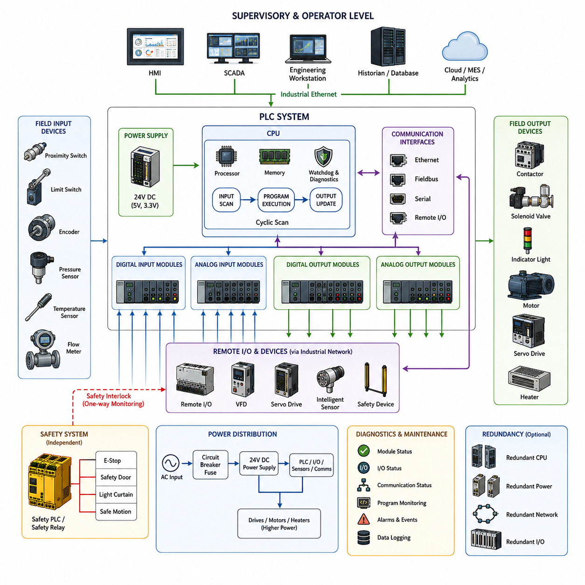
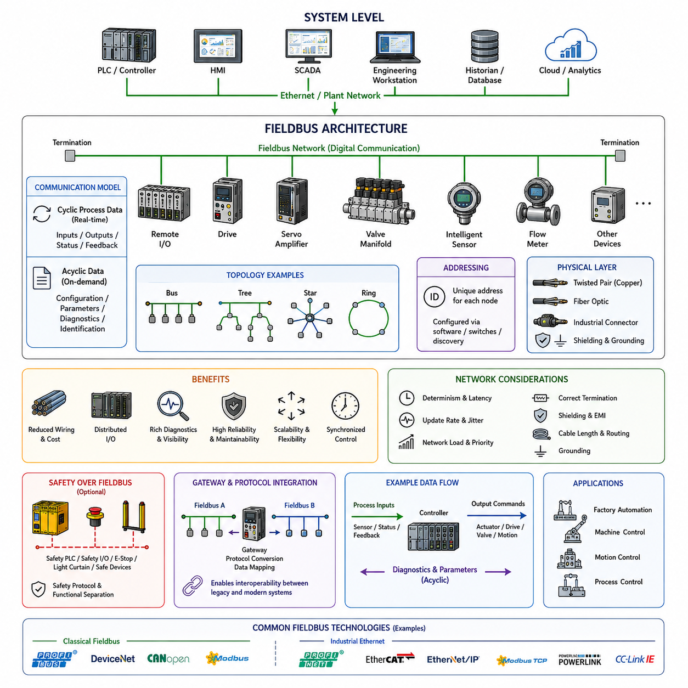
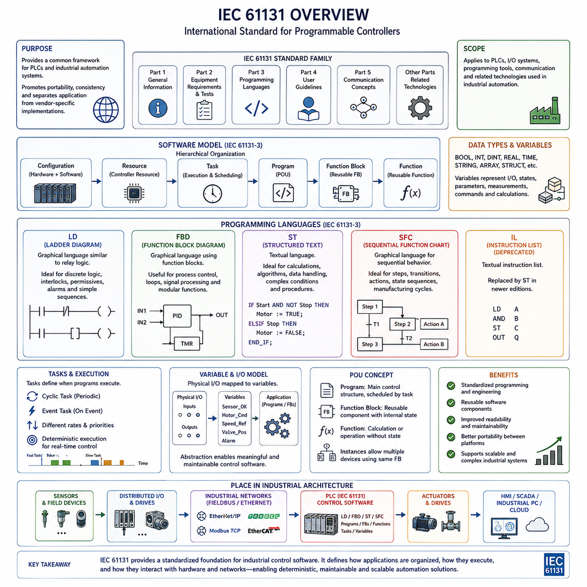
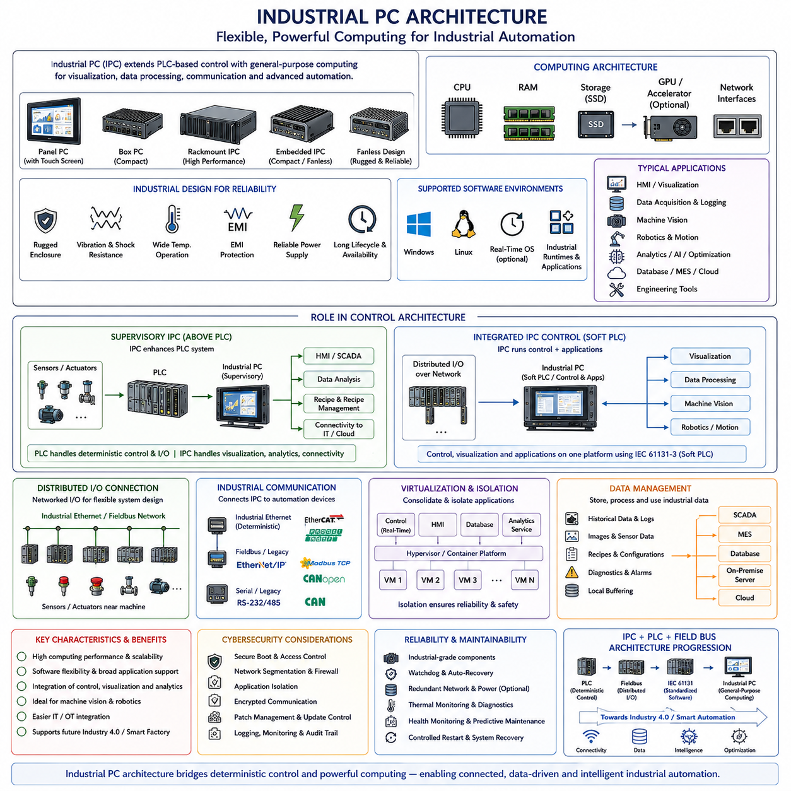
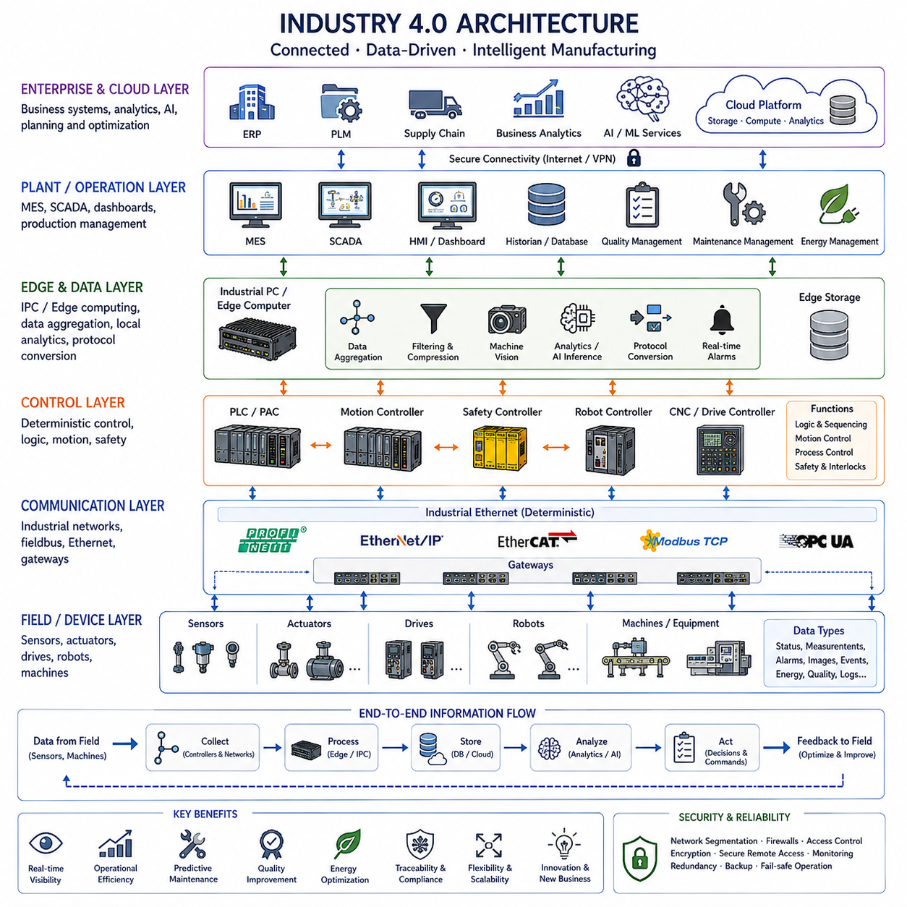

**Volume 01. Electrical Architecture Fundamentals**


# Chapter 03. Industrial Electrical Architecture

##  

## 03.01. PLC Based Architecture

{width="7.268055555555556in" height="7.268055555555556in"}

A PLC-based architecture organizes industrial electrical control around a Programmable Logic Controller that executes deterministic logic while coordinating sensors, actuators, drives, operator interfaces, and supervisory systems. The PLC acts as the primary control authority for a machine or process, repeatedly acquiring field inputs, executing the configured control program, and updating outputs according to defined timing and safety constraints.

The fundamental operating model is based on a cyclic scan. During each scan, the PLC reads digital and analog inputs, stores their states in an internal process image, executes control logic using those values, and then writes calculated states to physical outputs. Diagnostic and communication tasks are normally integrated into the same execution framework. This repetitive process provides predictable behavior that is essential for industrial automation.

Field devices form the physical boundary of the architecture. Proximity switches, limit switches, encoders, pressure sensors, temperature sensors, flow meters, and other devices provide information about the process. Output modules connect the PLC to contactors, solenoid valves, indicator devices, motors, and other actuators. Signal conditioning and electrical isolation protect the controller while adapting different voltage, current, and sensor interface standards.

A PLC system may use a compact architecture in which the processor, power supply, and I/O are integrated into one unit, or a modular architecture composed of separate CPU, communication, analog, digital, motion, and specialty modules. Modular systems allow engineers to expand the controller according to machine complexity. Remote I/O stations can further distribute interfaces near equipment, reducing long point-to-point wiring between field devices and the main control cabinet.

The CPU represents the computational center of the PLC. It executes application logic, manages memory, supervises communication, monitors hardware status, and maintains diagnostic information. Unlike general-purpose computers optimized for flexible computing workloads, PLCs emphasize predictable execution, long operational life, environmental robustness, and controlled failure behavior. Watchdogs and hardware diagnostics continuously detect abnormal execution or module failures.

PLC applications are commonly organized around logical functions representing individual machines, process sections, sequences, interlocks, and operating modes. A conveyor system, for example, may contain separate logic for motor commands, sensor validation, material tracking, fault handling, and emergency conditions. This modular organization makes complex automation systems easier to commission, troubleshoot, modify, and maintain throughout a long industrial equipment lifecycle.

Industrial communication extends PLC control beyond local I/O. Remote I/O, variable-frequency drives, servo drives, intelligent sensors, safety devices, and other controllers can communicate through industrial networks rather than individual signal wires. Traditional fieldbus technologies coexist with Industrial Ethernet, allowing the architecture to distribute control equipment physically while preserving coordinated logical operation across the production system.

Human-Machine Interfaces provide operators with a controlled view of the PLC system. The HMI reads process variables, equipment states, alarms, counters, operating modes, and diagnostic information while allowing authorized commands or parameter changes. Larger installations may connect multiple PLCs to SCADA systems, historians, engineering stations, or manufacturing systems, creating hierarchical information flows from physical equipment toward plant-level supervision.

Deterministic behavior is one of the most important characteristics of PLC architecture. Industrial machines often require actions to occur within known timing boundaries rather than merely achieving high average computing performance. PLC task scheduling, cyclic execution, interrupt routines, and real-time communication mechanisms therefore emphasize bounded response. Motion-control applications may use faster synchronized tasks while slower supervisory functions operate at independent rates.

Interlocking is another fundamental architectural principle. Outputs are not determined only by a requested command; they are enabled when required operating conditions are satisfied. A motor start command may depend on guard status, drive readiness, process conditions, upstream equipment, and fault states. These logical dependencies prevent invalid machine states and provide a structured method for coordinating equipment that physically interacts within an automated process.

Safety functions are frequently separated from ordinary machine control. Conventional PLC logic may control production behavior, while safety relays or safety PLCs supervise emergency stops, protective doors, light curtains, safe motion conditions, and other safety-related signals. Although standard and safety control systems exchange status information, safety functions are designed so that ordinary control software cannot improperly override the required protective behavior.

Power distribution and control architecture are closely related in PLC systems. Control power supplies commonly provide regulated DC power for the PLC, sensors, communication devices, and interface electronics, while higher-power circuits feed motors, heaters, drives, and other loads. Relays, contactors, circuit breakers, fuses, and protection devices create controlled electrical boundaries between low-power logic and energy-delivering equipment.

Diagnostics are built into multiple layers of the architecture. PLC hardware can report module faults, communication failures, power abnormalities, I/O errors, and execution problems, while application software can identify process-level faults such as sensor disagreement, actuator timeout, or invalid sequence transitions. Diagnostic information presented through an HMI or engineering workstation reduces troubleshooting time and supports systematic maintenance rather than relying only on physical inspection.

Redundancy can be introduced when process availability justifies additional complexity and cost. Critical installations may employ redundant power supplies, processors, communication paths, network interfaces, or remote I/O connections. The objective is not simply duplication but controlled continuation or transition when a component fails. Redundant architectures therefore require failure detection, state synchronization, switchover logic, and clear definition of acceptable degraded operating modes.

Engineering tools provide the configuration environment for PLC hardware, networks, variables, programs, diagnostics, and commissioning. Engineers define I/O assignments, communication parameters, task execution, control logic, and device relationships within a structured project. Online monitoring allows internal states to be observed during operation, making PLC systems especially practical for commissioning machinery where electrical, mechanical, and software behavior must be examined together.

The PLC also creates a clear separation between machine-level deterministic control and higher-level computing. Industrial PCs, edge computers, databases, analytics platforms, and AI systems can exchange commands, recipes, production information, or optimized parameters with the PLC without directly replacing its time-critical control functions. This separation allows computationally intensive applications to evolve while stable machine-control responsibilities remain within a predictable execution environment.

Modern PLC architectures increasingly combine traditional control principles with Ethernet-based connectivity, distributed I/O, intelligent drives, condition monitoring, edge computing, and plant-wide data integration. However, their architectural foundation remains consistent: field information is acquired reliably, control logic is executed predictably, outputs are applied safely, and system states remain diagnosable. This makes PLC-based architecture a foundational reference for understanding later industrial and robotic electrical architectures.

PLC 기반 아키텍처(PLC-Based Architecture)는 센서(Sensor), 액추에이터(Actuator), 드라이브(Drive), 운영자 인터페이스(Operator Interface), 상위 감독 시스템(Supervisory System)을 조정하면서 결정론적 로직(Deterministic Logic)을 실행하는 프로그래머블 로직 컨트롤러(Programmable Logic Controller, PLC)를 중심으로 산업용 전기 제어 시스템을 구성한다. PLC는 기계 또는 공정의 주요 제어 권한(Control Authority)을 담당하며, 현장 입력을 반복적으로 수집하고 설정된 제어 프로그램을 실행한 후 정의된 타이밍 및 안전 조건에 따라 출력을 갱신한다.

PLC의 기본 동작 모델은 주기적 스캔(Cyclic Scan)을 기반으로 한다. 각 스캔 동안 PLC는 디지털 입력(Digital Input)과 아날로그 입력(Analog Input)을 읽어 내부 프로세스 이미지(Process Image)에 상태를 저장하고, 해당 값을 이용하여 제어 로직(Control Logic)을 실행한 다음 계산된 상태를 물리적 출력으로 전달한다. 진단(Diagnostic) 및 통신 작업도 일반적으로 동일한 실행 프레임워크에 통합된다. 이러한 반복 과정은 산업 자동화(Industrial Automation)에 필요한 예측 가능한 동작을 제공한다.

필드 장치(Field Device)는 PLC 아키텍처와 물리적 환경 사이의 경계를 형성한다. 근접 센서(Proximity Switch), 리미트 스위치(Limit Switch), 엔코더(Encoder), 압력 센서(Pressure Sensor), 온도 센서(Temperature Sensor), 유량계(Flow Meter) 등의 장치가 공정 정보를 제공한다. 출력 모듈(Output Module)은 PLC를 접촉기(Contactor), 솔레노이드 밸브(Solenoid Valve), 표시 장치(Indicator Device), 모터(Motor) 등의 액추에이터와 연결한다. 신호 조절(Signal Conditioning)과 전기적 절연(Electrical Isolation)은 서로 다른 전압, 전류 및 센서 인터페이스 규격을 조정하면서 컨트롤러를 보호한다.

PLC 시스템은 프로세서(Processor), 전원 공급 장치(Power Supply), 입출력(I/O)이 하나의 장치에 통합된 컴팩트 아키텍처(Compact Architecture)를 사용할 수도 있고, CPU, 통신, 아날로그, 디지털, 모션(Motion), 특수 기능 모듈(Specialty Module)을 개별적으로 구성하는 모듈형 아키텍처(Modular Architecture)를 사용할 수도 있다. 모듈형 시스템은 기계의 복잡성에 따라 컨트롤러를 확장할 수 있으며, 원격 입출력(Remote I/O)을 장비 가까이에 배치하면 필드 장치와 주 제어반(Main Control Cabinet) 사이의 긴 점대점 배선(Point-to-Point Wiring)을 줄일 수 있다.

중앙처리장치(Central Processing Unit, CPU)는 PLC의 연산 중심을 구성한다. CPU는 애플리케이션 로직(Application Logic)을 실행하고 메모리(Memory)를 관리하며, 통신을 제어하고 하드웨어 상태와 진단 정보를 관리한다. 유연한 연산 작업에 최적화된 범용 컴퓨터(General-Purpose Computer)와 달리 PLC는 예측 가능한 실행, 긴 운용 수명, 환경적 견고성(Environmental Robustness), 통제된 고장 동작(Controlled Failure Behavior)을 중시한다. 워치독(Watchdog)과 하드웨어 진단 기능은 비정상적인 프로그램 실행이나 모듈 고장을 지속적으로 감지한다.

PLC 애플리케이션은 일반적으로 개별 기계, 공정 구간(Process Section), 시퀀스(Sequence), 인터록(Interlock), 운전 모드(Operating Mode)를 나타내는 논리적 기능 단위로 구성된다. 예를 들어 컨베이어 시스템(Conveyor System)은 모터 명령, 센서 검증, 자재 추적(Material Tracking), 고장 처리(Fault Handling), 비상 조건을 위한 별도의 로직을 포함할 수 있다. 이러한 모듈형 구성은 복잡한 자동화 시스템의 시운전(Commissioning), 문제 해결(Troubleshooting), 수정 및 장기간 유지보수를 보다 쉽게 수행할 수 있도록 한다.

산업용 통신(Industrial Communication)은 PLC 제어 영역을 로컬 입출력(Local I/O) 이상으로 확장한다. 원격 입출력(Remote I/O), 가변 주파수 드라이브(Variable-Frequency Drive), 서보 드라이브(Servo Drive), 지능형 센서(Intelligent Sensor), 안전 장치(Safety Device), 다른 컨트롤러는 개별 신호선을 사용하는 대신 산업용 네트워크(Industrial Network)를 통해 통신할 수 있다. 기존 필드버스(Fieldbus) 기술과 산업용 이더넷(Industrial Ethernet)이 함께 사용되면서 제어 장치를 물리적으로 분산시키는 동시에 생산 시스템 전체의 논리적 제어를 통합할 수 있다.

인간-기계 인터페이스(Human-Machine Interface, HMI)는 운영자가 PLC 시스템의 상태를 확인하고 제어할 수 있는 인터페이스를 제공한다. HMI는 공정 변수(Process Variable), 장비 상태, 알람(Alarm), 카운터(Counter), 운전 모드 및 진단 정보를 읽으며, 권한이 부여된 명령이나 파라미터(Parameter) 변경을 허용한다. 대규모 설비에서는 여러 PLC가 SCADA(Supervisory Control and Data Acquisition), 히스토리언(Historian), 엔지니어링 스테이션(Engineering Station), 제조 시스템과 연결되어 물리적 장비에서 공장 수준의 감독 시스템으로 이어지는 계층적 정보 흐름을 구성할 수 있다.

결정론적 동작(Deterministic Behavior)은 PLC 아키텍처의 가장 중요한 특성 중 하나이다. 산업용 기계에서는 단순히 높은 평균 연산 성능을 확보하는 것보다 정해진 시간 범위 내에서 동작을 수행하는 것이 중요하다. 따라서 PLC의 태스크 스케줄링(Task Scheduling), 주기적 실행(Cyclic Execution), 인터럽트 루틴(Interrupt Routine), 실시간 통신(Real-Time Communication)은 제한된 응답 시간(Bounded Response)을 중요하게 다룬다. 모션 제어(Motion Control)는 빠르게 동기화된 태스크를 사용할 수 있으며, 상대적으로 느린 감독 기능은 별도의 주기로 실행될 수 있다.

인터록(Interlocking)은 PLC 기반 아키텍처의 또 다른 핵심 원칙이다. 출력은 단순히 요청된 명령만으로 결정되는 것이 아니라 필요한 운전 조건이 모두 충족되었을 때 활성화된다. 예를 들어 모터 기동 명령은 보호문(Guard)의 상태, 드라이브 준비 상태(Drive Readiness), 공정 조건, 상류 장비(Upstream Equipment), 고장 상태 등에 의존할 수 있다. 이러한 논리적 종속 관계는 잘못된 기계 상태를 방지하고 물리적으로 상호작용하는 자동화 장비를 체계적으로 조정할 수 있게 한다.

안전 기능(Safety Function)은 일반적인 기계 제어와 분리되는 경우가 많다. 일반 PLC 로직은 생산 동작을 제어하고, 안전 릴레이(Safety Relay) 또는 안전 PLC(Safety PLC)는 비상 정지(Emergency Stop), 보호문, 라이트 커튼(Light Curtain), 안전 모션 조건(Safe Motion Condition) 등의 안전 관련 신호를 감시한다. 표준 제어 시스템과 안전 제어 시스템이 상태 정보를 교환할 수 있지만, 일반 제어 소프트웨어가 요구되는 보호 기능을 부적절하게 무효화할 수 없도록 안전 기능을 설계한다.

전력 분배(Power Distribution)와 제어 아키텍처(Control Architecture)는 PLC 시스템에서 밀접하게 연관된다. 제어용 전원 공급 장치(Control Power Supply)는 일반적으로 PLC, 센서, 통신 장치 및 인터페이스 전자회로에 안정화된 직류 전원(Regulated DC Power)을 공급하고, 더 높은 전력을 사용하는 회로는 모터, 히터(Heater), 드라이브 등의 부하를 구동한다. 릴레이(Relay), 접촉기(Contactor), 회로 차단기(Circuit Breaker), 퓨즈(Fuse), 보호 장치는 저전력 제어 로직과 실제 에너지를 공급하는 장비 사이에 통제된 전기적 경계를 형성한다.

진단 기능(Diagnostics)은 PLC 아키텍처의 여러 계층에 통합된다. PLC 하드웨어는 모듈 고장, 통신 장애, 전원 이상, 입출력 오류 및 프로그램 실행 문제를 보고할 수 있으며, 애플리케이션 소프트웨어는 센서 불일치(Sensor Disagreement), 액추에이터 타임아웃(Actuator Timeout), 잘못된 시퀀스 전환(Invalid Sequence Transition)과 같은 공정 수준의 고장을 식별할 수 있다. HMI 또는 엔지니어링 워크스테이션(Engineering Workstation)을 통해 진단 정보를 제공하면 단순한 물리적 점검에 의존하지 않고 체계적인 유지보수를 수행할 수 있다.

공정의 가용성(Availability)이 추가적인 복잡성과 비용을 정당화할 수 있는 경우에는 이중화(Redundancy)를 적용할 수 있다. 중요 설비는 이중화 전원 공급 장치(Redundant Power Supply), 프로세서, 통신 경로, 네트워크 인터페이스 또는 원격 입출력 연결을 사용할 수 있다. 목적은 단순히 구성요소를 복제하는 것이 아니라 특정 구성요소가 고장 났을 때 시스템이 통제된 방식으로 계속 동작하거나 전환되도록 하는 것이다. 따라서 이중화 아키텍처에는 고장 감지(Failure Detection), 상태 동기화(State Synchronization), 전환 로직(Switchover Logic), 성능 저하 운전 모드(Degraded Operating Mode)에 대한 명확한 정의가 필요하다.

엔지니어링 도구(Engineering Tool)는 PLC 하드웨어, 네트워크, 변수, 프로그램, 진단 및 시운전을 구성하기 위한 개발 환경을 제공한다. 엔지니어는 구조화된 프로젝트 내에서 입출력 할당(I/O Assignment), 통신 파라미터, 태스크 실행, 제어 로직 및 장치 간 관계를 정의한다. 온라인 모니터링(Online Monitoring)을 통해 운전 중 내부 상태를 확인할 수 있으므로 전기, 기계 및 소프트웨어의 동작을 함께 확인해야 하는 기계 시운전 과정에서 PLC 시스템은 특히 실용적이다.

PLC는 또한 기계 수준의 결정론적 제어(Machine-Level Deterministic Control)와 상위 수준 컴퓨팅(Higher-Level Computing)을 명확하게 분리하는 경계를 제공한다. 산업용 PC(Industrial PC), 엣지 컴퓨터(Edge Computer), 데이터베이스(Database), 분석 플랫폼(Analytics Platform), 인공지능 시스템(AI System)은 PLC의 시간 임계 제어(Time-Critical Control)를 직접 대체하지 않으면서 명령, 레시피(Recipe), 생산 정보 또는 최적화된 파라미터를 PLC와 교환할 수 있다. 이러한 분리는 안정적인 기계 제어 기능을 예측 가능한 실행 환경에 유지하면서 상위 연산 기능을 독립적으로 발전시킬 수 있게 한다.

현대의 PLC 아키텍처는 전통적인 제어 원칙에 이더넷 기반 연결(Ethernet-Based Connectivity), 분산 입출력(Distributed I/O), 지능형 드라이브(Intelligent Drive), 상태 모니터링(Condition Monitoring), 엣지 컴퓨팅(Edge Computing), 공장 전체 데이터 통합(Plant-Wide Data Integration)을 점차 결합하고 있다. 그러나 기본적인 아키텍처 원리는 유지된다. 현장 정보를 신뢰성 있게 획득하고, 제어 로직을 예측 가능하게 실행하며, 출력을 안전하게 적용하고, 시스템 상태를 진단 가능하게 유지하는 것이다. 이러한 특성으로 인해 PLC 기반 아키텍처는 이후의 산업용 및 로보틱스 전기 아키텍처(Robotics Electrical Architecture)를 이해하기 위한 핵심적인 기반이 된다.

##  

## 03.02. Fieldbus Architecture

{width="7.268055555555556in" height="7.268055555555556in"}

Fieldbus architecture provides a structured communication layer between industrial controllers and distributed field devices. Instead of connecting every sensor and actuator to a central controller through individual point-to-point wires, multiple devices share a digital communication network. Within the industrial electrical architecture, this approach extends PLC-based control toward distributed I/O, intelligent devices, coordinated drives, and networked automation.

Traditional industrial control systems required extensive wiring between the control cabinet and field equipment. Every switch, sensor, valve, relay, and actuator could require dedicated signal conductors, increasing cable volume, installation effort, cabinet terminals, and troubleshooting complexity. Fieldbus technology changes this structure by transporting multiple control variables and device states over a shared communication medium.

A typical fieldbus architecture contains a controller, network interface, communication medium, and multiple field nodes. The controller is commonly a PLC, industrial controller, or dedicated machine controller, while field nodes may include remote I/O modules, motor drives, servo amplifiers, valve manifolds, measurement instruments, and intelligent sensors. Each node exchanges defined process data through the network rather than relying entirely on discrete electrical signals.

The communication relationship between devices may follow master-slave, client-server, producer-consumer, or distributed control principles depending on the selected protocol. Earlier fieldbus systems often used a central master that cyclically requested or exchanged information with subordinate nodes. More advanced industrial networks allow devices to publish data, exchange synchronized process information, or communicate directly when the application requires distributed coordination.

Cyclic communication is particularly important for machine control. Process inputs such as sensor states, measured values, drive feedback, and equipment status are transferred repeatedly at defined intervals, while output commands such as actuator states, speed references, torque commands, and valve positions travel in the opposite direction. Predictable update timing allows the controller to coordinate physical equipment consistently across the network.

A fieldbus also carries acyclic information that does not require continuous real-time exchange. Device configuration, parameter settings, identification information, calibration values, diagnostic records, and maintenance data can be transferred when required. Separating cyclic process data from acyclic service information allows the network to support fast machine operation while providing richer engineering and diagnostic capabilities than conventional hardwired interfaces.

Physical transmission technologies differ considerably among fieldbus systems. Networks may use twisted-pair copper wiring, shielded cables, specialized industrial connectors, optical fiber, or Ethernet-based physical layers. Electrical characteristics, topology, termination, shielding, grounding, cable length, transmission speed, and environmental resistance must therefore be considered as part of the electrical architecture rather than treating communication as a purely software concern.

Network topology determines how controllers and field devices are physically interconnected. Bus, line, tree, star, and ring arrangements are commonly used depending on the communication technology and availability requirements. Traditional fieldbus networks frequently use a shared linear bus, while Industrial Ethernet systems provide greater topology flexibility. The selected topology affects cable routing, expansion capability, fault propagation, maintenance accessibility, and redundancy design.

Device addressing provides a logical identity for each node connected to the network. The controller uses these identities to associate transmitted information with specific devices and process variables. Address configuration may be performed through hardware switches, engineering software, automatic discovery, or network configuration mechanisms. Consistent addressing and device naming are essential because incorrect configuration can cause communication failures or unintended control relationships.

Remote I/O is one of the most important applications of fieldbus architecture. Instead of routing every sensor and actuator cable back to the main control cabinet, remote I/O modules can be installed near the machine or process equipment. Short local wires connect field devices to these modules, while the fieldbus carries aggregated information back to the controller. This architecture can significantly reduce harness length, terminal count, cabinet congestion, and installation effort.

Intelligent motor drives and servo systems gain additional benefits from networked communication. A drive can exchange not only start and stop commands but also velocity, position, torque, operating mode, current, temperature, fault codes, and internal diagnostic information. Servo networks can further coordinate multiple axes using synchronized communication, allowing distributed drive electronics to participate in tightly controlled motion systems without extensive analog or discrete wiring.

Fieldbus architecture improves diagnostics because communication devices can report their internal status through the same network used for control. A PLC or engineering workstation may identify a disconnected node, communication timeout, invalid configuration, sensor failure, drive alarm, or degraded link. This visibility allows technicians to distinguish network, device, wiring, and process faults more efficiently than systems based exclusively on conventional electrical signals.

Determinism and latency are critical design considerations when the network participates directly in machine control. A communication system must deliver required process information within timing limits appropriate to the controlled equipment. Update rate, jitter, synchronization accuracy, network load, message priority, and failure recovery therefore influence control performance. High-speed motion applications normally impose stricter timing requirements than monitoring or supervisory functions.

Reliability depends on both communication protocol behavior and physical installation quality. Incorrect termination, poor shielding, excessive cable length, electromagnetic interference, damaged connectors, grounding problems, or unsuitable routing can produce intermittent communication faults. Industrial fieldbus engineering therefore requires coordination between network configuration and electrical design, particularly when communication cables operate near motors, inverters, contactors, and high-current power conductors.

Industrial communication systems include many technologies optimized for different applications. Classical fieldbus technologies established standardized digital communication for factory and process automation, while Industrial Ethernet extends similar concepts using Ethernet-based infrastructure. The broader architecture may therefore contain multiple network types connected through gateways, communication modules, or controllers, allowing legacy equipment and newer intelligent devices to operate within the same automation system.

Gateways become important when equipment using different protocols must exchange information. A gateway translates or maps process variables between communication domains, while a PLC may also contain multiple communication interfaces and perform integration through application logic. Although protocol conversion increases interoperability, it can introduce additional latency, configuration complexity, diagnostic boundaries, and failure modes that must be considered during architecture design.

Safety-related communication can also be implemented over industrial networks when supported by appropriate safety protocols and certified devices. Safety PLCs, distributed safety I/O, emergency-stop devices, light curtains, drives, and other protective equipment may exchange safety information while maintaining required integrity mechanisms. Safety communication remains logically protected from ordinary control functions even when both types of traffic share portions of the physical network.

Modern fieldbus architecture increasingly converges with Industrial Ethernet, edge computing, and higher-level information systems. PLCs and distributed devices can provide operational data to HMIs, SCADA platforms, historians, industrial PCs, and analytics systems while continuing to perform deterministic machine control. This creates a layered architecture in which field communication connects physical equipment to control systems and higher computational layers.

For robotics and advanced industrial automation, the fieldbus concept establishes an important architectural principle: computation and electrical interfaces do not need to reside in one centralized cabinet. Sensors, I/O modules, motor controllers, servo drives, and intelligent devices can be physically distributed while remaining logically coordinated through deterministic communication. This principle forms an important bridge from traditional PLC systems toward distributed robotic electrical and communication architectures.

필드버스 아키텍처(Fieldbus Architecture)는 산업용 컨트롤러(Industrial Controller)와 분산된 필드 장치(Field Device) 사이에 구조화된 통신 계층(Communication Layer)을 제공한다. 모든 센서와 액추에이터(Actuator)를 개별 점대점 배선(Point-to-Point Wiring)을 통해 중앙 컨트롤러에 연결하는 대신, 여러 장치가 하나의 디지털 통신 네트워크(Digital Communication Network)를 공유한다. 산업용 전기 아키텍처(Industrial Electrical Architecture)에서 이러한 방식은 PLC 기반 제어를 분산 입출력(Distributed I/O), 지능형 장치(Intelligent Device), 협조 제어 드라이브(Coordinated Drive), 네트워크 기반 자동화(Networked Automation)로 확장한다.

전통적인 산업 제어 시스템(Industrial Control System)은 제어반(Control Cabinet)과 현장 장비 사이에 광범위한 배선을 필요로 했다. 각각의 스위치, 센서, 밸브, 릴레이 및 액추에이터에는 전용 신호선이 필요할 수 있으며, 이에 따라 케이블의 양, 설치 작업, 제어반 단자 및 문제 해결의 복잡성이 증가한다. 필드버스(Fieldbus) 기술은 여러 제어 변수(Control Variable)와 장치 상태(Device State)를 하나의 공유 통신 매체(Shared Communication Medium)를 통해 전달함으로써 이러한 구조를 변화시킨다.

일반적인 필드버스 아키텍처(Fieldbus Architecture)는 컨트롤러(Controller), 네트워크 인터페이스(Network Interface), 통신 매체(Communication Medium), 다수의 필드 노드(Field Node)로 구성된다. 컨트롤러는 일반적으로 PLC, 산업용 컨트롤러 또는 전용 기계 컨트롤러이며, 필드 노드에는 원격 입출력 모듈(Remote I/O Module), 모터 드라이브(Motor Drive), 서보 앰프(Servo Amplifier), 밸브 매니폴드(Valve Manifold), 계측 장비(Measurement Instrument), 지능형 센서(Intelligent Sensor) 등이 포함될 수 있다. 각 노드는 개별 전기 신호에만 의존하지 않고 네트워크를 통해 정의된 공정 데이터(Process Data)를 교환한다.

장치 간 통신 관계는 선택된 프로토콜(Protocol)에 따라 마스터-슬레이브(Master-Slave), 클라이언트-서버(Client-Server), 생산자-소비자(Producer-Consumer) 또는 분산 제어(Distributed Control) 원칙을 따를 수 있다. 초기 필드버스 시스템은 중앙 마스터가 하위 노드와 주기적으로 정보를 요청하거나 교환하는 방식을 주로 사용했다. 발전된 산업용 네트워크에서는 애플리케이션 요구에 따라 장치가 데이터를 게시하거나 동기화된 공정 정보를 교환하고 직접 통신할 수 있다.

주기적 통신(Cyclic Communication)은 특히 기계 제어에서 중요하다. 센서 상태, 측정값, 드라이브 피드백(Drive Feedback), 장비 상태 등의 공정 입력(Process Input)은 정해진 간격으로 반복적으로 전달되며, 액추에이터 상태, 속도 기준값(Speed Reference), 토크 명령(Torque Command), 밸브 위치 등의 출력 명령은 반대 방향으로 전달된다. 예측 가능한 갱신 주기(Update Timing)를 통해 컨트롤러는 네트워크 전체의 물리적 장비를 일관되게 협조 제어할 수 있다.

필드버스는 지속적인 실시간 교환이 필요하지 않은 비주기 정보(Acyclic Information)도 전달한다. 장치 설정(Device Configuration), 파라미터 설정(Parameter Setting), 식별 정보(Identification Information), 교정값(Calibration Value), 진단 기록(Diagnostic Record), 유지보수 데이터(Maintenance Data) 등을 필요할 때 전송할 수 있다. 주기적 공정 데이터(Cyclic Process Data)와 비주기 서비스 정보(Acyclic Service Information)를 구분하면 빠른 기계 동작을 지원하면서 기존 하드와이어드 인터페이스(Hardwired Interface)보다 풍부한 엔지니어링 및 진단 기능을 제공할 수 있다.

물리적 전송 기술(Physical Transmission Technology)은 필드버스 시스템에 따라 크게 달라진다. 네트워크에는 트위스트 페어(Twisted-Pair) 구리 배선, 차폐 케이블(Shielded Cable), 특수 산업용 커넥터(Industrial Connector), 광섬유(Optical Fiber), 이더넷 기반 물리 계층(Ethernet-Based Physical Layer) 등이 사용될 수 있다. 따라서 전기적 특성, 토폴로지(Topology), 종단(Termination), 차폐(Shielding), 접지(Grounding), 케이블 길이, 전송 속도 및 환경 내성을 단순한 소프트웨어 문제가 아닌 전기 아키텍처의 일부로 고려해야 한다.

네트워크 토폴로지(Network Topology)는 컨트롤러와 필드 장치가 물리적으로 어떻게 연결되는지를 결정한다. 통신 기술과 가용성(Availability) 요구사항에 따라 버스(Bus), 라인(Line), 트리(Tree), 스타(Star), 링(Ring) 구조가 사용된다. 전통적인 필드버스 네트워크는 공유 선형 버스(Shared Linear Bus)를 주로 사용하지만, 산업용 이더넷(Industrial Ethernet)은 보다 유연한 토폴로지를 제공한다. 선택된 토폴로지는 케이블 라우팅(Cable Routing), 확장성, 고장 전파(Fault Propagation), 유지보수 접근성 및 이중화 설계(Redundancy Design)에 영향을 준다.

장치 주소 지정(Device Addressing)은 네트워크에 연결된 각 노드에 논리적 식별자(Logical Identity)를 제공한다. 컨트롤러는 이러한 식별자를 사용하여 전송되는 정보를 특정 장치 및 공정 변수와 연결한다. 주소 설정은 하드웨어 스위치, 엔지니어링 소프트웨어(Engineering Software), 자동 검색(Automatic Discovery), 네트워크 설정 메커니즘(Network Configuration Mechanism)을 통해 수행될 수 있다. 잘못된 설정은 통신 장애 또는 의도하지 않은 제어 관계를 발생시킬 수 있으므로 일관된 주소와 장치 명칭 관리가 중요하다.

원격 입출력(Remote I/O)은 필드버스 아키텍처의 가장 중요한 적용 분야 중 하나이다. 모든 센서와 액추에이터 케이블을 주 제어반(Main Control Cabinet)까지 연결하는 대신, 원격 입출력 모듈을 기계 또는 공정 장비 가까이에 설치할 수 있다. 짧은 로컬 배선(Local Wiring)이 필드 장치와 해당 모듈을 연결하고, 필드버스가 통합된 정보를 컨트롤러로 전달한다. 이러한 아키텍처는 하니스 길이(Harness Length), 단자 수, 제어반 내부 복잡성 및 설치 작업을 크게 줄일 수 있다.

지능형 모터 드라이브(Intelligent Motor Drive)와 서보 시스템(Servo System)은 네트워크 통신을 통해 추가적인 이점을 얻는다. 드라이브는 단순한 시작 및 정지 명령뿐 아니라 속도, 위치, 토크, 운전 모드, 전류, 온도, 고장 코드(Fault Code), 내부 진단 정보를 교환할 수 있다. 서보 네트워크(Servo Network)는 동기화 통신(Synchronized Communication)을 통해 여러 축을 협조 제어하여 광범위한 아날로그 또는 개별 배선 없이 분산 드라이브 전자장치가 정밀 모션 시스템에 참여할 수 있도록 한다.

필드버스 아키텍처는 통신 장치가 제어에 사용하는 동일한 네트워크를 통해 내부 상태를 보고할 수 있기 때문에 진단 기능(Diagnostics)을 향상시킨다. PLC 또는 엔지니어링 워크스테이션(Engineering Workstation)은 연결이 끊어진 노드, 통신 타임아웃(Communication Timeout), 잘못된 설정, 센서 고장, 드라이브 알람(Drive Alarm), 성능이 저하된 통신 링크 등을 식별할 수 있다. 이러한 가시성(Visibility)은 기존 전기 신호에만 의존하는 시스템보다 네트워크, 장치, 배선 및 공정 고장을 효율적으로 구분할 수 있게 한다.

네트워크가 기계 제어에 직접 참여하는 경우 결정론성(Determinism)과 지연 시간(Latency)은 핵심적인 설계 요소가 된다. 통신 시스템은 제어 대상 장비에 적합한 시간 제한 내에서 필요한 공정 정보를 전달해야 한다. 따라서 갱신 속도(Update Rate), 지터(Jitter), 동기화 정확도(Synchronization Accuracy), 네트워크 부하(Network Load), 메시지 우선순위(Message Priority), 고장 복구(Failure Recovery)가 제어 성능에 영향을 준다. 고속 모션 애플리케이션은 일반적인 모니터링이나 감독 기능보다 엄격한 타이밍 요구사항을 가진다.

신뢰성(Reliability)은 통신 프로토콜의 동작뿐 아니라 물리적 설치 품질에도 영향을 받는다. 잘못된 종단, 불충분한 차폐, 과도한 케이블 길이, 전자기 간섭(Electromagnetic Interference, EMI), 손상된 커넥터, 접지 문제 또는 부적절한 케이블 라우팅은 간헐적인 통신 장애를 발생시킬 수 있다. 따라서 산업용 필드버스 엔지니어링(Fieldbus Engineering)은 특히 통신 케이블이 모터, 인버터(Inverter), 접촉기(Contactor), 대전류 전력선 근처에 위치하는 경우 네트워크 설정과 전기 설계를 함께 고려해야 한다.

산업용 통신 시스템(Industrial Communication System)에는 서로 다른 애플리케이션에 최적화된 다양한 기술이 존재한다. 전통적인 필드버스 기술은 공장 및 공정 자동화를 위한 표준화된 디지털 통신을 확립했으며, 산업용 이더넷(Industrial Ethernet)은 이러한 개념을 이더넷 기반 인프라로 확장하였다. 따라서 전체 아키텍처에는 게이트웨이(Gateway), 통신 모듈(Communication Module), 컨트롤러를 통해 연결되는 여러 종류의 네트워크가 존재할 수 있으며, 기존 장비와 새로운 지능형 장치가 동일한 자동화 시스템에서 함께 동작할 수 있다.

서로 다른 프로토콜을 사용하는 장비가 정보를 교환해야 할 때 게이트웨이(Gateway)가 중요해진다. 게이트웨이는 서로 다른 통신 영역(Communication Domain) 사이에서 공정 변수를 변환하거나 매핑(Mapping)하며, PLC 자체가 여러 통신 인터페이스를 갖추고 애플리케이션 로직을 통해 통합을 수행할 수도 있다. 프로토콜 변환(Protocol Conversion)은 상호운용성(Interoperability)을 향상시키지만 추가적인 지연 시간, 설정 복잡성, 진단 경계 및 고장 모드를 발생시킬 수 있으므로 아키텍처 설계 단계에서 고려해야 한다.

안전 관련 통신(Safety-Related Communication)은 적절한 안전 프로토콜(Safety Protocol)과 인증된 장치가 지원되는 경우 산업용 네트워크를 통해 구현할 수도 있다. 안전 PLC(Safety PLC), 분산 안전 입출력(Distributed Safety I/O), 비상 정지 장치(Emergency-Stop Device), 라이트 커튼(Light Curtain), 드라이브 및 기타 보호 장비가 요구되는 무결성 메커니즘(Integrity Mechanism)을 유지하면서 안전 정보를 교환할 수 있다. 두 종류의 트래픽이 물리적 네트워크 일부를 공유하더라도 안전 통신은 일반 제어 기능으로부터 논리적으로 보호된다.

현대의 필드버스 아키텍처는 산업용 이더넷(Industrial Ethernet), 엣지 컴퓨팅(Edge Computing), 상위 정보 시스템(Higher-Level Information System)과 점차 융합되고 있다. PLC와 분산 장치는 결정론적 기계 제어(Deterministic Machine Control)를 지속적으로 수행하면서 운전 데이터를 HMI, SCADA, 히스토리언(Historian), 산업용 PC(Industrial PC), 분석 시스템(Analytics System)에 제공할 수 있다. 이를 통해 필드 통신이 물리적 장비를 제어 시스템 및 상위 연산 계층과 연결하는 계층형 아키텍처(Layered Architecture)가 형성된다.

로보틱스(Robotics)와 첨단 산업 자동화(Advanced Industrial Automation)에서 필드버스 개념은 중요한 아키텍처 원칙을 확립한다. 연산 장치와 전기 인터페이스가 반드시 하나의 중앙 제어반에 위치할 필요는 없다. 센서, 입출력 모듈, 모터 컨트롤러(Motor Controller), 서보 드라이브 및 지능형 장치는 물리적으로 분산될 수 있으며 결정론적 통신(Deterministic Communication)을 통해 논리적으로 협조 제어될 수 있다. 이러한 원칙은 전통적인 PLC 시스템에서 분산형 로봇 전기 및 통신 아키텍처(Distributed Robotic Electrical and Communication Architecture)로 발전하는 중요한 연결 기반을 형성한다.

##  

## 03.03. IEC 61131 Overview

{width="7.268055555555556in" height="7.268055555555556in"}

IEC 61131 is an international standards family that establishes a common framework for programmable controllers and their associated industrial automation systems. It provides standardized concepts for controller characteristics, programming models, software organization, communication, and related engineering practices. Within PLC-based industrial electrical architecture, IEC 61131 helps separate control-system implementation from individual vendor-specific conventions.

The standard emerged from the need to reduce fragmentation among programmable controller platforms. Early PLC manufacturers developed different programming methods, terminology, data representations, and engineering environments, making applications difficult to transfer or maintain across systems. IEC 61131 introduced a common conceptual foundation so engineers could describe industrial control applications using more consistent programming and execution principles.

IEC 61131 is organized as a multi-part standard rather than a single programming specification. Its parts address areas such as general information, equipment requirements and tests, programming languages, user guidelines, communication-related concepts, and additional technologies associated with programmable controllers. For control software engineering, IEC 61131-3 is particularly important because it defines programming languages and software organization concepts widely used in PLC systems.

IEC 61131-3 defines a software model in which control applications can be decomposed into manageable elements instead of being treated as one monolithic program. Configuration, resource, task, program, function block, and function concepts provide different levels of organization. This hierarchy allows engineers to associate software execution with controller resources and to structure complex machine behavior according to functional and timing requirements.

The concept of a Program Organization Unit, commonly called a POU, is central to IEC 61131-3. POUs provide reusable software structures for organizing control algorithms and machine functions. The principal forms include programs, function blocks, and functions. Their different execution and data-handling characteristics allow engineers to select an appropriate structure for sequencing, calculations, device control, reusable components, and other automation functions.

A program generally represents a higher-level control organization associated with a particular machine or process function. It can coordinate multiple operations and interact with variables, function blocks, and other software elements. Programs are normally associated with tasks that determine when they execute. This relationship between program organization and task scheduling connects the logical software architecture with the deterministic execution behavior required by industrial controllers.

Functions are intended for operations that calculate a result from defined inputs without retaining the same type of persistent internal execution state expected from function blocks. They are useful for mathematical calculations, conversions, comparisons, scaling, and reusable algorithms. Standardized function concepts encourage engineers to encapsulate frequently repeated operations rather than reproducing equivalent logic throughout an automation application.

Function blocks provide reusable software components that can maintain internal state between executions. This makes them particularly suitable for timers, counters, motor control, valve control, state machines, communication handling, and equipment abstractions. Multiple instances of the same function block can operate independently with their own internal data, enabling industrial applications to represent repeated physical devices using consistent software structures.

IEC 61131-3 historically standardized several PLC programming representations, including Ladder Diagram, Function Block Diagram, Structured Text, Instruction List, and Sequential Function Chart. Instruction List was later deprecated in newer editions, while the remaining representations continue to support different engineering styles. The availability of multiple representations reflects the diverse origins and requirements of industrial automation engineering.

Ladder Diagram, commonly abbreviated as LD, visually resembles relay-based electrical control circuits. Contacts, coils, branches, and related elements express logical conditions and output behavior in a form familiar to electrical and maintenance engineers. It is particularly effective for discrete logic, interlocks, permissive conditions, alarms, and straightforward machine sequences where rapid visual interpretation during commissioning and troubleshooting is valuable.

Function Block Diagram, or FBD, represents control behavior through interconnected functional blocks. Signals flow between blocks representing logic, calculations, timers, controllers, processing functions, or equipment behavior. FBD is useful when the application can be naturally understood as interconnected processing elements and is widely applied to process control, signal processing, control loops, and modular automation functions.

Structured Text, abbreviated as ST, is a textual programming language designed for programmable controller applications. Its syntax supports expressions, assignments, conditional execution, loops, function calls, and structured algorithms. ST is especially useful when control logic involves mathematical operations, data manipulation, complex conditions, arrays, algorithms, or procedures that would become difficult to express clearly using graphical programming representations.

Sequential Function Chart, or SFC, provides a structured representation for sequential behavior. A process can be divided into steps, transitions, and associated actions so that machine operating sequences can be represented according to state progression. This approach is useful for manufacturing cycles, batch processes, startup and shutdown sequences, and other applications in which operations must proceed through clearly defined stages.

Variables and data types provide another important foundation of IEC 61131-3 programming. Control applications operate on Boolean values, integers, real numbers, time values, strings, and other defined data structures. Variables can represent physical I/O signals, internal machine states, parameters, measurements, commands, and intermediate calculations. Explicit data representation improves software readability and reduces ambiguity when information moves between different control functions.

Tasks define how software execution is scheduled within the controller. A task may activate programs periodically, in response to events, or according to execution mechanisms supported by the PLC environment. Different tasks can therefore operate at different rates according to application requirements. Fast control functions may execute frequently, while diagnostics, communication processing, or supervisory logic can operate at slower intervals.

The task concept is closely related to deterministic PLC operation. Industrial control software must often guarantee that critical logic is evaluated within an acceptable time boundary. Engineers therefore consider task periods, priorities, execution time, processor loading, and interactions between control functions. IEC 61131 software organization provides a framework in which these execution requirements can be associated with clearly structured application components.

IEC 61131 also supports the separation between hardware-oriented I/O representation and application-oriented control logic. Physical inputs and outputs can be associated with variables that are subsequently used by programs and function blocks. This abstraction allows software to express concepts such as motor readiness, valve commands, sensor validity, or machine state rather than repeatedly manipulating hardware addresses throughout the control program.

Standardization does not mean that PLC programs are automatically portable between every manufacturer. Vendors may provide different engineering tools, hardware configurations, libraries, extensions, communication functions, motion-control capabilities, and runtime behavior. Nevertheless, common IEC 61131 concepts significantly improve engineering consistency because developers can recognize familiar languages, software structures, variables, tasks, and execution models across different platforms.

In modern industrial architecture, IEC 61131-based control increasingly operates alongside Industrial Ethernet, fieldbus networks, safety controllers, motion systems, industrial PCs, edge computing, and higher-level software. PLC applications remain responsible for predictable machine-level control while other computing layers perform visualization, analytics, optimization, AI processing, or enterprise integration. This preserves deterministic control while allowing industrial systems to adopt more advanced computational capabilities.

For robotics and advanced automation, IEC 61131 provides an important software foundation between electrical architecture and control behavior. Sensors and distributed I/O provide physical information, industrial networks transport that information, PLC software interprets it through standardized control structures, and outputs command drives and actuators. In the attached volume structure, this progression connects PLC-based architecture and fieldbus architecture with later Industrial PC and Industry 4.0 architectures.

IEC 61131은 프로그래머블 컨트롤러(Programmable Controller)와 관련 산업 자동화 시스템(Industrial Automation System)을 위한 공통 프레임워크(Common Framework)를 정의하는 국제 표준군(International Standards Family)이다. 이 표준은 컨트롤러 특성, 프로그래밍 모델(Programming Model), 소프트웨어 구성(Software Organization), 통신 및 관련 엔지니어링 방법에 대한 표준화된 개념을 제공한다. PLC 기반 산업용 전기 아키텍처(PLC-Based Industrial Electrical Architecture)에서 IEC 61131은 제어 시스템 구현을 개별 제조사의 고유한 방식으로부터 분리하는 데 도움을 준다.

이 표준은 프로그래머블 컨트롤러 플랫폼(Programmable Controller Platform) 사이의 파편화(Fragmentation)를 줄일 필요성에서 등장하였다. 초기 PLC 제조사들은 서로 다른 프로그래밍 방식, 용어, 데이터 표현 및 엔지니어링 환경(Engineering Environment)을 개발했기 때문에 서로 다른 시스템 간에 애플리케이션을 이전하거나 유지보수하기 어려웠다. IEC 61131은 엔지니어가 보다 일관된 프로그래밍 및 실행 원칙을 이용하여 산업 제어 애플리케이션(Industrial Control Application)을 표현할 수 있도록 공통의 개념적 기반을 마련하였다.

IEC 61131은 하나의 프로그래밍 규격이 아니라 여러 부분으로 구성된 표준(Multi-Part Standard)이다. 각 부분에서는 일반 정보, 장비 요구사항 및 시험, 프로그래밍 언어(Programming Language), 사용자 지침, 통신 관련 개념, 프로그래머블 컨트롤러와 관련된 추가 기술 등을 다룬다. 제어 소프트웨어 엔지니어링(Control Software Engineering)에서는 PLC 시스템에서 널리 사용되는 프로그래밍 언어와 소프트웨어 구성 개념을 정의하는 IEC 61131-3이 특히 중요하다.

IEC 61131-3은 제어 애플리케이션을 하나의 거대한 프로그램으로 취급하는 대신 관리 가능한 요소로 분해할 수 있는 소프트웨어 모델(Software Model)을 정의한다. 구성(Configuration), 리소스(Resource), 태스크(Task), 프로그램(Program), 함수 블록(Function Block), 함수(Function) 개념은 서로 다른 구성 수준을 제공한다. 이러한 계층 구조를 통해 엔지니어는 소프트웨어 실행을 컨트롤러 리소스와 연결하고 복잡한 기계 동작을 기능 및 타이밍 요구사항에 따라 구조화할 수 있다.

일반적으로 POU라고 부르는 프로그램 구성 단위(Program Organization Unit)는 IEC 61131-3의 핵심 개념이다. POU는 제어 알고리즘(Control Algorithm)과 기계 기능을 구성하기 위한 재사용 가능한 소프트웨어 구조를 제공한다. 주요 형태에는 프로그램(Program), 함수 블록(Function Block), 함수(Function)가 포함된다. 각각의 서로 다른 실행 및 데이터 처리 특성을 이용하여 시퀀스 제어, 계산, 장치 제어, 재사용 가능한 구성요소 및 기타 자동화 기능에 적절한 구조를 선택할 수 있다.

프로그램(Program)은 일반적으로 특정 기계 또는 공정 기능과 연관된 상위 수준의 제어 구성을 나타낸다. 프로그램은 여러 동작을 조정하고 변수(Variable), 함수 블록 및 다른 소프트웨어 요소와 상호작용할 수 있다. 프로그램은 일반적으로 실행 시점을 결정하는 태스크(Task)와 연결된다. 프로그램 구성과 태스크 스케줄링(Task Scheduling)의 이러한 관계는 논리적 소프트웨어 아키텍처를 산업용 컨트롤러에 요구되는 결정론적 실행 동작(Deterministic Execution Behavior)과 연결한다.

함수(Function)는 정의된 입력으로부터 결과를 계산하는 연산을 위해 사용되며, 일반적으로 함수 블록과 같은 형태의 지속적인 내부 실행 상태(Persistent Internal Execution State)를 유지하지 않는다. 함수는 수학 계산, 변환, 비교, 스케일링(Scaling), 재사용 가능한 알고리즘 등에 적합하다. 표준화된 함수 개념을 사용하면 자동화 애플리케이션의 여러 위치에서 동일한 로직을 반복해서 작성하는 대신 자주 사용하는 연산을 하나의 구조로 캡슐화(Encapsulation)할 수 있다.

함수 블록(Function Block)은 실행 사이에 내부 상태(Internal State)를 유지할 수 있는 재사용 가능한 소프트웨어 구성요소를 제공한다. 이러한 특성으로 인해 타이머(Timer), 카운터(Counter), 모터 제어, 밸브 제어, 상태 머신(State Machine), 통신 처리 및 장비 추상화(Equipment Abstraction)에 특히 적합하다. 동일한 함수 블록의 여러 인스턴스(Instance)는 각각 독립적인 내부 데이터를 가지고 동작할 수 있으므로 반복되는 물리적 장치를 일관된 소프트웨어 구조로 표현할 수 있다.

IEC 61131-3은 전통적으로 래더 다이어그램(Ladder Diagram), 함수 블록 다이어그램(Function Block Diagram), 구조적 텍스트(Structured Text), 명령어 목록(Instruction List), 순차 기능 차트(Sequential Function Chart)를 포함한 여러 PLC 프로그래밍 표현 방식을 표준화하였다. 명령어 목록(Instruction List)은 이후 개정판에서 더 이상 권장되지 않게 되었지만, 나머지 표현 방식은 다양한 엔지니어링 스타일을 계속 지원한다. 여러 표현 방식이 존재하는 것은 산업 자동화 엔지니어링의 다양한 기원과 요구사항을 반영한다.

일반적으로 LD라고 약칭하는 래더 다이어그램(Ladder Diagram)은 릴레이 기반 전기 제어 회로(Relay-Based Electrical Control Circuit)와 시각적으로 유사하다. 접점(Contact), 코일(Coil), 분기(Branch) 및 관련 요소를 사용하여 논리 조건과 출력 동작을 표현하므로 전기 및 유지보수 엔지니어가 쉽게 이해할 수 있다. 특히 개별 논리(Discrete Logic), 인터록(Interlock), 허용 조건(Permissive Condition), 알람 및 단순한 기계 시퀀스에서 효과적이며 시운전 및 문제 해결 과정에서 빠르게 로직을 파악할 수 있다는 장점이 있다.

함수 블록 다이어그램(Function Block Diagram, FBD)은 서로 연결된 기능 블록을 통해 제어 동작을 표현한다. 신호는 논리, 계산, 타이머, 컨트롤러, 처리 기능 또는 장비 동작을 나타내는 블록 사이를 흐른다. FBD는 애플리케이션을 서로 연결된 처리 요소(Processing Element)로 자연스럽게 이해할 수 있는 경우에 유용하며, 공정 제어(Process Control), 신호 처리(Signal Processing), 제어 루프(Control Loop), 모듈형 자동화 기능에 널리 사용된다.

구조적 텍스트(Structured Text, ST)는 프로그래머블 컨트롤러 애플리케이션을 위해 설계된 텍스트 기반 프로그래밍 언어(Textual Programming Language)이다. 표현식(Expression), 대입(Assignment), 조건부 실행(Conditional Execution), 반복문(Loop), 함수 호출(Function Call), 구조화된 알고리즘을 지원한다. ST는 제어 로직에 수학 연산, 데이터 처리, 복잡한 조건, 배열(Array), 알고리즘 또는 절차가 포함되어 그래픽 기반 프로그래밍 방식으로 명확하게 표현하기 어려운 경우 특히 유용하다.

순차 기능 차트(Sequential Function Chart, SFC)는 순차적 동작(Sequential Behavior)을 구조적으로 표현하는 방법을 제공한다. 공정을 단계(Step), 전이(Transition), 관련 동작(Action)으로 나누어 기계의 운전 시퀀스를 상태 진행(State Progression)에 따라 표현할 수 있다. 이러한 방식은 제조 사이클(Manufacturing Cycle), 배치 공정(Batch Process), 시작 및 종료 시퀀스, 그리고 명확하게 정의된 단계에 따라 작업이 진행되어야 하는 애플리케이션에 적합하다.

변수(Variable)와 데이터 타입(Data Type)은 IEC 61131-3 프로그래밍의 또 다른 중요한 기반이다. 제어 애플리케이션은 불리언 값(Boolean Value), 정수(Integer), 실수(Real Number), 시간 값(Time Value), 문자열(String) 및 기타 정의된 데이터 구조를 사용한다. 변수는 물리적 입출력 신호, 내부 기계 상태, 파라미터(Parameter), 측정값, 명령 및 중간 계산값을 나타낼 수 있다. 명확한 데이터 표현은 소프트웨어의 가독성을 향상시키고 서로 다른 제어 기능 사이에서 정보가 전달될 때 발생할 수 있는 모호성을 줄인다.

태스크(Task)는 컨트롤러 내부에서 소프트웨어 실행이 어떻게 스케줄링되는지를 정의한다. 태스크는 프로그램을 주기적으로 활성화하거나 이벤트(Event)에 대응하여 실행할 수 있으며, PLC 환경에서 지원하는 실행 메커니즘에 따라 동작할 수 있다. 따라서 서로 다른 태스크를 애플리케이션 요구사항에 따라 서로 다른 주기로 실행할 수 있다. 빠른 제어 기능은 높은 빈도로 실행하고 진단, 통신 처리 또는 감독 로직(Supervisory Logic)은 상대적으로 느린 주기로 실행할 수 있다.

태스크 개념은 결정론적 PLC 동작(Deterministic PLC Operation)과 밀접하게 관련된다. 산업용 제어 소프트웨어는 중요한 로직이 허용 가능한 시간 범위 내에서 반드시 평가되도록 보장해야 하는 경우가 많다. 따라서 엔지니어는 태스크 주기(Task Period), 우선순위(Priority), 실행 시간(Execution Time), 프로세서 부하(Processor Loading), 제어 기능 사이의 상호작용을 고려한다. IEC 61131의 소프트웨어 구성은 이러한 실행 요구사항을 명확하게 구조화된 애플리케이션 구성요소와 연결할 수 있는 프레임워크를 제공한다.

IEC 61131은 하드웨어 중심의 입출력 표현(Hardware-Oriented I/O Representation)과 애플리케이션 중심의 제어 로직(Application-Oriented Control Logic)을 분리하는 것도 지원한다. 물리적 입력과 출력은 변수에 연결할 수 있으며, 이후 프로그램과 함수 블록은 이러한 변수를 사용한다. 이러한 추상화(Abstraction)를 통해 제어 프로그램 전체에서 하드웨어 주소를 반복적으로 직접 처리하는 대신 모터 준비 상태, 밸브 명령, 센서 유효성 또는 기계 상태와 같은 의미 있는 개념으로 소프트웨어를 표현할 수 있다.

표준화(Standardization)가 모든 제조사의 PLC 프로그램이 자동으로 서로 호환되거나 이식 가능하다는 것을 의미하지는 않는다. 제조사마다 엔지니어링 도구, 하드웨어 구성, 라이브러리(Library), 확장 기능, 통신 기능, 모션 제어 기능 및 런타임 동작(Runtime Behavior)이 다를 수 있다. 그럼에도 공통적인 IEC 61131 개념을 사용하면 개발자가 서로 다른 플랫폼에서도 익숙한 언어, 소프트웨어 구조, 변수, 태스크 및 실행 모델을 인식할 수 있으므로 엔지니어링 일관성이 크게 향상된다.

현대 산업 아키텍처에서 IEC 61131 기반 제어는 산업용 이더넷(Industrial Ethernet), 필드버스(Fieldbus) 네트워크, 안전 컨트롤러(Safety Controller), 모션 시스템(Motion System), 산업용 PC(Industrial PC), 엣지 컴퓨팅(Edge Computing), 상위 수준 소프트웨어와 함께 동작하는 방향으로 발전하고 있다. PLC 애플리케이션은 예측 가능한 기계 수준 제어(Machine-Level Control)를 담당하고 다른 컴퓨팅 계층은 시각화, 분석, 최적화, 인공지능 처리(AI Processing), 기업 시스템 통합(Enterprise Integration)을 수행한다. 이를 통해 결정론적 제어를 유지하면서 산업 시스템에 발전된 연산 기능을 통합할 수 있다.

로보틱스(Robotics)와 첨단 자동화(Advanced Automation)의 관점에서 IEC 61131은 전기 아키텍처(Electrical Architecture)와 제어 동작(Control Behavior)을 연결하는 중요한 소프트웨어 기반을 제공한다. 센서와 분산 입출력(Distributed I/O)이 물리적 정보를 제공하고, 산업용 네트워크가 이 정보를 전달하며, PLC 소프트웨어가 표준화된 제어 구조를 통해 이를 해석한 후 출력이 드라이브와 액추에이터를 제어한다. 첨부된 볼륨 구조에서는 이러한 발전 과정이 PLC 기반 아키텍처와 필드버스 아키텍처에서 이후 산업용 PC 아키텍처(Industrial PC Architecture) 및 인더스트리 4.0 아키텍처(Industry 4.0 Architecture)로 연결된다.

##  

## 03.04. Industrial PC Architecture

{width="7.268055555555556in" height="7.268055555555556in"}

Industrial PC architecture extends industrial control beyond the traditional PLC by introducing general-purpose computing resources designed for factory and machine environments. An Industrial PC, commonly called an IPC, combines PC-class processors, memory, storage, operating systems, and network interfaces with mechanical and electrical designs suitable for industrial operation. It provides a flexible computing layer for control, visualization, data processing, communication, and advanced automation applications.

Unlike conventional office computers, Industrial PCs are engineered for continuous operation under demanding environmental conditions. Industrial systems may experience vibration, shock, dust, electromagnetic interference, elevated temperatures, and unstable power conditions. IPC designs therefore emphasize rugged enclosures, industrial-grade components, controlled thermal management, reliable power supplies, long product availability, and interfaces suitable for integration into machines and control cabinets.

The computing architecture of an IPC generally resembles that of a conventional computer but is optimized for industrial reliability and lifecycle requirements. A CPU performs general-purpose processing while RAM supports active applications and solid-state storage provides operating-system and application persistence. Depending on the workload, the system may also incorporate GPUs, dedicated accelerators, real-time communication interfaces, and specialized expansion cards.

Industrial PCs are available in several physical configurations according to installation requirements. Panel PCs combine computing hardware with an operator display, while box PCs provide compact standalone computing modules for machine installation. Rack-mounted industrial computers support larger computing workloads and centralized installations, whereas embedded IPCs provide smaller form factors for integration directly into equipment. Fanless designs are common where dust resistance and reduced mechanical maintenance are important.

A major architectural advantage of the Industrial PC is software flexibility. Unlike PLC environments centered on dedicated automation runtimes, IPCs can execute general-purpose operating systems and a broad range of industrial applications. These may include visualization software, databases, machine vision, robotics frameworks, communication middleware, analytics, engineering tools, optimization algorithms, and custom applications written using conventional software-development environments.

Real-time behavior remains an important consideration when an IPC participates directly in machine control. A standard desktop operating system does not necessarily guarantee bounded execution latency, so industrial control applications may use real-time operating systems, real-time extensions, dedicated hypervisors, or specialized control runtimes. These technologies allow deterministic tasks to coexist with non-real-time functions such as visualization, logging, database access, or network services.

An IPC can operate as a supervisory computer above a PLC rather than replacing it. In this architecture, the PLC continues to execute deterministic machine logic, interlocks, sequencing, and time-critical I/O control, while the IPC performs computationally intensive or flexible functions. Machine vision, production optimization, data analysis, recipe management, user interfaces, and connectivity to higher-level systems can therefore be separated from the core control loop.

In more integrated architectures, an Industrial PC can directly perform functions traditionally assigned to a PLC. Software-based PLC runtimes, often called soft PLCs, execute control programs on PC-class hardware and may support IEC 61131-3 programming models. Combined with deterministic Industrial Ethernet and distributed I/O, this approach allows control logic, visualization, data processing, and other applications to operate on a consolidated computing platform.

Distributed I/O is particularly important when an IPC performs machine-level control. Instead of requiring conventional local PLC I/O modules, the IPC can communicate with remote digital and analog I/O through Industrial Ethernet or fieldbus interfaces. Sensors and actuators remain physically distributed near the machine while network communication connects them to the control runtime, preserving the distributed electrical architecture established by fieldbus-based systems.

Industrial communication interfaces provide the connection between the IPC and other automation components. Ethernet is widely used for supervisory and information-level communication, while deterministic Industrial Ethernet or dedicated communication adapters can connect drives, remote I/O, controllers, and synchronized devices. Legacy serial or fieldbus interfaces may also be supported when existing equipment must be integrated into a newer PC-based architecture.

Industrial PCs are especially valuable for machine vision because image processing requires substantially greater computational resources than conventional discrete control. Cameras can provide high-bandwidth image streams that are processed using computer-vision algorithms to perform inspection, localization, measurement, identification, or quality control. CPU, GPU, and accelerator resources within the IPC allow perception functions to operate near the physical production equipment.

The same computing capability makes IPC architecture suitable for robotics applications. Robot planning, localization, mapping, trajectory generation, sensor fusion, communication middleware, and supervisory control can execute on PC-class processors while dedicated servo drives or embedded controllers handle faster low-level loops. This creates a multi-rate architecture in which high-level computation and deterministic actuator control operate at different execution frequencies.

Virtualization can further consolidate industrial computing functions. Multiple operating environments or application domains may execute on one physical IPC using virtual machines, containers, or hypervisor-based partitioning. For example, deterministic control software can be isolated from an HMI, database, analytics service, or engineering application. Proper isolation is important because faults or excessive resource consumption in one software domain should not disturb critical control functions.

Storage and data management represent another major difference between IPC and traditional controller architectures. Industrial PCs can retain large quantities of production records, diagnostic logs, images, sensor histories, configuration data, and application files locally. This enables historical analysis, traceability, predictive maintenance, and temporary buffering when communication with plant or cloud infrastructure is unavailable.

Industrial PCs also provide a natural interface between operational technology and higher-level information technology. Data from PLCs, fieldbus networks, sensors, drives, and machines can be collected by the IPC and forwarded to SCADA, MES, databases, on-premise servers, or cloud platforms. At the same time, production recipes, configuration information, and authorized supervisory commands can move from higher-level systems toward the machine control layer.

Cybersecurity becomes increasingly important as industrial control adopts PC-based architectures. General-purpose operating systems, Ethernet connectivity, remote management, application software, and external services create a broader attack surface than isolated traditional controllers. Secure boot, access control, network segmentation, software patching, application isolation, encrypted communication, logging, and controlled update procedures therefore become important architectural considerations.

Reliability must be designed across both hardware and software layers. Industrial storage devices, watchdogs, redundant network paths, protected power supplies, thermal monitoring, health diagnostics, and controlled restart mechanisms can improve availability. Software supervision can detect failed applications or communication services, while system-level diagnostics allow maintenance personnel to identify whether a problem originates from hardware, operating systems, networks, or application software.

The transition from PLC-centered architecture to IPC-based architecture does not eliminate PLC principles. Deterministic execution, safe machine states, structured I/O, interlocks, diagnostics, and reliable industrial communication remain essential. The primary change is that the computing layer becomes more capable and flexible, allowing traditional control functions to coexist with data-intensive software, machine vision, robotics, optimization, and increasingly AI-based applications.

Within the industrial electrical architecture progression, the Industrial PC therefore forms a bridge between PLC and fieldbus-based automation and the broader connected architecture associated with Industry 4.0. PLCs established programmable deterministic control, fieldbus distributed the physical interfaces, IEC 61131 standardized control-software concepts, and IPCs add general-purpose computing capacity. This progression prepares industrial systems for interconnected, data-driven, software-defined, and intelligent automation.

산업용 PC 아키텍처(Industrial PC Architecture)는 공장 및 기계 환경에 적합하도록 설계된 범용 컴퓨팅 자원(General-Purpose Computing Resource)을 도입함으로써 기존 PLC 중심의 산업 제어를 확장한다. 일반적으로 IPC라고 부르는 산업용 PC(Industrial PC)는 PC급 프로세서, 메모리, 저장장치, 운영체제(Operating System), 네트워크 인터페이스를 산업 환경에 적합한 기계적·전기적 설계와 결합한다. 이를 통해 제어, 시각화, 데이터 처리, 통신 및 첨단 자동화 애플리케이션을 위한 유연한 컴퓨팅 계층을 제공한다.

일반적인 사무용 컴퓨터와 달리 산업용 PC(Industrial PC)는 까다로운 환경 조건에서 연속적으로 동작하도록 설계된다. 산업 시스템은 진동, 충격, 먼지, 전자기 간섭(Electromagnetic Interference), 높은 온도 및 불안정한 전원 조건에 노출될 수 있다. 따라서 IPC 설계에서는 견고한 인클로저(Rugged Enclosure), 산업용 등급 부품, 제어된 열 관리(Thermal Management), 신뢰성 높은 전원 공급 장치, 장기간의 제품 공급 가능성 및 기계와 제어반에 적합한 인터페이스를 중요하게 고려한다.

IPC의 컴퓨팅 아키텍처(Computing Architecture)는 일반적인 컴퓨터와 유사하지만 산업용 신뢰성과 제품 수명주기(Lifecycle) 요구사항에 최적화된다. CPU는 범용 연산을 수행하고 RAM은 실행 중인 애플리케이션을 지원하며, 솔리드 스테이트 저장장치(Solid-State Storage)는 운영체제와 애플리케이션을 저장한다. 작업 부하에 따라 GPU, 전용 가속기(Dedicated Accelerator), 실시간 통신 인터페이스(Real-Time Communication Interface), 특수 확장 카드(Specialized Expansion Card)를 추가할 수도 있다.

산업용 PC는 설치 요구사항에 따라 다양한 물리적 구성으로 제공된다. 패널 PC(Panel PC)는 컴퓨팅 하드웨어와 운영자 디스플레이를 통합하며, 박스 PC(Box PC)는 기계 내부에 설치할 수 있는 소형 독립형 컴퓨팅 모듈을 제공한다. 랙 마운트 산업용 컴퓨터(Rack-Mounted Industrial Computer)는 대규모 연산 작업과 중앙 집중식 설치에 적합하며, 임베디드 IPC(Embedded IPC)는 장비에 직접 통합할 수 있는 소형 폼팩터(Form Factor)를 제공한다. 먼지 저항성과 기계적 유지보수 감소가 중요한 환경에서는 팬리스 설계(Fanless Design)가 널리 사용된다.

산업용 PC의 주요 아키텍처적 장점 중 하나는 소프트웨어 유연성(Software Flexibility)이다. 전용 자동화 런타임(Automation Runtime)을 중심으로 하는 PLC 환경과 달리 IPC는 범용 운영체제와 다양한 산업용 애플리케이션을 실행할 수 있다. 여기에는 시각화 소프트웨어, 데이터베이스, 머신 비전(Machine Vision), 로보틱스 프레임워크(Robotics Framework), 통신 미들웨어(Communication Middleware), 분석, 엔지니어링 도구, 최적화 알고리즘 및 일반적인 소프트웨어 개발 환경으로 작성된 사용자 애플리케이션이 포함될 수 있다.

IPC가 기계 제어에 직접 참여하는 경우 실시간 동작(Real-Time Behavior)은 여전히 중요한 고려사항이다. 일반적인 데스크톱 운영체제는 제한된 실행 지연 시간(Bounded Execution Latency)을 반드시 보장하지 않으므로 산업 제어 애플리케이션에서는 실시간 운영체제(Real-Time Operating System), 실시간 확장 기능(Real-Time Extension), 전용 하이퍼바이저(Hypervisor) 또는 특수 제어 런타임(Control Runtime)을 사용할 수 있다. 이를 통해 결정론적 태스크와 시각화, 로깅, 데이터베이스 접근, 네트워크 서비스 등의 비실시간 기능을 함께 실행할 수 있다.

IPC는 PLC를 대체하지 않고 PLC 상위의 감독 컴퓨터(Supervisory Computer)로 동작할 수도 있다. 이러한 아키텍처에서는 PLC가 결정론적 기계 로직(Deterministic Machine Logic), 인터록(Interlock), 시퀀스 제어(Sequencing), 시간 임계 입출력 제어(Time-Critical I/O Control)를 계속 수행하고 IPC는 연산 집약적이거나 유연성이 필요한 기능을 담당한다. 따라서 머신 비전, 생산 최적화, 데이터 분석, 레시피 관리(Recipe Management), 사용자 인터페이스 및 상위 시스템 연결 기능을 핵심 제어 루프(Core Control Loop)와 분리할 수 있다.

보다 통합된 아키텍처에서는 산업용 PC가 전통적으로 PLC가 담당했던 기능을 직접 수행할 수도 있다. 일반적으로 소프트 PLC(Soft PLC)라고 하는 소프트웨어 기반 PLC 런타임은 PC급 하드웨어에서 제어 프로그램을 실행하며 IEC 61131-3 프로그래밍 모델을 지원할 수 있다. 결정론적 산업용 이더넷(Deterministic Industrial Ethernet) 및 분산 입출력(Distributed I/O)과 결합하면 제어 로직, 시각화, 데이터 처리 및 기타 애플리케이션을 하나의 통합 컴퓨팅 플랫폼에서 실행할 수 있다.

IPC가 기계 수준 제어(Machine-Level Control)를 수행할 때 분산 입출력(Distributed I/O)은 특히 중요하다. 기존의 로컬 PLC 입출력 모듈을 반드시 사용할 필요 없이 IPC는 산업용 이더넷 또는 필드버스(Fieldbus) 인터페이스를 통해 원격 디지털 및 아날로그 입출력(Remote Digital and Analog I/O)과 통신할 수 있다. 센서와 액추에이터는 기계 가까이에 물리적으로 분산 배치되고 네트워크 통신을 통해 제어 런타임과 연결되므로 필드버스 기반 시스템에서 확립된 분산형 전기 아키텍처를 유지할 수 있다.

산업용 통신 인터페이스(Industrial Communication Interface)는 IPC와 다른 자동화 구성요소를 연결한다. 이더넷(Ethernet)은 감독 및 정보 수준 통신에 널리 사용되며, 결정론적 산업용 이더넷 또는 전용 통신 어댑터는 드라이브, 원격 입출력, 컨트롤러 및 동기화 장치를 연결할 수 있다. 기존 장비를 새로운 PC 기반 아키텍처에 통합해야 하는 경우 레거시 직렬 통신(Legacy Serial Communication) 또는 필드버스 인터페이스도 지원할 수 있다.

산업용 PC는 영상 처리가 기존의 개별 제어(Discrete Control)보다 훨씬 많은 연산 자원을 요구하기 때문에 머신 비전(Machine Vision)에 특히 유용하다. 카메라는 고대역폭 이미지 스트림(High-Bandwidth Image Stream)을 제공할 수 있으며, 컴퓨터 비전 알고리즘(Computer Vision Algorithm)은 이를 처리하여 검사, 위치 추정(Localization), 측정, 식별 및 품질 관리를 수행한다. IPC 내부의 CPU, GPU 및 가속기 자원을 이용하면 이러한 인지 기능(Perception Function)을 실제 생산 장비 가까이에서 실행할 수 있다.

동일한 컴퓨팅 능력은 IPC 아키텍처를 로보틱스(Robotics) 애플리케이션에도 적합하게 만든다. 로봇 계획(Robot Planning), 위치 추정, 매핑(Mapping), 궤적 생성(Trajectory Generation), 센서 융합(Sensor Fusion), 통신 미들웨어 및 감독 제어는 PC급 프로세서에서 실행할 수 있으며, 전용 서보 드라이브(Servo Drive) 또는 임베디드 컨트롤러(Embedded Controller)는 더 빠른 저수준 제어 루프(Low-Level Control Loop)를 담당할 수 있다. 이를 통해 상위 수준 연산과 결정론적 액추에이터 제어가 서로 다른 실행 주기로 동작하는 다중 주기 아키텍처(Multi-Rate Architecture)를 구성할 수 있다.

가상화(Virtualization)는 산업용 컴퓨팅 기능을 더욱 통합할 수 있게 한다. 가상 머신(Virtual Machine), 컨테이너(Container), 하이퍼바이저 기반 파티셔닝(Hypervisor-Based Partitioning)을 사용하여 하나의 물리적 IPC에서 여러 운영 환경이나 애플리케이션 영역을 실행할 수 있다. 예를 들어 결정론적 제어 소프트웨어를 HMI, 데이터베이스, 분석 서비스 또는 엔지니어링 애플리케이션과 격리할 수 있다. 한 소프트웨어 영역의 장애나 과도한 자원 사용이 중요한 제어 기능에 영향을 주지 않도록 적절한 격리(Isolation)가 중요하다.

저장장치와 데이터 관리(Data Management)는 IPC와 전통적인 컨트롤러 아키텍처 사이의 또 다른 중요한 차이를 나타낸다. 산업용 PC는 대량의 생산 기록, 진단 로그(Diagnostic Log), 이미지, 센서 이력, 설정 데이터 및 애플리케이션 파일을 로컬에 저장할 수 있다. 이를 통해 과거 데이터 분석(Historical Analysis), 추적성(Traceability), 예지 정비(Predictive Maintenance)를 수행할 수 있으며, 공장 또는 클라우드 인프라와의 통신이 불가능할 때 데이터를 일시적으로 버퍼링(Buffering)할 수도 있다.

산업용 PC는 운영 기술(Operational Technology, OT)과 상위 정보 기술(Information Technology, IT) 사이의 자연스러운 인터페이스도 제공한다. PLC, 필드버스 네트워크, 센서, 드라이브 및 기계에서 생성된 데이터를 IPC가 수집하여 SCADA, 제조 실행 시스템(Manufacturing Execution System, MES), 데이터베이스, 온프레미스 서버(On-Premise Server), 클라우드 플랫폼(Cloud Platform)으로 전달할 수 있다. 동시에 생산 레시피, 설정 정보 및 승인된 감독 명령을 상위 시스템에서 기계 제어 계층으로 전달할 수 있다.

산업 제어 시스템이 PC 기반 아키텍처를 채택할수록 사이버보안(Cybersecurity)의 중요성이 증가한다. 범용 운영체제, 이더넷 연결, 원격 관리(Remote Management), 애플리케이션 소프트웨어 및 외부 서비스는 격리된 기존 컨트롤러보다 더 넓은 공격 표면(Attack Surface)을 형성한다. 따라서 보안 부팅(Secure Boot), 접근 제어(Access Control), 네트워크 분할(Network Segmentation), 소프트웨어 패치, 애플리케이션 격리, 암호화 통신, 로깅 및 통제된 업데이트 절차가 중요한 아키텍처 요소가 된다.

신뢰성(Reliability)은 하드웨어와 소프트웨어 계층 전체에 걸쳐 설계되어야 한다. 산업용 저장장치, 워치독(Watchdog), 이중화 네트워크 경로(Redundant Network Path), 보호된 전원 공급 장치, 열 상태 모니터링(Thermal Monitoring), 상태 진단(Health Diagnostics), 통제된 재시작 메커니즘(Controlled Restart Mechanism)은 시스템 가용성을 향상시킬 수 있다. 소프트웨어 감시 기능은 애플리케이션 또는 통신 서비스의 장애를 감지하고, 시스템 수준 진단을 통해 유지보수 담당자가 문제의 원인이 하드웨어, 운영체제, 네트워크 또는 애플리케이션 소프트웨어 중 어디에 있는지 식별할 수 있도록 한다.

PLC 중심 아키텍처에서 IPC 기반 아키텍처로의 전환이 PLC의 기본 원칙을 제거하는 것은 아니다. 결정론적 실행(Deterministic Execution), 안전한 기계 상태(Safe Machine State), 구조화된 입출력, 인터록, 진단 및 신뢰성 높은 산업용 통신은 여전히 필수적이다. 핵심적인 변화는 컴퓨팅 계층이 더욱 강력하고 유연해진다는 점이며, 이를 통해 전통적인 제어 기능과 데이터 집약적 소프트웨어, 머신 비전, 로보틱스, 최적화 및 점차 확대되는 인공지능 기반 애플리케이션(AI-Based Application)을 함께 운영할 수 있다.

산업용 전기 아키텍처(Industrial Electrical Architecture)의 발전 과정에서 산업용 PC는 PLC 및 필드버스 기반 자동화와 인더스트리 4.0(Industry 4.0)의 광범위한 연결형 아키텍처 사이를 연결하는 역할을 한다. PLC는 프로그래밍 가능한 결정론적 제어를 확립했고, 필드버스는 물리적 인터페이스를 분산시켰으며, IEC 61131은 제어 소프트웨어 개념을 표준화하였다. 여기에 IPC가 범용 컴퓨팅 능력을 추가함으로써 산업 시스템은 상호 연결되고 데이터 중심적이며 소프트웨어 정의형(Software-Defined)이고 지능적인 자동화(Intelligent Automation)로 발전할 수 있는 기반을 갖추게 된다.

##  

## 03.05. Industry 4.0 Architecture

{width="7.268055555555556in" height="7.268055555555556in"}

Industry 4.0 architecture represents the evolution of industrial automation from isolated control systems toward connected, data-driven, and increasingly intelligent production environments. It builds upon PLC-based control, fieldbus communication, standardized control software, and Industrial PC computing by connecting machines, sensors, controllers, information systems, and computing platforms across multiple operational layers.

Traditional automation architectures primarily focused on controlling individual machines or production lines. Industry 4.0 expands this perspective by treating equipment as part of a larger digital production system. Machine states, process variables, quality information, energy consumption, maintenance conditions, and production results can be collected and exchanged so that decisions are informed by data generated throughout the manufacturing environment.

At the physical layer, sensors, actuators, motors, drives, robots, machines, and production equipment interact directly with industrial processes. PLCs, motion controllers, embedded controllers, and safety systems execute deterministic control close to these physical assets. Industry 4.0 does not remove this machine-level architecture; instead, it connects these established control functions to broader information and computing layers.

Industrial communication provides the connectivity required for this integration. Fieldbus systems continue to support distributed devices, while Industrial Ethernet provides higher bandwidth and increasingly unified networking between controllers, drives, remote I/O, Industrial PCs, and supervisory systems. Gateways can connect legacy equipment to modern networks, allowing existing production assets to participate in a progressively connected factory architecture.

Industrial PCs and edge computers form an important computing layer between machine control and centralized information systems. They can aggregate data from PLCs, sensors, cameras, drives, and industrial networks while performing local visualization, protocol conversion, filtering, analytics, machine vision, optimization, or AI processing. Edge processing reduces the need to transmit every raw signal to centralized infrastructure and enables faster local responses.

The edge layer is especially valuable when industrial data is generated faster than higher-level systems can efficiently process it. High-frequency sensor measurements, images, vibration signals, and machine diagnostics can be filtered, compressed, summarized, or analyzed near the equipment. Only meaningful events, features, statistics, or selected records may then be forwarded to plant servers or cloud platforms, reducing network and storage requirements.

Supervisory systems provide visibility across machines and production areas. HMI and SCADA platforms present operating conditions, alarms, process values, equipment states, and historical information to operators and engineers. Industry 4.0 extends these functions by integrating supervisory information with production management, quality systems, maintenance platforms, databases, analytics services, and enterprise-level applications.

Manufacturing Execution Systems, commonly called MES, connect shop-floor operations with production management. MES applications can track work orders, production progress, equipment utilization, material movement, quality results, and traceability information. Data originating from machines can therefore contribute directly to production planning and operational analysis, while authorized recipes and production instructions can move downward toward control systems.

Data becomes a fundamental architectural resource in Industry 4.0. Rather than using sensor information only for immediate control decisions, industrial systems can retain operational histories for later analysis. Process values, alarms, equipment conditions, quality measurements, maintenance records, energy data, and production events can be stored in historians, databases, data platforms, or other repositories according to their operational purpose.

This accumulated information enables condition monitoring and predictive maintenance. Measurements such as vibration, temperature, current, pressure, cycle time, or error frequency can reveal changes in equipment behavior before complete failure occurs. Analytical software can compare current conditions with historical patterns and maintenance criteria, allowing maintenance activities to become increasingly condition-based rather than relying only on fixed schedules.

Digital representation is another important characteristic of Industry 4.0 architecture. Physical equipment can be associated with digital information describing configuration, status, operating history, engineering parameters, and relationships with other production assets. More advanced implementations may use digital twins that combine physical-system data with models, simulations, or lifecycle information to support engineering, monitoring, optimization, and operational decision-making.

Interoperability becomes essential as more devices and software platforms exchange information. PLCs, Industrial PCs, robots, drives, databases, MES platforms, engineering systems, and cloud services may originate from different vendors and use different data models. Standardized interfaces, communication protocols, information models, and middleware help these heterogeneous components exchange information without requiring every system to understand every proprietary implementation.

A layered architecture helps separate responsibilities. Fast deterministic control remains close to sensors and actuators, supervisory functions operate at machine or plant level, and computationally intensive analytics can execute on edge, on-premise, or cloud infrastructure. Different functions therefore operate at different time scales. A servo loop may execute extremely quickly while production analysis or business optimization may operate over seconds, minutes, hours, or longer periods.

Cloud computing can provide scalable storage, centralized analytics, fleet-level comparison, remote services, and computational resources beyond an individual factory. However, cloud connectivity does not imply that critical machine control should depend on continuous remote communication. Time-critical control and safety functions generally remain close to the physical process, while cloud systems perform functions that tolerate greater communication latency and temporary disconnection.

On-premise computing provides an intermediate alternative when organizations require centralized computational capacity while keeping industrial data within the facility or enterprise network. Local servers can support databases, AI inference, analytics, digital twins, engineering services, or production applications. Industry 4.0 architecture can therefore distribute computing dynamically across controllers, edge devices, Industrial PCs, on-premise servers, and cloud platforms.

Cybersecurity becomes a system-level requirement because connectivity creates pathways between previously isolated operational equipment and broader information networks. Network segmentation, firewalls, identity management, access control, encrypted communication, secure remote access, software updates, logging, monitoring, and backup strategies must be incorporated into the architecture. Security must protect connectivity without disrupting deterministic control and production availability.

Reliability and resilience remain fundamental even as the architecture becomes more software-driven. Communication failures, server outages, application faults, or loss of external connectivity should not automatically cause unsafe machine behavior. Local controllers require defined fallback states, edge systems may buffer data during network interruptions, and redundant networks or computing resources can be introduced where availability requirements justify them.

Artificial intelligence can be introduced as an additional computational capability within Industry 4.0 rather than as a replacement for deterministic automation. Machine vision, anomaly detection, quality prediction, process optimization, predictive maintenance, and production forecasting can use AI models while PLCs and dedicated controllers continue to enforce machine sequences, interlocks, safety conditions, and fast control loops.

The resulting architecture creates bidirectional information flow across the industrial system. Physical equipment produces operational data that moves upward through controllers, networks, edge systems, and information platforms. Higher layers transform this information into visualization, analysis, optimization, production planning, or learned models, while appropriate commands, parameters, recipes, and decisions can move downward toward the equipment under controlled interfaces.

Within the attached industrial electrical architecture sequence, Industry 4.0 represents the integration stage built upon the preceding technologies. PLC architecture establishes deterministic programmable control, fieldbus architecture distributes communication and I/O, IEC 61131 provides standardized control-software concepts, and Industrial PCs introduce flexible general-purpose computing. Industry 4.0 connects these foundations into a broader digital industrial system.

This progression also provides an important foundation for later robotics and Physical AI electrical architectures included in the broader volume structure. Connected sensors, distributed control, edge computing, high-bandwidth networking, data platforms, and heterogeneous computing allow industrial systems to evolve from isolated automated machines toward coordinated cyber-physical systems in which control, information, computation, and increasingly intelligent decision-making operate as parts of one integrated architecture.

인더스트리 4.0 아키텍처(Industry 4.0 Architecture)는 고립된 제어 시스템(Isolated Control System) 중심의 산업 자동화를 상호 연결되고 데이터 중심적이며 점차 지능화되는 생산 환경으로 발전시키는 구조를 의미한다. PLC 기반 제어, 필드버스(Fieldbus) 통신, 표준화된 제어 소프트웨어 및 산업용 PC(Industrial PC) 컴퓨팅을 기반으로 기계, 센서, 컨트롤러, 정보 시스템 및 컴퓨팅 플랫폼을 여러 운영 계층에 걸쳐 연결한다.

전통적인 자동화 아키텍처(Automation Architecture)는 주로 개별 기계나 생산 라인(Production Line)을 제어하는 데 초점을 맞추었다. 인더스트리 4.0은 장비를 보다 큰 디지털 생산 시스템(Digital Production System)의 일부로 취급함으로써 이러한 관점을 확장한다. 기계 상태, 공정 변수, 품질 정보, 에너지 소비, 유지보수 상태 및 생산 결과를 수집하고 교환함으로써 제조 환경 전체에서 생성되는 데이터를 기반으로 의사결정을 수행할 수 있다.

물리 계층(Physical Layer)에서는 센서, 액추에이터(Actuator), 모터, 드라이브(Drive), 로봇, 기계 및 생산 장비가 산업 공정과 직접 상호작용한다. PLC, 모션 컨트롤러(Motion Controller), 임베디드 컨트롤러(Embedded Controller), 안전 시스템(Safety System)은 이러한 물리적 자산 가까이에서 결정론적 제어(Deterministic Control)를 수행한다. 인더스트리 4.0은 이러한 기계 수준 아키텍처를 제거하는 것이 아니라 기존의 제어 기능을 보다 광범위한 정보 및 컴퓨팅 계층과 연결한다.

산업용 통신(Industrial Communication)은 이러한 통합에 필요한 연결성을 제공한다. 필드버스 시스템은 계속해서 분산 장치(Distributed Device)를 지원하며, 산업용 이더넷(Industrial Ethernet)은 컨트롤러, 드라이브, 원격 입출력(Remote I/O), 산업용 PC 및 감독 시스템 사이에서 더 높은 대역폭과 통합된 네트워킹을 제공한다. 게이트웨이(Gateway)를 이용하면 기존 장비를 현대적인 네트워크와 연결하여 기존 생산 자산도 점진적으로 연결되는 공장 아키텍처에 참여할 수 있다.

산업용 PC(Industrial PC)와 엣지 컴퓨터(Edge Computer)는 기계 제어와 중앙 집중형 정보 시스템 사이에서 중요한 컴퓨팅 계층(Computing Layer)을 형성한다. PLC, 센서, 카메라, 드라이브 및 산업용 네트워크에서 데이터를 수집하면서 로컬 시각화, 프로토콜 변환(Protocol Conversion), 필터링, 분석, 머신 비전(Machine Vision), 최적화 또는 인공지능 처리(AI Processing)를 수행할 수 있다. 엣지 처리는 모든 원시 신호를 중앙 인프라로 전송할 필요성을 줄이고 더 빠른 로컬 응답을 가능하게 한다.

엣지 계층(Edge Layer)은 산업 데이터가 상위 시스템에서 효율적으로 처리할 수 있는 속도보다 빠르게 생성되는 경우 특히 중요하다. 고주파 센서 측정값, 이미지, 진동 신호 및 기계 진단 데이터를 장비 가까이에서 필터링, 압축, 요약 또는 분석할 수 있다. 이후 의미 있는 이벤트(Event), 특징(Feature), 통계 또는 선택된 기록만 공장 서버나 클라우드 플랫폼으로 전달함으로써 네트워크 및 저장장치 요구량을 줄일 수 있다.

감독 시스템(Supervisory System)은 여러 기계와 생산 영역에 대한 가시성(Visibility)을 제공한다. HMI 및 SCADA 플랫폼은 운전 조건, 알람, 공정 값, 장비 상태 및 이력 정보를 운영자와 엔지니어에게 제공한다. 인더스트리 4.0은 이러한 감독 정보를 생산 관리, 품질 시스템, 유지보수 플랫폼, 데이터베이스, 분석 서비스 및 기업 수준 애플리케이션(Enterprise-Level Application)과 통합함으로써 기능을 더욱 확장한다.

일반적으로 MES라고 부르는 제조 실행 시스템(Manufacturing Execution System)은 생산 현장(Shop Floor)의 운영과 생산 관리를 연결한다. MES 애플리케이션은 작업 지시(Work Order), 생산 진행 상황, 장비 활용률, 자재 이동, 품질 결과 및 추적성(Traceability) 정보를 관리할 수 있다. 따라서 기계에서 발생한 데이터가 생산 계획과 운영 분석에 직접 활용될 수 있으며, 승인된 레시피(Recipe)와 생산 지시는 상위 시스템에서 제어 시스템으로 전달될 수 있다.

데이터(Data)는 인더스트리 4.0에서 핵심적인 아키텍처 자원이 된다. 센서 정보를 즉각적인 제어 결정에만 사용하는 대신 산업 시스템은 이후의 분석을 위해 운전 이력을 저장할 수 있다. 공정 값, 알람, 장비 상태, 품질 측정값, 유지보수 기록, 에너지 데이터 및 생산 이벤트를 운영 목적에 따라 히스토리언(Historian), 데이터베이스, 데이터 플랫폼(Data Platform) 또는 기타 저장소에 보관할 수 있다.

축적된 정보는 상태 모니터링(Condition Monitoring)과 예지 정비(Predictive Maintenance)를 가능하게 한다. 진동, 온도, 전류, 압력, 사이클 시간(Cycle Time), 오류 발생 빈도 등의 측정값은 장비가 완전히 고장 나기 전에 동작 변화를 나타낼 수 있다. 분석 소프트웨어는 현재 상태를 과거 패턴 및 유지보수 기준과 비교하여 고정된 일정에만 의존하는 방식에서 점차 상태 기반 유지보수(Condition-Based Maintenance)로 전환할 수 있도록 한다.

디지털 표현(Digital Representation)은 인더스트리 4.0 아키텍처의 또 다른 중요한 특성이다. 물리적 장비를 구성 정보, 상태, 운전 이력, 엔지니어링 파라미터 및 다른 생산 자산과의 관계를 설명하는 디지털 정보와 연결할 수 있다. 보다 발전된 구현에서는 물리 시스템 데이터와 모델, 시뮬레이션 또는 수명주기 정보를 결합하는 디지털 트윈(Digital Twin)을 활용하여 엔지니어링, 모니터링, 최적화 및 운영 의사결정을 지원할 수 있다.

더 많은 장치와 소프트웨어 플랫폼이 정보를 교환하면서 상호운용성(Interoperability)이 필수적인 요소가 된다. PLC, 산업용 PC, 로봇, 드라이브, 데이터베이스, MES 플랫폼, 엔지니어링 시스템 및 클라우드 서비스는 서로 다른 제조사에서 제공되고 서로 다른 데이터 모델(Data Model)을 사용할 수 있다. 표준화된 인터페이스, 통신 프로토콜, 정보 모델(Information Model), 미들웨어(Middleware)를 사용하면 모든 시스템이 각각의 독점적 구현 방식을 직접 이해하지 않아도 서로 정보를 교환할 수 있다.

계층형 아키텍처(Layered Architecture)는 시스템의 역할을 분리하는 데 도움을 준다. 빠른 결정론적 제어는 센서와 액추에이터 가까이에 유지하고, 감독 기능은 기계 또는 공장 수준에서 동작하며, 연산 집약적인 분석은 엣지, 온프레미스(On-Premise) 또는 클라우드 인프라에서 실행할 수 있다. 따라서 각 기능은 서로 다른 시간 척도(Time Scale)에서 동작하며, 서보 루프(Servo Loop)는 매우 빠르게 실행되는 반면 생산 분석이나 비즈니스 최적화는 수초, 수분, 수시간 또는 그 이상의 주기로 수행될 수 있다.

클라우드 컴퓨팅(Cloud Computing)은 개별 공장의 범위를 넘어 확장 가능한 저장 공간, 중앙 집중형 분석, 플릿 수준 비교(Fleet-Level Comparison), 원격 서비스 및 연산 자원을 제공할 수 있다. 그러나 클라우드 연결이 중요한 기계 제어를 지속적인 원격 통신에 의존시켜야 한다는 의미는 아니다. 시간 임계 제어(Time-Critical Control)와 안전 기능은 일반적으로 물리적 공정 가까이에 유지되며, 클라우드 시스템은 더 큰 통신 지연과 일시적인 연결 중단을 허용할 수 있는 기능을 담당한다.

온프레미스 컴퓨팅(On-Premise Computing)은 산업 데이터를 시설 또는 기업 네트워크 내부에 유지하면서 중앙 집중형 연산 능력이 필요한 경우 중간적인 대안을 제공한다. 로컬 서버(Local Server)는 데이터베이스, 인공지능 추론(AI Inference), 분석, 디지털 트윈, 엔지니어링 서비스 또는 생산 애플리케이션을 지원할 수 있다. 따라서 인더스트리 4.0 아키텍처는 컨트롤러, 엣지 장치, 산업용 PC, 온프레미스 서버 및 클라우드 플랫폼에 연산 기능을 분산할 수 있다.

연결성이 이전에 고립되어 있던 운영 장비와 광범위한 정보 네트워크 사이에 통신 경로를 형성하기 때문에 사이버보안(Cybersecurity)은 시스템 수준의 요구사항이 된다. 네트워크 분할(Network Segmentation), 방화벽(Firewall), 신원 관리(Identity Management), 접근 제어(Access Control), 암호화 통신, 안전한 원격 접속, 소프트웨어 업데이트, 로깅, 모니터링 및 백업 전략을 아키텍처에 포함해야 한다. 보안은 결정론적 제어와 생산 가용성을 방해하지 않으면서 연결성을 보호해야 한다.

아키텍처가 더욱 소프트웨어 중심(Software-Driven)으로 발전하더라도 신뢰성(Reliability)과 회복탄력성(Resilience)은 기본적인 요구사항으로 유지된다. 통신 장애, 서버 중단, 애플리케이션 오류 또는 외부 연결 손실이 자동적으로 안전하지 않은 기계 동작으로 이어져서는 안 된다. 로컬 컨트롤러에는 정의된 폴백 상태(Fallback State)가 필요하고, 엣지 시스템은 네트워크 중단 동안 데이터를 버퍼링할 수 있으며, 가용성 요구사항이 정당화되는 경우 이중화 네트워크와 컴퓨팅 자원을 도입할 수 있다.

인공지능(Artificial Intelligence)은 결정론적 자동화를 대체하는 것이 아니라 인더스트리 4.0 내부의 추가적인 연산 기능으로 도입될 수 있다. 머신 비전, 이상 탐지(Anomaly Detection), 품질 예측, 공정 최적화, 예지 정비 및 생산 예측에 AI 모델을 사용할 수 있으며, PLC와 전용 컨트롤러는 계속해서 기계 시퀀스, 인터록(Interlock), 안전 조건 및 빠른 제어 루프를 담당한다.

결과적으로 전체 산업 시스템에는 양방향 정보 흐름(Bidirectional Information Flow)이 형성된다. 물리적 장비에서 생성된 운전 데이터는 컨트롤러, 네트워크, 엣지 시스템 및 정보 플랫폼을 거쳐 상위 계층으로 이동한다. 상위 계층은 이 정보를 시각화, 분석, 최적화, 생산 계획 또는 학습된 모델(Learned Model)로 변환하며, 적절한 명령, 파라미터, 레시피 및 의사결정은 통제된 인터페이스를 통해 다시 장비 방향으로 전달될 수 있다.

첨부된 산업용 전기 아키텍처(Industrial Electrical Architecture)의 발전 구조에서 인더스트리 4.0은 앞선 기술을 기반으로 구축되는 통합 단계(Integration Stage)를 나타낸다. PLC 아키텍처는 결정론적인 프로그래머블 제어(Programmable Control)를 확립하고, 필드버스 아키텍처는 통신과 입출력을 분산하며, IEC 61131은 제어 소프트웨어 개념을 표준화한다. 산업용 PC는 여기에 유연한 범용 컴퓨팅을 추가하며, 인더스트리 4.0은 이러한 기반을 보다 광범위한 디지털 산업 시스템(Digital Industrial System)으로 연결한다.

이러한 발전 과정은 전체 볼륨 구조에서 이후에 다루는 로보틱스 전기 아키텍처(Robotics Electrical Architecture)와 피지컬 AI 전기 아키텍처(Physical AI Electrical Architecture)를 위한 중요한 기반도 제공한다. 연결된 센서, 분산 제어, 엣지 컴퓨팅, 고대역폭 네트워킹(High-Bandwidth Networking), 데이터 플랫폼 및 이기종 컴퓨팅(Heterogeneous Computing)을 통해 산업 시스템은 고립된 자동화 기계에서 제어, 정보, 연산 및 점차 지능화되는 의사결정이 하나의 통합 아키텍처로 동작하는 사이버-물리 시스템(Cyber-Physical System)으로 발전할 수 있다.
