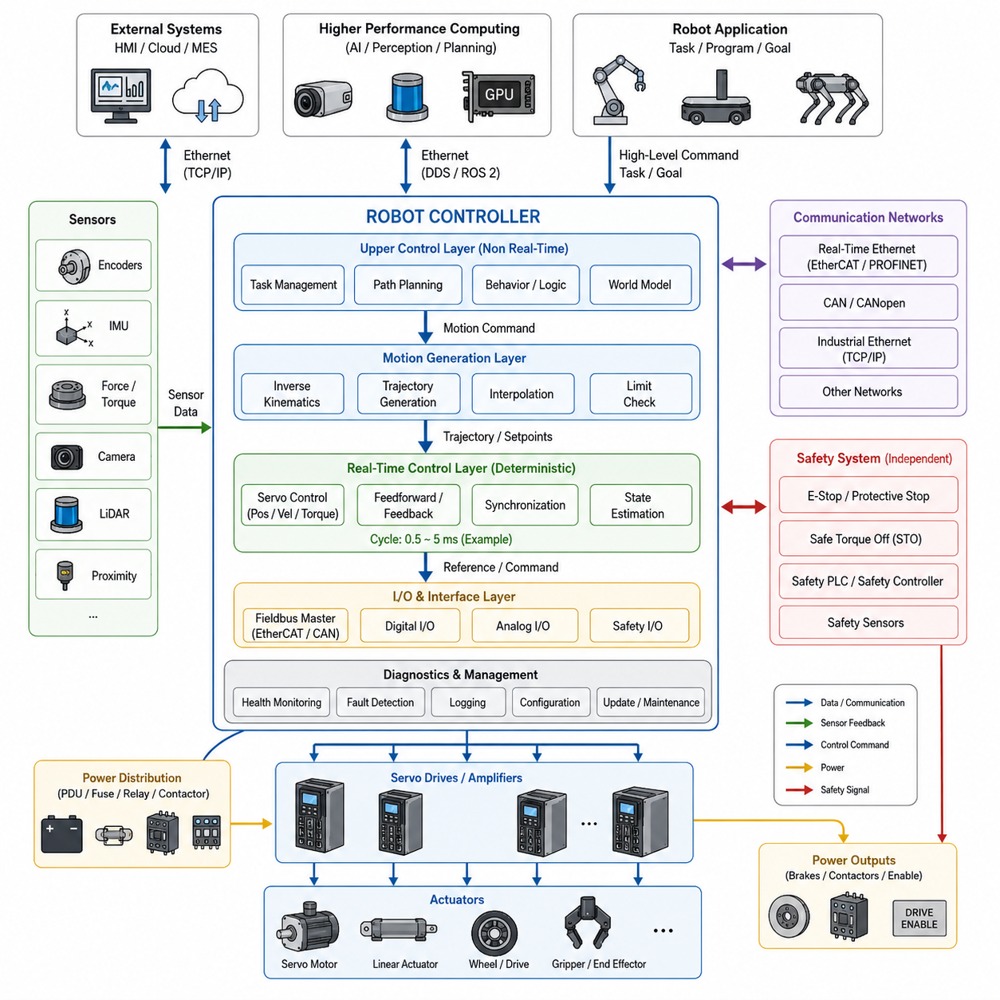
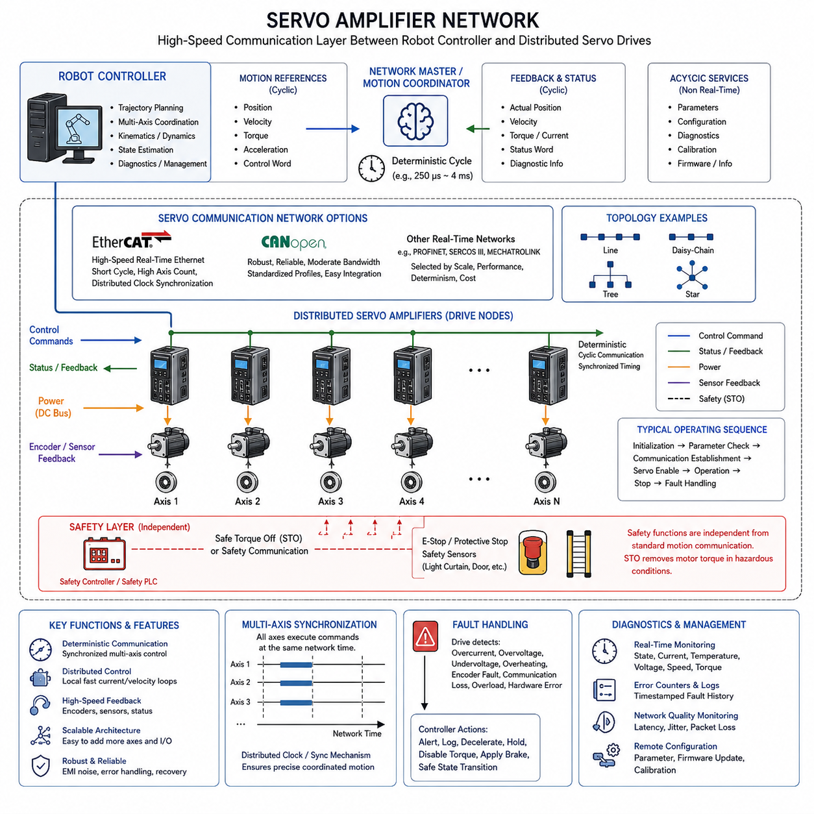
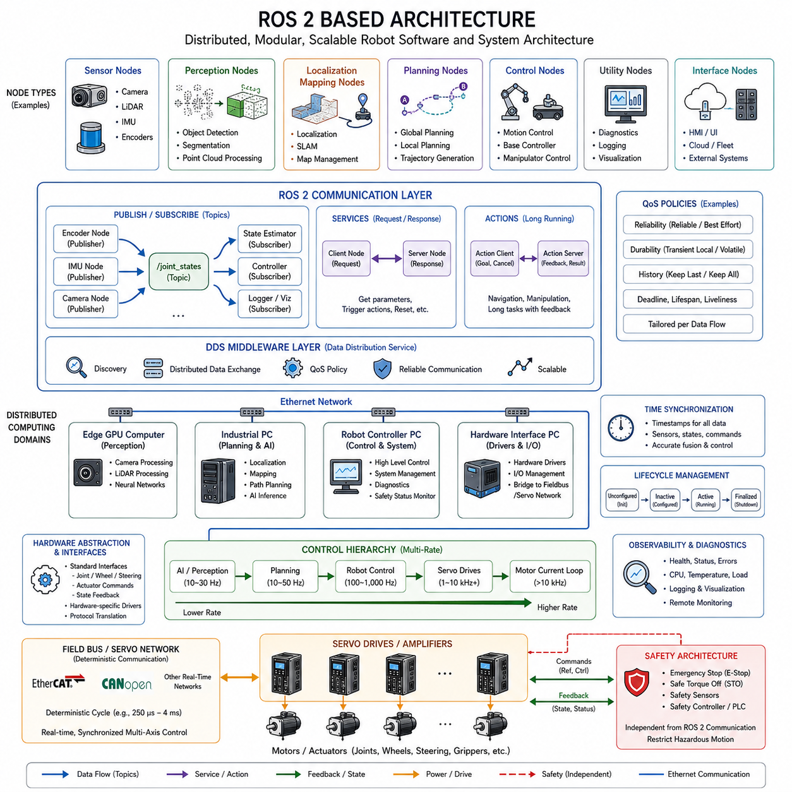
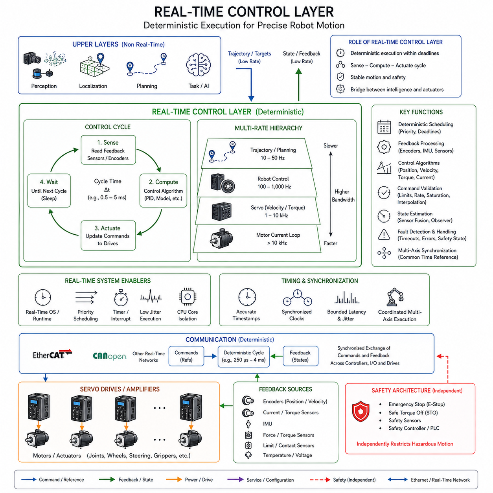
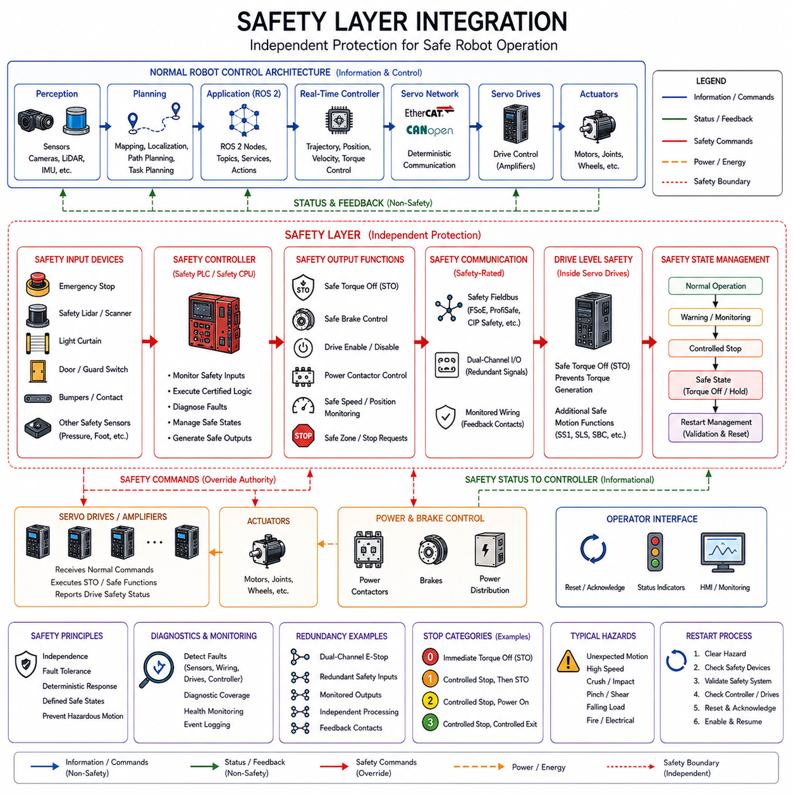

**Volume 01. Electrical Architecture Fundamentals**

# Chapter 04. Robotics Electrical Architecture

## 04.01. Robot Controller Architecture

{width="7.268055555555556in" height="7.268055555555556in"}

로봇 제어기(Robot Controller)는 동작 명령(Motion Command), 작업 목표(Task Objective), 센서 정보(Sensor Information)를 로봇의 결정론적 동작(Deterministic Action)으로 변환하는 핵심 연산 및 조정 요소이다. 로봇 전기 아키텍처(Robotics Electrical Architecture)에서 상위 소프트웨어와 서보 드라이브(Servo Drive), 액추에이터(Actuator), 센서(Sensor), 통신 네트워크(Communication Network), 안전 장치(Safety Device)를 연결하며, 디지털 제어 논리와 실제 물리적 움직임 사이의 운용 연결 계층을 형성한다.

로봇 제어기 아키텍처(Robot Controller Architecture)는 일반적으로 서로 다른 타이밍 요구사항(Timing Requirement)을 갖는 여러 연산 계층(Computational Layer)으로 구성된다. 상위 기능은 로봇 프로그램, 궤적(Trajectory), 내비게이션 목표(Navigation Goal), 조작 작업(Manipulation Task)을 해석하며, 하위 계층은 보간(Interpolation), 운동학 계산(Kinematic Calculation), 피드백 제어(Feedback Control), 액추에이터 명령을 실행한다. 이러한 기능 분리는 연산량이 많은 계획 작업이 시간 결정적인 모션 제어(Motion Control)를 방해하지 않도록 한다.

상위 제어 계층(Upper Control Layer)에서 작업 명령(Task Command)은 액추에이터의 전기적 동작을 직접 지정하기보다는 로봇이 수행해야 할 목표를 정의한다. 매니퓰레이터(Manipulator)는 목표 자세(Target Pose)를, 자율이동로봇(AMR)은 목적지(Destination)를, 사족보행 로봇(Quadruped Robot)은 목표 속도(Desired Velocity)를 받을 수 있다. 제어기는 계획 및 모션 생성(Motion Generation) 기능을 통해 이러한 추상적 목표를 관절, 휠, 조향 또는 추진 명령으로 변환한다.

모션 생성(Motion Generation)은 명령된 동작을 위치(Position), 속도(Velocity), 가속도(Acceleration), 그리고 필요한 경우 저크(Jerk) 제한조건을 만족하는 궤적으로 변환한다. 관절형 로봇(Articulated Robot)에서는 역기구학(Inverse Kinematics)이 직교좌표계 목표(Cartesian Target)를 관절 기준값(Joint Reference)으로 변환하며, 궤적 보간(Trajectory Interpolation)은 연속적으로 갱신되는 설정값(Setpoint)을 생성한다. 이러한 계산은 실제 기구와 액추에이터 시스템이 실행할 수 있도록 기계적 한계를 준수해야 한다.

실시간 제어 계층(Real-Time Control Layer)은 정밀하게 관리되는 타이밍에 따라 주기적인 계산을 수행한다. 위치, 속도, 토크(Torque), 전류(Current) 기준값은 수 밀리초에서 1밀리초 이하의 주기로 서보 증폭기(Servo Amplifier)와 교환될 수 있다. 따라서 평균적인 연산 성능보다 결정론적 스케줄링(Deterministic Scheduling)이 중요하며, 과도한 지연시간(Latency)이나 타이밍 지터(Timing Jitter)는 제어 안정성과 동작 품질을 직접 저하시킬 수 있다.

로봇 제어기는 일반적으로 모터 전력을 직접 스위칭하기보다 분산형 서보 전자장치(Distributed Servo Electronics)와 함께 동작한다. 중앙 제어기(Central Controller)는 조정된 모션 기준값을 계산하고, 서보 증폭기는 전류, 토크, 속도 또는 위치에 대한 더 빠른 로컬 제어 루프(Local Control Loop)를 수행한다. 이러한 계층 구조는 연산 책임을 분산시키며, 상위 궤적 계산이 상대적으로 느린 주기로 동작하더라도 모터 측 전자장치가 빠르게 응답할 수 있도록 한다.

따라서 통신 네트워크(Communication Network)는 제어기 아키텍처의 핵심 구성 요소이다. 실시간 산업용 이더넷(Real-Time Industrial Ethernet), 이더캣(EtherCAT), CAN, CANopen 또는 제조사 전용 서보 네트워크가 제어기와 드라이브 및 분산 입출력(Distributed I/O)을 연결할 수 있다. 더 높은 대역폭의 이더넷(Ethernet)은 인지 컴퓨터(Perception Computer) 또는 외부 시스템과 연결할 수 있으며, 각 네트워크는 지연시간, 결정성, 대역폭, 동기화, 신뢰성 및 장치 호환성에 따라 선택된다.

센서 인터페이스(Sensor Interface)는 로봇의 물리적 상태를 추정하는 데 필요한 피드백(Feedback)을 제공한다. 엔코더(Encoder)는 관절 또는 휠의 움직임을 제공하고, 관성측정장치(IMU), 힘-토크 센서(Force-Torque Sensor), 근접 센서(Proximity Sensor), 카메라(Camera), 라이다(LiDAR) 등은 로봇 본체와 주변 환경에 관한 정보를 제공한다. 제어기는 이러한 측정값을 적절한 타임스탬프(Timestamp)와 좌표계(Coordinate Frame)에 연결하여 시간적으로 일관된 상태 정보를 제어 계산에 사용해야 한다.

현대 로봇은 결정론적 로봇 제어기(Deterministic Robot Controller)와 고성능 컴퓨팅 플랫폼(High-Performance Computing Platform)을 분리하는 경우가 많다. 실시간 제어기는 서보 실행과 기계 수준 입출력을 담당하고, 산업용 PC(Industrial PC), 엣지 컴퓨터(Edge Computer), GPU 플랫폼은 인지(Perception), 매핑(Mapping), 최적화(Optimization), 계획(Planning), 인공지능 추론(AI Inference)을 수행한다. 두 영역은 정의된 인터페이스를 통해 명령을 교환하여 느리거나 실행시간이 변동되는 AI 작업이 빠른 액추에이터 제어 루프에 직접 영향을 주지 않도록 한다.

이러한 분리는 다중 주기 아키텍처(Multi-Rate Architecture)를 형성한다. 인지는 카메라나 라이다 프레임 속도로 갱신되고, 계획은 초당 수십 회 수준으로 실행될 수 있으며, 궤적 제어(Trajectory Control)는 초당 수백 회, 모터 전류 제어(Motor Current Regulation)는 서보 드라이브 내부에서 킬로헤르츠(kHz) 수준으로 수행될 수 있다. 따라서 각 계층은 서로 다른 실행 주기 사이에서 정보를 조정하면서 가장 최근의 유효한 상태 또는 명령을 유지한다.

안전 기능(Safety Function)은 일반적인 로봇 제어 기능과 아키텍처적으로 구분되어야 한다. 비상 정지(Emergency Stop), 보호 정지(Protective Stop), 안전 토크 차단(Safe Torque Off), 한계 감시(Limit Monitoring), 안전 센서(Safety Sensor)는 전용 회로, 안전 제어기(Safety Controller), 인증된 통신 경로를 사용할 수 있다. 일반 제어기가 안전 동작을 요청할 수는 있지만, 핵심 보호 기능이 범용 응용 소프트웨어의 정상적인 실행에만 의존해서는 안 된다.

전력 분배(Power Distribution)와 제어기 기동 동작(Startup Behavior)도 아키텍처와 밀접하게 연관된다. 로직 전원(Logic Power), 센서 전원(Sensor Power), 액추에이터 전원(Actuator Power), 브레이크(Brake), 접촉기(Contactor), 드라이브 활성화 신호(Drive-Enable Signal)는 기동과 종료 과정에서 제어된 상태로 전환되어야 한다. 제어기는 일반적으로 모션을 활성화하기 전에 통신, 센서 유효성, 드라이브 상태, 안전 조건 및 시스템 구성을 확인하여 초기화 과정에서 액추에이터가 통제되지 않은 상태로 동작하는 것을 방지한다.

진단 기능(Diagnostics)은 분산형 로봇 시스템에서 다양한 인터페이스를 통해 고장이 발생할 수 있기 때문에 또 하나의 핵심 제어기 기능이다. 제어기는 통신 타임아웃(Communication Timeout), 엔코더 오류, 드라이브 경보, 온도, 전압, 전류, 동기화 상태, 소프트웨어 실행 상태 및 안전 조건을 감시한다. 고장 정보는 영향을 받은 구성요소와 운용상의 결과를 함께 식별할 수 있어야 하며, 이를 통해 유지보수 담당자나 상위 관리 소프트웨어가 문제를 효율적으로 분리하고 진단할 수 있다.

확장 가능한 로봇 제어기 아키텍처(Scalable Robot Controller Architecture)는 액추에이터, 센서, 컴퓨팅 모듈(Compute Module), 소프트웨어 구성요소가 서로 독립적으로 발전할 수 있도록 모듈형 인터페이스(Modular Interface)를 점차 확대하고 있다. 표준화된 통신, 장치 추상화(Device Abstraction), 구성 관리(Configuration Management), 명확하게 정의된 제어 인터페이스는 하드웨어 세대 간 결합도를 낮춘다. 이러한 접근은 하나의 제어기 플랫폼으로 이동로봇, 매니퓰레이터, 사족보행 로봇 등 다양한 로봇 구성을 지원할 때 특히 중요하다.

궁극적으로 로봇 제어기 아키텍처(Robot Controller Architecture)는 단순한 하나의 컴퓨터가 아니라 연산(Computation), 통신(Communication), 센싱(Sensing), 구동(Actuation), 전력(Power), 안전(Safety)이 계층적으로 조정되는 통합 구조이다. 효과적인 아키텍처를 위해서는 각 기능을 적절한 타이밍 및 신뢰성 영역에 배치해야 한다. 상위 계층은 원하는 행동을 결정하고, 결정론적 제어 계층은 모션을 조정하며, 서보 드라이브는 빠른 로컬 제어를 실행하고, 독립적인 안전 메커니즘은 위험 조건에서 전체 시스템의 동작을 제한한다.

## 04.02. Servo Amplifier Network

{width="7.268055555555556in" height="7.268055555555556in"}

서보 앰프 네트워크는 로봇 컨트롤러와 분산형 서보 드라이브 사이에서 고속 전기 및 통신 계층을 형성합니다. 이 네트워크의 주된 목적은 여러 축에 동기화된 동작 기준을 전달하는 동시에 위치, 속도, 토크, 전류, 상태 및 진단 정보를 반환하는 것입니다. 다축 로봇에서 이 네트워크는 물리적으로 분리된 액추에이터들이 하나의 조율된 운동 시스템처럼 동작하도록 해줍니다.

로봇 컨트롤러는 일반적으로 네트워크 마스터 또는 운동 코디네이터 역할을 수행하며, 서보 앰프는 분산 드라이브 노드로 동작합니다. 컨트롤러는 궤적과 축 기준을 계산한 다음 확정적(deterministic) 통신주기에 따라 적절한 드라이브로 명령을 전송합니다. 각 앰프는 이러한 기준을 로컬 모터 제어 동작으로 변환하는 동시에 자신의 동작 상태를 컨트롤러에 지속적으로 보고합니다.

서보 앰프는 단순한 전력 변환 장치 그 이상입니다. 서보 앰프에는 엔코더 및 기타 내부 측정값의 피드백을 사용하여 모터 전류, 토크, 속도 또는 위치를 제어하는 제어 전자 회로가 포함되어 있습니다. 빠른 전류 제어에 필요한 대역폭은 궤적 계획의 대역폭보다 훨씬 높기 때문에 보통 로컬에서 실행됩니다. 이러한 분산형 계층 구조는 통신 부담을 줄이면서도 신속한 액추에이터 응답을 유지합니다.

조율된 로봇 운동은 예측 가능한 명령 전달에 의존하기 때문에 네트워크는 확정적 타이밍을 제공해야 합니다. 일반적인 이더넷은 높은 대역폭을 제공할 수 있지만 촘촘하게 동기화된 운동에 필요한 타이밍을 본질적으로 보증하지는 못합니다. 따라서 산업용 실시간 네트워크는 여러 서보 축이 제어된 시간에 기준을 수신하고 실행할 수 있도록 주기적 통신, 스케줄링, 동기화 및 제한된 지연 시간(bounded latency)을 위한 메커니즘을 도입합니다.

EtherCAT은 여러 서보 드라이브, I/O 장치 및 센서를 고속의 확정적 이더넷 기반 네트워크를 통해 연결할 수 있어 분산 운동 아키텍처에 널리 적합합니다. 프레임은 연결된 노드들을 통과하면서 프로세스 데이터를 효율적으로 교환하므로 짧은 주기적 업데이트 기간을 지원합니다. 분산 클럭 메커니즘은 드라이브 노드들을 동기화하여 물리적으로 분리된 축들이 공통의 타이밍 기준을 유지할 수 있도록 합니다.

CAN 및 CANopen은 대역폭 요구 사항이 완만하고 극도로 짧은 주기 시간보다 안정적인 분산 제어가 더 중요한 경우에 또 다른 실용적인 접근 방식을 제공합니다. CAN은 신뢰할 수 있는 메시지 중재 및 에러 처리를 제공하며, CANopen은 표준화된 장치 프로파일과 통신 개체를 추가합니다. 따라서 CANopen 기반 서보 시스템은 비교적 단순한 네트워크를 통해 모터 컨트롤러, 엔코더, I/O 모듈 및 기타 장치를 통합할 수 있습니다.

EtherCAT, CANopen 및 기타 서보 통신 기술 간의 선택은 로봇의 규모와 제어 요구 사항에 따라 달라집니다. 축 수가 많은 매니퓰레이터와 동적으로 조율되는 기계는 짧은 주기 시간과 정밀한 동기화가 필요하므로 실시간 이더넷이 유리합니다. 축 수가 적은 이동 로봇은 바퀴 및 조향 제어가 더 낮은 네트워크 대역폭을 감뇌할 수 있는 경우가 많아 CAN이나 CANopen을 효과적으로 사용할 수 있습니다.

네트워크 토폴로지는 물리적 구현에 강한 영향을 미칩니다. 서보 앰프는 통신 기술에 따라 라인, 데이지 체인, 트리 또는 기타 지원되는 방식으로 연결될 수 있습니다. 모터 근처에 분산 배치하면 고전류 모터 케이블 길이를 줄일 수 있지만 추가적인 통신 및 전원 배선이 필요합니다. 중앙 집중식 드라이브 캐비닛은 환경 보호를 단순화하지만 앰프와 액추에이터 사이의 케이블 거리가 길어집니다.

다축 동기화는 매니퓰레이터, 휴머노이드, 사족보행 로봇 및 조율된 이동 플랫폼에서 특히 중요합니다. 명령된 가직교(Cartesian) 운동을 수행하려면 여러 관절이 함께 가속하고 감속해야 할 수 있습니다. 각 드라이브가 일관되지 않은 시점에 기준을 실행하면, 모든 축이 로컬에서 안정적이더라도 궤적 정확도가 저하됩니다. 따라서 네트워크 동기화는 로봇의 전반적인 운동 제어 성능의 일부가 됩니다.

서보 네트워크는 보통 주기적 정보와 비주기적 정보를 동시에 전달합니다. 주기적 프로세스 데이터에는 목표 위치, 실제 위치, 속도, 토크, 제어 워드, 상태 워드와 같이 급격하게 변화하는 값이 포함됩니다. 비주기적 통신은 파라미터, 구성, 진단, 교정값, 펌웨어 정보 및 시간 긴급도가 낮은 서비스 기능에 사용됩니다. 이러한 트래픽 클래스를 분리함으로써 확정적 제어 성능을 보호합니다.

피드백 정보는 운동 명령과 반대 방향으로 이동하여 분산 제어 계층 구조를 완성합니다. 엔코더는 로터 또는 관절 위치 정보를 서보 앰프에 제공하며, 서보 앰프는 로컬 전류 및 속도 루프를 실행한 후 처리된 상태 정보를 로봇 컨트롤러로 반환할 수 있습니다. 컨트롤러는 여러 축에 걸친 이러한 측정값을 결합하여 조율된 궤적 실행과 시스템 수준의 상태 추정을 유지합니다.

서보 앰프는 네트워크를 통해 상태 및 인에이블(enable) 정보도 교환합니다. 일반적인 동작 순서에는 초기화, 파라미터 검증, 통신 확립, 서보 인에이블, 제어 동작, 정지 및 오류 처리가 포함됩니다. 컨트롤러는 조율된 운동이 시작되기 전에 필요한 모든 축이 올바른 상태에 진입했는지 확인하여 비활성화되었거나 잘못 설정된 하나의 드라이브로 인해 예상치 못한 기계적 동작이 발생하는 것을 방지해야 합니다.

안전 기능은 일반 서보 통신과 구분되어야 합니다. 속도 0을 요청하는 표준 운동 명령은 안전 등급 정지 기능과 동일하지 않습니다. 안전 토크 오프(STO)와 같은 기능은 시스템 아키텍처에 따라 전용 전기 신호 또는 인증된 안전 통신을 사용할 수 있습니다. 이를 통해 안전 조건이 발생했을 때 일반 궤적 소프트웨어와 독립적으로 위험한 모터 토크를 제거할 수 있습니다.

오류 처리는 서보 네트워크가 상당한 전기적·기계적 스트레스를 받는 부품들을 연결하기 때문에 필수적입니다. 드라이브는 과전류, 과전압, 저전압, 과열, 엔코더 오류, 통신 손실, 모터 과부하 및 내부 하드웨어 에러를 감지할 수 있습니다. 한 관절의 오류로 인해 다른 여러 축을 조율하여 감속하거나 정지해야 할 수 있으므로 컨트롤러는 시스템 수준에서 이러한 조건을 해석해야 합니다.

통신 손실 시 동작은 예외적인 소프트웨어 이벤트로 처리하기보다는 명시적으로 설계되어야 합니다. 서보 드라이브는 주기적 명령이 사라지거나 동기화가 상실되거나 마스터를 사용할 수 없게 될 때 어떤 일이 발생하는지 정의해야 합니다. 로봇 및 위험 분석에 따라 응답에는 제어된 감속, 위치 유지, 토크 비활성화, 기계식 브레이크 작동 또는 미리 정의된 안전 상태로의 전환이 포함될 수 있습니다.

전기적 설계 역시 서보 네트워크의 신뢰성에 영향을 미칩니다. 모터 인버터 스위칭은 상당한 전자기 간섭을 발생시키며, 통신 케이블은 고전류 전원 도선 근처에서 고속 차동 신호를 전달할 수 있습니다. 따라서 통신 에러를 방지하기 위해서는 적절한 접지, 차폐, 케이블 분리, 커넥터 선정, 종단 및 배선이 필요합니다. 결과적으로 네트워크 아키텍처와 물리적 하네스 엔지니어링은 함께 설계되어야 합니다.

진단 기능은 로봇 컨트롤러부터 개별 서보 축에 이르기까지 가시성을 제공해야 합니다. 엔지니어는 통신 에러, 동기화 편차, 드라이브 상태, 엔코더 문제, 열 조건, 전류 제한 및 오류 이력을 식별할 수 있어야 합니다. 로봇의 많은 고장이 기계적 부하, 전기적 동작, 통신 타이밍 및 소프트웨어 명령 간의 상호작용과 관련이 있기 때문에 타임스탬프가 찍힌 진단 정보는 특히 가치가 있습니다.

확장 가능한 서보 앰프 네트워크를 사용하면 동일한 컨트롤러 아키텍처로 다양한 수와 유형의 액추에이터를 가진 로봇을 지원할 수 있습니다. 통신 용량과 타이밍 예산이 허용하는 한 추가적인 바퀴 드라이브, 매니퓰레이터 관절, 조향 액추에이터, 그리퍼 또는 보조 축을 분산 노드로 도입할 수 있습니다. 표준화된 인터페이스는 개별 하드웨어 구현에 대한 의존도를 줄이고 모듈식 로봇 개발을 단순화합니다.

궁극적으로 서보 앰프 네트워크는 조율된 운동 계산과 물리적 액추에이터 실행 사이를 잇는 확정적 교량 역할을 합니다. 로봇 컨트롤러는 필요한 다축 동작을 결정하고, 네트워크는 동기화된 기준을 분산시키며, 각 서보 앰프는 모터의 빠른 로컬 제어를 수행합니다. 따라서 신뢰할 수 있는 로보틱스는 강력한 컨트롤러와 모터뿐만 아니라 이들을 하나의 통합된 제어 시스템으로 연결하는 예측 가능한 통신에 의존합니다.

## 04.03. ROS2 Based Architecture

{width="7.268055555555556in" height="7.268055555555556in"}

ROS 2 기반 아키텍처(ROS 2 Based Architecture)는 로봇의 전기 및 컴퓨팅 아키텍처에 분산형 소프트웨어 통신 프레임워크(Distributed Software Communication Framework)를 도입한다. 모든 기능을 하나의 단일 제어기(Monolithic Controller) 내부에 구성하는 대신 센싱(Sensing), 인지(Perception), 위치추정(Localization), 계획(Planning), 제어(Control), 진단(Diagnostics), 외부 인터페이스(External Interface)를 독립적인 소프트웨어 구성요소로 실행할 수 있다. 이러한 구성요소는 표준화된 인터페이스를 통해 통신하면서 서로 다른 프로세서와 컴퓨터에 분산 배치될 수 있다.

기본적인 소프트웨어 구성요소는 ROS 2 노드(Node)이다. 하나의 노드는 일반적으로 엔코더(Encoder) 읽기, 라이다(LiDAR) 데이터 처리, 로봇 자세 추정(Robot Pose Estimation), 궤적 생성(Trajectory Generation), 이동 베이스(Mobile Base) 명령 또는 시스템 상태 감시(System Health Monitoring)와 같은 특정 기능을 담당한다. 기능을 노드 단위로 분리하면 전체 로봇 소프트웨어 시스템을 다시 설계하지 않고도 개별 구성요소를 개발, 시험, 교체 및 재시작할 수 있어 모듈성(Modularity)이 향상된다.

노드는 발행자-구독자 모델(Publisher-Subscriber Model)을 사용하는 토픽(Topic)을 통해 지속적으로 생성되는 정보를 교환한다. 센서 노드(Sensor Node)는 카메라 이미지, 관절 상태(Joint State), IMU 측정값 또는 포인트 클라우드(Point Cloud)를 발행할 수 있으며, 여러 다른 노드가 동일한 정보를 독립적으로 구독할 수 있다. 이러한 다대다 통신(Many-to-Many Communication) 구조는 소프트웨어 간 직접적인 의존성을 줄이고 새로운 인지, 로깅(Logging), 시각화(Visualization), 진단 기능을 쉽게 추가할 수 있도록 한다.

서비스(Service)는 지속적인 데이터 스트리밍이 필요하지 않은 작업에 대해 요청-응답 통신(Request-Response Communication)을 제공한다. 노드는 구성 정보를 요청하거나 장치 동작을 실행하고, 서브시스템(Subsystem)을 재설정하거나 다른 노드로부터 특정 결과를 받을 수 있다. 액션(Action)은 이러한 개념을 내비게이션(Navigation)이나 조작 작업(Manipulation Task)과 같은 장시간 실행 작업으로 확장하며, 요청자는 진행 상태 피드백을 받고 실행 중인 목표를 취소하거나 변경할 수 있다.

ROS 2 통신은 데이터 분산 서비스(Data Distribution Service, DDS) 모델을 기반으로 하며, 실제 구현에서는 지원되는 다양한 미들웨어(Middleware) 기술을 사용할 수 있다. DDS는 모든 애플리케이션 노드가 직접적인 소켓 연결(Socket Connection)을 유지하지 않아도 검색(Discovery), 분산 데이터 교환(Distributed Data Exchange), 설정 가능한 통신 동작을 제공한다. 이 미들웨어 계층을 통해 서로 다른 컴퓨팅 장치에서 실행되는 소프트웨어 구성요소들이 하나의 분산 로봇 시스템에 참여할 수 있다.

서비스 품질(Quality of Service, QoS) 정책은 로봇 데이터 스트림마다 서로 다른 통신 요구사항을 가지므로 중요하다. 제어 상태(Control State)는 신뢰성 있는 전달이 필요할 수 있지만, 고속 카메라 스트림은 오래된 프레임의 재전송보다 최신 데이터의 전달을 우선할 수 있다. 신뢰성(Reliability), 내구성(Durability), 이력 깊이(History Depth), 데드라인(Deadline), 수명(Lifespan) 등의 정책을 통해 각 데이터 흐름의 의미와 타이밍 요구사항에 맞게 통신 동작을 조정할 수 있다.

ROS 2 아키텍처는 하나의 로봇 내부에서도 여러 컴퓨팅 영역(Computing Domain)에 걸쳐 구성될 수 있다. 센서 처리 노드는 엣지 GPU(Edge GPU)에서 실행되고, 내비게이션과 계획 기능은 산업용 PC(Industrial PC)에서 실행되며, 하드웨어 인터페이스 노드(Hardware Interface Node)는 로봇 제어기 가까이에서 동작할 수 있다. 이더넷(Ethernet)은 이러한 컴퓨터를 연결하는 물리적 통신 백본(Communication Backbone)을 제공하며, ROS 2와 DDS는 그 위에서 소프트웨어 수준의 검색과 메시지 교환을 제공한다.

이러한 분산 구조는 특히 높은 연산량이 필요한 로봇 기능에 유용하다. 카메라와 라이다는 GPU 기반 인지 노드에서 처리되는 대용량 데이터 스트림을 생성할 수 있으며, 위치추정, 매핑(Mapping), 월드 표현(World Representation), 경로 계획(Path Planning), AI 추론(AI Inference)은 각각의 갱신 주기로 동작한다. 이렇게 생성된 명령은 이후 결정론적인 물리적 실행을 담당하는 하위 제어 구성요소로 전달된다.

ROS 2를 결정론적 서보 네트워크(Deterministic Servo Network)의 대체 수단으로 자동적으로 간주해서는 안 된다. 모터 전류 제어(Motor Current Regulation), 고속 서보 루프(High-Speed Servo Loop), 정밀하게 동기화된 다축 제어(Multi-Axis Control)는 일반적으로 전용 실시간 제어기, 이더캣(EtherCAT), CANopen 또는 이에 상응하는 기술을 필요로 한다. 따라서 ROS 2는 이러한 빠른 제어 계층보다 상위에 배치되어 시스템 수준의 조정을 제공하고, 전용 네트워크가 액추에이터 수준의 결정론적 통신을 담당하는 형태가 일반적이다.

하드웨어 추상화 경계(Hardware Abstraction Boundary)는 이러한 두 영역을 연결하는 데 도움을 준다. ROS 2 제어 구성요소는 표준화된 관절(Joint), 휠(Wheel), 조향(Steering), 액추에이터 인터페이스(Actuator Interface)를 제공할 수 있으며, 하드웨어별 드라이버(Hardware-Specific Driver)는 이를 하위 서보 시스템이 이해할 수 있는 명령으로 변환한다. 엔코더와 드라이브에서 발생한 피드백은 반대 방향으로 전달되므로 상위 ROS 2 소프트웨어는 개별 하드웨어 프로토콜에 직접 의존하지 않고 로봇 상태를 확인할 수 있다.

결과적으로 전체 아키텍처는 다중 주기 계층 구조(Multi-Rate Hierarchy)를 형성한다. AI 인지는 센서 프레임 속도에 따라 동작하고, 내비게이션과 계획은 수십 헤르츠(Hz), 로봇 제어는 수백 또는 수천 헤르츠로 실행될 수 있으며, 내부 서보 전류 루프(Servo Current Loop)는 그보다 더 빠르게 동작할 수 있다. 이러한 계층 사이의 인터페이스는 모든 서브시스템이 동일한 주기로 실행된다고 가정하지 않으면서 유효한 명령과 상태 정보를 유지해야 한다.

여러 컴퓨터와 센서가 아키텍처에 참여하면 시간 동기화(Time Synchronization)의 중요성이 더욱 증가한다. 카메라 프레임, 라이다 스캔, IMU 측정값, 관절 상태 및 제어 정보에는 의미 있는 타임스탬프(Timestamp)가 연결되어야 한다. 정확한 시간 정보는 서로 다른 주기와 위치에서 동작하는 장치로부터 정보가 생성되더라도 센서 융합(Sensor Fusion)과 상태 추정(State Estimation) 알고리즘이 물리적 상황을 일관되게 재구성할 수 있도록 한다.

수명주기 관리(Lifecycle Management)는 소프트웨어 구성요소의 초기화(Initialize), 구성(Configure), 활성화(Activate), 비활성화(Deactivate), 종료(Shutdown)를 제어하여 운용 신뢰성을 높일 수 있다. 개별 프로세스가 실행되었다는 이유만으로 로봇이 자율 동작을 시작해서는 안 된다. 상위 기능이 활성 운용 상태로 전환되기 전에 센서 가용성, 통신 상태, 위치추정 유효성, 제어기 준비 상태 등의 선행 조건을 확인할 수 있다.

진단 및 관측 가능성(Diagnostics and Observability)은 분산형 ROS 2 아키텍처가 제공하는 중요한 장점이다. 노드는 상태 정보, 통신 상태, 센서 유효성, 연산 부하(Computational Load), 온도, 오류 및 운용 모드(Operating Mode)를 발행할 수 있다. 로깅 및 시각화 도구는 제어 애플리케이션과 강하게 결합하지 않고 이러한 인터페이스를 관찰할 수 있으므로 엔지니어가 센싱, 컴퓨팅, 네트워크 및 구동 계층 전반의 장애를 분석하는 데 도움이 된다.

안전 아키텍처(Safety Architecture)는 일반적인 ROS 2 통신과 명확하게 분리되어야 한다. 비상 정지(Emergency Stop) 또는 안전 토크 차단(Safe Torque Off, STO) 기능이 일반 ROS 2 메시지가 올바른 애플리케이션 노드에 전달되는 것에만 의존해서는 안 된다. 안전 등급 제어기(Safety-Rated Controller), 회로, 센서 및 통신 메커니즘이 위험한 동작을 독립적으로 제한하고, ROS 2는 안전 상태를 전달받아 이러한 제약조건에 맞추어 일반적인 소프트웨어 동작을 조정할 수 있다.

네트워크 설계(Network Design)에서는 대역폭(Bandwidth)과 트래픽 분리(Traffic Separation)도 고려해야 한다. 여러 카메라, 3D 라이다, 지도(Map), AI 출력은 상당한 이더넷 용량을 사용할 수 있는 반면 제어 및 진단 메시지는 예측 가능한 전달이 필요할 수 있다. 따라서 대용량 인지 데이터 스트림이 물리적 로봇 제어에 필요한 통신을 방해하지 않도록 네트워크 분할(Network Segmentation), 트래픽 우선순위, 적절한 QoS 정책 및 전용 액추에이터 네트워크를 사용할 수 있다.

ROS 2 기반 아키텍처는 하나의 로봇 컴퓨터를 넘어서는 확장성(Scalability)도 지원한다. 새로운 센서, 매니퓰레이터(Manipulator), 엣지 프로세서(Edge Processor), 사용자 인터페이스(User Interface), 애플리케이션 모듈을 정의된 토픽, 서비스, 액션 및 하드웨어 인터페이스를 통해 통합할 수 있다. 동일한 아키텍처 원칙을 자율이동로봇(AMR), 모바일 매니퓰레이터(Mobile Manipulator), 사족보행 로봇(Quadruped) 등 다양한 플랫폼에 적용하면서 하드웨어별 구성요소는 모듈형 인터페이스 뒤에 분리할 수 있다.

궁극적으로 ROS 2는 센싱, 컴퓨팅, 지능(Intelligence), 로봇 제어를 연결하는 분산형 소프트웨어 조정 계층(Distributed Software Coordination Layer)을 제공한다. ROS 2의 핵심 아키텍처 가치는 모듈형 노드, 표준화된 통신, 설정 가능한 QoS, 분산 컴퓨팅(Distributed Computing), 하드웨어 추상화를 결합하는 데 있다. 이를 결정론적 서보 제어(Deterministic Servo Control) 및 독립적인 안전 메커니즘과 통합하면 유연한 상위 지능과 신뢰성 높은 하위 물리 실행을 하나의 로봇 시스템에서 결합할 수 있다.

## 04.04. Real Time Control Layer

{width="7.268055555555556in" height="7.268055555555556in"}

실시간 제어 계층(Real-Time Control Layer)은 계획된 로봇의 움직임을 물리적 액추에이터(Actuator)를 위한 정밀한 타이밍의 명령으로 변환하는 결정론적 실행 영역(Deterministic Execution Domain)이다. 이 계층은 인지(Perception), 계획(Planning), 작업 수준 소프트웨어(Task-Level Software)보다 하위에서 동작하며, 연산의 유연성보다 예측 가능한 타이밍이 중요하다. 주요 역할은 피드백을 반복적으로 읽고 제어 출력을 계산하며 정의된 데드라인(Deadline) 내에서 액추에이터 기준값을 갱신하여 안정적인 움직임을 유지하는 것이다.

실시간 동작(Real-Time Behavior)은 단순히 계산이 빠르게 수행된다는 것을 의미하지 않는다. 실시간 시스템(Real-Time System)은 다른 연산 작업이 동시에 수행되는 상황에서도 중요한 작업을 알려진 시간 제한 내에 완료해야 한다. 따라서 로봇 제어에서는 평균적인 실행 속도보다 최대 지연시간(Maximum Latency)과 타이밍 변동(Timing Variation)이 더욱 중요할 수 있다. 제어 데드라인을 놓치면 위상 지연(Phase Delay)이 발생하고 제어 품질이 저하되거나 빠르게 움직이는 기계 시스템이 불안정해질 수 있다.

제어 계층은 일반적으로 주기적 실행 사이클(Periodic Execution Cycle)을 통해 동작한다. 각 사이클에서 제어기는 최신 관절(Joint), 휠(Wheel), 조향(Steering), 액추에이터 상태를 수신하고 이를 명령된 기준값과 비교하여 필요한 제어 응답을 계산한 후 갱신된 명령을 전달한다. 이러한 센싱-연산-구동(Sense--Compute--Actuate) 과정이 지속적으로 반복되면서 소프트웨어 계산과 로봇의 물리적 동역학(Physical Dynamics)을 연결하는 피드백 루프(Feedback Loop)가 형성된다.

서로 다른 제어 기능은 서로 다른 주파수에서 동작한다. 상위 궤적 계획(Trajectory Planning)은 수십 헤르츠(Hz) 수준으로 갱신될 수 있지만, 관절 또는 이동 베이스 제어(Mobile-Base Control)는 수백 또는 수천 헤르츠로 실행될 수 있다. 서보 드라이브(Servo Drive)는 더 높은 주파수에서 속도나 토크를 제어할 수 있으며, 모터 전류 루프(Motor Current Loop)는 수 킬로헤르츠(kHz) 이상의 속도로 동작할 수 있다. 따라서 아키텍처는 하나의 공통 실행 주기를 가정하기보다 여러 제어 주기를 조정해야 한다.

일반적인 제어 계층 구조(Control Hierarchy)는 요구되는 대역폭(Bandwidth)에 따라 궤적 제어(Trajectory Control), 위치 제어(Position Control), 속도 제어(Velocity Control), 토크 제어(Torque Control), 전류 제어(Current Regulation)를 구분한다. 로봇 제어기는 위치 또는 속도 기준값을 계산하고, 서보 증폭기(Servo Amplifier)는 더 빠른 로컬 제어 루프(Local Control Loop)를 실행할 수 있다. 모터 전류 제어는 빠른 샘플링과 응답이 필요하므로 일반적으로 전력 전자장치(Power Electronics) 가까이에 배치된다. 각각의 하위 계층은 그 위의 상위 감독 계층보다 빠르게 반응한다.

피드백(Feedback)은 실시간 제어의 핵심 요소이다. 엔코더(Encoder)는 위치와 속도 정보를 제공하며, 전류 센서(Current Sensor), 토크 센서(Torque Sensor), 관성측정장치(IMU), 힘-토크 센서(Force-Torque Sensor) 및 기타 장치가 추가적인 상태 정보를 제공할 수 있다. 이러한 측정값의 유용성은 정확도뿐만 아니라 타이밍에도 의존한다. 지연되거나 일관성이 없거나 잘못된 타임스탬프(Timestamp)를 가진 피드백은 제어기가 더 이상 실제 로봇 상태를 나타내지 않는 정보를 바탕으로 명령을 계산하게 만들 수 있다.

따라서 결정론적 통신(Deterministic Communication)은 제어 루프 자체의 일부가 된다. 이더캣(EtherCAT), CANopen 및 기타 실시간 통신 기술은 제어기, 분산 입출력(Distributed I/O), 서보 증폭기 사이에서 명령과 피드백을 전달할 수 있다. 센서 데이터 획득, 제어 계산, 메시지 전송 및 드라이브 실행이 예측 가능한 순서로 수행되도록 통신 주기(Communication Cycle)를 연산 및 액추에이터 갱신 과정과 조정해야 한다.

동기화(Synchronization)는 특히 다축 로봇(Multi-Axis Robot)에서 중요하다. 매니퓰레이터(Manipulator)의 궤적은 여러 관절이 동시에 조정된 위치에 도달하도록 요구할 수 있으며, 사족보행 로봇(Quadruped Robot)의 보행은 여러 다리 액추에이터 사이의 정밀한 시간 관계를 필요로 한다. 축 사이의 작은 타이밍 차이도 궤적 추종 오차(Tracking Error)나 원하지 않는 힘을 발생시킬 수 있다. 공유 클럭(Shared Clock)과 동기화된 통신은 분산 서보 노드가 공통 시간 기준(Common Time Reference)에 따라 명령을 실행하도록 지원한다.

실시간 스케줄링(Real-Time Scheduling)은 개별 소프트웨어 작업이 언제 실행될 수 있는지를 결정한다. 중요한 제어 기능에는 일반적으로 예측 가능한 우선순위와 실행 주기가 할당되며, 로깅(Logging), 시각화(Visualization), 파라미터 관리(Parameter Management), 사용자 인터페이스(User Interface)와 같이 중요도가 상대적으로 낮은 작업이 이를 지연시켜서는 안 된다. 실시간 운영체제(Real-Time Operating System) 또는 전용 런타임(Runtime)은 우선순위 스케줄링, 제한된 인터럽트 처리(Bounded Interrupt Handling), 타이머 및 제어되지 않는 스케줄링 변동을 줄이는 기능을 제공할 수 있다.

타이밍 지터(Timing Jitter)는 주기적 제어 작업의 실제 실행 시점이 계획된 스케줄에서 변동하는 정도를 의미한다. 평균적인 제어 주파수가 정확하더라도 과도한 지터는 움직임의 부드러움과 제어 안정성을 저하시킬 수 있다. 따라서 설계자는 단순히 제어기의 명목상 CPU 성능만 평가하는 것이 아니라 최악 실행시간(Worst-Case Execution Time), 스케줄링 지연, 통신 지연, 인터럽트 동작 및 프로세서 부하를 함께 분석해야 한다.

실시간 제어 계층은 상위 지능(Higher-Level Intelligence)과 직접적인 액추에이터 실행 사이에 중요한 경계를 제공한다. AI 인지(AI Perception), 월드 모델(World Model), 내비게이션(Navigation), 계획 기능은 상대적으로 느리거나 가변적인 주기로 명령을 생성할 수 있다. 이러한 명령은 제어되지 않은 모터 출력으로 직접 전달되기보다 제한된 기준값(Bounded Reference), 궤적 또는 운용 목표로 변환되는 것이 일반적이다. 실시간 계층은 물리적 제한조건과 제어 루프 타이밍에 따라 이러한 명령을 검증하고 실행한다.

이러한 경계는 GPU 기반 연산이 가변적인 실행 지연시간을 가질 수 있는 피지컬 AI 시스템(Physical AI System)에서 특히 중요하다. 인지 또는 계획 결과가 10, 20, 30 Hz로 전달되더라도 모션 제어기(Motion Controller)는 수백 Hz의 속도로 계속 동작할 수 있다. 상위 계층의 갱신 사이에서 실시간 제어기는 가장 최근의 유효한 궤적 또는 설정값(Setpoint)을 유지하고, 매 제어 주기마다 새로운 AI 추론 결과를 기다리지 않으면서 지속적으로 액추에이터 명령을 계산한다.

명령 검증(Command Validation)은 부적절한 기준값으로부터 물리적 시스템을 보호한다. 명령이 하위 드라이브에 전달되기 전에 위치, 속도, 가속도, 토크, 전류 및 저크(Jerk) 제한을 검사할 수 있다. 변화율 제한기(Rate Limiter), 포화 로직(Saturation Logic), 궤적 보간(Trajectory Interpolation), 운용 상태 검사(Operating-State Check)는 급격한 전환을 방지할 수 있다. 이러한 메커니즘은 복잡한 상위 의사결정과 모터 및 기계 시스템의 유한한 물리적 능력 사이에 제어된 인터페이스를 형성한다.

제어에 직접 측정할 수 없는 정보가 필요한 경우 상태 추정(State Estimation)도 실시간 계층에 포함될 수 있다. 엔코더, IMU, 힘 센서 및 기타 센서의 측정값을 결합하여 속도, 자세(Orientation), 접촉 상태(Contact State) 또는 제어기에 필요한 다른 변수를 추정할 수 있다. 상태 추정기는 출력 정보를 사용하는 제어 계산과 동일한 물리적 시간 범위를 나타낼 수 있도록 충분히 예측 가능한 타이밍으로 동작해야 한다.

고장 감지(Fault Detection)는 결정론적 실행과 밀접하게 통합된다. 제어기는 데드라인 누락(Missed Deadline), 통신 타임아웃(Communication Timeout), 과도한 추종 오차, 유효하지 않은 센서 데이터, 액추에이터 포화(Actuator Saturation), 드라이브 고장 및 동기화 손실(Synchronization Loss)을 감시할 수 있다. 비정상 조건이 발생하면 명령 제한, 제어 감속(Controlled Deceleration), 위치 유지(Holding Position), 특정 축 비활성화 또는 보다 안전한 운용 상태로의 전환 요청과 같은 사전에 정의된 대응을 수행할 수 있다.

실시간 제어(Real-Time Control)와 기능 안전(Functional Safety)은 서로 관련되어 있지만 동일한 개념으로 취급해서는 안 된다. 결정론적 제어기는 매우 신뢰성 높은 모션 제어를 수행하면서도 안전 등급 시스템(Safety-Rated System)이 아닐 수 있다. 따라서 비상 정지(Emergency Stop), 안전 토크 차단(Safe Torque Off, STO), 안전 센서(Safety Sensor), 인증된 보호 기능은 독립적인 안전 회로나 안전 제어기(Safety Controller)를 통해 동작할 수 있다. 실시간 계층은 정상적인 정지 동작을 조정하고, 안전 계층은 위험한 움직임을 제한할 수 있는 권한을 유지한다.

ROS 2와 같은 분산 소프트웨어 프레임워크(Distributed Software Framework)는 실시간 계층의 타이밍 원칙을 대체하지 않으면서 해당 계층과 연결될 수 있다. 상위 ROS 2 노드는 정의된 하드웨어 인터페이스(Hardware Interface)를 통해 궤적, 내비게이션 명령 또는 액추에이터 목표를 제공할 수 있다. 이후 실시간 구성요소가 빠른 제어 루프를 실행하며, EtherCAT, CANopen 또는 전용 드라이브 인터페이스가 서보 증폭기와 액추에이터 방향으로 결정론적 통신을 제공한다.

실시간 제어가 인지 또는 AI 작업과 동일한 하드웨어를 공유하는 경우 자원 격리(Resource Isolation)가 더욱 중요해진다. CPU 코어, 메모리 접근, 인터럽트, 네트워크 인터페이스 및 운영체제 서비스는 지연시간을 증가시키는 간섭을 발생시킬 수 있다. 신뢰성 높은 로봇 운용을 위해 더욱 강력한 타이밍 보장이 필요한 경우 전용 프로세서 코어(Dedicated Processor Core), 실시간 우선순위(Real-Time Priority), 분리된 통신 경로 또는 물리적으로 독립된 제어기를 사용할 수 있다.

궁극적으로 실시간 제어 계층(Real-Time Control Layer)은 비동기적으로 동작할 수 있는 로봇 지능을 연속적이고 결정론적인 물리적 행동으로 변환한다. 상위 시스템이 로봇이 무엇을 해야 하는지를 결정한다면, 이 계층은 하나의 제어 주기에서 다음 제어 주기까지 그 명령을 어떻게 신뢰성 있게 실행할 것인지를 결정한다. 피드백 제어, 결정론적 스케줄링, 동기화된 통신, 다중 주기 실행(Multi-Rate Execution), 명령 검증 및 고장 처리를 결합함으로써 로봇 모션을 위한 시간 결정적 기반(Timing-Critical Foundation)을 형성한다.

## 04.05. Safety Layer Integration

{width="7.268055555555556in" height="7.268055555555556in"}

안전 계층 통합(Safety Layer Integration)은 애플리케이션 소프트웨어(Application Software), 통신(Communication), 제어 기능(Control Function)에 장애가 발생하더라도 위험한 움직임을 제한할 수 있도록 일반적인 로봇 제어 아키텍처 주변에 독립적인 보호 구조를 구축한다. 안전을 단순한 소프트웨어 기능으로 취급하는 대신, 전용 회로, 안전 제어기(Safety Controller), 센서, 통신 경로 및 드라이브 수준 메커니즘에 안전 기능을 할당하고 로봇 움직임에 대한 명확한 제어 권한을 부여한다.

안전 계층(Safety Layer)은 일반적인 제어 계층 구조 아래에 단순히 배치되는 것이 아니라 정상 제어 계층과 병렬로 동작한다. 인지(Perception), 계획(Planning), ROS 2 애플리케이션, 실시간 제어기(Real-Time Controller), 서보 네트워크(Servo Network)가 정상적인 로봇 동작을 결정하는 동안 안전 시스템은 해당 동작이 허용될 수 있는지를 지속적으로 판단한다. 위험 조건이 감지되면 안전 로직(Safety Logic)은 정상 명령보다 우선하여 시스템을 사전에 정의된 안전 상태(Safe State)로 전환할 수 있다.

비상 정지(Emergency Stop)는 가장 기본적인 보호 기능 가운데 하나이다. 비상 정지 장치는 비정상적인 상황이 확인되었을 때 위험한 운전을 정지시키기 위한 의도적인 수단을 제공한다. 해당 신호는 일반적인 애플리케이션 소프트웨어가 아니라 안전 등급 전기 경로(Safety-Rated Electrical Path)를 통해 처리되는 것이 일반적이다. 시스템 설계에 따라 액추에이터 토크를 비활성화하거나 적절한 정지 절차를 시작하거나 전력 스위칭을 제어할 수 있다.

보호 정지(Protective Stop)는 이러한 개념을 자동으로 감지되는 위험까지 확장한다. 안전 라이다(Safety LiDAR), 라이트 커튼(Light Curtain), 안전 스캐너(Safety Scanner), 도어 스위치(Door Switch), 범퍼(Bumper), 접촉 센서(Contact Sensor) 등의 보호 장치는 감시 영역과 운용 조건을 정의할 수 있다. 사람이나 장애물이 보호 영역에 진입하면 안전 제어기는 감속, 동작 정지 또는 필요한 안전 조건이 복구될 때까지 재시작 방지를 요청할 수 있다.

안전 토크 차단(Safe Torque Off, STO)은 모터 드라이브가 토크를 발생시키지 못하도록 직접 차단하는 메커니즘을 제공한다. 일반적인 속도 0 명령과 달리 STO는 모션 제어 알고리즘(Motion-Control Algorithm)이 계속 정상적으로 실행되는 것에 의존하지 않는다. 이 기능은 일반적으로 서보 드라이브 또는 증폭기 내부에서 안전 관련 하드웨어 입력이나 인증된 안전 통신을 사용하여 구현되며, 액추에이터 가까이에 중요한 최종 보호 경계를 형성한다.

모든 안전 대응이 즉각적인 토크 제거를 요구하는 것은 아니다. 로봇과 위험 유형에 따라 제어 정지(Controlled Stop)를 통해 능동적인 모터 제어를 유지하면서 먼저 속도를 감소시킨 후 토크를 제거할 수 있다. 다른 상황에서는 위치 유지(Holding Position) 또는 기계식 브레이크(Mechanical Brake)의 작동이 필요할 수 있다. 따라서 안전 통합에서는 하나의 공통적인 종료 방식이 아니라 명확하게 정의된 정지 범주(Stop Category)와 상태 전환(State Transition)이 필요하다.

안전 제어기(Safety Controller) 또는 안전 PLC(Safety PLC)는 로봇 전체의 보호 장치와 액추에이터 안전 기능을 조정할 수 있다. 안전 입력을 평가하고 인증된 로직을 실행하며 STO, 브레이크, 접촉기(Contactor), 드라이브 활성화(Drive Enable) 또는 기타 보호 메커니즘을 제어하는 출력을 생성한다. 이러한 로직을 범용 로봇 제어기와 분리하면 중요한 안전 기능을 실행할 때 복잡한 애플리케이션 소프트웨어에 대한 의존성을 줄일 수 있다.

일반 로봇 제어기 역시 안전 상태(Safety Status)를 확인할 수 있어야 한다. 비상 정지 상태, 보호 영역 상태(Protective-Zone Status), 안전 제어기 상태, 드라이브 안전 상태 또는 동작 허가(Permission to Move)와 같은 정보를 제어 소프트웨어에 제공할 수 있다. 이를 통해 궤적 생성(Trajectory Generation)과 운용 로직이 적절하게 대응할 수 있지만, 이러한 정보 모니터링이 실제 안전 기능을 실행하는 유일한 경로가 되어서는 안 된다.

실시간 제어 계층(Real-Time Control Layer)과의 통합에서는 역할을 명확하게 구분해야 한다. 정상적인 조건에서는 실시간 제어기가 결정론적 위치, 속도, 토크 및 궤적 제어를 수행한다. 안전 계층이 제어된 대응을 요청하면 제어기는 조정된 감속(Coordinated Deceleration)이나 움직임 제한을 수행할 수 있다. 그러나 일반 제어기가 올바르게 대응하지 않는 경우에도 독립적인 안전 메커니즘은 위험한 구동을 비활성화할 수 있는 권한을 유지해야 한다.

따라서 서보 증폭기(Servo Amplifier)와의 통합은 안전 아키텍처의 핵심이다. 현대적인 드라이브 시스템은 전용 단자 또는 안전 통신 인터페이스(Safety Communication Interface)를 통해 안전 기능을 제공할 수 있다. STO는 토크 발생을 방지할 수 있으며 시스템별 설계에는 추가적인 안전 모션 기능(Safe Motion Function)이 포함될 수 있다. 핵심적인 아키텍처 원칙은 일반 서보 네트워크를 통해 전달되는 주기적인 모션 기준값과 독립적으로 드라이브가 안전 제어 권한을 인식할 수 있어야 한다는 것이다.

통신 아키텍처(Communication Architecture)는 일반적인 로봇 데이터와 안전 관련 통신(Safety-Related Communication)을 구분해야 한다. ROS 2, 일반 이더넷(Ethernet), CAN 또는 일반 제어 메시지는 운용 정보를 전달할 수 있지만, 안전 중요 명령(Safety-Critical Command)은 전용 배선이나 인증된 안전 프로토콜을 요구할 수 있다. 이러한 분리는 일반 네트워크 동작, 소프트웨어 혼잡 또는 애플리케이션 수준 통신 장애가 보호 체인의 통제되지 않은 의존성이 되는 것을 방지한다.

전력 아키텍처(Power Architecture) 역시 안전 계층과 상호작용한다. 접촉기, 릴레이(Relay), 드라이브 활성화 회로, 브레이크 및 전력 분배 장치(Power Distribution Unit, PDU)는 안전 상태로 전환되는 과정에 참여할 수 있다. 전기 전력을 제거하는 것이 항상 최초이거나 가장 안전한 대응은 아니다. 제어되지 않은 토크 손실은 매달린 하중이나 로봇 관절을 움직이게 할 수 있으므로 안전 설계에서는 전기적 차단과 기계적 거동 및 제동 요구사항을 함께 조정해야 한다.

이동로봇(Mobile Robot)은 전체 기계가 사람과 공유하는 환경을 이동할 수 있기 때문에 추가적인 안전 고려사항이 필요하다. 안전 스캐너는 플랫폼 주변에 경고 영역(Warning Zone)과 보호 영역(Protective Zone)을 설정할 수 있으며, 속도 의존 로직(Velocity-Dependent Logic)은 로봇의 움직임에 따라 이러한 영역을 변경할 수 있다. 안전 시스템은 내비게이션 소프트웨어와 독립적으로 감속 또는 정지를 명령하여 위치추정이나 계획 기능에 장애가 발생하더라도 기본적인 충돌 보호 기능을 유지할 수 있다.

매니퓰레이터(Manipulator)는 여러 개의 조정된 관절에 걸친 안전 통합을 필요로 한다. 로봇의 특정 부분 주변에서 위험이 감지되면 단순히 하나의 모터만 비활성화하는 것이 아니라 관련된 모든 축에서 조정된 대응이 필요할 수 있다. 따라서 안전 아키텍처는 정상 운전에서 안전 상태로 전환하는 방법을 정의할 때 기계적 결합(Mechanical Coupling), 중력(Gravity), 저장 에너지(Stored Energy), 페이로드(Payload), 제동 및 토크 제거 이후 발생 가능한 움직임을 고려해야 한다.

안전 모니터링(Safety Monitoring)은 보호 시스템 자체에서 발생하는 장애도 감지해야 한다. 배선 단선, 이중화 신호 사이의 불일치, 통신 손실, 센서 고장, 접촉기 피드백 오류 또는 드라이브 안전 장애는 보호 기능을 더 이상 신뢰할 수 없음을 의미할 수 있다. 진단 범위(Diagnostic Coverage)와 고장 감지(Fault Detection)를 통해 필요한 안전 기능의 가용성을 확인할 수 없는 경우 정상적인 운전을 방지할 수 있다.

하나의 전기적 또는 논리적 고장으로 보호 기능이 상실되어서는 안 되는 경우 이중화(Redundancy)가 자주 사용된다. 이중 채널 비상 정지 회로(Dual-Channel Emergency-Stop Circuit), 이중화된 안전 입력, 모니터링되는 출력, 독립적인 처리 경로 및 피드백 접점(Feedback Contact)은 내고장성(Fault Tolerance)과 진단 기능을 제공할 수 있다. 필요한 이중화 수준은 위험 분석(Hazard Analysis)과 해당 로봇 애플리케이션에서 요구되는 안전 무결성(Safety Integrity)에 따라 결정된다.

재시작 동작(Restart Behavior)은 정지 동작만큼 중요하다. 비상 정지 조건이 해제되거나 사람이 보호 영역을 벗어났다는 이유만으로 로봇이 예상하지 못한 움직임을 자동으로 시작해서는 안 된다. 일반적으로 아키텍처에서는 액추에이터 명령을 다시 허용하기 전에 적절한 리셋 조건(Reset Condition), 안전 장치 검증, 제어기 및 드라이브 상태 확인, 그리고 정상 운전으로의 명시적인 상태 전환을 요구한다.

따라서 안전 통합은 모션 제어 설계가 완료된 이후 추가되는 기능이 아니라 전체 전기 아키텍처 전반에서 고려되어야 한다. 센서, 제어기 인터페이스, 통신 네트워크, 서보 드라이브, 전력 스위칭, 브레이크, 커넥터(Connector), 배선(Wiring)은 모두 최종적인 보호 체인(Protective Chain)에 기여한다. 정상 제어와 안전 제어가 서로 협력하면서도 보호 기능을 약화시키는 숨겨진 의존성이 발생하지 않도록 각 인터페이스를 설계해야 한다.

궁극적으로 안전 계층 통합(Safety Layer Integration)은 센싱, 연산, 통신 및 구동 시스템 전체를 둘러싸는 감독형 보호 경계(Supervisory Protection Boundary)를 형성한다. 일반 제어기가 로봇이 작업을 어떻게 수행할지를 결정한다면 안전 아키텍처는 위험한 움직임의 지속이 허용되는지를 결정한다. 독립적인 센싱, 안전 로직, 안전 통신, 드라이브 수준 토크 제어, 제어 정지, 전력 관리, 진단 및 재시작 관리를 결합함으로써 고장이나 위험이 발생했을 때 로봇을 정상 운전 상태에서 정의된 안전 상태로 예측 가능하게 전환할 수 있다.
