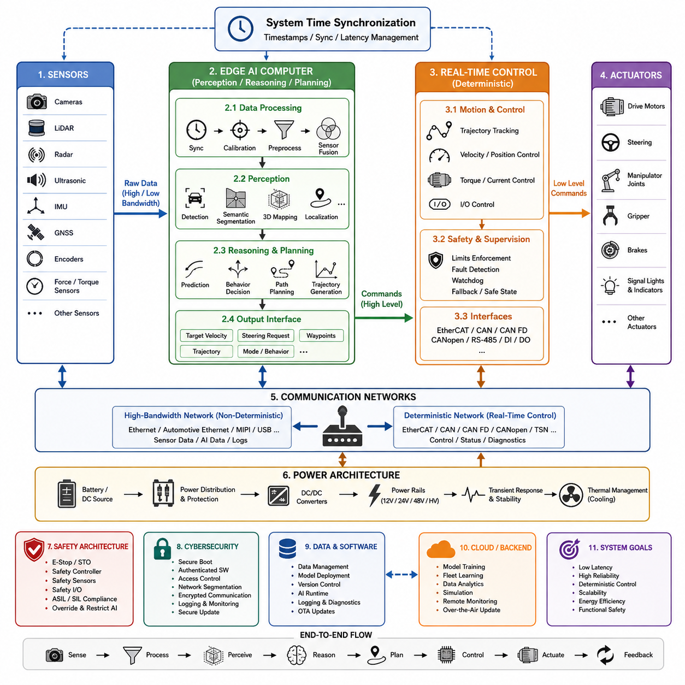
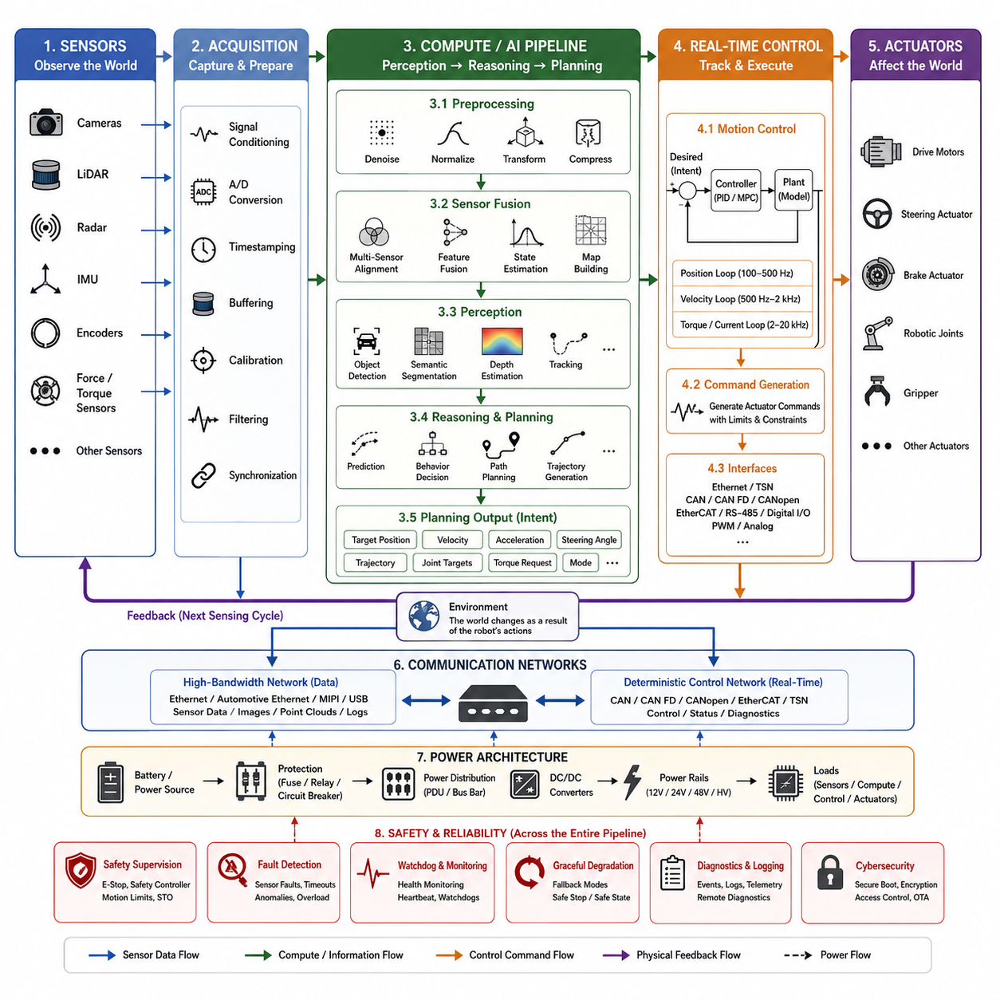
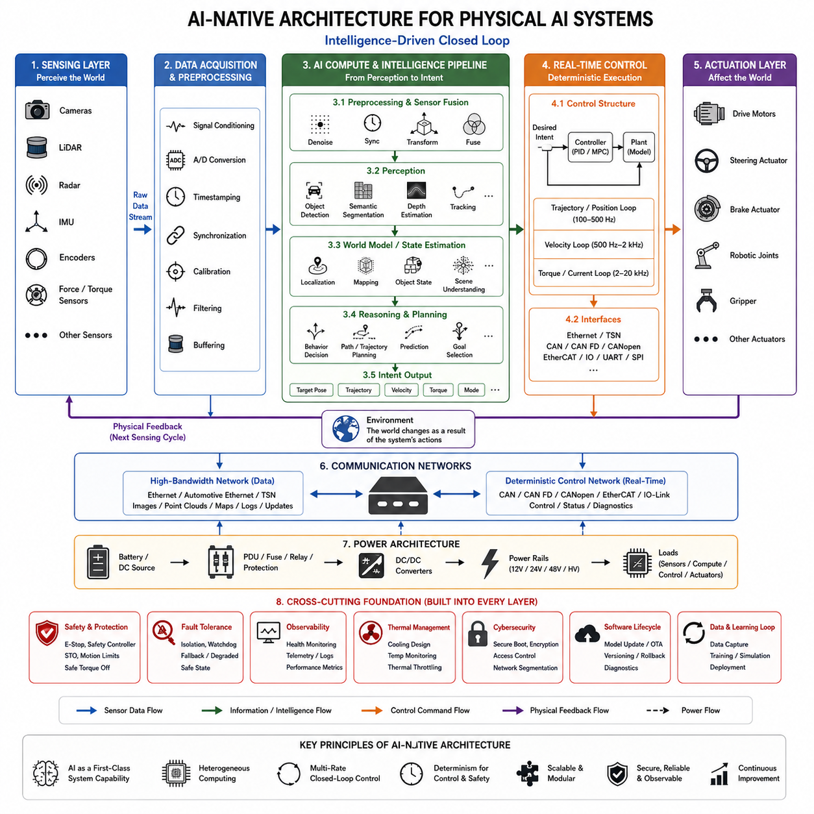
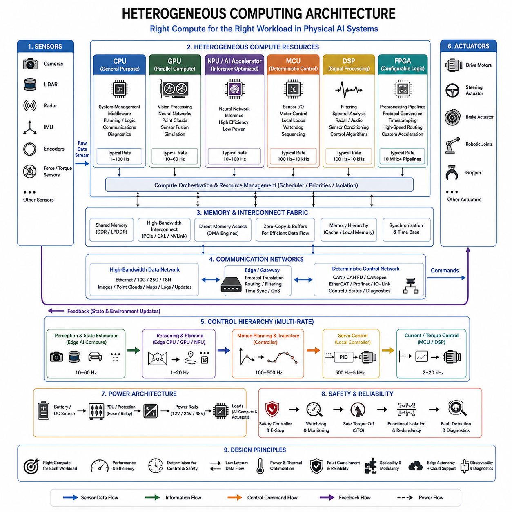
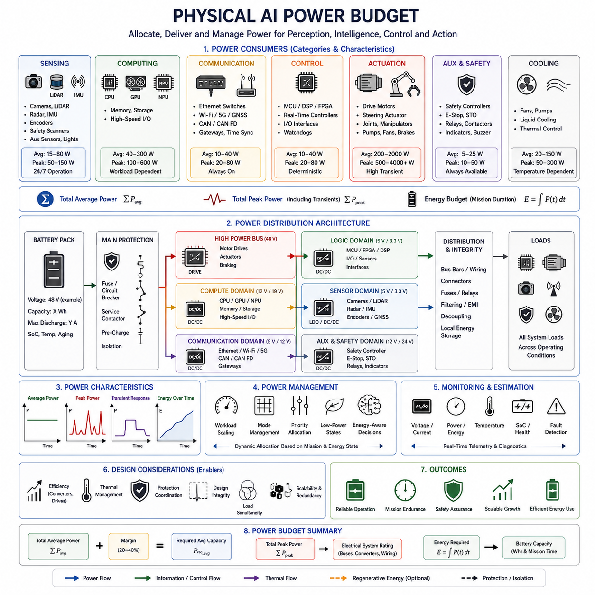

**Volume 01. Electrical Architecture Fundamentals**

# Chapter 05. Physical AI Electrical Architecture

## 05.01. Edge AI Integration

{width="7.268055555555556in" height="7.268055555555556in"}

Edge AI integration places artificial intelligence computation directly within the physical system, close to sensors, actuators, and real-time controllers. In the Physical AI electrical architecture, the edge computing layer connects conventional robot control electronics with perception, learning, and decision functions while avoiding continuous dependence on remote cloud infrastructure.

A practical architecture separates deterministic machine control from computationally intensive AI processing. Motor control, servo loops, emergency handling, and basic motion functions remain on MCUs, dedicated controllers, or real-time processors, while an edge AI computer executes perception, localization, prediction, planning, and higher-level decision algorithms. This separation preserves predictable control timing while enabling advanced intelligence.

The resulting system normally operates at multiple processing rates. A motor controller may execute current or torque regulation at kilohertz frequencies, while a robot controller performs trajectory and motion control at hundreds of hertz. Camera or LiDAR perception may operate at tens of frames per second, and complex AI planning can operate more slowly. Edge integration must therefore coordinate asynchronous information without forcing every subsystem into one execution cycle.

Sensors form the primary input boundary of the edge AI platform. Cameras, LiDAR, radar, ultrasonic sensors, IMUs, GNSS receivers, encoders, force sensors, and other devices generate data with different rates, bandwidths, formats, and timing characteristics. The electrical architecture must provide suitable physical interfaces, synchronization mechanisms, power distribution, grounding, and communication bandwidth so that AI software receives reliable observations.

High-bandwidth sensors are commonly connected through interfaces such as Ethernet, automotive Ethernet, MIPI, USB, or dedicated high-speed links. Lower-bandwidth control and status information may use CAN, CAN FD, CANopen, EtherCAT, RS-485, or similar networks depending on the robot architecture. Edge AI integration therefore requires communication architecture to be designed according to latency, determinism, bandwidth, fault containment, and physical implementation requirements.

The edge computer converts sensor information into increasingly meaningful representations. Raw measurements may first pass through signal conditioning, synchronization, calibration, preprocessing, and sensor fusion before entering neural networks or other perception algorithms. AI models can then generate objects, free-space estimates, semantic information, terrain representations, localization features, occupancy information, or other machine-readable descriptions of the surrounding environment.

Perception results become inputs to higher-level reasoning and planning functions. Depending on the system, the edge AI computer may estimate trajectories, predict environmental changes, evaluate possible actions, generate navigation paths, or calculate motion commands. These outputs should normally be expressed through controlled interfaces rather than allowing an AI model to directly manipulate power electronics or actuator signals without an intermediate control layer.

The interface between AI computation and deterministic control is therefore a critical architectural boundary. High-level outputs such as target velocity, steering request, waypoint, trajectory, joint target, or behavioral mode can be transferred to the real-time controller. The controller then converts these commands into precisely timed actuator operations while enforcing limits associated with velocity, acceleration, torque, current, position, and machine safety.

This layered approach also supports graceful degradation. If an AI workload becomes overloaded, a neural network fails, or the edge computer temporarily loses a sensor stream, the underlying controller can retain essential deterministic functions. Depending on the application, the system may reduce speed, hold position, enter a predefined fallback state, request remote assistance, or perform a controlled stop rather than allowing computational failure to propagate directly to actuators.

Electrical integration must account for the substantial power demand of modern AI processors. GPUs, NPUs, CPUs, memory, storage, and high-speed networking can create rapidly changing electrical loads and significant thermal dissipation. The power architecture must therefore consider converter capacity, transient response, voltage stability, startup sequencing, protection, grounding, cooling, and the interaction between AI computing loads and motors or other high-current equipment.

Thermal design is particularly important because inference performance can change when processors reach thermal or power limits. An edge computer capable of high peak AI performance may deliver substantially lower sustained performance if cooling is insufficient. Electrical and mechanical architecture must consequently treat compute power, cooling capacity, enclosure design, environmental temperature, airflow, and sustained AI workload as parts of the same engineering problem.

Data movement can consume significant system resources independently of neural-network computation. Multiple high-resolution cameras and 3D sensors may generate far more raw information than the AI algorithms ultimately require. Efficient edge architectures reduce unnecessary copying, use hardware acceleration where appropriate, manage memory bandwidth carefully, and process sensor information close to its acquisition path before forwarding compact representations to other controllers.

Time synchronization is equally important for Physical AI. Sensor measurements generated at different moments can create incorrect spatial or dynamic interpretations even when every individual sensor is accurate. Hardware timestamps, synchronized clocks, deterministic acquisition, and carefully defined latency budgets allow the edge computer to associate camera images, point clouds, inertial measurements, encoder states, and control information with a consistent representation of system time.

Edge AI also changes the role of the robot communication network. The network no longer carries only commands and diagnostic signals; it becomes part of the perception-to-action information pipeline. High-bandwidth Ethernet networks can transport sensor and AI data, while deterministic buses can maintain actuator control. Gateways or compute nodes may bridge these domains while controlling traffic priority, timing, security, and fault propagation.

Functional safety should remain architecturally distinguishable from probabilistic AI behavior. Safety controllers, emergency-stop circuits, safe torque off, protective sensors, and deterministic safety logic should retain authority over hazardous motion where required. AI can provide rich environmental understanding and operational decisions, but safety mechanisms must be capable of restricting or overriding AI-generated commands when predefined safety conditions are violated.

Cybersecurity becomes more important as edge computers introduce operating systems, middleware, neural-network runtimes, storage, Ethernet connectivity, and software update mechanisms into the robot. Secure boot, authenticated software, access control, network segmentation, encrypted communication where appropriate, logging, and controlled update procedures help prevent the intelligence layer from becoming an uncontrolled path into safety-critical or motion-control electronics.

Edge AI integration also provides a foundation for local autonomy when external connectivity is unreliable. The robot can continue perception, localization, planning, and essential decision making without depending on cloud round trips. Cloud or on-premise systems can instead support model distribution, fleet learning, large-scale analytics, data management, simulation, and computationally expensive training while operational inference remains close to the physical machine.

The boundary between edge device and edge AI computer should be defined explicitly. A compact controller near motors and actuators can maintain fast local control, while a GPU-class edge computer handles computationally intensive intelligence. Ethernet can connect the higher-level compute domain, while CAN, CANopen, EtherCAT, or other deterministic networks connect lower-level devices according to application requirements. This creates a hierarchical compute and communication structure.

Such hierarchy makes Physical AI fundamentally different from simply installing a GPU inside a robot. Successful integration requires coordinated design of sensors, compute hardware, networks, power distribution, thermal management, timing, control interfaces, safety mechanisms, and software deployment. The electrical architecture determines whether AI outputs can reach the physical system with sufficient reliability, latency, bandwidth, and operational predictability.

Scalability should also be considered from the beginning. Additional cameras, manipulators, accelerators, communication interfaces, or AI models can increase power, bandwidth, thermal load, and timing complexity. Modular compute interfaces, standardized communication boundaries, reserved power capacity, expandable networking, and clearly separated control responsibilities allow the architecture to evolve without requiring a complete redesign whenever intelligence capability increases.

Ultimately, Edge AI integration establishes the bridge between digital intelligence and physical action. Sensors observe the environment, edge computing transforms observations into useful representations and decisions, deterministic controllers convert decisions into precisely timed commands, and actuators interact with the physical world. The resulting feedback continuously returns new sensor information, forming the electrical and computational foundation for increasingly autonomous Physical AI systems.

## 05.02. Sensor Compute Actuator Pipeline

{width="7.268055555555556in" height="7.268055555555556in"}

The sensor-compute-actuator pipeline defines the fundamental information and control flow through which a Physical AI system observes its environment, interprets physical conditions, makes decisions, and produces actions. Within the Physical AI electrical architecture, this pipeline connects sensing hardware, computing resources, communication networks, real-time controllers, and actuators into a continuous closed-loop system.

The pipeline begins with sensors that convert physical phenomena into electrical or digital information. Cameras capture visual appearance, LiDAR measures three-dimensional geometry, radar estimates range and velocity, IMUs measure acceleration and angular motion, encoders observe joint or wheel position, and force or torque sensors measure mechanical interaction. Each sensor provides a different view of the robot and its surroundings.

Sensor signals must pass through an acquisition layer before they become useful computational inputs. Depending on the sensor, this layer may include analog conditioning, analog-to-digital conversion, packet reception, timestamp generation, buffering, calibration, filtering, and synchronization. The objective is not merely to collect data, but to preserve measurement quality and temporal relationships required for reliable perception and control.

Different sensors operate at different sampling frequencies and produce dramatically different data volumes. Encoders and inertial sensors may generate measurements at hundreds or thousands of hertz, while cameras commonly provide images at tens of frames per second. LiDAR and radar operate according to their own scanning cycles. The architecture must therefore manage asynchronous streams without assuming that every measurement arrives simultaneously.

Time synchronization provides the common temporal reference required to combine these streams. Hardware timestamps, synchronized clocks, trigger signals, Precision Time Protocol mechanisms, or equivalent techniques can associate measurements with their actual acquisition times. Without accurate timing, sensor fusion may combine observations representing different physical states, creating errors in localization, velocity estimation, mapping, prediction, or motion control.

After acquisition, sensor data enters the compute domain. Preprocessing operations can remove noise, compensate for calibration parameters, resize or normalize images, transform coordinate systems, filter point clouds, and convert raw packets into representations suitable for algorithms. Efficient preprocessing is important because unnecessary movement or duplication of high-bandwidth sensor data can consume memory bandwidth and increase end-to-end latency.

Sensor fusion combines complementary measurements into a more complete representation of the physical state. Camera information can provide semantic detail, LiDAR can provide accurate geometry, radar can contribute robust range and velocity information, and IMU or encoder measurements can provide rapid motion estimates. Fusion may occur at raw-data, feature, object, or state level depending on computational resources and application requirements.

The perception stage converts processed sensor information into representations that are useful for autonomous behavior. Typical outputs include detected objects, semantic regions, depth estimates, free space, occupancy maps, terrain characteristics, robot pose, landmarks, obstacles, and tracked dynamic objects. These representations reduce large quantities of raw sensor information into structured information that downstream decision functions can use efficiently.

The compute layer may contain heterogeneous processing devices because different workloads have different computational characteristics. CPUs are effective for general-purpose logic and system management, GPUs provide highly parallel processing for neural networks and vision, NPUs or dedicated AI accelerators can improve inference efficiency, and MCUs or real-time processors provide deterministic execution for time-critical functions. The pipeline coordinates these resources rather than treating them as interchangeable.

Once the current environment and robot state have been estimated, reasoning and planning functions determine the desired behavior. Navigation software may select a path around obstacles, a manipulator planner may generate a collision-free joint trajectory, or an autonomous vehicle planner may determine target velocity and steering behavior. AI models can contribute prediction and decision capabilities while conventional algorithms enforce geometric, dynamic, or operational constraints.

Planning outputs normally represent desired behavior rather than direct electrical actuator commands. Examples include target position, velocity, acceleration, steering angle, trajectory, joint configuration, torque request, or operating mode. This separation establishes an important boundary between higher-level computation and lower-level deterministic control, allowing AI decisions to be validated and constrained before they influence physical hardware.

The real-time control layer converts these higher-level requests into commands that actuators can execute. Motion controllers compare desired states with measured states and calculate appropriate control outputs using feedback algorithms. Position, velocity, torque, and current loops may operate at progressively faster rates as computation moves closer to the actuator, allowing the physical system to respond rapidly even when high-level AI decisions are generated more slowly.

For example, an edge computer may update a desired trajectory at tens of hertz while a robot controller tracks that trajectory at hundreds of hertz. A motor controller can simultaneously regulate current or torque at kilohertz rates. The pipeline therefore behaves as a hierarchy of nested control loops rather than a single sequential program, with each layer operating according to the timing requirements of its physical responsibility.

Communication networks connect the pipeline stages and must be selected according to their traffic characteristics. High-resolution cameras and LiDAR may require Ethernet or other high-bandwidth interfaces, while motor controllers and distributed I/O may use CAN, CAN FD, CANopen, EtherCAT, or similar control networks. The electrical architecture must prevent heavy sensor traffic from interfering with time-critical actuator communication.

The actuator stage transforms electrical commands into physical effects. Motors generate rotational or linear motion, steering actuators change direction, brakes generate stopping forces, robotic joints position links, and grippers interact with objects. Power electronics such as inverters, servo amplifiers, and motor drivers translate low-power control signals into the voltage and current required by the mechanical system.

Actuation immediately changes the physical state observed by the sensors, closing the feedback loop. Wheel rotation changes encoder measurements, steering modifies vehicle motion, manipulator movement changes camera geometry, and interaction forces appear in force sensors. The next sensing cycle therefore contains the consequences of the previous command, allowing the controller and AI system to continuously evaluate and correct their behavior.

Latency must be considered across the entire sensor-to-actuator path rather than at individual components alone. Sensor exposure, communication, buffering, preprocessing, inference, planning, network transmission, controller execution, and actuator response all contribute to end-to-end delay. Excessive or unpredictable latency can cause decisions to be based on outdated states and may reduce stability, tracking accuracy, or operational safety.

Reliability requires fault handling throughout the pipeline. Missing sensor frames, corrupted packets, communication timeout, compute overload, invalid AI outputs, controller faults, and actuator failures should be detected as close as practical to their source. Health monitoring and diagnostic information can propagate through the architecture so that higher layers understand when data or control capability has degraded.

Safety supervision operates alongside the normal pipeline rather than depending entirely on it. Emergency-stop circuits, safety sensors, safety controllers, motion limits, watchdogs, and safe torque off mechanisms can restrict or disable actuator commands when hazardous conditions occur. This ensures that failures in perception, AI reasoning, networking, or general-purpose computing do not automatically remove the system\'s final protective mechanisms.

Power distribution is another physical dependency spanning every pipeline stage. Sensors require stable low-noise supplies, compute platforms can create large dynamic loads, communication devices require reliable rails, and actuators may demand high transient current. Proper power-domain separation, grounding, protection, conversion, and sequencing prevent actuator disturbances or compute transients from degrading sensor measurements and control electronics.

A well-designed pipeline also supports modularity. Sensors can be upgraded without redesigning motor control, AI computers can evolve independently from actuator electronics, and control devices can be replaced while preserving defined command and feedback interfaces. Standardized electrical, communication, timing, and software boundaries make it possible to scale the architecture from simple mobile robots to complex autonomous machines.

The sensor-compute-actuator pipeline is therefore more than a linear chain of components. It is a multi-rate, closed-loop architecture in which sensing provides evidence about the physical world, computing transforms that evidence into state and intent, deterministic controllers translate intent into precisely timed commands, and actuators change the environment. Feedback continuously reconnects physical action with digital intelligence.

For Physical AI, the quality of this pipeline determines how effectively intelligence becomes physical behavior. High-performance AI models alone cannot provide reliable autonomy if sensor timing is inconsistent, communication is congested, control interfaces are poorly defined, power is unstable, or actuator response is unpredictable. Coordinated electrical and computational design transforms perception, reasoning, control, and physical action into one integrated autonomous system.

## 05.03. AI Native Architecture

{width="7.268055555555556in" height="7.268055555555556in"}

An AI-native architecture treats artificial intelligence as a fundamental system capability rather than an optional application added after the electrical and computing architecture has been designed. In a Physical AI system, sensing, computation, communication, control, power, and safety are therefore organized from the beginning around continuous perception, inference, decision making, and interaction with the physical world.

Traditional robot architectures often begin with deterministic control functions and later attach AI processors to support perception or advanced autonomy. An AI-native design reverses this assumption by considering intelligent workloads during the initial architecture definition. Sensor bandwidth, accelerator capacity, memory movement, network latency, power consumption, thermal limits, and software deployment become first-order electrical design parameters.

The architecture still preserves deterministic control where physical timing requires it. AI-native does not mean that neural networks replace every controller, nor does it imply that probabilistic models should directly operate power electronics. Instead, AI computation and conventional control are assigned to appropriate layers, allowing perception and reasoning to evolve rapidly while motor, servo, protection, and safety functions retain predictable real-time behavior.

Sensing becomes an integrated information infrastructure rather than a collection of independent devices. Cameras, LiDAR, radar, IMUs, encoders, force sensors, and other sensing devices provide complementary observations that can be synchronized and fused. Their electrical interfaces, timestamps, bandwidth requirements, calibration information, and physical placement are designed according to the representations required by downstream AI models.

The compute architecture is inherently heterogeneous because Physical AI workloads contain different types of computation. CPUs can manage operating systems, middleware, planning logic, and general algorithms; GPUs can accelerate vision and neural-network processing; NPUs or dedicated accelerators can improve inference efficiency; and MCUs, DSPs, FPGAs, or real-time processors can execute deterministic or specialized functions close to sensors and actuators.

Memory architecture becomes as important as raw processor performance. High-resolution cameras and three-dimensional sensors can generate large continuous data streams, while modern AI models require substantial parameter, activation, and intermediate-data movement. Shared memory, high-speed interconnects, direct memory access, efficient buffering, and minimized data copying can significantly reduce latency and energy consumption across the AI processing pipeline.

Communication networks must support both data-intensive intelligence and deterministic machine control. Ethernet-class networks can carry images, point clouds, AI features, maps, logs, and software updates, while CAN, CAN FD, CANopen, EtherCAT, or similar networks can serve distributed controllers and actuators. Network segmentation and traffic prioritization prevent high-bandwidth AI data from disrupting time-critical control communication.

AI-native systems naturally operate as multi-rate architectures. Sensor acquisition, neural-network inference, world-state estimation, planning, trajectory generation, servo control, and motor-current regulation do not need to execute at the same frequency. A perception model may operate at tens of hertz while trajectory control operates at hundreds of hertz and current control at several kilohertz, with defined interfaces connecting these different temporal domains.

The intelligence pipeline transforms raw observations into increasingly abstract representations. Sensor data can be calibrated, synchronized, filtered, and fused before perception models identify objects, geometry, free space, terrain, motion, or semantic relationships. Higher layers can then construct state representations that summarize what exists around the machine, how the environment is changing, and which information is relevant to future action.

Reasoning and planning operate on these representations to generate intent. Depending on the machine, this may include selecting navigation goals, predicting object motion, evaluating traversability, coordinating manipulation, generating trajectories, or selecting behavioral modes. The architecture should expose explicit interfaces between AI-generated intent and execution so that commands can be checked against physical constraints before reaching lower-level controllers.

This separation creates an important control boundary. AI may determine where the robot should move or what action it should attempt, while deterministic controllers determine precisely how motors and actuators execute that request. Position, velocity, torque, and current loops remain close to the physical hardware, allowing fast feedback control to continue independently between successive AI inference or planning updates.

An AI-native architecture must also be designed for uncertainty. Neural-network outputs may contain confidence values, ambiguous classifications, incomplete observations, or predictions that become invalid as the environment changes. Instead of assuming every AI output is correct, downstream functions can evaluate confidence, consistency, freshness, operational limits, and alternative information before converting an AI decision into physical action.

Fault containment is especially important because an AI compute platform may host many functions simultaneously. Excessive processing load, memory exhaustion, software failure, corrupted input, communication loss, or accelerator malfunction should not automatically disable basic motion control or safety functions. Architectural partitioning allows essential controllers to maintain controlled operation or transition the machine into a predefined degraded or safe state.

Functional safety therefore remains an independent authority within the overall system. Emergency-stop circuits, safety controllers, protective sensing, safe torque off, watchdogs, and deterministic safety logic can supervise or override AI-generated commands. The AI layer can improve environmental awareness and operational intelligence, but safety mechanisms must remain capable of restricting physical behavior when hazardous conditions are detected.

Power architecture must be designed around dynamically changing compute demand as well as actuator demand. GPUs and accelerators can transition rapidly between idle and intensive inference states, while motors produce their own large transient loads. Power distribution units, DC/DC converters, voltage rails, protection devices, grounding, filtering, and energy-storage components must maintain stable operation across these interacting electrical load profiles.

Thermal architecture is closely coupled with AI performance. Accelerator frequency, inference throughput, memory performance, and model execution can be reduced when thermal limits are reached. Cooling should therefore be sized according to sustained workloads rather than only nominal or peak processor specifications. Temperature monitoring can also become part of system-level resource management, allowing workloads to adapt before thermal throttling affects autonomy.

Software deployment becomes part of the electrical architecture lifecycle because AI capability changes after hardware production. Models, inference runtimes, calibration data, middleware, and configuration parameters may require controlled updates. Secure boot, authenticated packages, version management, rollback mechanisms, diagnostics, and over-the-air or service-based updates allow intelligence to evolve while maintaining configuration traceability and operational integrity.

AI-native design also encourages modularity between hardware generations and model generations. A sensor may be replaced by a higher-resolution device, an accelerator may be upgraded, or a perception model may change without redesigning every actuator interface. Stable data contracts, communication interfaces, timing definitions, command boundaries, and power interfaces reduce coupling between rapidly evolving AI technology and longer-lived electromechanical hardware.

Local edge autonomy is a central characteristic of this architecture. Critical perception, planning, and control functions should remain available without continuous cloud connectivity when the application requires autonomous operation. On-premise or cloud infrastructure can provide large-scale training, fleet analytics, simulation, model management, and data aggregation, while edge computing performs latency-sensitive inference and decision making near the machine.

Data generated during operation can also support a continuous improvement cycle. Selected sensor observations, AI outputs, uncertainty information, failures, interventions, and performance metrics can be recorded and transferred to development infrastructure. These data can support model evaluation, retraining, simulation, validation, and subsequent deployment, connecting the electrical machine to an evolving AI engineering lifecycle.

Cybersecurity becomes essential because an AI-native robot contains interconnected computers, software-defined functions, stored models, network services, and update mechanisms. Authentication, network segmentation, encrypted communication where appropriate, access control, secure storage, logging, and trusted software execution protect both information and physical control paths from unauthorized manipulation.

Observability should therefore be designed into every major layer. Sensor health, communication latency, processor utilization, inference timing, memory consumption, temperatures, power conditions, controller status, actuator faults, and AI confidence can be monitored together. This allows engineers to determine whether degraded physical behavior originates from sensing, computation, networking, software, control, power, thermal conditions, or mechanical hardware.

Scalability is achieved by treating compute, communication, power, and software resources as coordinated architectural domains. Adding sensors or AI models affects not only processing capacity but also memory bandwidth, network traffic, thermal dissipation, electrical load, storage, synchronization, and validation requirements. Capacity margins and modular interfaces should therefore be planned before additional intelligence is introduced.

Ultimately, an AI-native architecture integrates intelligence into the fundamental structure of the physical machine. Sensors continuously observe the world, heterogeneous computers transform observations into representations and decisions, real-time controllers convert intent into deterministic execution, and actuators create physical change that is sensed again. Power, communication, safety, security, timing, and software lifecycle functions support this loop as inseparable architectural elements.

The defining characteristic of AI-native Physical AI is therefore not the presence of a powerful GPU or a large neural network. It is the coordinated co-design of electrical hardware, computing, sensing, communication, control, safety, power, and software around an intelligence-driven closed loop. This approach enables increasingly capable AI models to evolve while preserving the timing, reliability, controllability, and physical integrity required by real machines.

## 05.04. Heterogeneous Computing

{width="7.268055555555556in" height="7.268055555555556in"}

Heterogeneous computing combines multiple processor types within one Physical AI system so that each workload can execute on hardware suited to its computational and timing characteristics. Instead of requiring a single processor to perform perception, planning, communication, safety, and motor control, the architecture distributes these functions across CPUs, GPUs, NPUs, MCUs, DSPs, FPGAs, and specialized real-time controllers.

The need for heterogeneous computing arises because Physical AI contains fundamentally different workloads. Neural-network inference requires large parallel matrix operations, image processing demands high data throughput, planning requires flexible general-purpose computation, and motor control requires deterministic execution with very low timing variation. No single processing architecture provides the optimum performance, efficiency, latency, and determinism for all of these requirements.

The CPU typically provides the general-purpose computing foundation. It can execute operating systems, middleware, communication stacks, navigation logic, task management, diagnostics, and algorithms containing complex branching or sequential processing. CPUs also coordinate other accelerators, manage memory and I/O resources, and provide the software environment in which multiple Physical AI functions are integrated into a complete application.

GPUs provide massively parallel computing resources and are particularly effective for workloads involving neural networks, computer vision, point-cloud processing, and large numerical operations. Camera perception, semantic segmentation, object detection, depth estimation, sensor fusion, and learned prediction models can benefit from GPU acceleration. GPU performance allows complex AI models to operate locally on an edge computer rather than depending entirely on remote infrastructure.

NPUs and dedicated AI accelerators provide another processing domain optimized specifically for neural-network inference. These devices can execute common tensor and matrix operations with lower power consumption than general-purpose processors for supported workloads. In mobile robots, autonomous machines, and battery-powered Physical AI platforms, inference performance per watt can be as important as maximum computational throughput.

MCUs remain essential because many physical functions require predictable execution rather than massive parallel computation. They can manage sensor acquisition, low-level communication, power sequencing, actuator interfaces, watchdogs, and local control loops. A motor-control MCU may execute current or torque regulation thousands of times per second while the edge AI processor performs perception and planning at substantially lower frequencies.

Digital signal processors(DSPs) are useful for workloads dominated by repetitive numerical signal processing. Filtering, spectral analysis, radar processing, audio processing, sensor conditioning, and some control algorithms can execute efficiently on DSP architectures. Processing data close to the sensor can also reduce the amount of raw information that must be transferred to higher-level processors, decreasing communication and memory bandwidth requirements.

FPGAs provide configurable hardware parallelism and can be valuable when very low latency, deterministic pipelines, or custom interfaces are required. They can implement sensor preprocessing, protocol conversion, timestamping, high-speed data routing, synchronization, or specialized acceleration. Unlike fixed processors, FPGA logic can be configured around a particular data path, although this flexibility introduces additional development and verification complexity.

Real-time processors and dedicated control units form another important part of heterogeneous Physical AI architecture. These devices execute trajectory tracking, servo control, vehicle dynamics, actuator coordination, or machine-control functions with bounded timing behavior. Their role is complementary to AI processors: AI determines higher-level intent while deterministic controllers ensure that physical execution follows that intent predictably.

The architecture therefore forms a hierarchy from intelligence-oriented computing toward increasingly time-critical physical control. High-performance edge computers may execute perception, world-state estimation, reasoning, and planning. Intermediate controllers transform planned behavior into trajectories or actuator targets, while local controllers execute position, velocity, torque, and current loops close to the hardware.

Different processing domains also operate at different rates. A vision model may update at 20 or 30 Hz, planning may execute at 10 Hz, trajectory control may operate at several hundred hertz, and motor-current regulation may exceed several kilohertz. Heterogeneous computing allows each processing element to operate at the rate appropriate to its responsibility without forcing the entire machine into one global execution cycle.

Data movement between processors becomes a major architectural concern. Sensor frames may move from an acquisition interface into memory, then into a GPU or accelerator, while inference results move back to the CPU for planning and subsequently to a real-time controller. Excessive copying can increase latency, memory bandwidth, processor utilization, and energy consumption even when the individual computation stages are highly optimized.

Shared memory, direct memory access(DMA), high-speed internal interconnects, zero-copy mechanisms, and accelerator-aware software can reduce this overhead. The objective is to move information through the compute architecture with as few unnecessary transformations and copies as possible. In high-bandwidth Physical AI systems, efficient data movement may provide greater practical improvement than simply adding additional peak computing performance.

Communication between separate computing nodes must also match the characteristics of the data being exchanged. Ethernet and other high-bandwidth links can connect cameras, LiDAR, edge computers, and high-performance controllers, while CAN, CAN FD, CANopen, EtherCAT, or similar networks can connect distributed real-time devices. Gateways may bridge these networks while preserving timing and fault-containment boundaries.

Task partitioning determines which processor should execute each function. This decision should consider computational complexity, latency, determinism, data locality, memory demand, power consumption, thermal behavior, safety requirements, and software maintainability. Assigning every available AI workload to a GPU may simplify early development but can create resource contention and unpredictable latency as system complexity increases.

Resource contention becomes particularly important when several AI models share the same accelerator. Perception, localization, prediction, and planning workloads may compete for GPU execution time, memory capacity, and memory bandwidth. Scheduling policies, workload priorities, execution budgets, and performance monitoring are therefore necessary to ensure that lower-priority processing does not delay functions required for immediate physical operation.

Power efficiency strongly influences heterogeneous computing design. CPUs, GPUs, accelerators, communication devices, and controllers have different power characteristics, and their utilization changes dynamically during operation. Workloads can sometimes be assigned to specialized processors that perform the required function with less energy, reducing battery consumption, thermal load, cooling requirements, and electrical infrastructure demand.

Thermal constraints are directly connected to processor allocation. Concentrating many workloads on a single high-performance processor may create localized heat and cause thermal throttling, reducing sustained computational performance. Distributing appropriate workloads across specialized devices can improve thermal balance, although additional processors also increase hardware complexity, power conversion requirements, packaging, and communication interfaces.

Reliability requires that failures in one compute domain do not unnecessarily propagate throughout the machine. A GPU failure or overloaded AI process should not automatically eliminate emergency handling or basic actuator control. Partitioning critical functions onto independent controllers enables graceful degradation, allowing the system to reduce capability, enter a fallback mode, maintain limited control, or transition safely when high-level computing becomes unavailable.

Functional safety further strengthens this separation. Safety-related monitoring, emergency-stop handling, safe torque off, and protective control may require dedicated safety hardware or certified processing paths rather than execution within the same general-purpose AI environment. Heterogeneous computing therefore supports not only performance optimization but also architectural independence between intelligent behavior and safety-critical authority.

Software architecture must hide unnecessary hardware complexity while preserving control over processor assignment. Middleware, runtime systems, drivers, communication frameworks, inference engines, and hardware abstraction layers can provide standardized interfaces between applications and processing devices. Well-defined APIs allow algorithms to evolve without exposing every higher-level function to detailed electrical or processor-specific implementation.

Diagnostics and observability must extend across all compute domains. CPU load, GPU utilization, accelerator execution time, memory usage, network traffic, controller cycle time, temperature, voltage, power consumption, and communication errors should be measurable. Correlating these signals helps engineers determine whether performance degradation originates from an algorithm, processor bottleneck, thermal condition, network delay, or electrical limitation.

Scalability depends on maintaining modular boundaries between processing resources. Future systems may add higher-resolution sensors, larger AI models, additional accelerators, more actuators, or new safety functions. Standardized interfaces and clearly defined compute responsibilities allow individual processing domains to evolve without requiring complete redesign of the electrical architecture whenever computational capability increases.

Heterogeneous computing also supports the separation between edge, on-premise, and cloud resources. Latency-sensitive perception and decision functions can execute on the robot, deterministic control remains near actuators, while computationally expensive training, fleet analytics, simulation, and model management can execute on larger external systems. The location of computation becomes another architectural dimension that can be optimized according to operational requirements.

Ultimately, heterogeneous computing provides the computational foundation required to connect AI intelligence with deterministic physical execution. CPUs coordinate, GPUs and accelerators provide intensive AI computation, specialized processors handle signal processing, MCUs and real-time controllers maintain fast physical control, and communication networks connect these domains. Each processor contributes according to the workload it can execute most effectively.

For Physical AI electrical architecture, the objective is therefore not to maximize the capability of one processor but to create a balanced computing system. Performance, latency, determinism, memory bandwidth, energy efficiency, thermal capacity, reliability, safety, and upgradeability must be considered together. Proper heterogeneous computing design enables increasingly sophisticated intelligence while preserving the predictable behavior required by real physical machines.

## 05.05. Physical AI Power Budget

{width="7.268055555555556in" height="7.268055555555556in"}

A Physical AI power budget defines how electrical energy is allocated across sensing, computing, communication, control, actuation, safety, and supporting electronics. Unlike conventional electronic systems with relatively predictable loads, Physical AI machines combine high-current electromechanical devices with rapidly changing AI computing workloads, making power allocation a system-level architectural problem rather than a simple sum of component ratings.

The power budget begins by identifying every electrical load and assigning its operating characteristics. Sensors, edge computers, GPUs, controllers, communication devices, storage, cooling systems, motor drives, actuators, safety equipment, lighting, and auxiliary electronics all consume power differently. Their nominal, peak, transient, startup, idle, and fault-state requirements must be distinguished because these conditions can produce substantially different demands.

Average power determines energy consumption over time, while peak power determines whether the electrical architecture can support demanding operating conditions without instability. A mobile robot may consume moderate average power while traveling normally but experience much higher demand during acceleration, steering, manipulation, braking transitions, intensive AI inference, or simultaneous operation of several actuators. Both values must therefore be represented in the design.

Transient power is particularly important because motors and compute accelerators can change their demand rapidly. A motor can request high current during acceleration or sudden load changes, while a GPU can transition from an idle state to intensive inference within a short period. The power system must respond without excessive voltage droop, converter saturation, processor reset, communication disturbance, or degradation of sensitive sensor measurements.

Actuators normally represent one of the largest power consumers in mobile and robotic systems. Drive motors, steering actuators, manipulators, joints, pumps, fans, grippers, and braking systems convert electrical energy into physical work. Their consumption depends on torque, speed, duty cycle, mechanical efficiency, payload, terrain, acceleration, and operating mode, so actuator power cannot be represented accurately by rated power alone.

AI computing introduces a different type of load. CPUs, GPUs, NPUs, memory, storage, and high-speed interfaces consume power according to workload intensity rather than mechanical demand. Running several perception networks, processing multiple camera streams, executing a world model, or performing complex planning can increase compute consumption even when the robot is mechanically stationary, creating a power domain that behaves independently from propulsion.

Sensors usually consume less power individually than motors or high-performance computers, but their combined demand can become significant. Multiple cameras, LiDAR units, radar sensors, GNSS receivers, IMUs, encoders, safety scanners, and auxiliary sensing devices may operate continuously. Sensor heaters, illumination systems, cleaning mechanisms, and environmental conditioning can further increase the total sensing power requirement.

Communication equipment also contributes to the power budget. Ethernet switches, gateways, wireless radios, CAN interfaces, time-synchronization devices, routers, and network processors may remain active throughout operation. High-speed networking can require additional power for transceivers and switching hardware, particularly when multiple high-bandwidth sensors continuously transmit images, point clouds, maps, or diagnostic information.

Cooling must be treated as an electrical load rather than a secondary mechanical consideration. Fans, pumps, liquid-cooling components, and thermal-control devices consume energy to maintain processors, batteries, power electronics, and motors within acceptable temperature ranges. Increasing computational performance can therefore create both direct processor power demand and indirect cooling demand, amplifying the effect of AI workloads on the overall power budget.

The electrical architecture normally separates loads into power domains according to voltage, function, noise sensitivity, safety, and fault behavior. High-power actuators may operate from 48 V or higher-voltage buses, while computers and communication devices use regulated intermediate rails and sensors require lower-voltage supplies. DC/DC converters provide these rails while electrically organizing the machine into manageable distribution domains.

Converter efficiency must be included because energy is lost during every voltage transformation. If a compute platform requires a lower voltage than the battery bus, the DC/DC converter supplying it dissipates part of the input energy as heat. Similar losses occur in motor drives, regulators, protection devices, wiring, and connectors. The battery must therefore provide more energy than the loads themselves ultimately consume.

Power-distribution losses become increasingly important as current increases. Cable resistance, connectors, bus bars, fuses, relays, contactors, and PCB conductors produce voltage drop and heat proportional to electrical loading. Appropriate wire gauge, conductor length, connector rating, distribution topology, and grounding must therefore be considered together with the power budget rather than calculated independently after load selection.

Design margin is necessary because component specifications and real operating conditions are never perfectly fixed. Additional sensors may be installed, AI workloads may grow, processors may operate at higher utilization, motors may encounter heavier loads, and environmental temperature may reduce component capability. Reserve capacity prevents small system changes from immediately requiring redesign of converters, wiring, protection, or battery capacity.

However, excessive margin also increases mass, volume, cost, and potentially conversion losses. Oversized converters, wiring, batteries, and cooling systems can reduce overall system efficiency. Power budgeting should therefore distinguish realistic worst-case operation from theoretically possible combinations of loads that cannot occur simultaneously, using operational scenarios and duty cycles to establish credible design conditions.

Load simultaneity is especially important in Physical AI systems. Maximum motor torque, maximum GPU utilization, full sensor operation, peak communication activity, and maximum cooling demand may not always occur at the same moment. Conversely, some critical scenarios may cause several of these loads to coincide. Scenario-based analysis identifies which combinations must genuinely be supported by the electrical system.

Energy budgeting extends power analysis into operating time. For a battery-powered robot, energy capacity determines mission duration and must account for propulsion, computing, sensing, communication, cooling, conversion losses, standby consumption, and reserve energy. A system with adequate peak power can still fail operational requirements if sustained AI or sensor workloads reduce battery endurance below the required mission duration.

AI workload management can therefore become part of energy management. Models may operate at different inference frequencies, sensors may change operating modes, accelerators may enter low-power states, and noncritical computation can be delayed when energy is constrained. Dynamic power management allows computational performance to adapt to mission conditions rather than assuming maximum AI processing must operate continuously.

Power management can also coordinate physical and computational priorities. During demanding acceleration or manipulation, the system may reserve electrical capacity for actuators while limiting nonessential compute workloads. During stationary inspection, propulsion demand may decrease while AI perception and analysis increase. Such coordination treats available electrical power as a shared system resource that can be allocated according to operational priorities.

Battery architecture must support both energy capacity and instantaneous power delivery. Cell chemistry, pack voltage, internal resistance, state of charge, temperature, aging, and battery-management-system limits influence the available power. A battery with sufficient nominal energy may still be unable to provide a required transient current under low temperature, low state of charge, or degraded aging conditions.

Regenerative energy introduces another consideration in mobile platforms. During braking or deceleration, motors may operate as generators and return electrical energy toward the DC bus or battery. The architecture must determine whether the battery can accept this energy, whether bus voltage remains controlled, and whether braking resistors or other energy-management mechanisms are required when regenerative power cannot be absorbed.

Protection devices must be coordinated with the expected load profile. Fuses, circuit breakers, relays, contactors, current sensors, and electronic protection should tolerate legitimate startup and transient currents while responding appropriately to overloads and faults. Incorrect protection sizing can either create nuisance interruptions during normal peak operation or fail to protect wiring and equipment during abnormal conditions.

Power integrity is particularly important for sensing and computing. Voltage disturbances generated by motors, inverters, switching converters, or large transient loads can affect cameras, communication equipment, processors, and precision sensors. Separate rails, filtering, grounding, decoupling, local energy storage, and carefully designed distribution paths help prevent high-power actuator activity from degrading the intelligence and control domains.

Monitoring converts the static power budget into an operational resource-management capability. Voltage, current, power, energy, temperature, battery state, converter status, and rail faults can be measured throughout the architecture. These measurements allow the system to compare actual consumption with expected behavior, identify abnormal loads, estimate remaining mission time, and detect degradation before it becomes a system-level failure.

Power information can also become an input to Physical AI decision making. A robot with limited remaining energy may select a shorter route, reduce speed, postpone computationally expensive tasks, return to a charger, or modify its mission priorities. Energy state therefore evolves from a passive electrical constraint into part of the machine\'s operational state and autonomous decision process.

Safety functions require protected power availability. Emergency-stop circuits, safety controllers, braking systems, communication needed for controlled shutdown, and other critical functions may require power even when nonessential loads are disconnected. The architecture should define which loads remain energized during faults and how power domains are isolated or shut down without eliminating the functions required to reach a safe state.

Scalability requires the power budget to anticipate future system evolution. Higher-performance AI computers, additional sensors, larger manipulators, faster communication, and more sophisticated cooling can substantially change electrical demand. Modular power distribution, reserved converter capacity, expandable protection, defined voltage rails, and measurable power domains make future upgrades more manageable.

Ultimately, a Physical AI power budget connects electrical energy with intelligence and physical capability. Battery capacity, power conversion, sensing, AI computation, networking, control, actuation, thermal management, protection, and safety must be evaluated as one interacting system. The objective is not merely to provide enough watts, but to deliver the correct power at the required voltage, location, time, and reliability.

A well-designed power budget enables the Physical AI machine to sustain perception, reasoning, deterministic control, and physical action throughout its intended mission. By combining peak-power analysis, energy budgeting, transient response, conversion efficiency, thermal constraints, protection coordination, monitoring, and design margin, the electrical architecture provides a stable foundation on which increasingly capable autonomous systems can operate.
