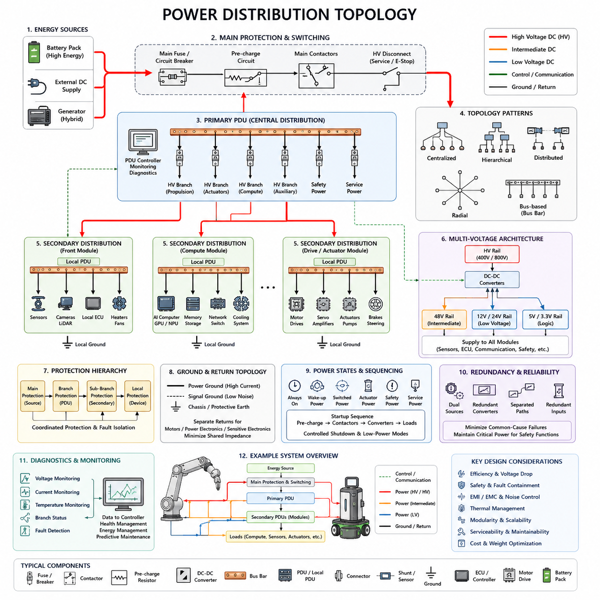
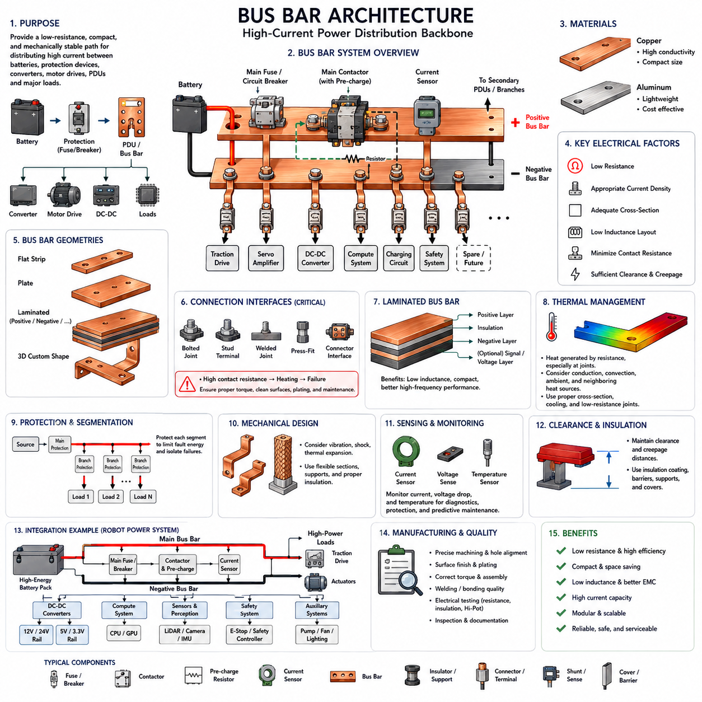
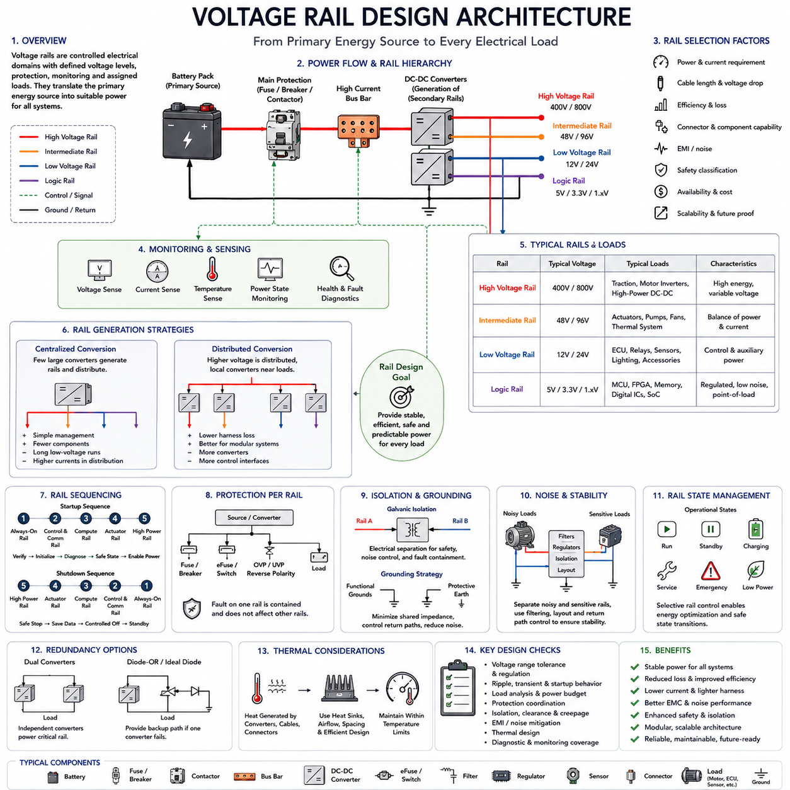
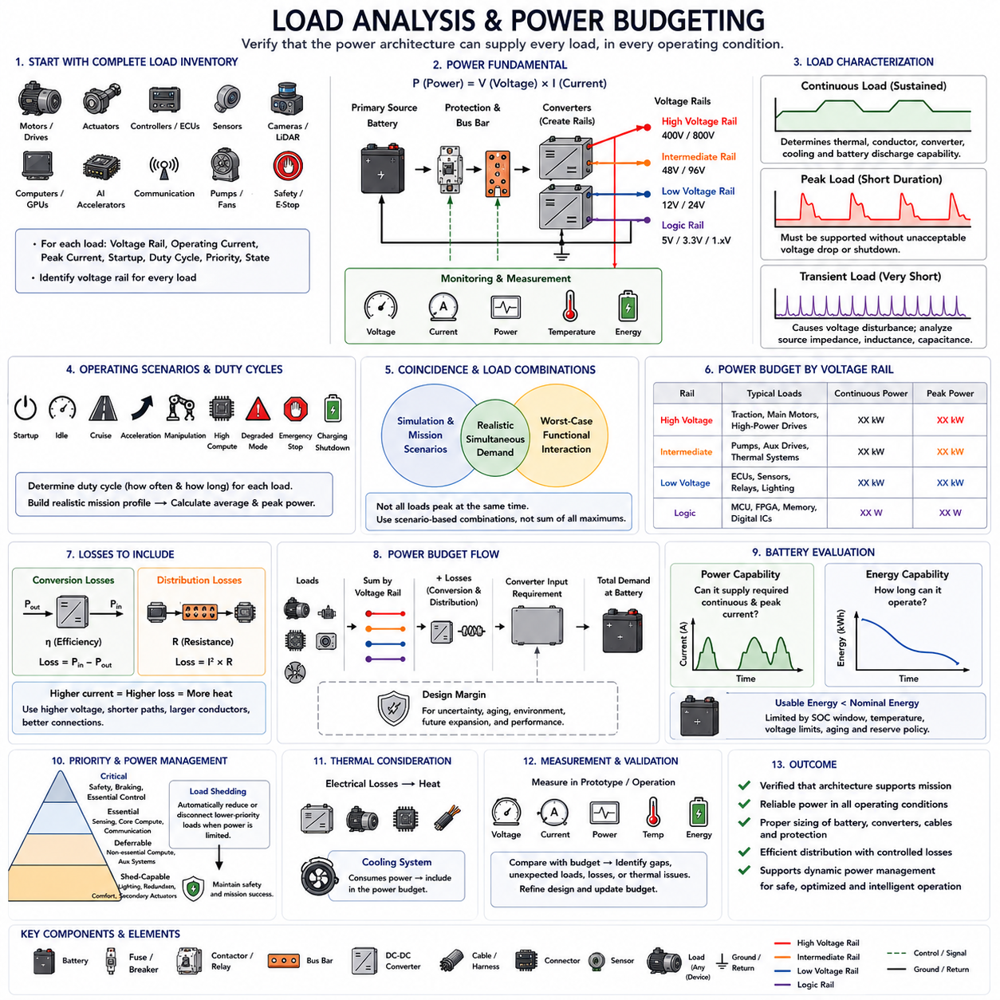
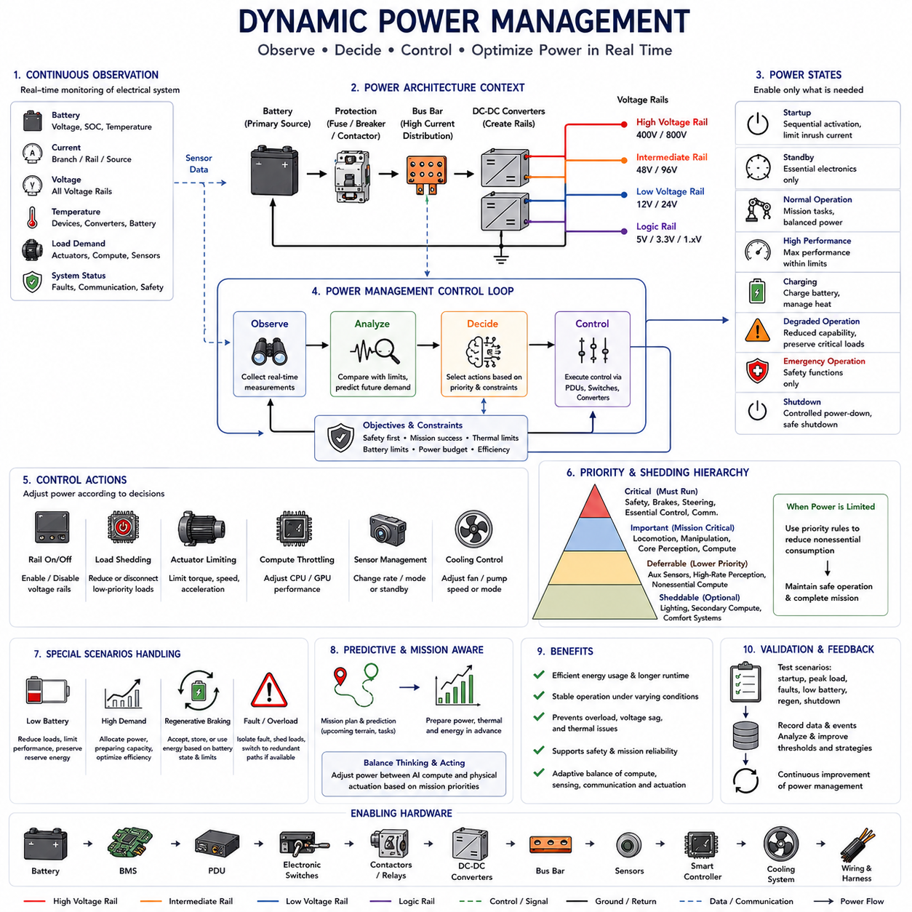

**Volume 01. Electrical Architecture Fundamentals**

# Chapter 06. Power Distribution Architecture

## 06.01. Power Distribution Topology

{width="7.268055555555556in" height="7.268055555555556in"}

전력 분배 토폴로지(Power Distribution Topology)는 로봇, 차량 또는 피지컬 AI 시스템(Physical AI System)의 주 에너지원(Primary Energy Source)에서 모든 전기·전자 부하(Electrical and Electronic Load)까지 전기 에너지가 전달되는 방식을 정의한다. 토폴로지는 전류 경로(Current Path), 사용 가능한 전압(Voltage Availability), 보호 경계(Protection Boundary), 절연 동작(Isolation Behavior), 개별 고장의 영향을 결정한다. 따라서 전체 전기 아키텍처(Electrical Architecture)를 구성하는 구조적 기반이 된다.

일반적인 아키텍처는 배터리 팩(Battery Pack), 외부 직류 전원(External DC Supply), 발전기(Generator), 하이브리드 에너지 시스템(Hybrid Energy System)과 같은 주 전원(Primary Source)에서 시작한다. 전력은 하위 전력 분배망(Downstream Distribution Network)에 공급되기 전에 주 보호 및 스위칭 단계(Main Protection and Switching Stage)를 통과한다. 비정상 전류나 시스템 고장이 확산되기 전에 차단할 수 있도록 접촉기(Contactor), 회로 차단기(Circuit Breaker), 퓨즈(Fuse), 프리차지 회로(Pre-charge Circuit), 차단 장치(Disconnect Device)를 전원 가까이에 배치할 수 있다.

가장 단순한 토폴로지는 중앙집중형 전력 분배(Centralized Power Distribution)로, 대부분의 전기 부하가 중앙 전력 분배 장치(Power Distribution Unit, PDU)로부터 전력을 공급받는다. PDU는 스위칭 및 보호 장치를 포함하며 컨트롤러(Controller), 센서(Sensor), 액추에이터(Actuator), 통신 장치(Communication Device), 보조 장비(Auxiliary Equipment)에 개별 분기 전원을 제공한다. 중앙집중화는 모니터링과 보호 협조(Protection Coordination)를 단순화하지만 긴 케이블로 인해 와이어 하네스(Wire Harness) 중량과 전압 강하(Voltage Drop)가 증가할 수 있다.

분산형 전력 아키텍처(Distributed Power Architecture)는 부하 그룹 가까이에 소형 전력 분배 장치를 배치한다. 예를 들어 모바일 로봇(Mobile Robot)은 전방 센서 어셈블리(Front Sensor Assembly), 컴퓨팅 시스템(Computing System), 구동 모듈(Drive Module), 매니퓰레이터(Manipulator), 보조 장비별로 별도의 분배 노드를 사용할 수 있다. 로컬 전력 분배(Local Distribution)는 긴 고전류 분기 회로를 줄이고 모듈식 조립을 단순화할 수 있지만 추가적인 전자장치, 커넥터(Connector), 통신 인터페이스(Communication Interface), 진단 기능(Diagnostic Function)이 필요하다.

계층형 토폴로지(Hierarchical Topology)는 중앙집중형과 분산형 개념을 결합한다. 주 배터리 전력(Main Battery Power)은 먼저 주 PDU(Primary PDU)로 전달되고, 여기에서 여러 개의 보조 전력 분배 장치(Secondary Distribution Unit)에 전력을 공급한다. 각 보조 장치는 다시 로컬 부하(Local Load)에 전력을 공급한다. 이를 통해 명확한 전기 도메인(Electrical Domain)을 구성하고, 모듈성과 정비성(Serviceability)을 유지하면서 배터리부터 중간 분기 회로와 개별 장치까지 단계적인 보호 협조가 가능하다.

방사형 전력 분배(Radial Distribution)는 각각의 주요 분기 회로를 중앙 분배 지점(Central Distribution Point)에 독립적으로 연결한다. 따라서 하나의 분기에서 고장이 발생하더라도 다른 분기에는 직접적인 영향을 주지 않고 해당 고장을 격리할 수 있다. 이러한 구조는 고장 격리(Fault Containment)가 중요한 시스템에서 유용하다. 그러나 각각의 독립 분기에 전용 도체(Conductor)와 보호 장치가 필요하기 때문에 부하 수가 증가하면 배선 복잡성, 커넥터 수, 패키징 요구사항(Packaging Requirement)이 증가할 수 있다.

버스 기반 전력 분배(Bus-based Distribution)는 여러 부하 또는 로컬 전력 분배 노드가 하나의 공통 전력 경로(Common Electrical Path)에서 전력을 공급받는 방식이다. 특히 버스바(Bus Bar)는 낮은 저항과 작은 패키징 공간으로 대전류를 전달하는 데 적합하다. 배터리, 접촉기, 컨버터(Converter), 모터 드라이브(Motor Drive), 고전력 컴퓨팅 시스템(High-power Computing System)을 연결하는 데 사용할 수 있다. 세부적인 버스바 형상과 구현 방법은 이후의 버스바 아키텍처(Bus Bar Architecture)에서 다룬다.

현대 로봇은 추진 시스템(Propulsion System), 액추에이터, 컴퓨팅 플랫폼(Computing Platform), 센서, 제어 전자장치(Control Electronics)의 전기적 요구사항이 서로 다르기 때문에 여러 전압 도메인(Voltage Domain)을 필요로 한다. 고에너지 배터리 레일(High-energy Battery Rail)은 트랙션 인버터(Traction Inverter)나 서보 드라이브(Servo Drive)에 직접 전력을 공급할 수 있으며, DC-DC 컨버터(DC-DC Converter)는 중간 및 저전압 레일(Low-voltage Rail)을 생성하여 컴퓨터, ECU, 통신 장비, 카메라, 라이다(LiDAR), 안전 컨트롤러(Safety Controller), 보조 전자장치에 전력을 공급한다.

DC-DC 컨버터의 배치 위치는 전력 토폴로지에 큰 영향을 준다. 중앙집중형 컨버터(Centralized Converter)는 전체 플랫폼을 위한 하나의 저전압 레일을 생성할 수 있으며, 분산형 컨버터(Distributed Converter)는 개별 부하 그룹 가까이에서 필요한 전압을 생성할 수 있다. 중앙집중형 변환은 컨버터 수를 줄일 수 있지만, 분산형 변환은 긴 하네스를 흐르는 저전압 대전류를 줄이고 모듈성을 향상시킬 수 있다. 따라서 변환 효율(Conversion Efficiency), 열 특성(Thermal Behavior), 고장 격리, 비용을 함께 평가해야 한다.

전력 토폴로지는 연속 부하(Continuous Load)와 과도 부하(Transient Load), 그리고 높은 동적 특성을 갖는 부하(Dynamic Load)를 구분하여 설계해야 한다. 센서와 컨트롤러의 소비 전력은 비교적 안정적이지만 모터, 서보 앰프(Servo Amplifier), 펌프, 컴퓨팅 가속기(Compute Accelerator), 통신 장비는 급격한 전력 수요 변화를 발생시킬 수 있다. 이러한 부하가 적절하지 않은 전력 경로를 공유하면 과도 전류(Transient Current)로 인해 전압 강하, 전도성 노이즈(Conducted Noise), 비정상적인 시스템 리셋 또는 센서 성능 저하가 발생할 수 있다.

보호 토폴로지(Protection Topology)는 물리적인 전력 분배 구조를 따라 구성되어야 한다. 주 보호 장치(Main Protection)는 에너지원 가까이에서 발생하는 고장을 제한하고, 분기 보호 장치(Branch Protection)는 전력 분배 구간을 격리하며, 로컬 보호 장치(Local Protection)는 개별 부하 또는 모듈을 보호한다. 따라서 퓨즈와 회로 차단기의 정격은 도체 허용 전류(Conductor Capacity), 정상 동작 전류, 돌입 전류(Inrush Current), 단락 조건(Short-circuit Condition), 하위 보호 장치와 협조하여 결정해야 한다.

접지 및 귀환 전류 토폴로지(Ground and Return-current Topology)도 중요하다. 전력 시스템은 전원 공급 경로뿐만 아니라 전류가 돌아오는 귀환 경로(Return Path)를 필요로 하기 때문이다. 모터의 대전류 귀환, 스위칭 컨버터 전류, 민감한 센서 기준 전위(Sensor Reference), 디지털 전자장치(Digital Electronics)는 공통 임피던스(Shared Impedance)를 고려하지 않고 연결해서는 안 된다. 부적절한 귀환 경로 설계는 부하 전류 변화를 기준 전압 변동으로 변환하여 통신 오류, 센서 노이즈, 측정 불안정, 전자기 적합성(Electromagnetic Compatibility, EMC) 문제를 발생시킬 수 있다.

전력 분배는 시스템의 동작 상태(Operating State)도 정의한다. 시스템에는 상시 전원(Always-on Power), 스위칭 전원(Switched Power), 웨이크업 전원(Wake-up Power), 안전 전원(Safety Power), 액추에이터 전원(Actuator Power), 컴퓨팅 전원(Compute Power), 서비스 전원(Service Power)이 존재할 수 있다. 이러한 도메인을 분리하면 일부 하위 시스템만 활성화하고 나머지는 차단할 수 있어 전체 플랫폼을 항상 활성 상태로 유지하지 않고도 시동 순서, 제어된 종료, 충전, 유지보수, 비상 운전, 저전력 대기, 에너지 관리가 가능하다.

대용량 커패시터 부하(Large Capacitive Load)가 존재하는 시스템에서는 시동 순서(Startup Sequencing)가 특히 중요하다. 모터 드라이브, 인버터, 고성능 컴퓨터(High-performance Computer), DC 링크 커패시터(DC-link Capacitor)는 전원에 직접 연결될 경우 큰 돌입 전류를 발생시킬 수 있다. 프리차지 회로, 단계적인 접촉기 동작, 제어된 컨버터 활성화 신호(Enable Signal), 순차적인 분기 활성화를 사용하면 이러한 과도 현상을 제한하고 퓨즈의 불필요한 동작, 커넥터 스트레스, 배터리 전압 붕괴, 시스템 리셋을 방지할 수 있다.

로봇 시스템에서는 기계적 모듈성(Mechanical Modularity)이 전기 토폴로지에도 반영되어야 한다. 모바일 베이스(Mobile Base), 매니퓰레이터, 인지 센서 마스트(Perception Mast), 배터리 모듈(Battery Module), 컴퓨팅 인클로저(Compute Enclosure), 엔드 이펙터(End Effector)를 각각 명확한 전력 인터페이스(Power Interface)를 가진 전기적 하위 시스템으로 구성할 수 있다. 이러한 분할은 전체 전력 분배망을 다시 설계하지 않고도 개별 모듈을 변경할 수 있어 제조, 교체, 진단, 향후 업그레이드를 용이하게 한다.

피지컬 AI 플랫폼(Physical AI Platform)은 컴퓨팅 전력이 주요 동적 전기 부하가 될 수 있기 때문에 추가적인 설계 과제를 갖는다. GPU, AI 가속기(AI Accelerator), 엣지 컴퓨터(Edge Computer), 카메라, 라이다, 네트워크 장치(Networking Device), 냉각 시스템(Cooling System)이 상당한 전력을 소비하는 동시에 모터에서도 큰 과도 전력 수요가 발생할 수 있다. 전력 분배 토폴로지는 공유 에너지원의 효율적인 사용을 유지하면서 추진 시스템의 전력 변동이 인지(Perception)와 AI 연산을 저해하지 않도록 설계되어야 한다.

안전 관련 부하(Safety-related Load)는 특별하게 고려해야 한다. 비상 정지 회로(Emergency-stop Circuit), 안전 컨트롤러, 제동 장치(Braking Device), 조향 기능(Steering Function), 절연 감시(Isolation Monitoring), 필수 센싱(Essential Sensing)은 비필수 부하가 차단된 이후에도 전력을 공급받아야 할 수 있다. 특히 안전 정지(Safe Stopping)를 수행하기 위해 일시적인 전기 에너지가 필요한 시스템에서는 전체 장비를 하나의 전기 부하로 취급하기보다 제어된 비활성화(Controlled De-energization)를 지원하도록 토폴로지를 구성해야 한다.

이중 전원(Dual Source), 독립 컨버터(Independent Converter), 분리된 전력 분배 경로(Separated Distribution Path), 중요 컨트롤러의 이중 전원 입력(Redundant Power Input)을 통해 전력 이중화(Power Redundancy)를 구현할 수 있다. 그러나 공통 원인 고장(Common-cause Failure)을 최소화하지 않으면 이중화의 효과가 제한된다. 명목상 두 개의 독립적인 분기가 동일한 상위 퓨즈, 커넥터, 컨버터, 버스바 또는 접지 연결을 공유한다면 두 경로가 동시에 고장 날 수 있다. 따라서 전력 토폴로지는 이후의 이중화 전략(Redundancy Strategy)을 구현하기 위한 물리적 경계를 정의한다.

진단 기능(Diagnostics)은 점차 전력 분배 아키텍처 자체의 일부가 되고 있다. 지능형 PDU(Intelligent PDU)와 전자식 스위칭 장치(Electronic Switching Device)는 전압, 전류, 온도, 과부하 상태(Overload Condition), 분기 상태(Branch Status)를 측정할 수 있다. 이를 통해 컨트롤러는 비정상적인 전력 소비, 부하 단선, 단락, 부품 열화(Component Degradation), 예상하지 못한 에너지 수요를 식별할 수 있다. 따라서 전력 분배 시스템은 단순한 수동 배선망이 아니라 관측 및 제어 가능한 하위 시스템(Observable and Controllable Subsystem)으로 발전할 수 있다.

잘 설계된 전력 분배 토폴로지는 전기적 효율(Electrical Efficiency), 안전성(Safety), 고장 격리, 중량, 패키징, 비용, 열 성능(Thermal Performance), 정비성, 확장성(Scalability) 사이의 균형을 확보해야 한다. 중앙집중형, 분산형, 방사형 또는 버스 기반 구조 가운데 하나의 방식이 모든 플랫폼에 최적인 것은 아니다. 실제 아키텍처에서는 전류 수준, 물리적 거리, 중요도(Criticality), 모듈 경계(Module Boundary), 예상 운전 조건에 따라 여러 토폴로지를 조합하는 경우가 일반적이다.

전력 분배 토폴로지는 궁극적으로 버스바 아키텍처(Bus Bar Architecture), 전압 레일 설계(Voltage Rail Design), 부하 분석(Load Analysis), 동적 전력 관리(Dynamic Power Management)가 구축되는 기본 프레임워크를 제공한다. 이러한 주제는 Chapter 06에서 구조적인 전력 분배부터 세부적인 전력 구현과 능동적 에너지 제어(Active Energy Control)로 이어지는 순서로 구성되어 있다. 따라서 견고한 전력 분배 토폴로지는 이후의 최적화, 보호, 지능형 전력 관리(Intelligent Power Management)를 가능하게 하는 핵심 전기 경로를 확립한다.

## 06.02. Bus Bar Architecture

{width="7.268055555555556in" height="7.268055555555556in"}

버스바 아키텍처(Bus Bar Architecture)는 배터리(Battery), 보호 장치(Protection Device), 접촉기(Contactor), 컨버터(Converter), 모터 드라이브(Motor Drive), 전력 분배 장치(Power Distribution Unit, PDU), 기타 주요 부하 사이에서 대전류를 체계적으로 분배하는 방법을 제공한다. 모든 전류를 기존 전선을 통해 전달하는 대신, 버스바(Bus Bar)는 낮은 저항과 기계적 안정성, 높은 공간 효율성을 갖는 강성 또는 반강성 도전 부품을 사용하여 전력 분배 시스템 내부에 전기적 경로를 형성한다.

버스바는 일반적으로 구리(Copper) 또는 알루미늄(Aluminum)으로 제작된다. 두 재료 모두 전기 전도도(Electrical Conductivity), 기계적 강도(Mechanical Strength), 중량, 제조성(Manufacturability), 비용 측면에서 장점을 제공한다. 구리는 높은 전도도를 통해 작은 도체 크기로 설계할 수 있으며, 알루미늄은 시스템 중량을 크게 줄일 수 있다. 따라서 재료 선택은 전류 수준, 패키징 공간, 열 한계(Thermal Limit), 기계적 요구사항, 시스템 중량 목표를 종합적으로 고려하여 결정한다.

버스바의 전기적 특성은 기본적으로 저항(Resistance), 전류 밀도(Current Density), 형상(Geometry), 접속 인터페이스(Connection Interface)에 의해 결정된다. 수백 암페어의 전류가 흐르는 경우 매우 작은 저항도 중요해지는데, 전력 손실이 전류의 제곱에 비례하여 증가하기 때문이다. 과도한 저항은 열을 발생시키고 시스템 효율을 감소시키며 전압 강하(Voltage Drop)를 증가시키고 단자, 절연체, 주변 전자 부품의 열화를 가속할 수 있다.

버스바의 단면적(Cross-sectional Area)은 연속 전류(Continuous Current), 피크 전류(Peak Current), 허용 온도 상승(Allowable Temperature Rise), 주변 온도(Ambient Temperature), 냉각 조건(Cooling Condition), 예상 동작 시간을 고려하여 선정해야 한다. 짧은 모터 가속 구간의 전류를 견딜 수 있는 도체라도 동일한 전류를 연속적으로 안전하게 전달하지 못할 수 있다. 따라서 버스바 크기는 최대 순간 전류만이 아니라 정상 상태 부하(Steady-state Loading)와 과도 부하(Transient Loading)를 구분하여 결정해야 한다.

버스바의 형상은 기존의 원형 전선에 비해 중요한 설계상의 장점을 제공한다. 버스바는 평판 스트립(Flat Strip), 플레이트(Plate), 적층 구조(Laminated Structure), 또는 사용 가능한 기계적 공간에 맞춘 사용자 정의 3차원 형상(Custom Three-dimensional Shape)으로 제작할 수 있다. 폭이 넓고 얇은 도체는 큰 도전 면적을 확보하면서도 기존 케이블 배선보다 작은 공간으로 배터리 팩, PDU, 인버터 어셈블리(Inverter Assembly), 로봇 전력 모듈(Robotic Power Module)에 배치할 수 있다.

중앙집중형 버스바(Centralized Bus Bar)는 주 전력 분배 장치(Primary Power Distribution Unit)의 전기적 백본(Electrical Backbone)을 구성할 수 있다. 배터리 전력은 퓨즈(Fuse), 회로 차단기(Circuit Breaker), 접촉기 또는 차단 장치(Disconnect Device)를 거쳐 주 버스(Main Bus)로 입력된 후 보호된 여러 분기 회로로 나누어진다. 이러한 분기들은 시스템 수준에서 정의된 전력 분배 토폴로지(Power Distribution Topology)에 따라 트랙션 드라이브(Traction Drive), 서보 앰프(Servo Amplifier), DC-DC 컨버터(DC-DC Converter), 컴퓨팅 시스템, 충전 회로, 안전 시스템, 보조 PDU에 전력을 공급할 수 있다.

모든 공급 전류에는 대응하는 귀환 경로(Return Path)가 필요하기 때문에 양극 및 음극 버스바(Positive and Negative Bus Bar)는 함께 고려해야 한다. 두 버스바의 물리적 배치 관계는 저항, 인덕턴스(Inductance), 전자기 방출(Electromagnetic Emission), 과도 응답(Transient Behavior)에 영향을 준다. 전원 공급 도체와 귀환 도체를 서로 가깝게 배치하면 전류 루프 면적(Current Loop Area)과 관련 자기장을 감소시킬 수 있으며, 이는 인버터와 모터 드라이브 같은 대전류 스위칭 장치가 높은 스위칭 주파수로 동작할 때 더욱 중요하다.

적층 버스바(Laminated Bus Bar)는 여러 개의 도전층(Conductive Layer)을 서로 가깝게 배치하고 그 사이를 유전체 절연체(Dielectric Insulation)로 분리한다. 양극, 음극, 그리고 경우에 따라 추가적인 전압 또는 신호 관련 층을 하나의 소형 어셈블리에 통합할 수 있다. 전류 경로 사이의 간격이 감소하면 기생 인덕턴스(Parasitic Inductance)를 낮추고 고주파 전기 특성을 향상시킬 수 있으므로, 적층 구조는 특히 인버터, DC 링크(DC Link), 컨버터, 고전력 스위칭 전자장치 주변에 적합하다.

접속 인터페이스는 버스바 자체의 저항보다 더 중요한 요소가 되는 경우가 많다. 볼트 체결부(Bolted Joint), 스터드(Stud), 단자(Terminal), 용접 접속부(Welded Connection), 압입 구조(Press-fit Structure), 커넥터 인터페이스(Connector Interface)는 접촉 저항(Contact Resistance)을 발생시키며, 체결력 부족, 오염, 산화, 표면 변형 또는 열 사이클링(Thermal Cycling)으로 인해 저항이 증가할 수 있다. 따라서 주 도체의 크기가 충분하더라도 국부적으로 열화된 접속부가 열적 핫스팟(Thermal Hotspot)이 될 수 있다.

기계 설계(Mechanical Design)에서는 진동(Vibration), 충격(Shock), 열팽창(Thermal Expansion), 제조 공차(Manufacturing Tolerance), 조립 하중(Assembly Force)을 고려해야 한다. 서로 다른 열팽창이나 기계적 움직임을 갖는 부품을 강성 도체로 직접 연결하면 단자와 전자 어셈블리에 불필요한 응력이 전달될 수 있다. 상대적인 움직임을 수용해야 하는 위치에는 전기적 성능을 저하시키지 않으면서 플렉시블 버스바(Flexible Bus Bar), 편조 도체(Braided Conductor), 유연 구조(Compliant Section), 적절한 기계적 지지 구조를 적용할 수 있다.

열 관리(Thermal Management)는 전기 설계와 밀접하게 연결된다. 도체 저항과 특히 높은 저항을 갖는 접속 인터페이스에서 열이 발생하며, 주변 부품에서 버스 구조로 열이 전달될 수도 있다. 따라서 설계자는 도체 재료의 명목 전류 정격(Current Rating)만 고려하는 것이 아니라 장착 구조물로 전달되는 열전도(Heat Conduction), 자연 또는 강제 대류(Convection), 인클로저 온도(Enclosure Temperature), 주변 열원, 국부적인 접촉부 발열을 함께 평가해야 한다.

버스바는 특히 높은 직류 전압을 사용하는 아키텍처에서 전기적 공간 거리(Clearance)와 연면 거리(Creepage) 요구사항을 충족해야 한다. 도전 표면은 다른 전위, 섀시 구조, 사용자가 접촉할 수 있는 부품과 충분한 물리적 거리를 확보해야 한다. 절연 코팅(Insulation Coating), 몰딩 배리어(Molded Barrier), 절연 지지대(Insulating Support), 보호 커버, 적층 유전체층(Laminated Dielectric Layer)을 사용하면 예상 운전 환경에서 필요한 전기적 절연 거리를 유지하면서 의도하지 않은 접촉을 방지할 수 있다.

보호 장치는 주요 버스 구간에서 발생한 고장을 도체나 연결 장비가 손상되기 전에 차단할 수 있도록 배치해야 한다. 주 퓨즈(Main Fuse)는 전원 측 버스(Source-side Bus)를 보호하고, 분기 퓨즈(Branch Fuse) 또는 전자식 보호 장치(Electronic Protection Device)는 개별 출력 회로를 보호할 수 있다. 특히 에너지원과 보호 장치 사이의 보호되지 않은 도체 구간은 심각한 단락 에너지(Short-circuit Energy)에 노출될 수 있으므로 보호 장치의 물리적인 위치가 중요하다.

접촉기와 같은 대전류 스위칭 부품(High-current Switching Component)은 버스바 구조에 직접 통합되는 경우가 많다. 이를 통해 배터리, 보호 장치, 프리차지 회로(Pre-charge Circuit), 하위 전력 분배망 사이의 케이블 길이와 개별 접속 인터페이스의 수를 줄일 수 있다. 이러한 통합은 저항과 패키징 공간을 감소시킬 수 있지만 열 경로(Thermal Path), 절연 거리, 정비 접근성(Service Access), 고장 격리(Fault Containment)를 함께 고려해야 한다.

버스바가 배터리와 대용량 DC 링크 커패시터(DC-link Capacitor)를 포함한 부하를 연결하는 경우 프리차지 아키텍처(Pre-charge Architecture)가 특히 중요하다. 배터리를 직접 연결하면 매우 큰 돌입 전류(Inrush Current)가 발생할 수 있다. 프리차지 저항(Pre-charge Resistor)과 제어된 스위칭 경로를 이용하여 주 접촉기가 닫히기 전에 하위 회로의 전압을 점진적으로 상승시킨다. 따라서 버스 구조는 정상적인 대전류 경로와 일시적인 프리차지 경로를 모두 지원하면서 위험한 우회 경로가 형성되지 않도록 해야 한다.

전류 측정(Current Measurement)은 션트 저항(Shunt Resistor), 홀 효과 센서(Hall-effect Sensor), 자기 센서(Magnetic Sensor), 전용 전류 센싱 모듈(Current-sensing Module)을 이용하여 버스바에 통합할 수 있다. 주 전력 분배 지점 근처에서 전류를 측정하면 전체 전력 소비량을 추정하고 비정상 부하를 탐지하며 배터리 관리(Battery Management)와 전력 상태 감시를 지원할 수 있다. 추가적인 분기 전류 측정은 진단, 예지 정비(Predictive Maintenance), 지능형 전력 관리(Intelligent Power Management)를 위한 보다 세부적인 정보를 제공한다.

전압 및 온도 센싱(Voltage and Temperature Sensing)을 추가하면 수동적인 버스 구조를 관측 가능한 전기 아키텍처의 일부로 발전시킬 수 있다. 주요 단자, 접촉기, 퓨즈 또는 대전류 접속부 주변에 센서를 배치하면 비정상적인 전압 강하나 온도 상승을 감지할 수 있다. 이를 통해 접속부의 저항 증가를 심각한 고장이 발생하기 전에 식별하고 상위 컨트롤러(Supervisory Controller)가 부하를 감소시키거나 분기 회로를 격리하거나 유지보수 경고를 발생시킬 수 있다.

로봇 플랫폼(Robotic Platform)은 배터리, 구동, 컴퓨팅, 인지(Perception), 보조 모듈이 서로 다른 전류 수준을 요구하기 때문에 모듈형 버스바 아키텍처(Modular Bus Bar Architecture)의 장점을 활용할 수 있다. 주 대전류 버스(Main High-current Bus)는 추진 및 액추에이터 시스템에 전력을 공급하고, 별도의 분기 회로는 컨트롤러, 센서, 네트워크 장비, AI 컴퓨터용 저전압 레일을 생성하는 DC-DC 컨버터에 전력을 공급할 수 있다. 이를 통해 대용량 에너지 분배(Bulk Energy Distribution)에서 로컬 전압 변환(Localized Voltage Conversion)으로 이어지는 명확한 구조를 구성할 수 있다.

피지컬 AI 시스템(Physical AI System)은 고성능 컴퓨팅(High-performance Computing)과 전기기계식 액추에이션(Electromechanical Actuation)이 동시에 동작하기 때문에 버스 아키텍처에 추가적인 요구사항을 부여한다. GPU 기반 엣지 컴퓨터(Edge Computer)의 소비 전력은 빠르게 변화할 수 있으며, 동시에 모터와 서보 드라이브에서는 훨씬 큰 과도 전류가 발생할 수 있다. 저임피던스 전력 분배(Low-impedance Distribution)와 민감한 컴퓨팅 분기를 노이즈가 큰 액추에이터 분기로부터 적절히 분리하면 인지, 통신, AI 연산을 위한 안정적인 전압을 유지하는 데 도움이 된다.

고장 격리는 버스 시스템의 물리적 분할(Physical Segmentation)에 반영되어야 한다. 하나의 연속적인 도체 네트워크를 구성하기보다는 보호 및 스위칭 장치에 의해 구분되는 전기적 영역(Electrical Zone)을 구성할 수 있다. 액추에이터 분기, 컨버터, 컴퓨팅 모듈 또는 보조 시스템에서 고장이 발생하면 해당 영역을 격리하면서 필수적인 안전 또는 제어 기능에는 계속 전력을 공급할 수 있으며, 이를 위해서는 전체 아키텍처가 필요한 성능 저하 운전 상태(Degraded Operating State)를 지원해야 한다.

버스바는 배터리 팩, PDU, 인버터 인클로저(Inverter Enclosure), 또는 공간이 제한된 로봇 구조 내부에 위치하는 경우가 많으므로 정비성(Serviceability)을 고려해야 한다. 기술자는 통전 구간(Energized Section)을 식별하고 에너지원을 안전하게 격리하며, 관련 없는 회로를 분해하지 않고 체결부에 접근하거나 모듈을 교체할 수 있어야 한다. 보호 커버, 인터록(Interlock), 라벨링(Labeling), 접촉 보호(Touch Protection), 기계적 키 구조(Mechanically Keyed Interface)는 안전한 조립과 유지보수에 기여한다.

제조 품질(Manufacturing Quality)은 전기적 신뢰성(Electrical Reliability)에 직접적인 영향을 준다. 표면 처리(Surface Finish), 도금(Plating), 평탄도(Flatness), 홀 위치, 체결 토크(Joint Torque), 절연체 배치, 용접 품질(Welding Quality), 치수 공차(Dimensional Tolerance)는 접촉 저항과 기계적 건전성(Mechanical Integrity)에 영향을 줄 수 있다. 따라서 생산 검사에서는 기계적 특성과 전기적 성능을 모두 검증해야 하며, 특히 작은 제조 편차가 대전류 조건에서 큰 발열을 발생시킬 수 있는 접속부를 중요하게 관리해야 한다.

버스바 아키텍처는 궁극적으로 추상적인 전력 분배 토폴로지(Power Distribution Topology)를 실제 대전류 에너지 경로(High-current Energy Path)의 물리적 구현과 연결한다. 이를 통해 에너지원, 스위칭 장치, 보호 요소, 컨버터, 주요 부하 사이에서 에너지가 효율적이고 안전하게 이동하는 방식을 결정한다. Chapter 06에서 이러한 버스바 아키텍처는 이후의 세부적인 전압 레일 설계(Voltage Rail Design), 부하 분석 및 전력 예산(Load Analysis and Power Budget), 동적 전력 관리(Dynamic Power Management)를 정의하기 위한 물리적 전력 분배 기반을 제공한다.

## 06.03. Voltage Rail Design

{width="7.268055555555556in" height="7.268055555555556in"}

전압 레일 설계(Voltage Rail Design)는 전력 분배 아키텍처(Power Distribution Architecture) 내부에서 서로 다른 전압 수준이 어떻게 생성되고, 분배되고, 보호되고, 모니터링되며, 각각의 전기 부하에 할당되는지를 정의한다. 전체 전력 토폴로지(Power Topology)와 대전류 버스 구조(High-current Bus Structure)가 확립된 이후, 전압 레일은 주 에너지원(Primary Energy Source)을 모터, 컨트롤러, 센서, 통신 장치, 안전 시스템, 컴퓨팅 플랫폼에 적합한 전기적 도메인(Electrical Domain)으로 변환한다.

전압 레일(Voltage Rail)은 호환 가능한 전압 특성을 요구하는 하나 이상의 부하가 공유하는 제어된 전원 공급 경로를 의미한다. 로봇에는 추진 시스템을 위한 고에너지 배터리 레일(High-energy Battery Rail), 액추에이터와 산업용 장비를 위한 중간 전압 레일(Intermediate Rail), 컨트롤러와 보조 장비를 위한 저전압 레일(Low-voltage Rail), 프로세서와 센서를 위한 더 낮은 로직 레일(Logic Rail)이 존재할 수 있다. 각각의 레일은 고유한 성능 및 보호 요구사항을 가진 독립적인 전기적 도메인이 된다.

주 배터리 전압(Primary Battery Voltage)은 일반적으로 시스템에서 사용할 수 있는 가장 높은 에너지 수준의 전압 레일을 형성한다. 플랫폼에 따라 이 레일은 모터 인버터(Motor Inverter), 서보 드라이브(Servo Drive), 트랙션 시스템(Traction System), 고전력 DC-DC 컨버터(High-power DC-DC Converter), 기타 주요 부하에 직접 전력을 공급할 수 있다. 배터리 전압은 충전 상태(State of Charge), 온도, 전류 수요, 배터리 화학 특성에 따라 변화하므로 연결 장치는 공칭 전압뿐만 아니라 예상되는 전체 동작 전압 범위를 견딜 수 있어야 한다.

DC-DC 컨버터(DC-DC Converter)는 주 전원으로부터 보조 전압 레일(Secondary Voltage Rail)을 생성한다. 강압 컨버터(Step-down Converter)는 높은 배터리 전압을 중간 또는 저전압 수준으로 낮추며, 절연형 컨버터(Isolated Converter)는 서로 다른 전기적 도메인 사이에 갈바닉 절연(Galvanic Isolation)을 추가로 제공할 수 있다. 특수한 아키텍처에서는 양방향 컨버터(Bidirectional Converter)를 사용하여 에너지를 양방향으로 전달함으로써 회생 에너지(Regenerative Energy), 보조 에너지 저장 장치, 서로 다른 전력 도메인 사이의 제어된 에너지 교환을 지원할 수 있다.

전압 레일의 선정에서는 개별 부품이 요구하는 공칭 전압(Nominal Voltage) 이상의 요소를 고려해야 한다. 전류 요구량, 케이블 길이, 도체 크기, 변환 효율(Conversion Efficiency), 커넥터 용량, 전기적 노이즈(Electrical Noise), 안전 등급(Safety Classification), 부품 가용성, 향후 확장성(Scalability)이 적절한 전압을 결정하는 데 영향을 준다. 동일한 전력을 전달할 경우 분배 전압을 높이면 전류가 감소하므로 도체 단면적, 저항 손실(Resistive Loss), 전압 강하(Voltage Drop), 하네스 중량을 줄일 수 있다.

이러한 관계는 특히 고출력 로봇 액추에이터(High-power Robotic Actuator)에서 중요하다. 수 킬로와트의 전력을 낮은 전압 레일을 통해 공급하면 매우 큰 전류와 굵은 케이블, 대형 커넥터, 높은 용량의 보호 장치가 필요할 수 있다. 액추에이터 전력을 더 높은 전압으로 이동시키면 이러한 요구사항을 줄일 수 있지만, 동시에 절연(Insulation), 전기적 격리(Isolation), 공간 거리(Clearance), 연면 거리(Creepage), 스위칭, 정비, 작업자 보호(Personnel Protection)에 대한 요구사항은 증가한다.

중간 전압 레일(Intermediate Voltage Rail)은 고에너지 추진 버스(High-energy Propulsion Bus)와 민감한 저전압 전자장치 사이에서 실용적인 절충점을 제공한다. 예를 들어 48 V급 아키텍처(48 V-class Architecture)는 기존의 더 낮은 전압 분배 방식보다 전류를 감소시키면서 모터, 펌프, 액추에이터, 열 관리 시스템(Thermal System), 기타 중간 출력 장비를 지원할 수 있다. 그러나 정확한 레일 전압은 관습적인 전압 분류만을 기준으로 선택하기보다 시스템 요구사항에 따라 결정해야 한다.

저전압 레일(Low-voltage Rail)은 일반적으로 ECU, 통신 장치, 릴레이(Relay), 센서, 조명, 안전 전자장치(Safety Electronics), 보조 장비에 전력을 공급한다. 플랫폼에 따라 12 V 또는 24 V 도메인이 포함될 수 있다. 산업용 로봇은 제어 장비에 24 V를 사용하는 경우가 많으며, 다른 로봇이나 차량 아키텍처에서는 부품 가용성, 기존 인터페이스(Legacy Interface), 기존 전기 생태계와의 호환성을 위해 12 V 호환 장치를 유지할 수 있다.

전자 컴퓨팅 시스템(Electronic Computing System)은 추가적인 정전압 레일(Regulated Rail)을 필요로 한다. 엣지 컴퓨터(Edge Computer), GPU, 네트워크 스위치(Network Switch), 카메라, 라이다(LiDAR), 임베디드 컨트롤러(Embedded Controller)는 중간 전압을 공급받은 후 로컬 부하점 변환(Point-of-load Conversion)을 통해 더 낮은 내부 전압을 생성할 수 있다. 프로세서 코어, 메모리, 인터페이스, 디지털 로직(Digital Logic)은 플랫폼 수준의 전압 레일보다 훨씬 낮은 전압에서 동작할 수 있으므로 전압 변환은 배터리 에너지에서 반도체 수준 전력까지 이어지는 계층적 과정이 된다.

중앙집중형 전압 변환(Centralized Conversion)은 소수의 대용량 컨버터를 사용하여 플랫폼 전체에 분배되는 전압 레일을 생성한다. 이 방식은 컨버터 관리를 단순화하고 부품 수를 줄일 수 있지만, 긴 저전압 분배 경로에 큰 전류가 흐를 수 있다. 반면 분산형 전압 변환(Distributed Conversion)은 더 높은 전압을 부하 가까이까지 전달한 후 로컬에서 변환함으로써 하네스 손실을 줄일 수 있지만 컨버터와 관련 제어 인터페이스의 수는 증가한다.

전압 조정 품질(Voltage Regulation Quality)은 민감한 전자 부하에서 매우 중요하다. 공칭 전압 레일은 시동, 종료, 모터 가속, 회생 동작(Regenerative Event), 부하 스위칭, 배터리 전압 변화, 컨버터 과도 상태(Converter Transient)가 발생하는 동안에도 연결된 장치의 동작 한계 내에 유지되어야 한다. 따라서 정상 상태 허용 오차(Steady-state Tolerance)뿐만 아니라 리플(Ripple), 오버슈트(Overshoot), 언더슈트(Undershoot), 과도 응답(Transient Response), 시동 램프 특성(Startup Ramp Behavior), 단시간 전압 교란을 함께 평가해야 한다.

동적 부하(Dynamic Load)는 서로 다른 전압 레일 사이에 상당한 상호작용을 발생시킬 수 있다. 모터 드라이브는 가속 과정에서 갑작스럽게 큰 전류를 요구할 수 있으며, GPU 역시 연산 부하에 따라 소비 전력을 빠르게 변화시킬 수 있다. 두 부하가 충분히 분리되지 않았거나 전압 조정이 불안정한 전력 경로를 공유하면 발생한 전압 교란이 센서, 통신 인터페이스, 컨트롤러, 컴퓨팅 시스템에 영향을 줄 수 있다. 따라서 레일 분할(Rail Partitioning)은 시스템 안정성에 직접적으로 기여한다.

필요한 경우 민감한 부하(Sensitive Load)와 노이즈가 큰 부하(Noisy Load)를 분리해야 한다. 모터 드라이브, 스위칭 컨버터, 펌프, 솔레노이드(Solenoid), 대전류 액추에이터는 공급 레일에 전도성 노이즈(Conducted Disturbance)를 주입할 수 있으며, 카메라, IMU, 통신 트랜시버(Communication Transceiver), 아날로그 센서, 컴퓨팅 시스템은 보다 깨끗한 전원 조건을 요구할 수 있다. 전용 분기, 필터(Filter), 로컬 레귤레이터(Local Regulator), 접지 전략(Grounding Strategy), 제어된 귀환 경로(Return Path)를 사용하여 이러한 도메인 사이의 결합을 줄일 수 있다.

레일 시퀀싱(Rail Sequencing)은 각 전기적 도메인이 활성화되는 순서를 결정한다. 상시 전원 레일(Always-on Rail)이 먼저 배터리 관리 시스템(Battery Management System), 웨이크업 컨트롤러(Wake-up Controller), 상위 관리 전자장치(Supervisory Electronics)에 전력을 공급할 수 있다. 이후 제어 및 통신 레일이 초기화되고, 그 다음 컴퓨팅 시스템과 액추에이터 전력이 활성화될 수 있다. 이러한 순서를 통해 고출력 부하에 전력을 공급하기 전에 시스템 상태 확인, 통신 설정, 진단 수행, 안전 상태 확인이 가능하다.

종료 시퀀싱(Shutdown Sequencing) 역시 중요하다. 모든 전압 레일을 동시에 차단하면 컨트롤러가 진단 정보를 기록하거나 액추에이터를 안전 상태로 이동시키거나 데이터 저장을 완료하지 못할 수 있다. 제어된 아키텍처에서는 먼저 액추에이터 전원을 제거하면서 안전, 제어, 컴퓨팅 레일을 일정 시간 유지할 수 있다. 이후 필수 전자장치가 제어된 종료 절차(Controlled Shutdown Procedure)를 수행한 후 나머지 레일을 차단하거나 저전력 운전 상태로 전환할 수 있다.

안전 전원(Safety Power)은 편의성이 아니라 기능적 요구사항(Functional Requirement)에 따라 설계해야 한다. 비상 정지 감시(Emergency-stop Monitoring), 안전 컨트롤러(Safety Controller), 제동 회로(Braking Circuit), 조향 기능(Steering Function), 절연 감시(Isolation Monitoring), 필수 센서는 일반적인 액추에이터 또는 컴퓨팅 레일이 차단된 이후에도 전력을 필요로 할 수 있다. 전용 안전 레일(Dedicated Safety Rail) 또는 보호된 안전 분기(Protected Safety Branch)는 장비를 정의된 안전 상태(Safe State)로 전환하는 데 필요한 전기적 기능을 유지할 수 있다.

보호 기능(Protection)은 각각의 전압 레일에 대해 별도로 협조되어야 한다. 전원 컨버터, 도체, 커넥터, 분배 분기, 연결 부하는 서로 다른 전류 한계와 고장 특성을 갖는다. 따라서 퓨즈(Fuse), 회로 차단기(Circuit Breaker), 전자식 스위치(Electronic Switch), 전류 제한(Current Limiting), 과전압 보호(Overvoltage Protection), 역극성 보호(Reverse-polarity Protection), 컨버터 차단 기능을 조합하여 하나의 전압 레일에서 발생한 고장이 상위 장치를 손상시키거나 다른 전기적 도메인으로 전파되는 것을 방지할 수 있다.

전기적 안전, 노이즈 제어, 측정 정확성, 고장 격리(Fault Containment)를 위해 일부 전압 레일 사이에는 갈바닉 절연(Galvanic Isolation)이 필요할 수 있다. 절연형 DC-DC 컨버터(Isolated DC-DC Converter)는 입력과 출력 도메인 사이에 직접적인 도전 연결 없이 전력을 전달한다. 의도된 절연이 예상하지 못한 전도 경로로 무효화되지 않도록 절연 경계(Isolation Boundary)를 통신 인터페이스, 접지, 차폐(Shielding), 섀시 연결, 진단 회로와 함께 설계해야 한다.

접지 및 귀환 아키텍처(Ground and Return Architecture)는 전압 레일과 함께 설계해야 한다. 여러 개의 양극 전원 레일이 존재한다고 해서 반드시 동일한 귀환 구조를 사용해야 하는 것은 아니며, 특히 대전류 액추에이터와 민감한 전자장치가 함께 존재할 때 더욱 그렇다. 공통 귀환 임피던스(Shared Return Impedance)는 전류 변화를 기준 전압 오차로 변환할 수 있다. 따라서 각 레일의 전류가 어디로 귀환하고, 접지가 어디에서 결합되며, 섀시와 보호 접지(Protective Earth)가 기능 접지(Functional Ground)와 어떻게 상호작용하는지를 이해해야 한다.

전압 센싱(Voltage Sensing)은 전압 레일의 상태를 직접 관측할 수 있도록 한다. 주 배터리 레일과 주요 보조 레일을 모니터링하면 상위 컨트롤러(Supervisory Controller)가 저전압(Undervoltage), 과전압(Overvoltage), 컨버터 고장, 비정상적인 전압 강하, 불안정한 동작을 감지할 수 있다. 전압 측정값을 전류 및 온도 정보와 결합하면 과도한 부하, 배선 열화, 접속 불량, 열 문제, 컨버터 관련 고장을 구분할 수 있다.

피지컬 AI 플랫폼(Physical AI Platform)에서는 컴퓨팅과 액추에이션(Actuation)이 서로 다른 동시에 발생하는 전력 프로파일(Power Profile)을 생성하기 때문에 전압 레일 설계가 더욱 중요해진다. AI 가속기(AI Accelerator)와 GPU는 인지(Perception) 및 추론(Inference)을 위해 안정적인 전원을 요구하는 반면, 추진 및 매니퓰레이션 시스템(Manipulation System)은 훨씬 큰 과도 전류를 발생시킬 수 있다. 컴퓨팅, 인지, 통신, 액추에이터, 안전 전력 도메인을 분리하면 기계 시스템의 전력 변화가 지능 스택(Intelligence Stack)을 방해하는 것을 줄일 수 있다.

전압 레일 아키텍처는 전력 상태 관리(Power-state Management)와 에너지 최적화(Energy Optimization)도 지원한다. 필요하지 않은 센서, 보조 컴퓨터, 통신 모듈, 냉각 장비 또는 액추에이터의 전원을 차단할 수 있다. 선택적 레일 제어(Selective Rail Control)를 통해 시스템은 운전(Operating), 대기(Standby), 충전(Charging), 서비스(Service), 비상(Emergency), 저전력(Low-power) 상태 사이를 전환하면서 각 상태에서 필요한 전기적 도메인만 유지할 수 있다.

이중화 시스템(Redundant System)은 중요 부하를 위해 독립적인 전압 생성 경로를 사용할 수 있다. 두 개의 DC-DC 컨버터가 분리된 레일 또는 다이오드 OR 구성(Diode-ORed Rail)에 전력을 공급하거나, 안전 컨트롤러가 독립적인 전원으로부터 전력을 공급받을 수 있다. 효과적인 이중화를 위해서는 단순히 출력만 복제하는 것이 아니라 공유되는 상위 부품, 공통 접지, 커넥터, 보호 장치, 열적 의존성(Thermal Dependency), 제어 로직을 함께 고려해야 한다.

모든 전압 변환 단계에서는 손실이 발생하기 때문에 열 설계(Thermal Design)는 전압 레일 설계와 함께 수행되어야 한다. 대전류 컨버터, 레귤레이터(Regulator), 보호 장치, 커넥터, 도체는 부하와 효율에 따라 열을 발생시킨다. 따라서 레일 아키텍처는 인클로저 냉각(Enclosure Cooling), 히트싱크 배치(Heat-sink Placement), 공기 흐름(Airflow), 부품 간격, 허용 연속 전력에 영향을 준다. 특히 배터리 기반 로봇에서는 전기적 손실이 직접적으로 운전 시간을 감소시키므로 변환 효율이 중요하다.

견고한 전압 레일 아키텍처(Voltage Rail Architecture)는 결과적으로 주 에너지원에서 모든 전기 부하까지 이어지는 제어된 전력 계층 구조를 형성한다. 배터리와 버스바 시스템(Bus-bar System)은 대용량 에너지(Bulk Energy)를 공급하고, 컨버터는 적절한 전압 도메인을 생성하며, 보호 장치는 고장을 격리하고, 모니터링 기능은 각 레일의 상태를 감시한다. Chapter 06에서 이러한 전압 구조는 이후의 부하 분석 및 전력 예산(Load Analysis and Power Budget), 그리고 동적 전력 관리(Dynamic Power Management)를 수행하기 위한 기반을 제공한다.

## 06.04. Load Analysis and Budget

{width="7.268055555555556in" height="7.268055555555556in"}

부하 분석 및 전력 예산(Load Analysis and Power Budgeting)은 전기 아키텍처(Electrical Architecture)가 정상, 피크, 과도, 시동, 성능 저하, 비상 운전 조건에서 모든 하위 시스템에 안정적으로 전력을 공급할 수 있는지를 결정한다. 전력 분배 토폴로지(Power Distribution Topology), 버스바 아키텍처(Bus-bar Architecture), 전압 레일(Voltage Rail)이 정의된 이후, 부하 분석은 각 장치가 요구하는 전력과 이러한 요구량이 분기, 레일, 컨버터, 배터리 및 전체 시스템 수준에서 어떻게 결합되는지를 정량화한다.

분석은 전체 전기 부하 목록(Electrical Load Inventory)을 작성하는 것에서 시작한다. 모터, 서보 드라이브(Servo Drive), 컨트롤러, 센서, 카메라, 라이다(LiDAR), 통신 장치, 안전 장비, 펌프, 팬, 조명, 컴퓨터, GPU, AI 가속기(AI Accelerator), 보조 장비를 모두 식별해야 한다. 각 부하는 해당 전압 레일, 동작 전류, 피크 전류, 시동 특성, 듀티 사이클(Duty Cycle), 우선순위, 예상 운전 상태와 연계되어야 한다.

직류 부하(DC Load)의 전력은 기본적으로 P = V × I 관계를 통해 전압과 전류로 결정된다. 이러한 단순한 관계를 수많은 부하에 적용하면 시스템 수준의 중요한 엔지니어링 도구가 된다. 설계자는 개별 장치의 전력을 계산하고 각 전압 레일에 연결된 부하를 합산하며 컨버터 입력 요구량을 산출하여 최종적으로 배터리 또는 다른 주 에너지원(Primary Energy Source)에 요구되는 전체 전력을 결정할 수 있다.

정격 전력(Rated Power)을 반드시 연속 운전 전력(Continuous Operating Power)으로 해석해서는 안 된다. 모터는 가속이나 높은 부하 조건에서만 정격 또는 피크 출력을 사용할 수 있지만 냉각 팬, 펌프, 센서, 컴퓨터는 연속적으로 동작할 수 있다. AI 컴퓨터 역시 연산 부하에 따라 소비 전력이 크게 달라질 수 있다. 따라서 정확한 전력 예산을 위해서는 모든 부품의 최대 정격을 단순 합산하는 대신 실제적인 운전 프로파일(Operating Profile)을 사용해야 한다.

연속 부하(Continuous Load)는 열적 또는 전기적 한계를 초과하지 않으면서 장시간 공급해야 하는 전력을 의미한다. 이 값은 도체 크기, 버스바 온도, 컨버터 정격, 커넥터 용량, 냉각 요구사항, 배터리 방전 특성에 영향을 준다. 시스템의 연속 전력 예산은 냉각이나 액추에이터의 전력 요구를 증가시킬 수 있는 환경 조건까지 포함하여 실제로 지속될 가능성이 있는 운전 상태를 반영해야 한다.

피크 부하(Peak Load)는 운전 중 예상되는 가장 높은 단시간 전력 요구량을 의미한다. 모터의 동시 가속, 조향, 매니퓰레이션(Manipulation), 제동 제어, 냉각 시스템 활성화, 집중적인 AI 연산이 동시에 발생하면 평균 소비 전력보다 훨씬 높은 피크가 발생할 수 있다. 전기 아키텍처는 이러한 조건에서도 허용할 수 없는 전압 강하, 컨버터 차단, 퓨즈 동작, 통신 장애 또는 컴퓨팅 장비의 비정상적인 리셋 없이 동작할 수 있어야 한다.

과도 상태 분석(Transient Analysis)은 이보다 더 짧은 시간 동안 발생하는 전기적 현상을 다룬다. 모터 드라이브, 용량성 전자장치(Capacitive Electronics), DC 링크 회로(DC-link Circuit), 솔레노이드(Solenoid), 접촉기(Contactor), 대형 컴퓨터는 스위칭이나 시동 과정에서 빠른 전류 변화를 발생시킬 수 있다. 이러한 현상이 수 밀리초 또는 수 초에 불과하더라도 공유 전압 레일에 영향을 줄 수 있으며, 전원 임피던스, 버스 저항, 컨버터 응답, 커패시턴스, 보호 특성, 배선 인덕턴스가 결과적인 전압 거동에 영향을 준다.

시동 부하(Startup Load)는 많은 시스템이 정상 상태 조건에서 운전을 시작하지 않기 때문에 별도로 분석해야 한다. 컴퓨터는 내부 커패시터를 충전하고, 컨버터는 초기화되며, 펌프가 기동하고, 센서가 활성화되며, 액추에이터 드라이브가 통전된다. 이러한 부하를 동시에 활성화하면 누적 돌입 전류(Inrush Current)가 정상 운전 전류를 초과할 수 있다. 제어된 시퀀싱(Controlled Sequencing)과 프리차지(Pre-charge)를 이용하면 시동 부하를 시간적으로 분산하여 전기 시스템의 스트레스를 줄일 수 있다.

듀티 사이클(Duty Cycle)은 부하가 얼마나 자주 그리고 얼마나 오랫동안 동작하는지를 나타낸다. 몇 초 동안 100 A를 사용하는 모터는 100 A를 연속적으로 사용하는 장치와 동일한 열적 및 에너지 요구조건을 발생시키지 않는다. 따라서 미션 프로파일(Mission Profile)은 현실적인 평균 및 피크 소비량을 계산하기 위해 가속, 순항, 매니퓰레이션, 높은 인지 연산이 필요한 운전, 유휴 상태, 충전, 대기 및 기타 대표적인 상태를 구분해야 한다.

동시성(Coincidence) 역시 중요한 요소이다. 모든 부하가 동시에 최대 전력을 요구하는 것은 아니다. 모든 부품의 최대 정격을 단순 적용하면 불필요하게 큰 배터리 용량, 도체 중량, 컨버터 크기와 비용을 갖는 과도하게 보수적인 아키텍처가 만들어질 수 있다. 반대로 동시성을 지나치게 낮게 가정하면 시스템 용량이 부족해질 수 있다. 따라서 부하 조합은 현실적인 운전 시나리오와 최악 조건의 기능적 상호작용을 바탕으로 결정해야 한다.

전력 예산(Power Budget)은 전압 레일과 전기적 도메인(Electrical Domain)을 기준으로 구성해야 한다. 고전압 또는 고에너지 레일은 주로 트랙션(Traction)과 주요 액추에이터를 지원하고, 중간 전압 레일은 펌프와 보조 구동 장치를 지원하며, 저전압 레일은 컨트롤러, 센서, 통신 및 안전 장비에 전력을 공급할 수 있다. 로직 및 로컬 정전압 레일(Logic and Local Regulated Rail)은 개별 전자 모듈 내부의 프로세서, 메모리, 반도체 장치를 지원한다.

부하 요구량을 서로 다른 전압 도메인 사이에서 환산할 때는 컨버터 효율(Converter Efficiency)을 포함해야 한다. 하위 부하가 900 W를 소비한다고 하더라도 컨버터 효율이 100%가 아니라면 상위 레일에서는 정확히 900 W만을 공급하는 것으로 충분하지 않다. 변환 손실(Conversion Loss)은 열로 변환되고 주 전원의 요구 전력을 증가시킨다. 여러 단계의 전압 변환을 사용하는 시스템에서는 이러한 손실이 누적될 수 있으며, 특히 다수의 분산형 컨버터와 고전력 컴퓨팅 장비를 사용하는 시스템에서 중요하다.

전력 분배 손실(Distribution Loss) 역시 전력 예산에 포함해야 한다. 케이블, 버스바, 커넥터, 퓨즈, 접촉기, PCB 도체를 통해 전류가 흐르면 저항 손실(Resistive Loss)이 발생한다. 이러한 손실은 전류가 증가함에 따라 빠르게 증가하며 저전압·고출력 시스템에서 상당한 수준이 될 수 있다. 분배 전압을 높이고, 대전류 경로를 단축하며, 도체 단면적을 증가시키고, 접촉 저항(Contact Resistance)을 낮추면 전체 전력 전달 효율을 향상시킬 수 있다.

열 부하(Thermal Load)는 전기적 전력 예산과 밀접하게 관련된다. 컨버터, 모터 드라이브, 컴퓨팅 장비, 도체, 접속부에서 발생하는 전기적 손실은 냉각 시스템이 제거해야 하는 열로 변환된다. 냉각 장비 자체도 전력을 소비하기 때문에 전기 예산과 열 예산(Thermal Budget)은 서로 영향을 준다. 높은 주변 온도는 팬이나 펌프의 전력 요구를 증가시키는 동시에 온도에 민감한 전기 부품의 허용 출력을 감소시킬 수 있다.

설계 마진(Design Margin)은 불확실성, 부품 편차, 노화(Aging), 환경 영향, 향후 확장에 대응할 수 있는 여유 용량을 제공한다. 계산된 연속 한계에 정확히 맞추어 설계된 시스템은 예상하지 못한 부하나 효율 저하에 대응할 여유가 거의 없다. 그러나 모든 영역에 임의로 과도한 마진을 적용하면 배터리 크기, 컨버터 용량, 중량, 패키징 공간, 비용이 증가하므로 설계 마진은 목적에 따라 합리적으로 할당해야 한다.

배터리는 전력(Power)과 에너지(Energy)의 두 관점에서 평가해야 한다. 전력은 배터리가 필요한 순간 및 연속 전류를 공급할 수 있는지를 결정하며, 에너지는 시스템이 얼마나 오랫동안 운전할 수 있는지를 결정한다. 로봇이 미션 수행에 충분한 킬로와트시(kWh)를 가지고 있더라도 배터리가 모터의 피크 전류를 공급하지 못하면 시스템은 정상적으로 동작할 수 없다. 반대로 높은 출력 성능만으로 충분한 운전 시간을 보장할 수도 없다.

사용 가능한 배터리 에너지(Usable Battery Energy)는 일반적으로 명목상 저장 에너지보다 작다. 운전 한계, 충전 상태(State of Charge) 범위, 온도, 노화, 전압 요구사항, 예비 에너지 정책(Reserve Policy)으로 인해 실제 사용할 수 있는 에너지가 제한되기 때문이다. 따라서 미션 에너지 계산에서는 이론적인 배터리 용량보다 실제 사용 가능한 에너지 범위를 사용해야 한다. 안전 복귀, 종료, 통신, 제동 또는 비상 기능을 위한 예비 에너지도 필요할 수 있다.

피지컬 AI 시스템(Physical AI System)은 전력 예산에 상당한 컴퓨팅 부하(Compute Load)를 추가한다. GPU, CPU, AI 가속기, 메모리, 스토리지(Storage), 고속 네트워킹, 카메라, 라이다, 냉각 시스템이 함께 상당한 전력을 소비할 수 있다. 기존 제어 전자장치와 달리 AI 컴퓨팅의 전력 요구량은 모델 복잡도(Model Complexity), 센서 처리 속도, 추론 부하(Inference Workload), 운전 모드에 따라 달라질 수 있으므로 컴퓨팅은 전기적 전력 예산에서 능동적인 변수로 취급해야 한다.

액추에이션(Actuation)과 컴퓨팅은 피크 전력이 동시에 발생할 수 있기 때문에 함께 분석해야 한다. 로봇이 험난한 지형을 주행할 경우 높은 모터 토크와 동시에 집중적인 인지(Perception), 위치 추정(Localization), 월드 모델 처리(World-model Processing), 경로 계획(Planning), 통신이 필요할 수 있다. 이러한 도메인을 서로 독립적으로 설계하면 실제 시스템 요구 전력을 과소평가할 수 있다. 미션 기반 부하 분석(Mission-based Load Analysis)은 이러한 상호작용을 반영하여 전원과 컨버터 용량을 보다 현실적으로 선정할 수 있도록 한다.

사용 가능한 전력이 요구되는 전력보다 일시적으로 낮아지는 경우에는 부하 우선순위(Load Priority)가 중요해진다. 안전 컨트롤러, 제동 시스템, 필수 센싱(Essential Sensing), 최소 제어 기능은 일반적으로 편의 부하나 비필수 컴퓨팅 작업보다 높은 우선순위를 갖는다. 중요 부하(Critical Load), 필수 부하(Essential Load), 지연 가능한 부하(Deferrable Load), 차단 가능한 부하(Shed-capable Load)를 구분하면 배터리 부족, 컨버터 제한, 열적 제약 또는 고장 상황에서도 핵심 기능을 유지할 수 있다.

부하 차단(Load Shedding)은 전력 용량이 제한될 때 우선순위가 낮은 부하를 의도적으로 차단하거나 감소시키는 기능이다. 시스템 요구사항에 따라 보조 조명, 중복 인지 처리(Redundant Perception Processing), 비필수 통신, 보조 컴퓨팅, 추가적인 냉각 기능 또는 일부 액추에이터의 전력을 줄일 수 있다. 효과적인 부하 차단을 위해서는 전력 감소가 안전하지 않은 시스템 동작을 발생시키지 않도록 전기 하드웨어와 상위 제어 소프트웨어(Supervisory Software)를 함께 조정해야 한다.

따라서 전력 예산은 하나의 전체 와트(Watt) 값이 아니라 동적 모델(Dynamic Model)로 다루어야 한다. 서로 다른 운전 상태는 서로 다른 부하 조합을 생성하며, 미션 진행 과정에서 주요 전력 소비 장치도 달라질 수 있다. 시동, 유휴(Idle), 순항(Cruise), 가속, 매니퓰레이션, 고연산 운전(High-compute Operation), 성능 저하 모드(Degraded Mode), 비상 정지, 충전, 종료 상태를 각각 독립적인 전기적 시나리오로 평가해야 한다.

분석적으로 계산한 값을 검증하기 위해서는 실제 측정(Measurement)이 필수적이다. 프로토타입 시험(Prototype Testing) 과정에서 전압, 전류, 온도, 컨버터 효율, 배터리 전력, 분기별 소비 전력을 기록할 수 있다. 측정값과 설계 전력 예산을 비교하면 잘못된 가정, 예상하지 못한 과도 부하, 과도한 손실 또는 비정상적인 열 거동을 식별할 수 있다. 계측 기능을 갖춘 PDU와 지능형 전력 모니터(Intelligent Power Monitor)는 개발 및 실제 운전 과정에서 이러한 정보를 지속적으로 제공할 수 있다.

최종적으로 도출된 전력 예산은 전기, 기계, 열, 소프트웨어, AI 및 시스템 팀을 연결하는 엔지니어링 인터페이스(Engineering Interface)가 된다. 전기 엔지니어는 이를 이용하여 도체와 컨버터의 용량을 선정하고, 기계 엔지니어는 패키징과 냉각을 설계하며, 배터리 엔지니어는 에너지 저장 용량을 결정하고, 소프트웨어 팀은 운전 상태와 전력 제어 정책을 정의한다. AI 팀 역시 전력 예산을 이용하여 허용 가능한 컴퓨팅 전력 범위(Compute Envelope)를 파악할 수 있다.

부하 분석 및 전력 예산(Load Analysis and Power Budgeting)은 궁극적으로 모든 전기 부품이 단순히 연결되어 있는지를 확인하는 것이 아니라 전력 분배 아키텍처가 목표 미션(Intended Mission)을 실제로 수행할 수 있는지를 검증한다. Chapter 06에서는 앞서 정의한 전력 분배 토폴로지, 버스바, 전압 레일을 정량적인 운전 요구사항으로 변환한다. 이러한 결과는 이후 동적 전력 관리(Dynamic Power Management)를 위한 기반이 되며, 실제 운전 중 전력 자원을 능동적으로 모니터링하고 우선순위를 설정하며 제어할 수 있도록 한다.

## 06.05. Dynamic Power Management

{width="7.268055555555556in" height="7.268055555555556in"}

동적 전력 관리(Dynamic Power Management)는 전력 분배 아키텍처(Power Distribution Architecture)를 단순한 수동적 에너지 공급 구조에서 실제 운전 중 전기 자원(Electrical Resource)을 능동적으로 제어하는 구조로 확장한다. 전력 토폴로지(Power Topology), 버스바(Bus Bar), 전압 레일(Voltage Rail), 부하 예산(Load Budget)이 정의되면 시스템은 사용 가능한 에너지와 실제 전력 요구를 지속적으로 관측하고 미션 요구사항, 안전 우선순위, 열적 한계, 배터리 상태, 변화하는 컴퓨팅 및 액추에이터 부하에 따라 전력 상태를 조정할 수 있다.

동적 전력 관리의 기본 목적은 현재 필요하지 않은 장비를 불필요하게 활성화하지 않으면서 필요한 모든 기능에 충분한 전력을 공급하는 것이다. 로봇은 모든 센서, 프로세서, 액추에이터, 통신 장치, 냉각 시스템, 보조 장비를 항상 최대 성능으로 사용할 필요가 없다. 동적 제어(Dynamic Control)를 적용하면 전기적 소비량이 최악 조건의 고정된 설계 상태가 아니라 실제 운전 상태에 따라 변화하도록 할 수 있다.

전력 관리는 전기 시스템을 지속적으로 관측하는 것에서 시작한다. 배터리 전압, 충전 상태(State of Charge), 분기 전류(Branch Current), 레일 전압, 컨버터 상태, 온도, 액추에이터 요구량, 컴퓨팅 사용률(Compute Utilization), 고장 정보를 상위 컨트롤러(Supervisory Controller)가 수집할 수 있다. 이러한 측정값은 전기 시스템에서 사용 가능한 전력과 실제 소비 전력의 실시간 상태를 구성하며 부하 분석 및 전력 예산에서 정의한 한계와 비교할 수 있다.

전력 상태(Power State)는 특정 운전 조건에 적합한 전기적 도메인(Electrical Domain)의 조합을 정의한다. 일반적인 상태에는 시동(Startup), 대기(Standby), 정상 운전(Normal Operation), 고성능 운전(High-performance Operation), 충전(Charging), 서비스(Service), 성능 저하 운전(Degraded Operation), 비상 운전(Emergency Operation), 종료(Shutdown)가 포함될 수 있다. 각 상태에서는 어떤 전압 레일과 부하를 활성화할지, 어떤 장치를 제한된 성능으로 운전할지, 어떤 장비를 완전히 차단할지를 결정한다.

시동 관리(Startup Management)는 전기 부하의 활성화 순서를 조정하여 과도한 동시 돌입 전류(Inrush Current)가 발생하지 않도록 한다. 상시 전원 컨트롤러와 배터리 관리 기능이 먼저 초기화되고 이후 통신, 안전, 인지(Perception), 컴퓨팅, 액추에이터 도메인을 순차적으로 활성화할 수 있다. 고전력 부하는 전압 안정성, 통신 상태, 열적 조건, 안전 선행 조건(Safety Prerequisite)이 확인된 이후에만 활성화할 수 있다.

정상 운전 중에는 전력 관리 컨트롤러(Power-management Controller)가 변화하는 미션 요구에 대응할 수 있다. 모바일 로봇이 단순한 환경을 주행할 때에는 중간 수준의 추진 및 인지 전력만 필요할 수 있지만 험난한 지형이나 매니퓰레이션(Manipulation) 작업에서는 더 높은 액추에이터 출력이 요구된다. 복잡한 환경에서는 AI 처리 요구량 역시 증가할 수 있으므로 현재의 물리적 및 컴퓨팅 부하 조합에 따라 전기 자원을 할당할 수 있다.

부하 우선순위화(Load Prioritization)는 제한된 전력을 어떻게 배분할지를 결정하는 구조를 제공한다. 안전 기능, 제동, 조향, 필수 제어, 중요 센싱(Critical Sensing), 안전 운전에 필요한 통신은 일반적으로 가장 높은 우선순위를 갖는다. 이후 플랫폼 요구사항에 따라 미션 핵심 컴퓨팅과 액추에이션(Actuation)이 배치되며, 보조 장치와 비필수 연산은 낮은 우선순위를 가질 수 있다. 이러한 분류는 사용 가능한 전력이 제한될 때 제어된 대응의 기준이 된다.

부하 차단(Load Shedding)은 전체 전력 요구량이 시스템 한계에 접근할 때 우선순위가 낮은 전기 부하를 감소시키거나 차단한다. 배터리 전압이 붕괴하거나 보호 장치가 동작하도록 방치하는 대신 상위 시스템은 선택적 장비를 비활성화하고, 보조 부하를 줄이고, 2차 연산을 중지하거나, 일부 액추에이터 기능을 제한할 수 있다. 부하 차단은 예측 가능한 동작을 유지해야 하며 안전 상태를 유지하거나 도달하는 데 필요한 전기 기능을 제거해서는 안 된다.

동적 액추에이터 전력 제한(Dynamic Actuator Power Limiting)은 기계적 부하가 사용 가능한 전기적 용량을 초과하지 않도록 할 수 있다. 배터리 전류, 컨버터 용량, 열적 한계 또는 레일 전압이 정의된 임계값에 접근하면 모터 토크, 가속도, 속도, 펌프 출력 또는 매니퓰레이터 성능을 일시적으로 제한할 수 있다. 이를 통해 독립적인 하위 시스템들이 전력을 무제한으로 경쟁하는 대신 사용 가능한 전기 자원과 모션 제어 성능(Motion-control Capability)을 직접 연계할 수 있다.

컴퓨팅 전력(Compute Power) 역시 동적으로 관리할 수 있다. CPU, GPU, AI 가속기(AI Accelerator)는 조정 가능한 성능 상태(Performance State), 워크로드 스케줄링(Workload Scheduling), 클록 제어(Clock Control), 연산 자원의 선택적 활성화를 지원할 수 있다. 피지컬 AI 시스템(Physical AI System)은 전기 용량이 제한될 때 비필수 추론 워크로드(Inference Workload)나 처리 속도를 줄이면서 내비게이션, 안전, 최소 미션 수행에 필요한 인지 및 판단 기능을 유지할 수 있다.

센서 전력 관리(Sensor Power Management)는 에너지 최적화를 위한 또 다른 방법을 제공한다. 카메라, 라이다(LiDAR), 레이더(Radar), 보조 센서, 조명, 환경 센싱 장치는 모든 미션 상태에서 동일한 동작 속도를 유지할 필요가 없다. 환경 조건과 안전 요구사항이 허용한다면 일부 센서를 낮은 주기로 동작시키거나 대기 상태로 전환할 수 있지만 안전 운전을 위해 필요한 최소 센싱 범위(Sensing Coverage)는 항상 유지해야 한다.

전기적 소비와 열 발생은 밀접하게 연계되어 있기 때문에 열 관리(Thermal Management)는 전력 관리와 함께 조정해야 한다. 모터, 컨버터 또는 컴퓨팅 전력이 증가하면 추가적인 열이 발생하며 이 열을 제거하기 위해 팬과 펌프가 다시 전력을 소비한다. 따라서 컨트롤러는 전기적 한계와 열적 한계를 동시에 고려하여 하나의 제약을 해결하는 과정에서 다른 시스템 수준의 제약이 발생하지 않도록 해야 한다.

배터리 상태(Battery Condition)는 사용 가능한 전력에 직접적인 영향을 준다. 충전 상태, 온도, 셀 전압(Cell Voltage), 노화(Aging), 내부 저항(Internal Resistance), 배터리 관리 한계는 안전하게 공급할 수 있는 전류를 감소시킬 수 있다. 따라서 동적 전력 관리는 일정한 공칭 정격을 가정하기보다 실제 사용 가능한 배터리 성능을 사용해야 한다. 동일한 로봇이라도 배터리 및 환경 조건에 따라 허용 가능한 가속 성능이나 컴퓨팅 성능이 달라질 수 있다.

회생 전력(Regenerative Power)은 모터가 제동 또는 제어된 감속 과정에서 에너지를 전원 측으로 되돌려 보내기 때문에 반대 방향의 문제를 발생시킨다. 전기 아키텍처는 이 에너지를 배터리가 받아들일 수 있는지, 다른 저장 장치에 저장할 것인지, 다른 부하에서 소비할 것인지 또는 드라이브 시스템에서 제한할 것인지를 결정해야 한다. 동적 전력 관리는 회생 전류를 배터리 상태, 전압 한계, 시스템의 동시 소비 전력과 조정하여 버스 과전압(Bus Overvoltage)을 방지할 수 있다.

전압 레일 제어(Voltage Rail Control)를 이용하면 시스템 상태에 따라 전체 전기적 도메인을 활성화하거나 비활성화할 수 있다. 액추에이터, 컴퓨팅, 인지, 통신, 보조 장치, 안전 시스템을 별도의 전압 레일로 구성하면 전체 플랫폼의 전원을 차단하지 않고 선택적으로 제어할 수 있다. 지능형 PDU(Intelligent PDU), 전자식 스위치(Electronic Switch), 접촉기(Contactor), 컨버터 활성화 인터페이스(Converter Enable Interface)를 이용하여 상위 제어 로직의 명령에 따라 이러한 전환을 구현할 수 있다.

전압 레일 전환(Rail Transition)은 제어된 시퀀싱 규칙(Sequencing Rule)을 따라야 한다. 고전력 레일을 활성화하려면 전원 전압, 절연 상태, 접촉기 상태, 컨버터 준비 상태, 통신, 하위 고장 상태를 먼저 확인해야 할 수 있다. 마찬가지로 레일을 비활성화하기 전에 소프트웨어 알림, 데이터 저장, 액추에이터 안정화 또는 다른 전원으로의 전환이 필요할 수 있다. 따라서 동적 전력 관리는 전기적 스위칭과 시스템 상태 전환을 함께 조정한다.

고장 조건(Fault Condition)에서는 정상적인 전력 전략을 신속하게 변경해야 한다. 과부하가 발생한 분기를 격리하고, 고장 난 컨버터를 비활성화하며, 비필수 부하를 제거하여 중요 기능을 유지할 수 있다. 이중 전력 경로(Redundant Power Path)가 존재하는 경우 일부 부하를 대체 전원이나 컨버터로 전환할 수도 있다. 결과적인 성능 저하 모드(Degraded Mode)는 시스템이 제어되지 않은 상태로 동작하는 대신 사전에 정의된 수준의 기능을 제공해야 한다.

전력 이중화(Power Redundancy)는 능동적 감시(Active Supervision)와 결합될 때 더욱 효과적이다. 두 개의 전원이나 컨버터가 존재하더라도 시스템이 각각의 상태를 감지하고 언제 전환해야 하는지를 판단할 수 없다면 효과가 제한된다. 전압, 전류, 온도, 진단 상태, 통신 상태를 이용하여 완전한 고장이 발생하기 전에 성능 저하를 식별하면 충분한 전기적 용량이 남아 있는 동안 제어된 전환(Controlled Switchover)을 수행할 수 있다.

예측 전력 관리(Predictive Power Management)는 현재 측정값뿐만 아니라 미래의 전력 요구까지 고려하여 이러한 개념을 확장한다. 미션 계획(Mission Planning)을 통해 경사로, 매니퓰레이션 작업, 고속 주행 구간 또는 높은 컴퓨팅 성능이 필요한 인지 영역에 접근하고 있음을 예측할 수 있다. 시스템은 예상되는 부하가 발생하기 전에 배터리 예비량을 확보하고, 열 시스템을 사전 조절하며, 비필수 부하를 감소시키거나 추가적인 전력 용량을 준비할 수 있다.

미션 수준 에너지 관리(Mission-level Energy Management)는 순간적인 전력 결정과 전체 운전 시간을 연결한다. 로봇이 미션 초기에 지나치게 많은 에너지를 소비하면 작업을 완료하거나 안전하게 복귀하지 못할 수 있다. 따라서 잔여 배터리 에너지를 예상 경로, 지형, 페이로드(Payload), 컴퓨팅 요구량, 예비 에너지 요구사항과 비교할 수 있다. 미션 계획과 전력 관리는 이를 기반으로 속도, 워크로드, 경로 또는 작업 수행 방법을 함께 조정할 수 있다.

피지컬 AI(Physical AI)에서는 지능 자체가 조정 가능한 전기 부하가 되기 때문에 이러한 협조가 특히 중요하다. 인지 모델(Perception Model), 월드 모델(World Model), 계획 알고리즘(Planning Algorithm), 멀티모달 AI(Multimodal AI)는 상당한 컴퓨팅 전력을 소비할 수 있으며 동일한 플랫폼은 물리적 움직임을 위한 에너지도 필요로 한다. 동적 전력 관리는 현재의 미션 우선순위에 따라 사고(Thinking)와 행동(Acting) 사이에서 에너지를 균형 있게 배분하는 메커니즘을 제공한다.

예를 들어 험난한 지형에서는 필수적인 AI 처리 기능을 유지하면서 로코모션(Locomotion)에 더 많은 전력을 할당하는 것이 필요할 수 있다. 반대로 정지 상태에서 검사 작업을 수행하는 경우에는 액추에이터 전력 요구가 감소하므로 카메라, 라이다, GPU 추론 또는 상세한 환경 분석에 더 많은 전력을 할당할 수 있다. 이를 통해 센싱, 컴퓨팅, 통신, 액추에이션의 전력 예산을 항상 독립적으로 유지하는 대신 상황에 따라 적응적으로 연계할 수 있다.

그러나 전력 관리 결정은 항상 안전 아키텍처(Safety Architecture)가 정의한 범위 안에서 이루어져야 한다. 에너지 최적화는 비상 정지(Emergency Stop), 최소 제동 성능, 안전 센싱, 필수 통신 또는 기타 안전 관련 기능을 무시할 수 없다. 따라서 안전 제약(Safety Constraint)은 반드시 유지해야 하는 전력 할당을 정의하며, 전력 최적화는 이러한 필수 전력을 제외하고 제어 가능한 나머지 전기 용량에 대해서만 수행된다.

진단 정보(Diagnostics)와 과거 데이터(Historical Data)는 시간이 지남에 따라 전력 관리 전략을 개선하는 데 사용할 수 있다. 기록된 분기 전류, 배터리 거동, 컨버터 효율, 열 상태, 미션 프로파일, 부하 차단 이벤트를 분석하면 반복적으로 발생하는 병목이나 과도한 설계 마진을 확인할 수 있다. 이러한 정보는 임계값 보정(Calibration), 유지보수 계획, 하드웨어 재설계, 잔여 운전 시간 예측의 정확도 향상에 활용할 수 있다.

검증(Validation)은 정상 상태뿐만 아니라 상태 전환 과정도 시험해야 한다. 엔지니어는 동시 피크 부하, 낮은 배터리 상태, 열적 디레이팅(Thermal Derating), 컨버터 고장, 통신 손실, 회생 동작, 시동, 비상 정지, 제어된 종료 조건에서 시스템의 동작을 검증해야 한다. 목적은 전력 관리 동작이 결정론적(Deterministic)이고 안정적이며 전기 아키텍처와 기능 안전 아키텍처(Functional Safety Architecture)에 적합하게 유지되는지를 확인하는 것이다.

동적 전력 관리(Dynamic Power Management)는 궁극적으로 Chapter 06의 전체 전력 아키텍처를 폐루프(Closed Loop)로 완성한다. 전력 분배 토폴로지는 에너지가 이동하는 경로를 정의하고, 버스바 아키텍처는 대전류의 물리적 경로를 제공하며, 전압 레일 설계는 전기적 도메인을 구성하고, 부하 분석은 요구 전력을 정량화한다. 마지막으로 동적 전력 관리는 실제 운전 중 이러한 자원을 관측하고 제어함으로써 전체 전력 아키텍처를 효율적이고 신뢰성 높으며 지능적인 로봇 운전을 지원하는 적응형 시스템(Adaptive System)으로 완성한다.
