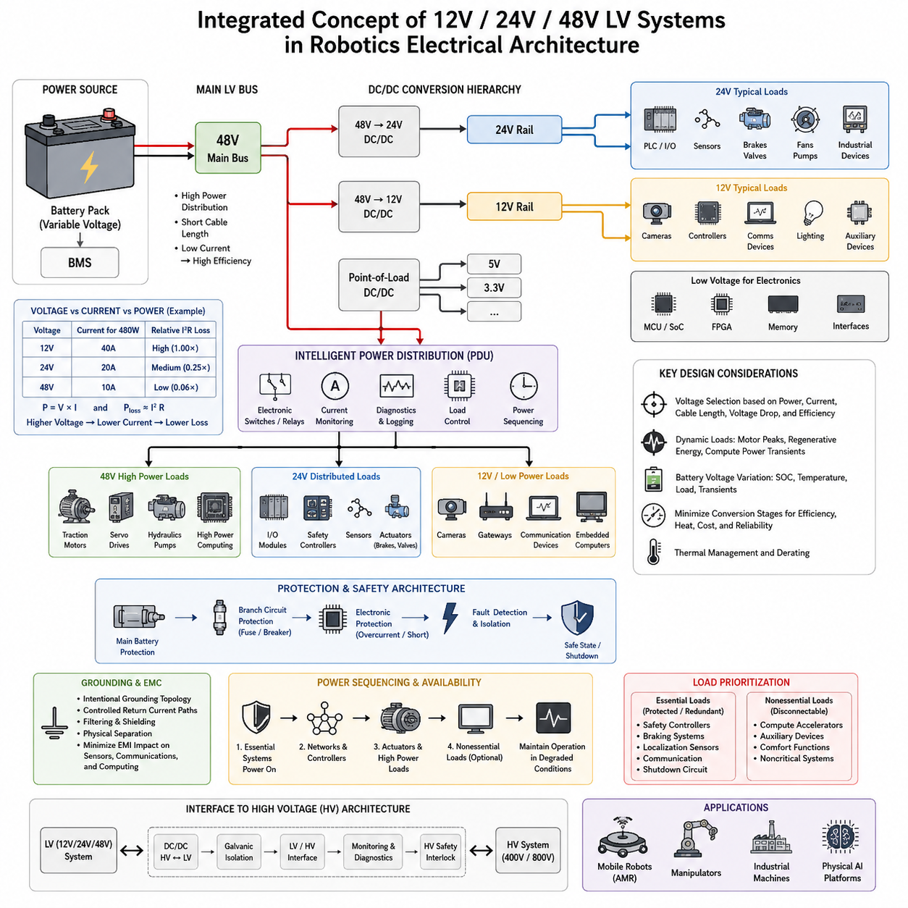
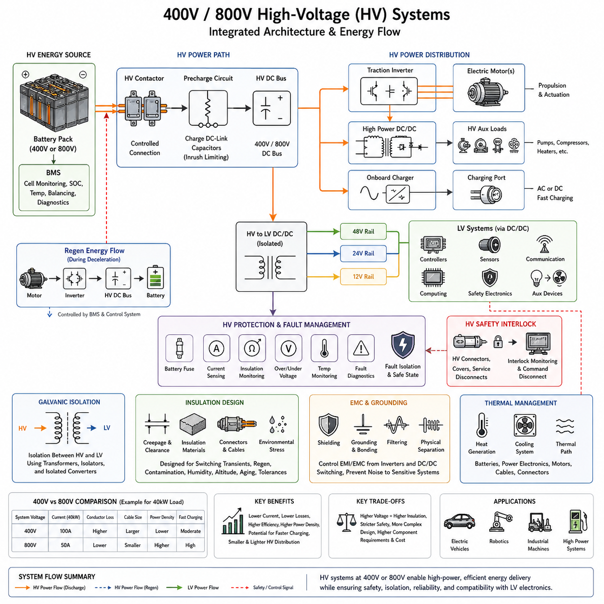
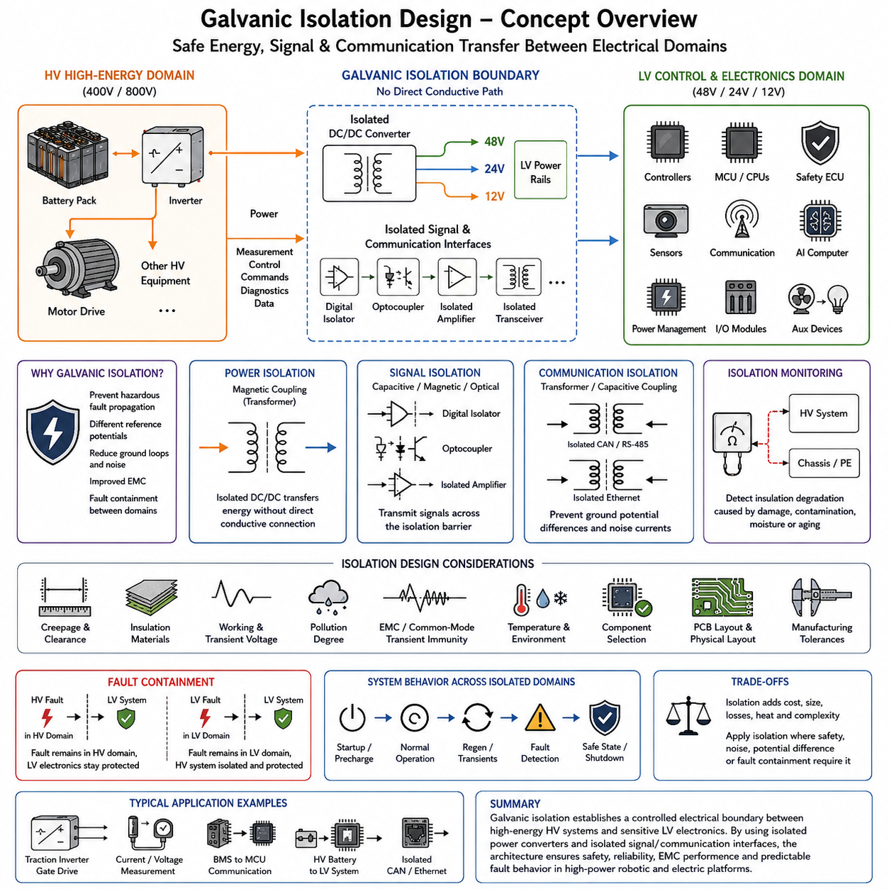
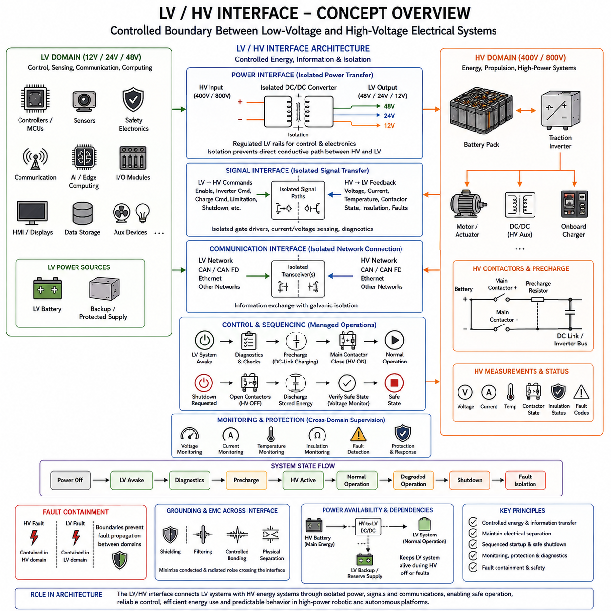
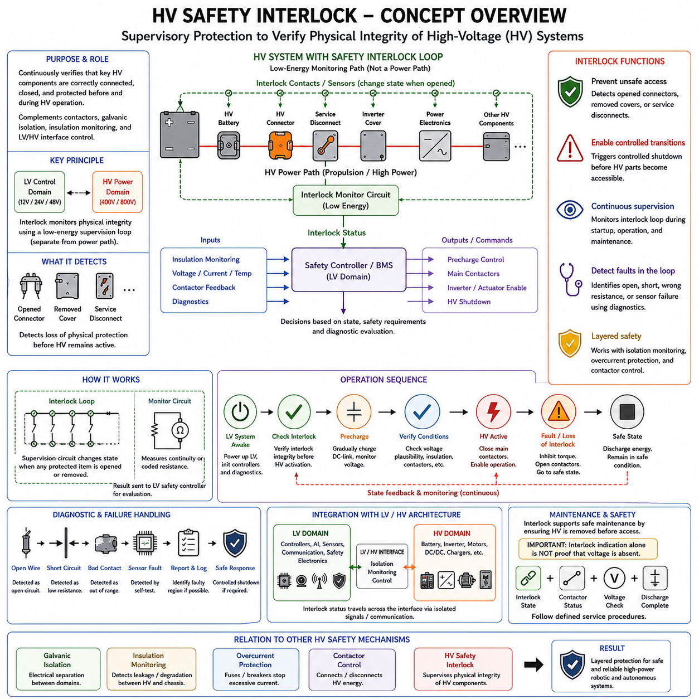

**Volume 01. Electrical Architecture Fundamentals**

# Chapter 07. LV/HV Architecture

## 07.01. 12V/24V/48V LV Systems

{width="7.268055555555556in" height="7.268055555555556in"}

12V, 24V, 48V 전압 레일(Voltage Rail)을 기반으로 하는 저전압 전기 시스템(Low-Voltage Electrical System)은 제어기(Controller), 센서(Sensor), 통신 장치(Communication Device), 컴퓨팅 플랫폼(Computing Platform), 보조 장치(Auxiliary Device), 그리고 다양한 액추에이터(Actuator) 하위 시스템에 전력을 공급하는 실질적인 기반을 형성합니다. 전체 아키텍처에서 이러한 저전압 시스템(LV System)은 일반적인 전력 분배 설계(Power Distribution Design)와 이후 다루어지는 400V/800V 고전압 시스템(HV System), 갈바닉 절연(Galvanic Isolation), 저전압/고전압 인터페이스(LV/HV Interface), 안전 인터록(Safety Interlock) 사이에 위치합니다.

12V 시스템(12V System)은 제어 모듈(Control Module), 센서(Sensor), 카메라(Camera), 통신 인터페이스(Communication Interface), 조명(Lighting), 릴레이(Relay), 보조 장치(Auxiliary Device)와 같이 비교적 전력 소비가 작은 전자 부하에 널리 적합합니다. 주요 장점은 다양한 부품을 쉽게 확보할 수 있고 보호 기술(Protection Technology)이 충분히 성숙했다는 점입니다. 그러나 12V에서 큰 전력을 전달하려면 상대적으로 높은 전류가 필요하므로 배선 크기, 커넥터 요구 조건, 저항 손실, 전압 강하(Voltage Drop), 열 부하(Thermal Load)가 증가합니다.

24V 아키텍처(24V Architecture)는 기존 12V 전자 시스템과 더 높은 전력을 처리하는 48V 전력 분배(Power Distribution) 사이에서 유용한 중간 영역을 제공합니다. 특히 산업 자동화(Industrial Automation)와 로보틱스(Robotics)에서 널리 사용되며, PLC, 입출력 모듈(I/O Module), 센서, 통신 장치, 브레이크(Brake), 밸브(Valve), 소형 액추에이터가 표준화된 전원 환경을 공유할 수 있습니다. 동일한 전력을 공급할 때 전압을 12V에서 24V로 두 배 높이면 전류는 대략 절반으로 감소하여 배선 손실을 줄이고 전력 분배를 단순화할 수 있습니다.

48V 영역(48V Domain)은 견인급 고전압 시스템(Traction-Class HV System)에서 사용하는 높은 전압까지 올라가지 않으면서도 저전압 개념(LV Concept)을 상당히 높은 전력 영역으로 확장합니다. 모터(Motor), 서보 드라이브(Servo Drive), 펌프(Pump), 팬(Fan), 컴퓨팅 장비(Computing Equipment), 고전력 보조 장치를 동일한 12V 또는 24V 설계보다 낮은 전류로 구동할 수 있기 때문에 이동 로봇(Mobile Robot), AMR, 매니퓰레이터(Manipulator)와 같이 전력 요구량이 큰 시스템에 적합합니다. 이를 통해 전력 밀도(Power Density)를 높이고 와이어 하네스(Wire Harness)의 질량과 전력 분배 손실을 줄일 수 있습니다.

전압(Voltage), 전류(Current), 전력(Power)의 기본 관계는 P = V × I로 표현됩니다. 예를 들어 480W 부하는 변환 손실과 배선 손실을 고려하기 전 이론적으로 12V에서는 40A, 24V에서는 20A, 48V에서는 10A의 전류를 요구합니다. 도체 손실(Conductor Loss)은 대략 P_loss = I²R의 관계를 따르므로 동일한 전력을 전달할 때 배전 전압(Distribution Voltage)을 높이면 저항 손실(Resistive Loss)을 크게 감소시킬 수 있습니다. 이것이 고전력 로봇 하위 시스템에서 48V 아키텍처를 채택하는 주요 공학적 이유 중 하나입니다.

따라서 전압 선택(Voltage Selection)은 단순히 부하의 공칭 전압(Nominal Voltage)만을 기준으로 결정할 수 없습니다. 엔지니어는 연속 전류(Continuous Current), 피크 전류(Peak Current), 시동 및 돌입 전류(Inrush Current), 과도 상태(Transient Condition), 허용 전압 강하, 배선 길이, 커넥터 용량, 퓨즈 협조(Fuse Coordination), 열 환경(Thermal Environment), 변환 효율(Conversion Efficiency), 고장 동작(Fault Behavior)을 함께 고려해야 합니다. 이러한 요소는 저전압 아키텍처를 배선 크기 선정, 회로 보호, 접지(Grounding), 전자기 적합성(EMC), 배터리 설계, 파워트레인 통합(Powertrain Integration)과 직접 연결합니다.

실제 로봇에서는 모든 장치에 하나의 전압만 사용하는 대신 여러 저전압 레일(LV Rail)을 동시에 사용할 수 있습니다. 예를 들어 48V 배터리(Battery) 또는 메인 버스(Main Bus)가 추진 및 액추에이터 시스템에 전력을 공급하고, 절연형 또는 비절연형 DC/DC 컨버터(DC/DC Converter)를 통해 24V와 12V의 보조 전압 레일을 생성할 수 있습니다. 전자 모듈 내부에서는 부하점 변환(Point-of-Load Conversion)을 통해 5V, 3.3V 또는 더 낮은 반도체 공급 전압을 생성할 수도 있습니다. 이러한 계층적 구조는 고전력 분배와 민감한 전자 회로를 분리하면서 공통 시스템 수준의 전력 아키텍처를 유지합니다.

48V 전압 레일은 높은 전류가 흐르는 케이블 길이를 최소화하기 위해 일반적으로 에너지원(Energy Source)과 고전력 부하 가까이에 배치됩니다. 24V 레일은 산업용 제어 장치와 분산 입출력(Distributed I/O)을 지원할 수 있으며, 12V는 카메라, 임베디드 컴퓨터(Embedded Computer), 게이트웨이(Gateway), 통신 장비 또는 자동차 기반 모듈에 사용할 수 있습니다. 정확한 분할 방식은 부품 가용성과 플랫폼 요구 조건에 따라 달라지지만, 불필요한 변환 단계는 효율 손실, 발열, 비용, 패키징 요구 조건, 추가적인 고장 모드(Failure Mode)를 발생시키므로 최소화해야 합니다.

배터리 전압(Battery Voltage)은 충전 상태(State of Charge), 부하(Load), 온도(Temperature), 배터리 화학 특성(Battery Chemistry), 과도 동작에 따라 지속적으로 변하므로 공칭 12V, 24V, 48V 시스템을 이상적인 고정 전압원(Fixed-Voltage Source)으로 취급해서는 안 됩니다. 전기 부하와 컨버터는 공칭값뿐 아니라 정의된 전체 동작 전압 범위(Operating Voltage Range)를 견딜 수 있어야 합니다. 제어기와 안전 기능이 예측 가능한 상태를 유지하도록 저전압, 과전압, 시동, 회생 에너지(Regenerative Energy), 적용 가능한 경우의 로드 덤프(Load Dump), 단시간 전압 변동을 평가해야 합니다.

동적 부하(Dynamic Load)는 로보틱스에서 특히 중요합니다. 모터와 서보 증폭기(Servo Amplifier)는 가속 과정에서 순간적으로 높은 전류를 요구할 수 있으며, 감속 과정에서는 회생 제동(Regenerative Braking)을 통해 에너지를 DC 버스로 반환할 수 있습니다. 동시에 GPU와 고성능 컴퓨터(High-Performance Computer)는 연산량 변화에 따라 전력 요구가 빠르게 변할 수 있습니다. 이러한 현상이 동시에 발생하면 저전압 버스에 상당한 전압 변동이 나타날 수 있으므로 전원 임피던스(Source Impedance), 케이블 저항, 컨버터 동특성(Converter Dynamics), 로컬 커패시턴스(Local Capacitance), 배터리 특성이 중요한 아키텍처 설계 변수가 됩니다.

보호 기능(Protection)은 여러 단계에서 상호 협조되도록 설계해야 합니다. 메인 배터리 보호(Main Battery Protection)는 치명적인 고장 에너지를 제한하고, 분기 회로 보호(Branch Protection)는 개별 회로의 고장을 격리하며, 전자식 보호(Electronic Protection)는 과부하 또는 단락(Short Circuit)을 더욱 빠르게 감지할 수 있습니다. 따라서 퓨즈(Fuse) 또는 회로 차단기(Circuit Breaker)의 정격은 도체 허용 전류와 부하 특성을 함께 고려하여 선정해야 합니다. 정격이 너무 작으면 불필요한 차단이 발생하고, 지나치게 크면 케이블, 커넥터 또는 전자 모듈이 손상될 정도의 고장 에너지가 흐를 수 있습니다.

접지(Ground)와 귀환 전류 경로(Return-Current Path)의 설계 역시 중요합니다. 동일한 저전압 플랫폼에서 높은 전류를 사용하는 액추에이터 회로와 민감한 센서 전자 회로가 함께 존재할 수 있기 때문입니다. 모터 드라이브(Motor Drive)와 스위칭 컨버터(Switching Converter)는 카메라, 라이다(LiDAR), 관성측정장치(IMU), 통신 네트워크, 컴퓨팅 시스템에 영향을 미치는 전도성 및 방사성 간섭(Conducted and Radiated Interference)을 발생시킬 수 있습니다. 의도적인 접지 토폴로지(Grounding Topology), 제어된 귀환 전류 경로, 필터링(Filtering), 차폐(Shielding), 물리적 분리, 적절한 DC/DC 아키텍처를 통해 전력 분배의 교란이 인지 또는 통신 장애로 이어지는 것을 방지해야 합니다.

저전압 영역의 수가 증가할수록 전원 시퀀싱(Power Sequencing)의 중요성도 커집니다. 일부 제어기는 액추에이터에 전원이 공급되기 전에 먼저 시작되어야 하며, 통신 네트워크는 종속 노드(Dependent Node)가 초기화되기 전에 안정적인 전원을 확보해야 할 수 있습니다. 또한 안전 제어기(Safety Controller)는 특정 고장 조건에서도 동작을 유지해야 합니다. 지능형 전력 분배 장치(Intelligent PDU)는 분기 전류를 감시하고 전자 스위치 또는 릴레이를 제어하며 비정상 부하를 감지하고 진단 정보를 제공함으로써 수동적인 배선을 관찰 및 제어 가능한 전력 하위 시스템으로 변화시킵니다.

가용성 요구 조건(Availability Requirement)에 따라 필수 저전압 부하(Essential LV Load)와 비필수 부하(Nonessential Load)를 분리할 수도 있습니다. 안전 제어기, 제동 기능, 위치 추정 센서(Localization Sensor), 통신 게이트웨이, 종료 회로(Shutdown Circuit)는 보호되거나 이중화된 전원에 할당하고, 연산 가속기(Computational Accelerator)나 보조 장비는 성능 저하 운전(Degraded Operation) 중 차단할 수 있습니다. 이러한 우선순위 설정을 통해 배터리 용량, 컨버터 능력 또는 전력 분배 건전성이 제한되더라도 모든 전기 기능을 동시에 상실하는 대신 로봇을 제어된 안전 상태(Safe State)로 전환할 수 있습니다.

48V 저전압 분배와 더 높은 전압 아키텍처 사이의 경계는 단순한 전압 수치의 차이가 아니라 하나의 아키텍처 인터페이스(Architectural Interface)로 다루어야 합니다. 저전압 전자 시스템과 400V 또는 800V 추진 시스템을 결합하는 경우에는 전력 변환(Power Conversion), 절연(Isolation), 접지, 모니터링(Monitoring), 커넥터, 고장 격리(Fault Containment)를 체계적으로 설계해야 합니다. 이러한 흐름은 12V/24V/48V 시스템 이후에 고전압 시스템, 갈바닉 절연, 저전압/고전압 인터페이스, 고전압 안전 인터록(HV Safety Interlock)을 다루도록 구성된 장의 구조와 연결됩니다.

피지컬 AI(Physical AI)와 첨단 로봇 플랫폼에서 저전압 아키텍처는 궁극적으로 인지-연산-구동(Sense-Compute-Actuate) 인프라의 일부가 됩니다. 센서는 전기적으로 깨끗하고 안정적인 전압 레일을 필요로 하고, 엣지 AI 컴퓨터(Edge AI Computer)는 순간적인 높은 전력 요구를 처리할 수 있어야 하며, 통신 네트워크는 안정적인 전원 연속성을 요구하고, 액추에이터는 효율적인 고전류 공급을 필요로 합니다. 따라서 12V, 24V, 48V 영역을 적절하게 조합한 설계는 단순한 전기적 호환성을 넘어 신뢰성 있는 인지(Perception), 연산(Computation), 통신(Communication), 제어(Control), 물리적 동작(Physical Action)을 가능하게 하는 에너지 기반(Energy Foundation)을 제공합니다.

## 07.02. 400V/800V HV Systems

{width="7.268055555555556in" height="7.268055555555556in"}

400V 및 800V 아키텍처(Architecture)를 기반으로 하는 고전압 전기 시스템(High-Voltage Electrical System)은 추진(Propulsion), 구동(Actuation), 충전(Charging), 보조 전력(Auxiliary Power)의 요구량이 12V, 24V, 48V 전력 분배의 실용적인 한계를 넘어서는 플랫폼에서 핵심적인 에너지 기반을 제공합니다. 저전압/고전압 아키텍처(LV/HV Architecture)에서 이러한 시스템은 전력 계층을 고에너지 영역으로 확장하며, 더욱 강화된 절연(Isolation), 보호(Protection), 모니터링(Monitoring), 제어된 인터페이스(Controlled Interface)를 필요로 합니다.

시스템 전압(System Voltage)을 높이는 가장 중요한 이유는 매우 높은 전류를 사용하지 않고도 대용량 전력을 전달하기 위해서입니다. 전력은 P = V × I의 관계를 따르므로 40kW 부하는 이론적으로 400V에서는 100A가 필요하지만 800V에서는 50A만 필요합니다. 또한 도체의 저항 손실(Resistive Conductor Loss)은 대략 P_loss = I²R의 관계를 따르므로 전류를 낮추면 케이블 손실, 도체 발열, 커넥터 부하를 크게 줄이고 고전력 배선에 필요한 도체 단면적도 감소시킬 수 있습니다.

400V 아키텍처(400V Architecture)는 전기 추진(Electric Propulsion)과 기타 고전력 시스템에 폭넓게 적용할 수 있는 대표적인 고전압 영역입니다. 견인 인버터(Traction Inverter), 고출력 모터 드라이브(High-Power Motor Drive), 펌프(Pump), 컴프레서(Compressor), 히터(Heater), 충전 시스템(Charging System), DC/DC 컨버터(DC/DC Converter)에 전력을 공급하면서 저전압 분배보다 훨씬 낮은 전류를 사용할 수 있습니다. 따라서 로봇, 자율주행 차량, 대형 이동 플랫폼, 전동 기계에서 48V 버스로는 비효율적이거나 물리적으로 어려운 전력 수준을 구현할 수 있습니다.

800V 아키텍처(800V Architecture)는 동일한 전력을 전달할 때 400V 시스템과 비교하여 전류를 약 절반으로 줄임으로써 이러한 장점을 더욱 확장합니다. 낮은 전류는 케이블 질량과 저항 손실을 감소시키고 견인 시스템(Traction System)의 전력 밀도(Power Density)를 높이며 고출력 급속 충전(High-Power Fast Charging)을 지원하는 데 유리할 수 있습니다. 그러나 높은 전압은 절연 협조(Insulation Coordination), 반도체 내전압, 연면거리(Creepage), 공간거리(Clearance), 커넥터 구조, 스위칭 특성, 전자기 적합성(EMC), 안전 정비 절차에 더 엄격한 요구 조건을 부과합니다.

따라서 400V와 800V의 선택을 단순히 효율만으로 결정해서는 안 됩니다. 엔지니어는 요구되는 연속 및 피크 전력(Continuous and Peak Power), 모터와 인버터 특성, 배터리 구성(Battery Configuration), 충전 요구 조건, 케이블 길이, 패키징(Packaging), 열적 제약 조건(Thermal Constraint), 컨버터 가용성, 부품 비용, 절연 요구 조건, 안전 목표(Safety Objective)를 종합적으로 평가해야 합니다. 높은 전압 아키텍처는 추가되는 전기적, 기계적, 안전 복잡성을 시스템 수준의 장점이 충분히 상쇄할 때 의미가 있습니다.

배터리 팩(Battery Pack)은 일반적으로 고전압 시스템의 주 에너지원(Main HV Energy Source)을 구성하며, 필요한 전압과 에너지 용량 및 전류 성능을 확보하기 위해 많은 셀(Cell)을 직렬과 병렬로 연결합니다. 배터리 관리 시스템(Battery Management System, BMS)은 셀 전압, 온도, 충전 상태(State of Charge), 비정상 상태를 감시하며, 컨택터(Contactor)와 관련 보호 장치는 배터리 팩과 고전압 버스(HV Bus)의 연결을 제어합니다. 이러한 구조는 정상적인 에너지 공급뿐 아니라 잠재적으로 위험한 고장 에너지(Fault Energy)도 관리해야 합니다.

고전압 컨택터(HV Contactor)는 배터리와 하위 부하 사이의 전기적 연결을 제어합니다. 견인 인버터와 기타 전력 전자 장치(Power Electronics)는 상당한 용량의 DC 링크 커패시턴스(DC-Link Capacitance)를 포함하기 때문에 메인 컨택터를 직접 연결하면 매우 큰 돌입 전류(Inrush Current)가 발생할 수 있습니다. 따라서 프리차지 회로(Precharge Circuit)를 사용하여 주 전력 경로를 완전히 연결하기 전에 DC 링크 전압을 제어된 방식으로 상승시키고, 시동 과정에서 컨택터, 커패시터, 커넥터 및 기타 부품에 가해지는 전기적 스트레스를 줄입니다.

고전압 DC 버스(HV DC Bus)가 활성화되면 견인 인버터와 고출력 DC/DC 컨버터 같은 주요 부하에 에너지를 분배합니다. 인버터(Inverter)는 DC 전기 에너지를 전기 모터를 제어하기 위한 다상 전력(Multiphase Power)으로 변환하며, 회생 동작(Regenerative Operation)에서는 에너지 흐름을 반대로 전환할 수 있습니다. 감속 또는 음의 기계적 작업(Negative Mechanical Work) 중 모터에서 생성된 전기 에너지는 인버터를 통해 고전압 버스와 배터리 방향으로 반환될 수 있으므로 배터리의 에너지 수용 한계와 버스 전압을 함께 제어해야 합니다.

고전압 DC/DC 변환(HV DC/DC Conversion)은 고전압 영역과 저전압 전기 시스템을 연결하는 중요한 다리 역할을 합니다. 400V 또는 800V 배터리는 절연형 컨버터(Isolated Converter)를 통해 제어기, 센서, 통신 장비, 컴퓨팅 플랫폼, 안전 전자 장치, 보조 장치를 위한 48V, 24V 또는 12V 전압 레일을 생성할 수 있습니다. 이를 통해 모든 장치가 고전압 버스에서 직접 동작하지 않아도 고출력 추진 시스템과 저전압 제어 전자 시스템이 계층적인 전력 아키텍처 안에서 함께 동작할 수 있습니다.

갈바닉 절연(Galvanic Isolation)은 고전압 영역과 저전압 영역이 상호작용할 때 핵심적인 아키텍처 요구 조건이 됩니다. 절연은 선택된 전기 영역 사이의 의도적인 직접 전도 경로를 차단하면서 적절하게 설계된 컨버터, 변압기(Transformer), 절연기(Isolator), 통신 인터페이스를 통해 에너지 또는 정보를 전달할 수 있도록 합니다. 다음 절에서 갈바닉 절연을 별도로 다루는 것은 고에너지 회로와 접근 가능한 저전압 전자 시스템 사이의 공학적 경계로서 절연이 매우 중요하기 때문입니다.

절연 설계(Insulation Design)는 단순히 공칭 400V 또는 800V 동작 전압만 고려해서는 안 됩니다. 스위칭 과도현상(Switching Transient), 회생 동작, 충전 조건, 고장 조건, 환경 오염(Environmental Contamination), 습도, 고도, 노화(Aging), 제조 공차가 절연체에 가해지는 전기적 스트레스에 영향을 줄 수 있습니다. 따라서 연면거리, 공간거리, 절연 재료, 커넥터 형상, 케이블 구조, 차폐(Shielding), 인클로저 설계(Enclosure Design)는 예상되는 최대 전기적 및 환경적 스트레스와 함께 고려해야 합니다.

고전압 고장 관리(HV Fault Management)는 사용 가능한 전기 에너지가 상당히 크기 때문에 신속한 고장 감지와 제어된 격리(Controlled Isolation)를 필요로 합니다. 보호 기능에는 배터리 퓨즈(Battery Fuse), 컨택터, 전류 센싱(Current Sensing), 절연 감시(Insulation Monitoring), 과전압 및 저전압 감지, 온도 감시, 고장 진단(Fault Diagnostics)이 포함될 수 있습니다. 아키텍처는 국부적인 고장이 전체 전력 시스템으로 확산되는 것을 방지하고, 고전압 동작을 계속할 수 없는 경우 플랫폼을 적절한 안전 상태(Safe State)로 전환할 수 있어야 합니다.

고전압 안전 인터록(High-Voltage Safety Interlock)은 고전압 커넥터, 커버, 서비스 디스커넥트(Service Disconnect), 기타 보호 인터페이스의 무결성(Integrity)을 감시함으로써 추가적인 안전 계층을 제공합니다. 인터록 경로(Interlock Path)를 통해 고전압 시스템의 일부가 열렸거나 손상되었다고 판단되면 제어 아키텍처는 에너지원과 고전압 버스의 연결을 차단하도록 명령할 수 있습니다. 따라서 이 기능은 단순한 배선 요소가 아니라 별도의 고전압 안전 메커니즘(HV Safety Mechanism)으로 다루어집니다.

접지(Grounding)와 전자기 적합성(Electromagnetic Compatibility, EMC)은 고전압 인버터와 DC/DC 컨버터가 높은 주파수에서 대량의 에너지를 스위칭하기 때문에 더욱 중요해집니다. 빠른 전압 및 전류 변화는 공통 모드 전류(Common-Mode Current), 전도성 노이즈(Conducted Noise), 방사성 방출(Radiated Emission)을 발생시켜 센서, 통신 네트워크, 위치 측정 시스템(Positioning System), AI 컴퓨팅 하드웨어에 간섭을 일으킬 수 있습니다. 따라서 고전압 케이블 차폐, 제어된 귀환 경로, 필터링, 인클로저 본딩(Enclosure Bonding), 물리적 분리, 체계적인 접지 구조가 아키텍처의 필수 요소가 됩니다.

열 관리(Thermal Management) 역시 시스템 수준에서 고려해야 합니다. 배터리, 인버터, 모터, DC/DC 컨버터, 컨택터, 커넥터, 도체는 동작 전류, 스위칭 손실(Switching Loss), 내부 저항, 환경 조건에 따라 열을 발생시킵니다. 전압을 높이면 전력 분배 전류를 낮출 수 있지만 반도체 또는 전력 변환 손실까지 제거되는 것은 아닙니다. 따라서 부품 수명, 효율, 예측 가능한 성능을 유지하기 위해 냉각 아키텍처(Cooling Architecture)와 전기 아키텍처(Electrical Architecture)를 함께 설계해야 합니다.

첨단 로보틱스(Advanced Robotics)와 피지컬 AI(Physical AI) 플랫폼에서 400V 또는 800V 영역은 추진과 고출력 구동에 집중된 에너지를 제공하고, 저전압 영역(LV Domain)은 인지(Perception), 통신(Communication), 실시간 제어(Real-Time Control), AI 연산(AI Computation)을 지원할 수 있습니다. 따라서 최종 전기 시스템은 하나의 전압 네트워크가 아니라 전력 변환, 절연, 모니터링, 안전 메커니즘을 통해 연결된 여러 에너지 영역의 계층 구조입니다. 이러한 구조는 민감한 전자 시스템과의 제어된 인터페이스를 유지하면서 확장 가능한 고출력 자율 기계(High-Power Autonomous Machine)를 구현하기 위한 기반을 제공합니다.

## 07.03. Galvanic Isolation Design

{width="7.268055555555556in" height="7.268055555555556in"}

갈바닉 절연(Galvanic Isolation)은 두 전기 영역(Electrical Domain) 사이에서 직접적인 전도 전류(Conductive Current)의 흐름을 의도적으로 차단하면서도 전력(Power), 제어 신호(Control Signal), 통신 데이터(Communication Data)는 경계를 넘어 전달할 수 있도록 하는 설계 방식입니다. 저전압/고전압 아키텍처(LV/HV Architecture)에서 갈바닉 절연은 400V 또는 800V의 고에너지 회로와 48V, 24V, 12V의 저전압 전자 시스템 사이에 중요한 인터페이스를 형성하며, 위험한 전기적 고장의 전파를 제한하면서 제어된 에너지 전달을 지원합니다.

절연(Isolation)의 기본 목적은 두 회로가 의도하지 않은 직접적인 전기 경로를 공유하지 않도록 하는 것입니다. 따라서 두 회로의 기준 전위(Reference Potential)가 서로 다르더라도 신호 접지(Signal Ground), 섀시 구조(Chassis Structure), 통신 케이블 또는 민감한 전자 장치를 통해 큰 등전위 전류(Equalization Current)가 흐르지 않도록 할 수 있습니다. 에너지 또는 정보는 연속적인 금속 도체가 아니라 자기 결합(Magnetic Coupling), 용량성 결합(Capacitive Coupling), 광학 전송(Optical Transmission)과 같은 방식으로 절연 장벽(Isolation Barrier)을 통과합니다.

고전압 로봇 또는 전기자동차 아키텍처에서 견인 배터리(Traction Battery), 인버터(Inverter), 모터 드라이브(Motor Drive), 기타 고전압 장비는 하나의 전기 영역을 형성할 수 있으며, 제어기(Controller), 센서(Sensor), 통신 장치(Communication Device), 안전 전자 장치(Safety Electronics), AI 컴퓨터(AI Computer)는 다른 영역에서 동작할 수 있습니다. 갈바닉 절연은 고전압 고장이 접근 가능한 저전압 회로로 위험한 전압을 직접 전달할 가능성을 제한하고, 고에너지 추진 시스템과 저전압 제어 인프라 사이에 명확한 전기적 경계를 제공합니다.

절연형 DC/DC 컨버터(Isolated DC/DC Converter)는 이러한 경계를 넘어 전력을 전달하는 가장 중요한 구성 요소 중 하나입니다. 컨버터는 400V 또는 800V 고전압 버스(HV Bus)에서 에너지를 공급받아 48V, 24V 또는 12V 출력을 생성하면서 입력과 출력 사이의 전기적 분리(Electrical Separation)를 유지할 수 있습니다. 변압기 기반 변환(Transformer-Based Conversion)은 절연 장벽을 통해 에너지를 자기적으로 전달하므로 저전압 시스템이 고전압 버스와 직접적인 전도 연결 없이 전력을 공급받을 수 있습니다.

절연은 신호 경로(Signal Path)에서도 동일하게 중요합니다. 게이트 명령(Gate Command), 전류 측정(Current Measurement), 전압 측정(Voltage Measurement), 진단 정보(Diagnostic Information), 제어 신호는 서로 다른 전위에서 동작하는 회로 사이의 경계를 통과해야 하는 경우가 많습니다. 디지털 절연기(Digital Isolator), 광커플러(Optocoupler), 절연 증폭기(Isolated Amplifier), 절연형 ADC 인터페이스(Isolated ADC Interface), 변압기 기반 통신 인터페이스를 사용하면 전기 영역 사이에 필요한 분리를 유지하면서 정보를 전달할 수 있습니다.

모터 인버터(Motor Inverter)는 이러한 요구 조건을 대표적으로 보여주는 사례입니다. 전력 반도체 스위치(Power Semiconductor Switch)는 고전압 영역에서 직접 동작하지만, 이를 제어하는 알고리즘은 저전압 마이크로컨트롤러(Microcontroller) 또는 프로세서(Processor)에서 실행될 수 있습니다. 절연형 게이트 드라이버(Isolated Gate Driver) 아키텍처는 스위칭 명령을 고전압 전력단으로 전달하면서 스위칭 노드 전압이 제어기 영역으로 직접 전달되는 것을 방지합니다. 전류, 전압, 고장 정보에 대한 피드백 경로(Feedback Path)에도 유사한 절연이 필요할 수 있습니다.

절연 장벽(Isolation Barrier)은 단순한 회로 기호가 아니라 실제 물리적 구조로 설계되어야 합니다. PCB 레이아웃(PCB Layout), 변압기 구조(Transformer Construction), 패키지 형상(Package Geometry), 커넥터 배치, 절연 재료(Insulation Material), 케이블 라우팅(Cable Routing), 인클로저 구조(Enclosure Structure), 제조 공차가 실제 운전 조건에서 전기적 분리가 유지되는지를 결정합니다. 따라서 서로 다른 전위의 도전 영역 사이에 필요한 물리적 거리를 확보하기 위해 연면거리(Creepage)와 공간거리(Clearance)가 핵심적인 설계 변수가 됩니다.

공간거리(Clearance)는 두 도전부 사이의 공기를 통한 최단거리를 의미하며, 연면거리(Creepage)는 절연 재료 표면을 따라 측정되는 최단거리를 의미합니다. 필요한 거리는 동작 전압(Working Voltage), 과도 전압(Transient Voltage), 절연 등급(Insulation Category), 재료 특성, 오염 조건(Pollution Condition), 환경 요구 조건 등에 따라 달라집니다. 따라서 회로도에서는 충분히 절연되어 보이는 설계라도 PCB 간격, 커넥터 형상 또는 오염에 의해 의도하지 않은 절연 파괴 경로(Breakdown Path)가 형성되면 실제 시스템에서는 충분하지 않을 수 있습니다.

절연 요구 조건은 공칭 버스 전압(Nominal Bus Voltage)뿐 아니라 과도 상태(Transient Condition)도 고려해야 합니다. 인버터와 DC/DC 컨버터의 빠른 스위칭 에지(Switching Edge)는 큰 공통 모드 전압 변화(Common-Mode Voltage Transition)를 발생시킬 수 있으며, 회생 동작(Regenerative Operation), 충전(Charging), 스위칭 이벤트, 고장 상황에서는 일시적으로 전기적 스트레스가 증가할 수 있습니다. 따라서 절연 부품은 정상 상태의 전압뿐 아니라 플랫폼의 전체 운용 수명 동안 예상되는 과도 동작까지 견딜 수 있어야 합니다.

공통 모드 과도 내성(Common-Mode Transient Immunity)은 빠르게 스위칭하는 전력 전자 장치 주변에 위치한 절연 신호 인터페이스에서 특히 중요합니다. 급격한 전압 변화는 직접적인 전도가 차단되어 있더라도 절연 장벽을 통해 용량성으로 결합되어 논리 신호를 교란할 수 있습니다. 따라서 고주파 스위칭 상황에서 신호 무결성(Signal Integrity)을 유지하기 위해 적절한 절연 기술, PCB 레이아웃, 기생 커패시턴스(Parasitic Capacitance) 제어, 필터링(Filtering), 차폐(Shielding), 접지(Grounding)를 함께 고려해야 합니다.

갈바닉 절연은 접지 및 전자기 적합성 아키텍처(Grounding and EMC Architecture)에도 기여합니다. 선택된 영역을 분리하면 제어되지 않은 접지 루프 전류(Ground-Loop Current)를 방지하고 고전력 시스템과 민감한 전자 시스템 사이에서 전도성 간섭(Conducted Interference)이 전파되는 것을 줄일 수 있습니다. 그러나 기생 커패시턴스, 케이블 실드(Cable Shield), 섀시 연결, 방사 전자기장(Radiated Field)을 통해 노이즈가 전달될 수 있으므로 절연만으로 전자기 결합이 완전히 제거되지는 않습니다. 따라서 절연 전략은 접지, 본딩(Bonding), 차폐, 필터링 설계와 함께 조정되어야 합니다.

통신 네트워크(Communication Network) 역시 절연된 전기 영역의 경계를 통과할 수 있습니다. CAN, CAN FD, RS-485, 이더넷(Ethernet) 등의 인터페이스는 노드가 상당히 다른 기준 전위에서 동작하거나 고장 격리(Fault Containment)가 필요한 경우 절연이 요구될 수 있습니다. 절연은 접지 전위차(Ground-Potential Difference)가 통신 배선을 통해 손상을 일으키는 전류로 변하는 것을 방지하고 제어 영역 사이의 고장을 분리하는 데 도움을 줍니다. 구체적인 방식은 네트워크 토폴로지(Network Topology), 대역폭(Bandwidth), 타이밍(Timing), EMC, 안전 요구 조건에 따라 결정됩니다.

절연 감시(Isolation Monitoring)는 갈바닉 절연을 보완하는 기능을 제공합니다. 절연 장벽이 원하지 않는 전도 경로를 차단하도록 설계되는 반면, 절연 감시 기능은 고전압 시스템과 섀시 또는 다른 기준 구조 사이의 전기적 관계를 지속적으로 감시할 수 있습니다. 손상된 케이블, 오염, 습기, 커넥터 고장 또는 절연 노화(Insulation Aging)에 의해 발생하는 절연 성능 저하를 더욱 심각한 전기적 또는 안전 고장으로 발전하기 전에 감지할 수 있습니다.

따라서 고장 격리(Fault Containment)는 갈바닉 절연의 핵심적인 아키텍처 장점 중 하나입니다. 고전압 인버터, 배터리 회로 또는 고출력 컨버터에서 발생한 고장이 인지 컴퓨터(Perception Computer), 통신 제어기, 안전 프로세서(Safety Processor), 기타 저전압 전자 장치로 자동적으로 전파되어서는 안 됩니다. 반대로 저전압 영역의 접지 고장(Ground Fault)이 고전압 시스템을 통해 제어되지 않은 전류 경로를 형성해서도 안 됩니다. 명확하게 정의된 절연 경계는 전기 아키텍처를 여러 영역으로 분리하여 각 영역의 고장을 더욱 예측 가능하게 감지하고 관리할 수 있도록 합니다.

그러나 모든 절연 경계에는 공학적인 비용이 추가되므로 갈바닉 절연을 선택적으로 적용해야 합니다. 절연형 컨버터와 통신 장치는 부품 수, 변환 손실(Conversion Loss), 열 부하(Thermal Load), PCB 면적, 인증 및 검증 요구 조건(Qualification Requirement), 잠재적인 고장 모드(Failure Mode)를 증가시킵니다. 따라서 과도한 절연은 시스템을 불필요하게 복잡하게 만들 수 있습니다. 시스템 아키텍처에서는 전압 차이, 기준 전위 차이, 안전 노출(Safety Exposure), 노이즈 환경, 고장 격리 요구 조건을 분석하여 명확한 절연 경계가 필요한 위치를 결정해야 합니다.

시동(Startup), 종료(Shutdown), 고장 동작도 절연된 영역 전체에 걸쳐 고려해야 합니다. 고전압 버스가 차단된 이후에도 저전압 제어기는 계속 전원을 공급받을 수 있으며, 절연형 컨버터의 입력이 차단된 이후에도 하위 회로의 커패시터에 일정 시간 에너지가 남아 있을 수 있습니다. 또한 진단 신호와 전원 레일이 서로 다른 시점에 사라질 수 있습니다. 따라서 시스템 상태 머신(System State Machine)은 통신 손실, 절연 전원 손실, 의도적인 고전압 종료, 절연 고장, 실제 제어기 고장을 서로 구분할 수 있어야 합니다.

로보틱스(Robotics)와 피지컬 AI(Physical AI) 시스템에서 갈바닉 절연은 고출력 물리적 구동(Physical Actuation)과 민감한 컴퓨팅 지능(Computational Intelligence) 사이의 경계를 보호합니다. 모터, 인버터, 배터리, 전력 컨버터는 고에너지 영역에서 동작할 수 있으며, 인지 센서(Perception Sensor), 엣지 AI 컴퓨터(Edge AI Computer), 통신 네트워크, 안전 제어기(Safety Controller)는 제어된 저전압 환경에서 유지될 수 있습니다. 이러한 분리는 상당한 전기적 노이즈와 에너지가 존재하는 환경에서도 안정적인 인지-연산-구동(Sense-Compute-Actuate) 동작을 지원합니다.

따라서 갈바닉 절연은 이 장의 구조에서 400V/800V 고전압 아키텍처와 이후의 저전압/고전압 인터페이스(LV/HV Interface) 및 고전압 안전 인터록(HV Safety Interlock) 개념을 연결합니다. 갈바닉 절연은 위험한 직접 전류 경로를 제한하면서 에너지와 정보가 통과할 수 있는 제어된 전기적 경계를 형성합니다. 절연 협조(Insulation Coordination), 모니터링, 접지, 보호, 고장 관리와 결합될 때 갈바닉 절연은 안전하고 신뢰성 높은 고출력 로봇 전기 시스템을 구현하기 위한 핵심적인 아키텍처 메커니즘이 됩니다.

## 07.04. LV/HV Interface

{width="7.268055555555556in" height="7.268055555555556in"}

저전압/고전압 인터페이스(LV/HV Interface)는 저전압 전기 시스템(Low-Voltage Electrical System)과 고전압 에너지 시스템(High-Voltage Energy System) 사이에 형성되는 제어된 아키텍처 경계(Controlled Architectural Boundary)입니다. 로봇 또는 자율 플랫폼에서 저전압 영역(LV Domain)은 제어기, 센서, 통신, 안전 전자 장치, 컴퓨팅을 위해 12V, 24V 또는 48V로 동작할 수 있으며, 고전압 영역(HV Domain)은 추진, 고출력 구동, 충전 및 기타 에너지 집약적 기능을 위해 400V 또는 800V로 동작할 수 있습니다.

이 인터페이스는 단일 커넥터(Connector)나 컨버터(Converter)가 아니라 전력(Power), 신호(Signal), 통신(Communication), 절연(Isolation), 모니터링(Monitoring), 제어(Control) 기능이 서로 연계된 구조입니다. 목적은 저전압 영역과 고전압 영역이 전기적 분리(Electrical Separation)와 고장 격리(Fault Containment) 특성을 유지하면서 상호 협력할 수 있도록 하는 것입니다. 따라서 인터페이스는 어떤 물리량과 정보가 경계를 통과할 수 있는지, 어떻게 전달되는지, 어느 한쪽에서 비정상 상태가 발생할 경우 어떻게 동작할지를 정의합니다.

전력은 일반적으로 절연형 DC/DC 컨버터(Isolated DC/DC Converter)를 통해 저전압/고전압 경계를 통과합니다. 400V 또는 800V 배터리 버스(Battery Bus)의 에너지를 제어 및 전자 장비에 필요한 48V, 24V 또는 12V 전압 레일(Voltage Rail)로 변환할 수 있습니다. 컨버터는 고전압 측의 전압 변화와 과도현상(Transient)을 견디면서 저전압 출력을 안정적으로 조절해야 하며, 절연 장벽(Isolation Barrier)은 고전압 버스가 접근 가능한 저전압 회로에 직접 연결되는 것을 방지합니다.

양방향 에너지 전달이 필요한 아키텍처에서는 이러한 관계가 양방향(Bidirectional)으로 구성될 수도 있습니다. 많은 보조 컨버터(Auxiliary Converter)는 주로 고전압에서 저전압으로 에너지를 전달하지만, 첨단 시스템에서는 에너지 관리(Energy Management), 백업 전원(Backup Power), 충전(Charging), 특수 에너지 저장 아키텍처를 위해 양방향 DC/DC 변환(Bidirectional DC/DC Conversion)을 사용할 수 있습니다. 따라서 전력 흐름(Power Flow)의 방향과 크기는 모든 운전 상태에서 일정하다고 가정하지 않고 명시적으로 제어해야 합니다.

제어 정보(Control Information)는 경계를 양방향으로 통과합니다. 저전압 제어기는 고전압 활성화(HV Activation), 인버터 동작(Inverter Operation), 충전, 전력 제한(Power Limitation), 종료(Shutdown)를 요청할 수 있으며, 고전압 시스템은 전압, 전류, 온도, 컨택터 상태(Contactor State), 절연 상태(Isolation Condition), 고장 코드(Fault Code)와 같은 측정값과 상태 정보를 반환합니다. 이러한 정보 교환은 물리적인 전력 인터페이스와 함께 동작하지만 별도로 구분되는 논리적 제어 인터페이스(Logical Control Interface)를 형성합니다.

통신 네트워크(Communication Network)는 이러한 논리적 연결을 제공할 수 있습니다. CAN, CAN FD, 이더넷(Ethernet) 또는 기타 통신 기술을 대역폭(Bandwidth), 결정성(Determinism), 안전성(Safety), 시스템 요구 조건에 따라 두 전압 영역의 제어기 사이에 적용할 수 있습니다. 갈바닉 분리(Galvanic Separation)가 필요한 경우 절연형 트랜시버(Isolated Transceiver), 변압기(Transformer) 또는 기타 절연 메커니즘을 사용하여 고전압과 저전압 기준 전위 사이에 의도하지 않은 전도 경로를 만들지 않고 정보를 전달합니다.

저전압 영역은 고전압 영역을 활성화하기 위한 시퀀스(Sequence)를 제어하는 경우가 많습니다. 저전압 배터리(LV Battery) 또는 보호된 저전압 레일이 메인 고전압 버스가 활성화되기 전에 차량 또는 로봇 제어기, 배터리 관리 시스템(Battery Management System), 안전 제어기(Safety Controller), 통신 네트워크에 먼저 전력을 공급할 수 있습니다. 이러한 제어기들은 진단(Diagnostics)을 수행하고 운전 조건을 확인하여 시스템이 프리차지(Precharge)와 메인 컨택터(Main Contactor) 연결 단계로 진행할 수 있는지를 판단합니다.

따라서 프리차지(Precharge)는 저전압/고전압 인터페이스 제어와 밀접하게 연결됩니다. 메인 고전압 컨택터가 전체 전력 경로를 연결하기 전에 제어 시스템은 프리차지 회로(Precharge Circuit)를 활성화하여 하위 DC 링크 커패시턴스(DC-Link Capacitance)를 점진적으로 충전할 수 있습니다. 이후 전압 측정값을 평가하여 예상되는 버스 전압에 도달했는지 확인합니다. 검증이 성공한 이후에만 제어 로직(Control Logic)이 메인 컨택터를 연결하여 고전압 전력 경로를 완성합니다.

종료(Shutdown)는 반대 방향의 아키텍처 원리를 따르지만 저장된 에너지(Stored Energy)도 함께 고려해야 합니다. 저전압 제어 시스템이 고전압 종료를 요청하면 견인 또는 액추에이터 명령을 비활성화하고 고전압 컨택터를 열어 배터리를 분리할 수 있습니다. 그러나 인버터와 컨버터 내부의 커패시터에는 차단 이후에도 전하가 남아 있을 수 있습니다. 따라서 하위 고전압 버스가 허용 가능한 상태에 도달했는지를 판단하기 위한 전압 모니터링(Voltage Monitoring)과 방전 메커니즘(Discharge Mechanism)이 필요합니다.

인터페이스는 정상적인 운전 상태 전환과 전기적 고장(Electrical Fault)을 구분할 수 있어야 합니다. 통신 시간 초과(Communication Timeout), 컨버터 고장, 절연 성능 저하(Isolation Degradation), 과열(Overtemperature), 과전류(Overcurrent), 컨택터 오작동, 비정상 버스 전압은 각각 서로 다른 대응을 요구할 수 있습니다. 인터페이스 로직은 이벤트의 종류와 심각도를 판단하여 진단 보고(Diagnostic Reporting), 출력 제한(Power Derating), 제어된 종료(Controlled Shutdown), 즉각적인 고전압 격리(HV Isolation) 등의 적절한 대응을 선택해야 합니다.

갈바닉 절연(Galvanic Isolation)은 이러한 인터페이스 기능의 물리적 기반을 제공합니다. 전력 컨버터(Power Converter), 측정 회로(Measurement Circuit), 게이트 제어 경로(Gate-Control Path), 통신 링크(Communication Link)는 전기적 분리를 유지하면서 저전압/고전압 경계를 통과할 수 있습니다. 따라서 절연 설계는 독립적인 부품 수준 기능으로 다루기보다 전체 인터페이스 아키텍처와 함께 설계해야 합니다. 연면거리(Creepage), 공간거리(Clearance), 과도현상 내성(Transient Immunity), 절연 감시(Isolation Monitoring), 고장 격리가 전체 경계의 건전성에 영향을 미칩니다.

측정(Measurement) 역시 핵심적인 기능입니다. 저전압 제어기는 실제로 고전압 영역 내부에 존재하는 전기적 물리량에 대한 정보를 필요로 하는 경우가 많습니다. 절연형 전압 센싱(Isolated Voltage Sensing)과 절연형 전류 센싱(Isolated Current Sensing)을 이용하면 제어기를 고전압 전위에 직접 노출하지 않고 이러한 값을 측정할 수 있습니다. 측정이 에너지 관리, 제어, 보호 또는 안전 기능 가운데 어떤 목적으로 사용되는지에 따라 정확도(Accuracy), 대역폭, 절연 정격(Isolation Rating), 진단 범위(Diagnostic Coverage), 고장 시 동작(Failure Behavior)을 적절하게 선정해야 합니다.

접지 및 전자기 적합성 설계(Grounding and EMC Design) 역시 인터페이스 전체에 걸쳐 고려되어야 합니다. 직접적인 전도 경로가 제거되어도 스위칭 노이즈(Switching Noise)는 기생 커패시턴스(Parasitic Capacitance) 또는 전자기 결합(Electromagnetic Coupling)을 통해 절연 장벽을 넘어갈 수 있습니다. 높은 dv/dt의 인버터 노드와 높은 di/dt의 전류 경로는 인터페이스 설계가 적절하지 않을 경우 저전압 센서와 컴퓨팅 시스템을 교란할 수 있습니다. 따라서 차폐(Shielding), 필터링(Filtering), 제어된 본딩(Controlled Bonding), 케이블 라우팅(Cable Routing), 절연 커패시턴스(Isolation Capacitance), 물리적 분리를 하나의 통합된 EMC 전략으로 설계해야 합니다.

저전압/고전압 인터페이스는 고장 격리 경계(Fault-Containment Boundary)도 형성합니다. 고전압 인버터 또는 배터리 회로의 고장이 카메라, 통신 게이트웨이(Communication Gateway), AI 컴퓨터, 안전 제어기로 위험한 전압을 직접 전달해서는 안 됩니다. 반대로 저전압 시스템에서 발생한 단락(Short Circuit) 또는 접지 고장(Ground Fault)이 의도하지 않게 고전압 영역을 활성화하거나 불안정하게 만들어서도 안 됩니다. 보호 및 절연 메커니즘은 아키텍처를 분리하여 고장을 예측 가능한 영역 내부에서 감지하고 격리할 수 있도록 합니다.

전원 가용성(Power Availability)은 두 영역 사이에 또 다른 중요한 의존 관계를 형성합니다. 정상 운전 중 저전압 시스템은 고전압-저전압 DC/DC 컨버터(HV-to-LV DC/DC Converter)를 통해 고전압 배터리에 의존할 수 있지만, 고전압 시스템이 차단된 상황에서도 저전압 제어기는 계속 동작해야 하는 경우가 많습니다. 따라서 별도의 저전압 배터리, 백업 전원 또는 보호된 에너지 예비량(Energy Reserve)을 사용하여 전환 또는 고장 상황에서도 통신, 진단, 제동(Braking), 종료 제어 및 기타 필수 기능을 유지할 수 있습니다.

상태 관리(State Management)는 이러한 상호작용을 체계적으로 조정하는 유용한 방법입니다. 전기 아키텍처는 전원 꺼짐(Powered-Off), 저전압 활성(LV Awake), 진단(Diagnostics), 프리차지, 고전압 활성(HV Active), 정상 운전(Normal Operation), 성능 저하 운전(Degraded Operation), 종료, 고장 격리(Fault Isolation)와 같은 상태를 순차적으로 가질 수 있습니다. 각 상태에서는 허용되는 컨택터 명령, 컨버터 동작, 통신 요구 조건, 액추에이터 권한(Actuator Authority), 진단 동작을 정의합니다. 명확한 상태 전환(State Transition)은 소프트웨어 제어와 실제 전기적 동작 사이의 모호성을 줄여줍니다.

피지컬 AI(Physical AI) 플랫폼에서 이 인터페이스는 물리적 움직임을 생성하는 고에너지 계층(High-Energy Layer)과 인지(Perception), 추론(Reasoning), 통신, 상위 제어(Supervisory Control)를 수행하는 저전압 계층(Low-Voltage Layer)을 분리합니다. 엣지 AI 컴퓨터(Edge AI Computer)와 센서는 보호된 저전압 환경에서 유지되면서 고전압 영역에서 동작하는 모터와 고출력 액추에이터를 명령할 수 있습니다. 따라서 저전압/고전압 인터페이스는 단순한 전력 변환 경계가 아니라 인지-연산-구동(Sense-Compute-Actuate) 체인을 연결하는 핵심적인 연결부가 됩니다.

이 장의 구조에서 저전압/고전압 인터페이스는 앞에서 다룬 12V/24V/48V 저전압 시스템, 400V/800V 고전압 시스템, 갈바닉 절연의 개념을 통합하며, 다음에 이어지는 고전압 안전 인터록(HV Safety Interlock)으로 자연스럽게 연결됩니다. 이러한 메커니즘들은 함께 고출력 로봇 전기 아키텍처의 두 주요 전압 영역 사이에서 제어된 에너지 전달, 정보 교환, 시동 및 종료 시퀀싱, 전기적 분리, 모니터링, 고장 격리를 구현합니다.

## 07.05. HV Safety Interlock

{width="7.268055555555556in" height="7.268055555555556in"}

고전압 안전 인터록(High-Voltage Safety Interlock)은 고전압 에너지의 활성 상태가 유지되기 전에 고전압 전기 시스템(HV Electrical System)의 주요 구성 요소가 올바르게 연결되고 닫혀 있으며 보호된 상태인지를 확인하는 감시 보호 메커니즘(Supervisory Protection Mechanism)입니다. 400V 또는 800V 아키텍처에서 이 기능은 컨택터(Contactor), 갈바닉 절연(Galvanic Isolation), 절연 감시(Isolation Monitoring), 저전압/고전압 인터페이스 제어(LV/HV Interface Control)를 보완하며 고전압 시스템의 물리적 무결성(Physical Integrity)에 대한 지속적인 정보를 제공합니다.

일반적인 고전압 안전 인터록은 선택된 고전압 커넥터(HV Connector), 서비스 디스커넥트(Service Disconnect), 접근 커버(Access Cover), 배터리 인터페이스(Battery Interface), 전력 전자 장치(Power Electronics), 기타 보호 대상 구성 요소를 통과하는 저에너지 감시 회로(Low-Energy Monitoring Circuit)를 사용합니다. 감시 회로 자체는 추진 전력(Propulsion Power)을 전달하지 않습니다. 대신 감시 루프(Supervision Loop)를 형성하여 전기적 연속성(Electrical Continuity) 또는 정의된 상태를 통해 감시 대상 고전압 구성 요소가 올바르게 설치되고 기계적으로 고정되어 있는지를 나타냅니다.

이러한 구조는 위험한 에너지 경로와 감지 기능(Detection Function)을 분리합니다. 고전압 배터리에는 상당한 양의 에너지가 저장되어 있을 수 있지만, 인터록은 보호된 저전압 제어 영역(LV Control Domain)에서 동작할 수 있습니다. 배터리 관리 시스템(Battery Management System), 안전 제어기(Safety Controller) 또는 전용 감시 회로가 인터록 상태를 평가하여 고전압 컨택터(HV Contactor)의 연결을 허용하거나 연결 상태를 유지할 수 있는지를 결정합니다. 따라서 저전압 제어 아키텍처는 논리 회로를 고전압 전위에 직접 노출하지 않고 고전압 시스템의 물리적 무결성을 감시할 수 있습니다.

커넥터(Connector)는 활성화된 고전압 커넥터를 분리할 경우 위험한 상황이 발생할 수 있기 때문에 인터록 아키텍처의 중요한 구성 요소입니다. 인터록 접점(Interlock Contact)은 일반적으로 주 전력 접점(Main Power Contact)이 물리적으로 접근 가능해지거나 완전히 분리되기 전에 감시 경로의 상태가 먼저 변경되도록 구성됩니다. 이를 통해 전력 연결이 완전히 분리되기 전에 제어 시스템이 메인 컨택터를 이용하여 고전압 에너지를 차단할 수 있는 기회를 확보합니다.

이와 유사한 원리는 서비스 디스커넥트, 배터리 커버(Battery Cover), 인버터 커버(Inverter Cover), 정션 박스(Junction Box), 그리고 유지보수 과정에서 고전압 회로를 노출하거나 차단할 수 있는 기타 구성 요소에도 적용할 수 있습니다. 보호된 인터페이스가 열리면 인터록 상태가 변경되고, 이를 통해 고전압 종료(HV Shutdown) 방향으로 제어된 상태 전환을 시작할 수 있습니다. 구체적인 구현 방식은 플랫폼에 따라 달라지지만, 지속적인 고전압 운전이 위험해지기 전에 물리적 보호 상태의 상실을 감지하는 것이 핵심적인 아키텍처 목적입니다.

인터록 신호(Interlock Signal)는 단순한 온/오프 입력(On/Off Input)이 아니라 상태 관리 시스템(State-Management System)의 일부로 해석되어야 합니다. 초기 시동(Startup) 과정에서 제어기는 프리차지(Precharge)를 허용하기 전에 인터록의 무결성을 확인할 수 있습니다. 인터록 루프가 정상적인 경우 절연 상태, 배터리 상태, 컨택터 진단(Contactor Diagnostics), 버스 전압(Bus Voltage) 등의 다른 조건을 추가로 확인할 수 있습니다. 필요한 모든 조건이 충족된 경우에만 메인 컨택터 연결과 고전압 활성(HV-Active) 운전으로 진행해야 합니다.

정상 운전(Normal Operation) 중에는 인터록 상태를 지속적으로 또는 주기적으로 감시합니다. 감시 경로가 예상하지 못하게 열리면 제어기는 시스템 안전 요구 조건(System Safety Requirement)에 따라 적절한 대응을 결정해야 합니다. 먼저 추진 또는 액추에이터 토크(Actuator Torque)를 제한하거나 차단한 다음 메인 컨택터를 제어된 방식으로 개방하고 안전 상태(Safe State)로 전환할 수 있습니다. 필요한 대응 시간은 위험 요소(Hazard), 저장 에너지(Stored Energy), 운전 모드(Operating Mode), 시스템 수준 안전 개념(System-Level Safety Concept)에 따라 결정됩니다.

고전압 종료가 이루어졌다고 해서 모든 고전압 노드가 즉시 전기적으로 안전한 상태가 되는 것은 아닙니다. 인버터, DC/DC 컨버터 및 기타 전력 전자 장치는 배터리 컨택터가 개방된 이후에도 에너지를 유지하는 DC 링크 커패시터(DC-Link Capacitor)를 포함할 수 있습니다. 따라서 인터록 대응은 방전 회로(Discharge Circuit) 및 전압 모니터링(Voltage Monitoring)과 연계되어야 합니다. 안전 상태 판단은 에너지원의 차단뿐만 아니라 하위 구성 요소에 남아 있는 잔류 전압(Residual Voltage)까지 고려해야 합니다.

인터록 감시 기능은 감시 회로 자체에서 발생하는 고장도 감지할 수 있어야 합니다. 단선(Broken Wire), 손상된 커넥터, 단락(Short Circuit), 부식된 접점(Corroded Contact), 잘못된 조립, 센싱 장치 고장 등이 발생하면 회로가 진단 기능을 갖추지 않은 경우 잘못된 정보를 제공할 수 있습니다. 요구되는 무결성 수준(Integrity Level)에 따라 연속성 검사(Continuity Check), 정의된 저항 범위(Defined Resistance Range), 이중화 경로(Redundant Path), 타당성 검사(Plausibility Check) 또는 기타 진단 메커니즘을 사용하여 정상적인 상태와 감시 회로의 고장을 구분할 수 있습니다.

인터록은 갈바닉 절연 또는 절연 감시를 대체하는 기능으로 간주해서는 안 됩니다. 갈바닉 절연은 서로 다른 전기 영역 사이의 전도성 분리(Conductive Separation)를 제어하며, 절연 감시는 고전압 시스템과 섀시(Chassis) 같은 기준 구조 사이에서 발생하는 의도하지 않은 전기적 누설(Electrical Leakage)이나 절연 성능 저하를 감시합니다. 반면 안전 인터록(Safety Interlock)은 선택된 고전압 구성 요소의 물리적 무결성과 연결 상태를 감시합니다. 이러한 메커니즘들은 서로 다른 고장 모드(Failure Mode)를 대상으로 하며 전체 안전 아키텍처에서 상호 보완적으로 동작합니다.

마찬가지로 인터록은 과전류 보호(Overcurrent Protection)나 배터리 고장 보호(Battery Fault Protection)를 대체하지 않습니다. 퓨즈(Fuse)는 심각한 고장 전류를 차단하고, 컨택터는 에너지원을 분리하며, 절연 감시 장치는 절연 성능 저하를 감지하고, 인터록은 열린 커넥터 또는 접근 커버를 감지할 수 있습니다. 따라서 효과적인 고전압 보호(HV Protection)는 계층적인 구조를 가지며, 각각의 메커니즘이 전기적 무결성의 서로 다른 측면을 감시하면서 전체 고장 관리 전략(Fault-Management Strategy)에 정보를 제공합니다.

저전압/고전압 인터페이스(LV/HV Interface)는 인터록 정보가 고전압 시스템의 동작에 영향을 미치는 제어 경로(Control Path)를 제공합니다. 안전 제어기는 저전압 영역에서 인터록 상태를 수신하고 이를 전압, 전류, 온도, 절연 상태, 컨택터 피드백(Contactor Feedback)과 함께 사용할 수 있습니다. 이후 현재 운전 상태와 감지된 비정상 조건의 심각도에 따라 프리차지 회로, 메인 컨택터, 인버터 및 기타 고전압 장치에 적절한 명령을 전달할 수 있습니다.

시동 시퀀싱(Startup Sequencing)은 이러한 통합 관계를 명확하게 보여줍니다. 먼저 저전압 시스템이 활성화되어 제어기, 진단, 통신, 안전 감시 기능을 초기화합니다. 고전압 활성화가 허용되기 전에 인터록 상태의 정상 여부를 확인합니다. 이후 프리차지를 통해 하위 DC 링크 전압을 제어된 방식으로 상승시키고, 전압 타당성(Voltage Plausibility)과 컨택터 상태를 확인합니다. 이러한 시퀀스가 모두 정상적으로 완료된 경우에만 시스템이 고전압 활성 상태로 진입할 수 있습니다.

종료 시퀀싱(Shutdown Sequencing)은 이와 반대 방향의 제어된 절차를 따릅니다. 토크를 발생시키는 장치(Torque-Producing Device)는 적절한 상태로 전환되도록 명령되고, 에너지 전달은 감소하거나 중지되며, 메인 컨택터가 고전압 배터리를 분리합니다. 잔류 에너지는 방전되고 감시되며, 저전압 시스템은 이러한 전환 과정을 감독하고 진단 정보를 기록할 수 있도록 충분한 시간 동안 전원을 유지합니다. 따라서 인터록은 단순히 전원을 순간적으로 제거하는 것이 아니라 제어된 상태 전환(Controlled State Transition)에 참여합니다.

기계 설계(Mechanical Design)는 인터록 성능과 밀접하게 관련되어 있습니다. 커넥터 위치, 잠금 메커니즘(Locking Mechanism), 서비스 커버, 하네스 라우팅(Harness Routing), 진동(Vibration), 충격(Shock), 오염(Contamination), 습기(Moisture), 온도 사이클링(Temperature Cycling), 제조 공차(Manufacturing Tolerance)는 모두 감시 경로의 신뢰성에 영향을 미칠 수 있습니다. 따라서 견고한 인터록 아키텍처는 단순히 전기 회로도에 추가하는 기능이 아니라 커넥터, 하네스, 인클로저(Enclosure), 정비 절차(Service Procedure)와 함께 설계되어야 합니다.

진단(Diagnostics)은 자율 로봇(Autonomous Robot)과 고출력 피지컬 AI(Physical AI) 플랫폼에서 특히 중요합니다. 작업자와 멀리 떨어진 곳에서도 인터록 이벤트가 발생할 수 있기 때문입니다. 아키텍처가 위치 식별 기능(Localization)을 지원한다면 시스템은 감시 대상 영역 가운데 어느 부분에서 인터록 중단이 발생했는지를 식별할 수 있어야 합니다. 이러한 진단 정보는 상위 관리 소프트웨어(Supervisory Software) 또는 유지보수 시스템(Maintenance System)에 전달되어 실제 고전압 인터페이스 개방과 배선 손상, 커넥터 열화 또는 기타 인터록 회로 고장을 구분하는 데 활용될 수 있습니다.

인터록은 기술자가 고전압 구성 요소에 접근하기 전에 제어된 비활성화(Controlled De-Energization)를 지원함으로써 유지보수 안전(Maintenance Safety)에도 기여합니다. 그러나 인터록 상태만으로 위험한 전압이 존재하지 않는다고 판단해서는 안 됩니다. 저장된 전기 에너지와 잠재적인 부품 고장을 계속 고려해야 합니다. 따라서 아키텍처는 고전압 하위 시스템이 안전한 상태에 도달했는지를 판단할 때 인터록 상태, 컨택터 상태, 전압 측정, 방전 동작, 정의된 정비 절차를 함께 사용합니다.

로보틱스(Robotics)와 피지컬 AI 시스템에서 고전압 안전 인터록은 고에너지 물리적 구동(High-Energy Physical Actuation)과 저전압 지능 계층(Low-Voltage Intelligence Layer) 사이의 경계를 보호하는 데 기여합니다. 배터리, 인버터, 모터, 고출력 컨버터는 저전압 안전 로직(LV Safety Logic)을 통해 감시될 수 있으며, 인지 컴퓨터(Perception Computer), 통신 시스템, 제어 프로세서는 전기적으로 분리된 상태를 유지할 수 있습니다. 고전압 무결성의 상실이 감지되면 제어되지 않은 에너지가 플랫폼을 위협하기 전에 시스템이 협조된 출력 제한 또는 종료를 수행할 수 있습니다.

이 장의 구조에서 고전압 안전 인터록은 12V/24V/48V 저전압 시스템(LV System)에서 시작하여 400V/800V 고전압 시스템(HV System), 갈바닉 절연, 저전압/고전압 인터페이스로 이어지는 개념적 흐름을 완성합니다. 이러한 개념들은 함께 전압 영역 분리(Voltage-Domain Separation), 제어된 에너지 전달(Controlled Energy Transfer), 모니터링, 시퀀싱(Sequencing), 물리적 무결성 감시(Physical Integrity Supervision), 고장 격리를 구현합니다. 이는 신뢰성 높은 고출력 로봇 및 자율 시스템의 전기 아키텍처를 구성하는 기본적인 저전압/고전압 구조입니다.
