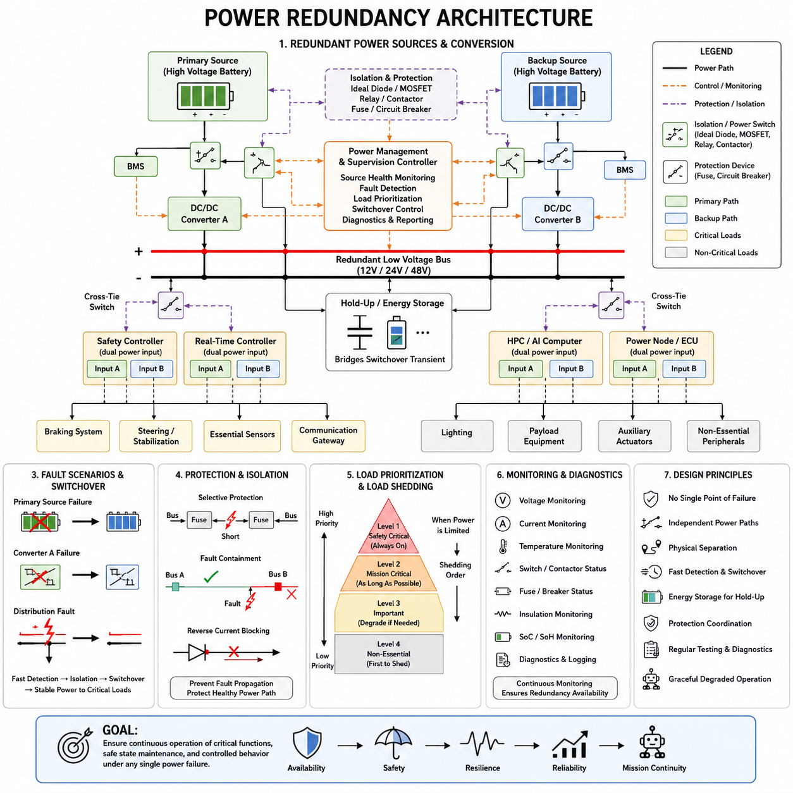
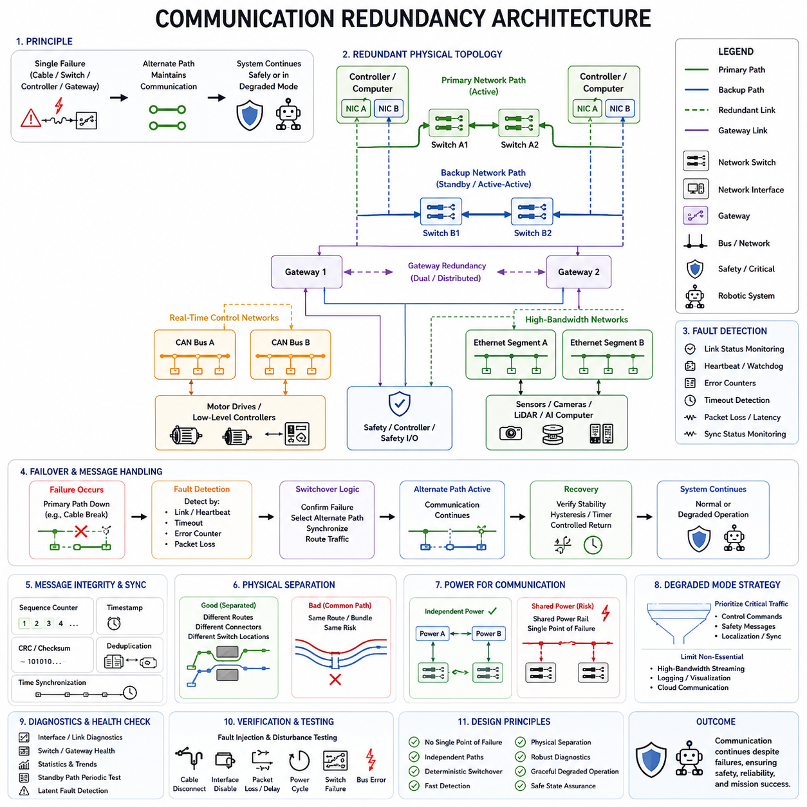
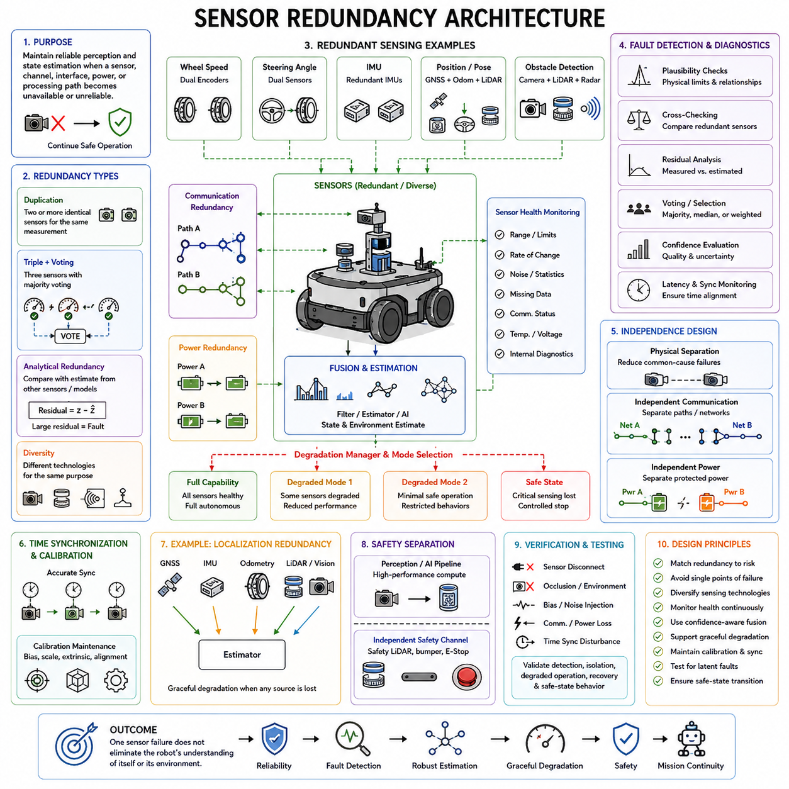
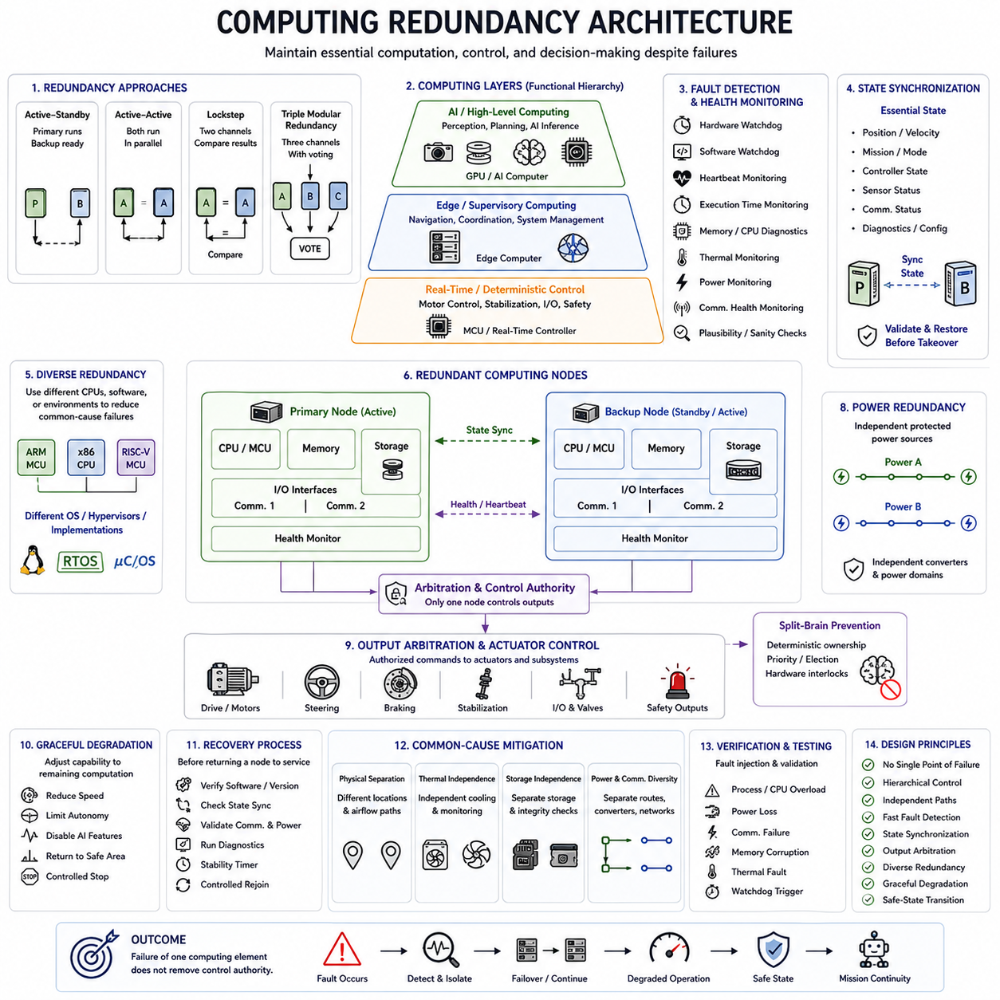
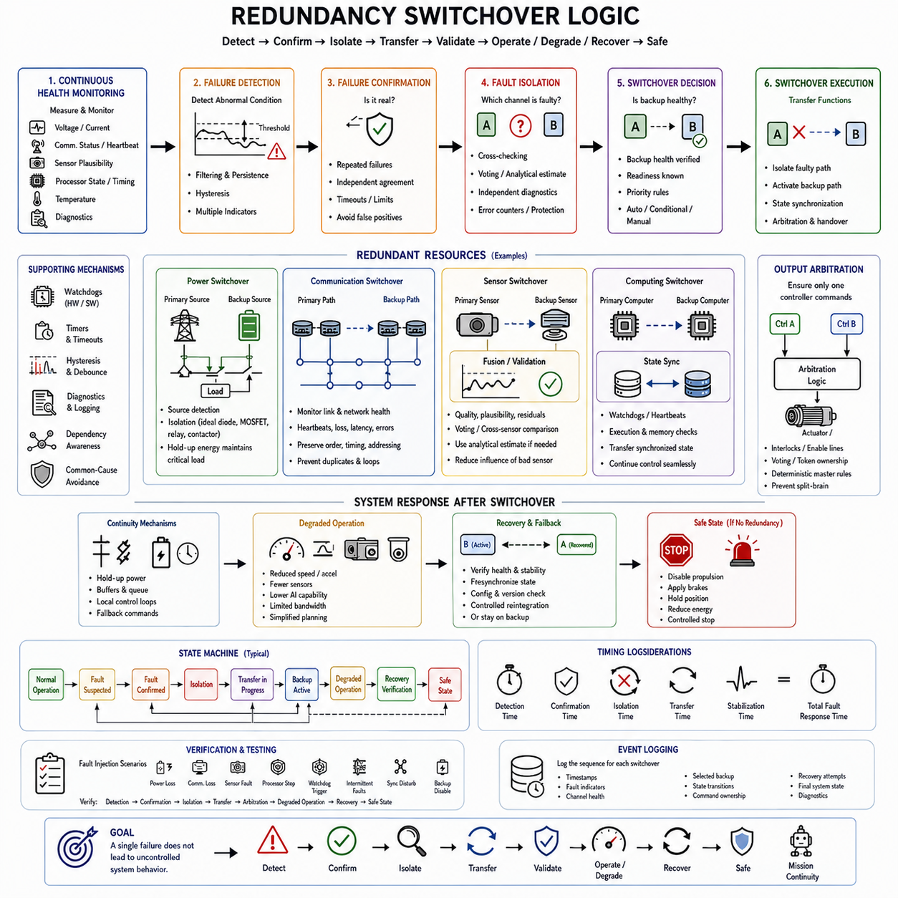

**Volume 01. Electrical Architecture Fundamentals**

# Chapter 08. Redundancy Design

## 08.01. Power Redundancy

{width="7.268055555555556in" height="7.268055555555556in"}

전원 이중화(Power Redundancy)는 주 전원 공급원(Primary Power Source), 전력 변환 단계(Power Conversion Stage), 배전 경로(Distribution Path) 또는 스위칭 장치(Switching Device)를 사용할 수 없게 되었을 때에도 필수적인 전기 기능(Electrical Function)을 유지하기 위한 아키텍처 설계 방식이다. 로보틱스(Robotics)와 피지컬 AI(Physical AI) 시스템에서 이중화는 단순한 연속 운전뿐만 아니라 전기적 고장 발생 시 제어된 동작, 안전 정지, 통신, 센싱 및 진단 기능까지 유지해야 한다.

이중 전원 아키텍처(Redundant Power Architecture)는 어떤 부하가 임무 필수 부하(Mission-Critical Load)이고 어떤 부하가 성능 저하 운전(Degraded Operation) 중 차단될 수 있는지를 식별하는 것에서 시작한다. 안전 제어기(Safety Controller), 제동 회로(Braking Circuit), 조향 또는 안정화 시스템, 필수 센서, 통신 게이트웨이 (Communication Gateway), 감독 컴퓨터(Supervisory Computer)는 보조 조명이나 탑재 장비, 비필수 컴퓨팅보다 높은 가용성(Availability)이 요구되는 경우가 많다. 이러한 분류에 따라 독립 전원 경로(Independent Power Path)가 필요한 위치가 결정된다.

가장 단순한 이중화 개념은 주 전원(Primary Source)과 백업 전원(Backup Source)을 제어된 전원 선택 회로(Power-Selection Circuitry)를 통해 연결하는 것이다. 백업 전원은 별도의 배터리, 보조 저전압 배터리(Auxiliary Low-Voltage Battery), 슈퍼커패시터 시스템(Supercapacitor System) 또는 독립형 DC 전원 공급장치가 될 수 있다. 하나의 고장난 전원이 정상 전원의 전압까지 떨어뜨리지 않도록 다이오드(Diode), 이상 다이오드 제어기(Ideal-Diode Controller), MOSFET 스위치, 릴레이(Relay), 접촉기(Contactor) 등의 절연 장치(Isolation Device)가 사용된다.

진정한 이중화(True Redundancy)는 단순히 두 개의 배터리를 설치하는 것만으로 달성되지 않는다. 두 전원이 동일한 퓨즈(Fuse), 커넥터(Connector), 버스바(Bus Bar), DC/DC 컨버터(DC/DC Converter), 접지 경로(Ground Path) 또는 전력 분배 장치(Power Distribution Unit)를 공유한다면 해당 요소가 단일 고장점(Single Point of Failure)이 될 수 있다. 따라서 아키텍처는 전원에서 부하까지 전체 경로를 평가해야 하며, 한 분기의 고장이 다른 이중화 분기를 비활성화하지 않도록 독립 분기(Independent Branch)를 충분한 범위까지 전기적으로 분리해야 한다.

전원 이중화는 액티브-액티브(Active-Active) 또는 액티브-대기(Active-Standby) 방식으로 구성할 수 있다. 액티브-액티브 아키텍처에서는 여러 전원 또는 컨버터가 동시에 전기 버스(Electrical Bus)를 지원하며 부하를 분담할 수 있다. 액티브-대기 아키텍처에서는 하나의 경로가 정상적으로 부하에 전력을 공급하고 다른 경로는 전환을 위해 대기한다. 액티브-액티브 방식은 보다 부드러운 전환을 제공할 수 있으며, 대기 방식은 부하 제어와 고장 격리(Fault Isolation)를 단순화할 수 있다.

고전압 배터리(High-Voltage Battery)가 저전압 전자장치(Low-Voltage Electronics)에 전력을 공급하는 시스템에서는 DC/DC 변환 이중화(Redundant DC/DC Conversion)가 특히 중요하다. 두 개의 컨버터가 하나의 공통 보호 저전압 버스(Common Protected Low-Voltage Bus)에 전력을 공급하거나 각각 독립적인 배전 분기를 담당할 수 있다. 하나의 컨버터 고장이 공통 전기 네트워크로 확산되지 않도록 전류 공유(Current Sharing), 역전류 차단(Reverse-Current Blocking), 출력 전압 허용오차, 기동 순서 및 고장 격리를 고려해야 한다.

배전 이중화(Distribution Redundancy)는 듀얼 버스(Dual Bus), 분할 버스(Segmented Bus) 또는 상호 연결 전력 도메인(Cross-Connected Power Domain)을 사용할 수 있다. 듀얼 버스 아키텍처에서는 중요한 부하를 절연된 입력을 통해 버스 A(Bus A)와 버스 B(Bus B)에 모두 연결하고 중요도가 낮은 부하는 하나의 버스에만 연결할 수 있다. 크로스 타이 스위치(Cross-Tie Switch)를 통해 고장 후 정상 전원이 다른 버스를 지원할 수 있지만, 잘못 제어하면 고장 영역과 정상 영역이 연결될 수 있으므로 신중한 제어가 필요하다.

연속 운전이 요구되는 이중화 부하(Redundant Load)는 가능하면 독립적인 전원 입력(Independent Power Input)을 지원해야 한다. 안전 제어기, 통신 게이트웨이 또는 고성능 컴퓨터(High-Performance Computer)는 서로 분리된 전원 공급 중 하나를 내부적으로 선택하는 듀얼 전원 입력 회로(Dual Power-Entry Circuit)를 가질 수 있다. 장비가 하나의 전원 입력만 제공한다면 외부 이중화 모듈(External Redundancy Module)이 전원을 선택할 수 있지만, 이 외부 선택기 자체가 또 다른 공통 고장점이 될 수 있으므로 함께 분석해야 한다.

고장 감지(Fault Detection)는 성공적인 이중화의 핵심 요소이다. 전압, 전류, 온도, 접촉기 상태, 퓨즈 상태, 절연 상태 및 컨버터 상태를 지속적으로 모니터링할 수 있다. 감독 제어기(Supervisory Controller)는 이러한 신호를 운전 한계값과 비교하여 각 전원 경로가 신뢰 가능한지를 판단할 수 있다. 감지 속도는 중요한 전원 레일(Power Rail)의 붕괴를 방지할 만큼 빨라야 하지만, 전환이 필요하지 않은 일시적인 교란(Transient Disturbance)은 구분할 수 있어야 한다.

전환 동작(Switchover Behavior)은 중요 부하 주변에서 사용할 수 있는 에너지 저장장치(Energy Storage)에 크게 영향을 받는다. 빠른 전자식 스위치조차 고장 감지와 전환에 유한한 시간이 필요하며 릴레이와 접촉기는 기계적인 동작으로 더 긴 시간이 필요할 수 있다. 로컬 커패시터(Local Capacitor), 홀드업 회로(Hold-Up Circuit), 전용 에너지 저장 모듈이 이러한 전력 공백을 보완할 수 있다. 저장 에너지는 전환 중 부하 전력과 허용 가능한 최대 전압 강하를 기준으로 계산해야 한다.

이중화는 완전한 전원 상실뿐만 아니라 과도 상태(Transient Condition)도 고려해야 한다. 모터, 서보 드라이브(Servo Drive), 펌프, 히터, GPU 및 기타 동적 부하(Dynamic Load)는 큰 전류 변화를 발생시켜 일시적으로 버스 전압을 낮출 수 있다. 정상적인 과도 현상이 발생할 때마다 백업 경로가 불필요하게 활성화되어서는 안 된다. 임계값, 필터링, 히스테리시스(Hysteresis), 타이밍 로직 및 부하 상태 정보를 이용하여 실제 전원 고장과 정상적인 동적 동작을 구분할 수 있다.

전원 경로 절연(Power-Path Isolation)은 보호 협조(Protection Coordination)와 밀접한 관계가 있다. 하나의 이중화 분기에서 단락(Short Circuit)이 발생하면 해당 로컬 퓨즈, 전자식 보호 장치 또는 회로 차단기(Circuit Breaker)가 다른 분기에 영향을 주기 전에 동작해야 한다. 따라서 보호 장치는 전류 정격과 트립 특성(Trip Characteristic)이 서로 조정되어야 한다. 선택적 보호(Selective Protection)가 없는 이중화에서는 하나의 하위 단락이 명목상 독립적인 두 전원을 모두 붕괴시킬 수 있다.

접지 아키텍처(Ground Architecture) 역시 이중화 분석에 포함되어야 한다. 양극 전원 경로를 두 개로 복제했다고 해서 자동으로 독립적인 전기 채널이 만들어지는 것은 아니다. 공유 접지 도체, 섀시 연결, 리턴 커넥터(Return Connector), 접지 접속점은 공통 고장 메커니즘(Common Failure Mechanism)을 발생시킬 수 있다. 중요 회로에는 독립적으로 배선된 리턴 경로나 신중하게 설계된 접지 구조가 필요할 수 있으며, 동시에 EMC, 차폐(Shielding), 등전위 본딩(Equipotential Bonding) 및 전기 안전 요구사항도 충족해야 한다.

물리적 분리(Physical Separation)는 이중화 채널의 효과를 향상시킨다. 두 개의 전기 경로가 동일한 커넥터, 하네스 번들(Harness Bundle), 인클로저(Enclosure) 또는 고온 영역을 통과한다면 기계적 충격, 수분 침투, 과열, 마모 또는 화재에 의해 동시에 손상될 수 있다. 위험 수준에 따라 이중 전원 공급 경로는 공통 원인 고장(Common-Cause Failure)을 줄이기 위해 서로 분리된 커넥터, 배선 경로, 보호 장치 및 배전 영역을 사용해야 한다.

배터리 이중화(Battery Redundancy)는 배터리마다 충전 상태(State of Charge), 전압, 온도, 내부 저항 및 건전 상태(State of Health)가 다를 수 있기 때문에 추가적인 제어가 필요하다. 상태가 서로 다른 배터리 팩을 직접 병렬 연결하면 제어되지 않는 평형 전류(Equalization Current)가 발생할 수 있다. 따라서 배터리 관리 시스템(Battery Management System)과 전원 경로 제어기(Power-Path Controller)는 연결, 프리차지(Precharge), 절연, 충전, 고장 감지 및 허용 전류를 조정하고 성능이 저하된 배터리가 정상 전원에 영향을 주지 않도록 해야 한다.

모바일 로봇(Mobile Robot)에서 이중화가 반드시 모든 액추에이터(Actuator)를 최대 성능으로 계속 작동시켜야 한다는 의미는 아니다. 전원 고장이 발생하면 시스템은 대신 성능 저하 운전 모드(Degraded Operating Mode)로 전환할 수 있다. 탑재 장비를 차단하고, 가속도를 제한하고, 컴퓨팅 전력을 줄이며, 비필수 센서를 비활성화하여 남아 있는 에너지를 조향, 제동, 위치 추정(Localization), 통신 또는 제어된 복귀에 사용할 수 있다. 따라서 이중화는 부하 차단(Load Shedding) 및 에너지 관리(Energy Management)와 밀접하게 연결된다.

피지컬 AI(Physical AI) 플랫폼에서는 AI 컴퓨팅(AI Computing)이 상당하면서도 동적으로 변화하는 전력을 소비하기 때문에 이러한 우선순위 결정이 특히 중요하다. 안전 관련 제어 기능의 전원을 제거하기 전에 GPU 또는 가속기(Accelerator)의 워크로드를 감소시킬 수 있다. 전기 아키텍처는 인지(Perception)와 AI 기능의 성능 저하가 결정론적 저수준 제어(Deterministic Low-Level Control)를 의도하지 않게 중단시키지 않도록 해야 한다. 따라서 전력 도메인(Power Domain)은 AI 연산, 실시간 제어(Real-Time Control), 안전 실행(Safety Execution) 사이의 기능적 계층 구조를 반영할 수 있다.

실용적인 이중 전원 아키텍처에는 소프트웨어와의 전원 상태 조정(Power-State Coordination)도 필요하다. 전기 시스템은 전원 상태, 잔여 백업 용량, 컨버터 고장 및 성능 저하 운전 상태를 상위 제어기에 전달해야 한다. 소프트웨어는 사용 가능한 전기적 능력에 따라 임무 동작을 변경할 수 있다. 반대로 소프트웨어 명령이 남아 있는 전력 예비량을 위협할 경우 전기 제어기는 독립적으로 하드웨어 수준의 보호 기능을 수행할 수 있다.

기동 및 종료 순서(Startup and Shutdown Sequence) 역시 이중화를 고려하여 설계해야 한다. 여러 전원과 컨버터를 사용하는 경우 서로 다른 전원 레일이 서로 다른 시점에 상승하거나 하강하면서 예상하지 못한 역급전(Backfeeding)이 발생할 수 있다. 따라서 제어기, 통신 인터페이스, 센서 및 전원 스위치는 정의된 시퀀싱 상태를 견딜 수 있어야 한다. 비활성화된 분기가 다른 모듈이나 통신 인터페이스를 통해 계속 통전되는 것을 방지하기 위해 제어된 방전(Controlled Discharge)과 절연도 중요하다.

진단 범위(Diagnostic Coverage)는 제품 수명 전체에 걸쳐 이중화 기능이 유효하게 유지되는지를 결정한다. 한 번도 시험되지 않은 백업 전원은 고장이 발생해도 발견되지 않은 상태로 유지되다가 주 전원까지 고장난 후에야 문제가 드러날 수 있다. 주기적인 자체 시험(Self-Test)을 통해 배터리 상태, 컨버터 출력, 스위칭 장치, 센싱 회로 및 통신 경로를 확인할 수 있다. 유지보수 정보는 잠재 고장(Latent Fault)을 표시하여 또 다른 독립 고장이 발생하기 전에 이중화 기능을 복구할 수 있도록 해야 한다.

이중화 설계에서는 독립 고장(Independent Failure)과 공통 원인 고장(Common-Cause Failure)을 구분해야 한다. 동일한 위치에 설치된 두 개의 동일한 컨버터는 같은 온도 상승, 제조 결함, 소프트웨어 오류 또는 과전압 사건에 동시에 영향을 받을 수 있다. 부품 종류, 제어 방식, 배선 경로, 물리적 위치 또는 전원 공급원의 다양성(Diversity)은 일부 공통 원인 위험을 줄일 수 있지만, 이러한 다양성은 엔지니어링, 검증, 유지보수 및 구성 관리의 복잡성도 증가시킨다.

따라서 필요한 이중화 수준(Redundancy Level)은 보편적인 규칙이 아니라 시스템 위험도(System Risk)를 기준으로 결정해야 한다. 중요하지 않은 보조 기능에는 하나의 보호 전원을 사용할 수 있지만 안전 필수 또는 임무 필수 기능에는 이중 전원, 이중 컨버터, 독립 배전 경로, 보호 스위칭 및 지속적인 진단이 필요할 수 있다. 과도한 중복 설계는 질량, 비용, 배선, 열 부하 및 고장 가능성을 증가시키므로 전원 상실이 허용할 수 없는 결과를 만드는 영역을 중심으로 이중화를 적용해야 한다.

이중 전원 아키텍처의 검증(Verification)에는 의도적인 고장 주입(Fault Injection)이 포함되어야 한다. 엔지니어는 시스템 동작을 관찰하면서 전원을 분리하고, 퓨즈를 개방하고, 보호된 분기에 단락을 발생시키며, 컨버터를 비활성화하고, 저전압(Undervoltage)을 인가하거나 스위칭 장치 고장을 모사할 수 있다. 시험은 백업 배터리가 연결되어 있다는 사실뿐만 아니라 고장 격리, 전환 시간, 전압 안정성, 진단 보고, 부하 차단, 성능 저하 운전 및 복구 기능을 확인해야 한다.

전원 이중화(Power Redundancy)는 궁극적으로 가용성(Availability), 고장 격리(Fault Containment), 보호 협조(Protection Coordination), 에너지 저장(Energy Storage), 진단(Diagnostics), 시스템 수준 제어(System-Level Control)를 결합하는 설계 개념이다. 견고한 아키텍처는 하나의 전기적 고장이 즉시 전체 로봇의 고장으로 확대되지 않도록 한다. 더 중요한 것은 필수 기능을 유지하고 정의된 성능 저하 상태로 전환하거나 제어되고 안전한 상태에 도달하기 위한 충분한 전기적 능력을 시스템에 제공하는 것이다.

## 08.02. Communication Redundancy

{width="7.268055555555556in" height="7.268055555555556in"}

통신 이중화(Communication Redundancy)는 네트워크 링크(Network Link), 통신 제어기(Communication Controller), 스위치(Switch), 게이트웨이(Gateway), 케이블(Cable), 커넥터(Connector) 또는 프로토콜 경로(Protocol Path)를 사용할 수 없게 되었을 때에도 필수적인 데이터 교환(Essential Data Exchange)을 유지하기 위한 아키텍처 설계 방식이다. 로보틱스(Robotics)와 피지컬 AI(Physical AI) 시스템에서는 통신 가용성(Communication Availability)이 센싱, 제어, 협조, 진단 및 안전에 직접적인 영향을 미치므로 네트워크 고장이 즉시 전체 시스템 고장으로 확대되지 않도록 격리해야 한다.

이중 통신 아키텍처(Redundant Communication Architecture)는 어떤 메시지와 인터페이스가 안전 및 임무 필수 운전(Safe and Mission-Critical Operation)에 필요한지를 식별하는 것에서 시작한다. 비상 명령(Emergency Command), 액추에이터 제어(Actuator Control), 안전 상태, 위치 추정(Localization) 정보, 동기화 데이터(Synchronization Data), 중요 센서 메시지는 일반적으로 유지보수 로그나 비필수 텔레메트리(Telemetry)보다 높은 가용성을 요구한다. 이러한 분류에 따라 링크, 인터페이스, 스위치, 게이트웨이 또는 네트워크의 이중화가 필요한 위치가 결정된다.

물리적 이중화(Physical Redundancy)는 중요한 노드(Node) 사이에 여러 개의 독립적인 전송 경로(Independent Transmission Path)를 제공한다. 하나의 제어기는 두 개의 이더넷 스위치(Ethernet Switch), 두 개의 CAN 채널(CAN Channel) 또는 두 개의 독립적인 통신 백본(Communication Backbone)에 연결될 수 있다. 케이블 손상, 커넥터 고장, 트랜시버(Transceiver) 이상 또는 스위치 고장으로 하나의 경로를 사용할 수 없게 되더라도 대체 경로를 통해 통신을 유지할 수 있다. 두 경로에는 단일 고장점(Single Point of Failure)이 될 수 있는 공통 구성요소를 가능한 한 배제해야 한다.

이중화 네트워크(Redundant Network)는 액티브-액티브(Active-Active) 또는 액티브-대기(Active-Standby) 구성으로 동작할 수 있다. 액티브-액티브 통신에서는 여러 경로가 동시에 트래픽(Traffic)을 전달하여 부하 분산과 빠른 고장 대응을 제공할 수 있다. 액티브-대기 통신에서는 일반적으로 하나의 주 경로(Primary Path)를 사용하고 다른 경로는 전환을 위해 대기한다. 적절한 구성은 대역폭(Bandwidth), 결정론적 동작(Deterministic Behavior), 전환 시간, 네트워크 복잡성 및 요구 가용성에 따라 결정된다.

통신 이중화는 단순히 케이블을 복제하는 것이 아니라 전체 종단 간 경로(End-to-End Path)를 고려해야 한다. 두 개의 네트워크 케이블이 동일한 고장난 스위치나 통신 제어기에 연결되어 있다면 완전한 독립성을 제공하지 못한다. 효과적인 이중화를 위해서는 별도의 트랜시버, 커넥터, 스위치, 게이트웨이, 전원 공급장치, 소프트웨어 인터페이스 및 라우팅 경로(Routing Path)가 필요할 수 있다. 공통 고장이 두 채널을 동시에 비활성화하지 않도록 아키텍처의 충분한 범위까지 독립성을 유지해야 한다.

CAN 기반 시스템(CAN-Based System)은 중요한 제어 기능을 위해 독립적인 CAN 버스(CAN Bus)를 구성하여 이중화를 구현할 수 있다. 제어기는 서로 다른 물리적 네트워크에 연결된 두 개의 CAN 인터페이스를 사용하여 하나의 채널이 고장난 이후에도 중요한 메시지를 유지할 수 있다. CAN 이중화는 메시지 중복(Message Duplication), 버스 오프(Bus-Off) 상태, 중재 동작(Arbitration Behavior), 오류 처리, 게이트웨이 의존성 및 어떤 통신 채널을 신뢰할 것인지 결정하는 로직을 함께 고려해야 한다.

산업용 로봇 시스템(Industrial Robotic System)에서도 시스템 요구사항에 따라 CANopen, EtherCAT, PROFINET, EtherNet/IP 또는 기타 산업용 네트워크(Industrial Network)에 이중화를 적용할 수 있다. 구체적인 이중화 메커니즘은 프로토콜과 구현 방식에 따라 달라지지만 아키텍처의 목적은 동일하다. 하나의 통신 채널에 장애가 발생하더라도 다른 사용 가능한 경로를 통해 필수적인 제어, 모니터링 또는 안전 상태 전환(Safe-State Transition)을 유지할 수 있어야 한다.

이더넷 기반 로보틱스 아키텍처(Ethernet-Based Robotics Architecture)는 스위치, 네트워크 인터페이스 제어기(Network Interface Controller), 링크 및 라우팅 경로를 복제함으로써 추가적인 이중화 구성을 제공할 수 있다. 엣지 컴퓨터(Edge Computer), AI 컴퓨터(AI Computer), 실시간 제어기(Real-Time Controller), 센서 처리 장치(Sensor-Processing Unit)는 독립적인 네트워크 세그먼트(Network Segment)에 연결된 여러 이더넷 인터페이스를 사용할 수 있다. 이중 이더넷 설계에서는 스위칭 동작, 주소 관리, 멀티캐스트 트래픽(Multicast Traffic), 혼잡(Congestion), 시간 동기화 및 토폴로지 변경 이후의 복구를 고려해야 한다.

로보틱스 통신(Robotics Communication)은 하나의 버스만 사용하는 것이 아니라 여러 네트워크 기술에 걸쳐 구성되는 경우가 많다. 피지컬 AI 플랫폼에서는 저수준 제어기(Low-Level Controller)와 모터 드라이브(Motor Drive) 사이에 CAN 또는 CANopen을 사용하고, 실시간 제어기, 엣지 컴퓨터, 센서 및 AI 컴퓨팅 플랫폼 사이에는 이더넷을 사용할 수 있다. 따라서 특히 결정론적 제어 네트워크(Deterministic Control Network)와 고대역폭 컴퓨팅 네트워크(High-Bandwidth Computing Network) 사이에서 정보를 변환하거나 전달하는 게이트웨이 구간을 포함하여 네트워크 경계를 넘는 이중화를 고려해야 한다.

통신 도메인(Communication Domain)이 중앙 게이트웨이에 의존하는 경우 게이트웨이 이중화(Gateway Redundancy)가 중요해진다. CAN, 산업용 이더넷, 일반 이더넷 또는 기타 네트워크를 연결하는 하나의 중앙 게이트웨이는 중요한 단일 고장점이 될 수 있다. 듀얼 게이트웨이(Dual Gateway) 또는 분산 라우팅 기능(Distributed Routing Function)을 사용하면 가용성을 높일 수 있지만, 정상 운전과 성능 저하 운전 중에 중복 명령, 라우팅 루프(Routing Loop), 상태 충돌 또는 일관되지 않은 전달 동작이 발생하지 않도록 조정해야 한다.

센서 통신 이중화(Sensor Communication Redundancy)는 센서 이중화(Sensor Redundancy)와 통신 경로 이중화를 구분해야 한다. 두 개의 센서가 동일한 스위치나 케이블 트렁크(Cable Trunk)에 연결되어 있다면 하나의 네트워크 고장으로 두 센서를 모두 사용할 수 없게 될 수 있다. 반대로 하나의 센서가 두 개의 독립 인터페이스를 가지고 있다면 링크 고장은 견딜 수 있지만 센싱 소자(Sensing Element) 자체의 고장은 견딜 수 없다. 따라서 견고한 아키텍처에서는 센서 이중화와 통신 이중화를 서로 연관되어 있지만 별개의 메커니즘으로 평가해야 한다.

통신 이중화에는 신뢰할 수 있는 고장 감지(Fault Detection)도 필요하다. 제어기는 링크 상태(Link State), 메시지 카운터(Message Counter), 통신 타임아웃(Communication Timeout), 순환 중복 검사(Cyclic Redundancy Check) 오류, 하트비트 메시지(Heartbeat Message), 버스 오류 카운터, 패킷 손실(Packet Loss), 지연시간(Latency) 및 동기화 상태를 모니터링할 수 있다. 이러한 지표를 통해 채널이 정상인지, 성능이 저하되었는지, 간헐적인 장애가 있는지 또는 완전히 사용할 수 없는지를 판단할 수 있다. 고장 감지 임계값은 대응이 지나치게 늦어지거나 일시적인 교란으로 불필요한 전환이 발생하지 않도록 설정해야 한다.

하트비트(Heartbeat)와 워치독(Watchdog) 메커니즘은 분산 로봇 제어기(Distributed Robotic Controller)에 특히 유용하다. 각 노드는 주기적으로 상태 정보를 전송하여 다른 제어기가 해당 노드의 동작 여부와 통신 상태를 확인할 수 있도록 한다. 메시지가 누락되거나 지연되면 진단 동작 또는 페일오버(Failover)를 시작할 수 있다. 그러나 하트비트가 사라졌다는 사실만으로 제어기, 통신 링크, 스위치, 게이트웨이 또는 전원 공급장치 중 어느 부분에서 고장이 발생했는지를 항상 식별할 수 있는 것은 아니므로 추가적인 진단 정보가 필요할 수 있다.

전환 로직(Switchover Logic)은 고장난 통신 경로에서 대체 경로로 시스템이 어떻게 전환되는지를 결정한다. 이러한 전환은 하드웨어, 네트워크 인프라(Network Infrastructure), 통신 미들웨어(Communication Middleware) 또는 응용 소프트웨어(Application Software)에 의해 제어될 수 있다. 중요 시스템에서는 감지 시간, 고장 확인 조건, 경로 선택, 메시지 동기화 및 복구 동작을 정의하는 결정론적 규칙이 필요하다. 목적은 통신 중단으로 인해 제어되지 않은 액추에이터 명령이나 일관되지 않은 시스템 상태가 발생하는 것을 방지하는 것이다.

메시지 중복 전송(Message Duplication)은 전환 지연(Switchover Delay)을 줄이는 방법 중 하나이다. 중요 정보를 두 개의 독립 채널을 통해 동시에 전송하여 수신기가 먼저 도착한 유효 메시지를 사용하거나 두 메시지를 비교할 수 있다. 시퀀스 카운터(Sequence Counter), 타임스탬프(Timestamp), 송신원 식별자(Source Identifier), 무결성 검사(Integrity Check)를 이용하면 동일한 명령이 중복 실행되는 것을 방지할 수 있다. 이 방식은 빠른 고장 허용성(Fault Tolerance)을 제공하지만 대역폭 사용량이 증가하며 지연되거나 순서가 변경된 메시지를 신중하게 처리해야 한다.

현대의 로봇 시스템은 동기화된 센서 및 제어 데이터에 의존하는 경우가 많기 때문에 네트워크 고장 중에도 시간 동기화(Time Synchronization)를 유지해야 한다. 카메라, 라이다(LiDAR), 관성 측정 장치(IMU), 제어기 및 분산 컴퓨터는 센서 융합(Sensor Fusion)과 협조된 실행을 위해 공통 시간 기준(Common Time Reference)을 필요로 할 수 있다. 주 동기화 경로가 고장날 경우 이중화된 클록 소스(Clock Source), 대체 동기화 경로 또는 제어된 홀드오버(Controlled Holdover) 메커니즘을 통해 허용 가능한 시간 정확도를 유지할 수 있다.

논리적으로 이중화된 네트워크도 동일한 환경적 위험을 공유할 수 있으므로 물리적 분리(Physical Separation)가 중요하다. 두 케이블이 동일한 하네스 번들(Harness Bundle), 커넥터, 케이블 체인(Cable Chain) 또는 기계적으로 취약한 영역을 통과하면 동시에 손상될 수 있다. 통신 가용성이 중요한 경우 충격, 마모, 열, 수분 또는 전자기적 교란으로 발생하는 공통 원인 고장(Common-Cause Failure)을 줄이기 위해 이중 채널의 배선 경로, 커넥터, 스위치 위치 및 전력 도메인(Power Domain)을 적절히 분리해야 한다.

전원 이중화(Power Redundancy)와 통신 이중화는 강하게 연결되어 있다. 두 개의 이중화 네트워크 스위치가 동일한 비보호 전원 레일(Unprotected Power Rail)에 연결되어 있다면 해당 전원이 상실될 때 두 스위치가 동시에 고장날 수 있다. 마찬가지로 복제된 통신 제어기가 하나의 DC/DC 컨버터나 퓨즈를 공유할 수도 있다. 따라서 통신 이중화 분석에는 스위치, 게이트웨이, 트랜시버, 제어기 및 센서에 전력을 공급하는 전원까지 포함하여 공유된 전기적 고장이 네트워크의 독립성을 무력화하지 않도록 해야 한다.

이중 통신 경로를 설치할 때는 전자기 적합성(Electromagnetic Compatibility, EMC)도 고려해야 한다. 모터 드라이브, 인버터(Inverter), 스위칭 전력 변환기(Switching Power Converter), 대전류 케이블 및 빠르게 스위칭되는 액추에이터는 통신 네트워크에 간섭을 발생시킬 수 있다. 이중 채널을 서로 가깝게 배선하면 동일한 전자기 간섭(Electromagnetic Interference, EMI)의 영향을 받을 수 있다. 적절한 분리, 차폐, 접지, 종단(Termination), 필터링, 케이블 선정 및 네트워크 진단을 통해 하나의 공통 교란이 두 통신 경로에 동시에 영향을 미치는 것을 방지해야 한다.

통신 장애가 항상 시스템의 즉각적인 정지를 요구하는 것은 아니다. 시스템은 대역폭을 많이 사용하는 트래픽이나 비필수 트래픽을 줄이고 중요한 제어 및 안전 메시지에 우선순위를 부여하는 성능 저하 통신 모드(Degraded Communication Mode)로 전환할 수 있다. 고해상도 센서 스트리밍, 로깅(Logging), 원격 시각화 또는 클라우드 통신을 제한하여 남아 있는 네트워크 용량을 위치 추정, 모션 제어(Motion Control), 안전 상태 및 필수 감독 명령에 사용할 수 있다.

피지컬 AI 시스템은 AI 워크로드와 결정론적 제어가 서로 다른 통신 특성을 가지므로 이러한 계층적 접근 방식(Hierarchical Approach)의 이점을 특히 크게 얻을 수 있다. 카메라와 라이다는 인지(Perception)를 위해 고대역폭 데이터를 생성하는 반면 모터 제어기는 상대적으로 작은 크기이지만 시간에 민감한 제어 메시지를 교환한다. 따라서 독립적인 실시간 통신 채널이 정상적으로 유지되어 정의된 안전 동작이나 성능 저하 동작을 수행할 수 있다면 AI 중심 이더넷 경로의 고장이 자동으로 저수준 모션 제어까지 중단시켜서는 안 된다.

진단 기능(Diagnostics)은 주 트래픽을 전달하지 않는 대기 상태에서도 이중화 채널이 정상적으로 동작하는지를 지속적으로 확인해야 한다. 한 번도 시험되지 않은 대기 네트워크(Standby Network)는 잠재 고장(Latent Fault)이 발생하더라도 실제 페일오버가 필요할 때까지 발견되지 않을 수 있다. 주기적인 링크 검사, 시험 메시지, 인터페이스 진단, 스위치 모니터링, 게이트웨이 상태 보고 및 통신 통계를 이용하면 또 다른 독립 고장이 발생하기 전에 이러한 잠재 고장을 발견할 수 있다.

통신이 복구된 이후에도 제어된 복구 동작(Controlled Recovery)이 필요하다. 링크가 다시 연결되자마자 선호되는 주 네트워크로 자동 복귀하면 간헐적 고장이 존재할 경우 반복적인 전환이 발생할 수 있다. 히스테리시스(Hysteresis), 안정화 타이머(Stability Timer), 상태 검증(Health Verification), 제어된 재통합(Controlled Reintegration)을 사용하면 네트워크가 반복적으로 전환되는 현상을 방지할 수 있다. 일부 시스템은 유지보수 주기 또는 사전에 정의된 복구 조건이 완료될 때까지 정상적인 백업 경로를 계속 사용할 수도 있다.

통신 이중화는 의도적인 고장 주입(Fault Injection)과 네트워크 교란 시험(Network Disturbance Testing)을 통해 검증해야 한다. 엔지니어는 시스템 동작을 관찰하면서 케이블을 분리하고, 인터페이스를 비활성화하고, 스위치 전원을 차단하고, 게이트웨이 경로를 차단하며, 패킷 손실이나 지연시간을 발생시키고, 동기화를 중단하거나 버스 오류를 강제로 발생시킬 수 있다. 검증에서는 고장 감지, 격리, 전환 시간, 메시지 연속성, 성능 저하 운전, 진단, 복구 및 안전 상태 동작을 확인해야 한다.

필요한 통신 이중화 수준(Redundancy Level)은 통신 상실로 발생하는 결과에 따라 결정된다. 중요하지 않은 텔레메트리는 일시적인 통신 중단을 허용할 수 있지만 제동, 조향, 안정화, 안전 센싱 또는 협조된 액추에이터 제어는 독립적인 통신 채널과 결정론적 페일오버가 필요할 수 있다. 지나친 중복은 배선, 인터페이스, 소프트웨어 복잡성, 네트워크 관리 작업 및 검증 비용을 증가시키므로 기능적 위험(Functional Risk)과 가용성 요구사항에 따라 필요한 영역에 선택적으로 이중화를 적용해야 한다.

통신 이중화(Communication Redundancy)는 궁극적으로 독립 네트워크 경로(Independent Network Path), 고장 감지(Fault Detection), 결정론적 전환(Deterministic Switchover), 메시지 무결성(Message Integrity), 시간 동기화(Time Synchronization), 물리적 분리(Physical Separation), 진단(Diagnostics), 성능 저하 운전 전략(Degraded-Operation Strategy)을 결합하는 설계 개념이다. 견고한 아키텍처는 하나의 통신 고장이 중요한 제어기를 즉시 고립시키거나 제어 권한(Control Authority)을 상실하게 하지 않는다. 대신 시스템이 안전한 운전을 지속하거나 기능을 제어된 방식으로 축소하거나 정의된 안전 상태(Safe State)로 전환할 수 있을 만큼 필수 정보 흐름을 유지하도록 한다.

## 08.03. Sensor Redundancy

{width="7.268055555555556in" height="7.268055555555556in"}

센서 이중화(Sensor Redundancy)는 개별 센서, 센싱 채널(Sensing Channel), 인터페이스, 전원 공급장치 또는 처리 경로(Processing Path)를 사용할 수 없거나 신뢰할 수 없게 되었을 때에도 신뢰성 있는 인지(Perception)와 상태 추정(State Estimation)을 유지하기 위한 아키텍처 설계 방식이다. 로보틱스(Robotics)와 피지컬 AI(Physical AI) 시스템에서 센서는 물리적 환경과 컴퓨팅 지능(Computational Intelligence)을 연결하므로, 센서 고장이 안전하지 않거나 제어되지 않는 동작으로 이어지기 전에 이를 감지하고 관리해야 한다.

이중 센서 아키텍처(Redundant Sensor Architecture)는 제어, 위치 추정(Localization), 인지 및 안전에 필수적인 물리량(Physical Quantity)을 식별하는 것에서 시작한다. 위치, 속도, 가속도, 자세(Orientation), 장애물 거리, 휠 속도, 관절 위치, 힘, 온도 및 환경 정보는 서로 다른 중요도(Criticality)를 가질 수 있다. 따라서 필요한 이중화 수준은 모든 센서를 단순히 복제하는 것이 아니라 각각의 측정값을 상실했을 때 발생하는 결과에 따라 결정해야 한다.

가장 단순한 형태의 이중화는 동일한 물리량을 측정하는 두 개의 센서를 사용하는 것이다. 듀얼 휠 엔코더(Dual Wheel Encoder), 듀얼 조향각 센서(Dual Steering-Angle Sensor), 이중 위치 센서 또는 복제된 관성 측정 장치(IMU)는 하나의 채널이 고장난 후에도 측정 기능을 지속할 수 있다. 그러나 동일한 환경에 노출된 동일 종류의 센서는 공통 고장 메커니즘(Common Failure Mechanism)을 공유할 수 있으므로 단순한 복제만으로 완전한 고장 허용성(Fault Tolerance)이나 독립적인 측정 능력을 보장할 수는 없다.

삼중 이중화(Triple Redundancy)는 다수결 투표(Majority Voting)를 통해 추가적인 진단 능력을 제공할 수 있다. 세 개의 독립 센서가 동일한 물리량을 측정하면 시스템은 각 센서의 출력을 비교하여 나머지 두 센서와 크게 다른 채널을 식별할 수 있다. 이 방식은 하나의 센서 고장 이후에도 지속적인 운전이 필요한 경우 유용하지만 하드웨어, 배선, 보정(Calibration), 연산, 패키징(Packaging) 및 검증의 복잡성을 증가시킨다.

분석적 이중화(Analytical Redundancy)는 반드시 동일한 하드웨어를 복제하지 않고도 사용할 수 있는 또 다른 접근 방식이다. 측정값을 다른 센서, 시스템 동역학(System Dynamics) 또는 수학적 모델(Mathematical Model)에서 계산된 추정값과 비교할 수 있다. 예를 들어 휠 속도를 추정 차량 속도와 비교하거나 IMU 측정값을 엔코더, 조향 또는 위치 추정 정보와 비교할 수 있다. 큰 잔차(Residual)가 발생하면 센서 고장이나 비정상 운전 상태를 나타낼 수 있다.

이종 이중화(Diverse Redundancy)는 서로 다른 센싱 기술을 사용하여 동일한 환경의 관련 특성을 관찰한다. 카메라, 라이다(LiDAR), 레이더(Radar), 초음파 센서(Ultrasonic Sensor), 위성항법시스템(GNSS), 관성 측정 장치(IMU), 휠 오도메트리(Wheel Odometry)는 각각 서로 다른 장점과 고장 모드를 가진다. 서로 다른 모달리티(Modality)를 결합하면 하나의 물리적 센싱 원리에 대한 의존성을 낮추고 어둠, 눈부심, 먼지, 비, 텍스처 부족, 가림(Occlusion), 다중경로 효과(Multipath Effect), 일시적 신호 차단 등에 대한 강건성(Robustness)을 향상시킬 수 있다.

센서 이중화와 센서 융합(Sensor Fusion)은 서로 관련되어 있지만 동일한 개념은 아니다. 센서 융합은 상호 보완적인 측정값을 결합하여 시스템이나 환경에 대한 더 나은 추정값을 생성하는 반면, 이중화는 고장이나 성능 저하가 발생한 이후에도 신뢰할 수 있는 운전을 지속하는 것을 목적으로 한다. 융합 시스템이라도 추정기(Estimator)가 정상적으로 동작하기 위해 하나의 필수 센서에 의존한다면 여전히 단일 고장점(Single Point of Failure)을 포함할 수 있다.

이중 센싱(Redundant Sensing)은 요구되는 가용성 수준에 따라 독립적인 통신 경로(Independent Communication Path)를 포함해야 한다. 두 센서가 동일한 통신 스위치, CAN 버스, 이더넷 세그먼트(Ethernet Segment), 커넥터 또는 게이트웨이를 통해 연결되어 있다면 하나의 통신 장애로 두 센서를 모두 사용할 수 없게 될 수 있다. 따라서 중요 센서에는 네트워크 고장이 센싱 이중화를 무력화하지 않도록 별도의 네트워크 인터페이스, 독립 버스, 이중 스위치 또는 대체 통신 경로가 필요할 수 있다.

전원 독립성(Power Independence)도 마찬가지로 중요하다. 두 개의 이중 센서가 동일한 퓨즈, DC/DC 컨버터, 배전 분기(Power Distribution Branch) 또는 커넥터에 연결되어 있다면 하나의 전기적 고장으로 동시에 작동하지 않을 수 있다. 중요 센싱 채널에는 독립적으로 보호되는 전원 공급 또는 별도의 전력 도메인(Power Domain)이 필요할 수 있다. 따라서 센서 이중화는 독립된 기능으로 설계하는 것이 아니라 전원 이중화(Power Redundancy) 및 통신 이중화(Communication Redundancy)와 연계하여 설계해야 한다.

물리적 배치(Physical Placement)는 이중화의 효과에 큰 영향을 미친다. 서로 인접하게 장착된 센서는 동일한 오염, 충격, 진동, 열 조건, 전자기 간섭(Electromagnetic Interference) 또는 시야 차단(Field-of-View Obstruction)의 영향을 받을 수 있다. 적절한 공간적 분리(Spatial Separation)는 공통 원인 고장(Common-Cause Failure)을 줄일 수 있지만, 지나치게 멀리 분리하면 센서들이 서로 다른 물리적 조건을 관찰하게 되어 비교, 동기화, 보정 및 융합이 복잡해질 수 있다.

센서 상태 모니터링(Sensor Health Monitoring)은 측정값을 계속 신뢰할 수 있는지를 판단하는 데 필요한 정보를 제공한다. 모니터링에는 신호 범위 검사, 변화율 제한(Rate-of-Change Limit), 노이즈 통계, 데이터 누락 감지, 통신 상태, 내부 진단 플래그(Diagnostic Flag), 온도, 공급 전압 및 다른 측정값과의 일관성 검사가 포함될 수 있다. 상태 평가는 완전한 센서 상실뿐만 아니라 점진적인 성능 저하, 바이어스(Bias), 드리프트(Drift), 간헐적 고장 및 환경적 교란까지 구분할 수 있어야 한다.

타당성 검사(Plausibility Checking)는 센서 측정값을 물리적으로 가능한 범위 또는 관계와 비교한다. 조향 센서는 물리적으로 불가능한 각도 변화를 보고해서는 안 되며, 엔코더는 예상되는 움직임과 일관성을 유지해야 하고, IMU는 알려진 불확실성 범위에서 차량 동역학(Vehicle Dynamics)과 일치하는 측정값을 생성해야 한다. 이러한 검사를 통해 센서가 외관상 정상적인 메시지를 계속 전송하는 경우에도 손상된 데이터를 식별할 수 있다.

이중 센서 간 교차 검사(Cross-Checking)는 또 다른 고장 감지 계층을 제공한다. 동일하거나 관련된 물리적 상태를 나타내는 측정값을 지속적으로 비교하고 예상 센서 정확도와 운전 조건을 기준으로 임계값을 설정할 수 있다. 측정값 사이에 차이가 발생했다고 해서 어떤 센서가 잘못되었는지를 자동으로 알 수 있는 것은 아니므로, 고장 채널을 격리하기 위해 추가 센서, 분석적 추정값, 신뢰도(Confidence Measure) 또는 과거 동작 정보가 필요할 수 있다.

여러 개의 동등한 센싱 채널을 사용할 수 있는 경우 투표 로직(Voting Logic)을 통해 신뢰할 수 있는 정보를 선택할 수 있다. 다수결 투표는 세 개 이상의 비교 가능한 센서가 독립적인 측정값을 제공할 때 효과적이며, 중앙값 선택(Median Selection)은 하나의 극단적인 측정값에 대한 민감도를 줄일 수 있다. 가중 투표(Weighted Voting)는 센서 정확도, 상태, 환경 적합성 및 신뢰도를 반영할 수 있다. 투표 메커니즘 자체도 일시적인 측정 차이를 불필요한 센서 제거로 전환하지 않도록 설계해야 한다.

센서 성능 저하(Sensor Degradation)는 완전한 고장보다 관리하기 어려운 경우가 많다. 카메라는 작동하면서도 일부가 가려질 수 있고, IMU에는 바이어스가 발생할 수 있으며, 엔코더는 간헐적으로 카운트를 잃을 수 있고, 라이다는 오염이나 날씨로 인해 성능이 저하될 수 있다. 따라서 이중화 관리에서는 단순한 정상 또는 고장(Healthy-or-Failed) 상태 정보에만 의존하지 않고 측정 품질(Measurement Quality)을 평가해야 한다.

신뢰도 인식 센싱(Confidence-Aware Sensing)을 사용하면 인지 또는 제어 시스템이 각각의 측정값을 어느 정도 신뢰할 것인지를 조정할 수 있다. 센서 신뢰도는 진단 정보, 환경 조건, 잔차 오류, 신호 품질 또는 추정기의 불확실성을 기반으로 계산할 수 있다. 신뢰도가 낮아지면 융합 알고리즘은 성능이 저하된 센서를 즉시 완전히 제거하는 대신 해당 채널의 영향력을 줄이고 더 정상적인 센서에 대한 의존도를 증가시킬 수 있다.

이중 측정값을 비교하거나 융합할 때는 시간 동기화(Time Synchronization)가 매우 중요하다. 정확한 두 센서라도 타임스탬프(Timestamp)가 서로 다른 물리적 시점을 나타낸다면 측정값이 일치하지 않는 것처럼 보일 수 있다. 카메라, 라이다, 레이더, IMU, 엔코더 및 분산 제어기는 충분한 정확도의 동기화 메커니즘을 사용해야 한다. 타이밍 고장(Timing Fault)은 센서 고장과 유사하게 나타날 수 있으므로 타임스탬프 품질과 동기화 상태 자체도 모니터링해야 한다.

이중 센싱 채널 사이의 보정(Calibration) 역시 지속적으로 유지되어야 한다. 바이어스, 스케일 팩터(Scale Factor), 장착 위치, 방향, 내부 파라미터(Intrinsic Parameter) 및 외부 파라미터 관계(Extrinsic Relationship)는 진동, 기계적 정비, 온도 변화 또는 부품 교체로 인해 시간에 따라 달라질 수 있다. 이중화 아키텍처는 실제 센서 고장과 보정 오류를 구분할 수 있어야 하며, 측정값 차이가 운전에 영향을 미치기 전에 재보정(Recalibration)이 필요한 시점을 진단할 수 있어야 한다.

위치 추정 시스템(Localization System)은 이종 센서 이중화의 가치를 잘 보여준다. GNSS는 실외에서 전역 위치(Global Position)를 제공할 수 있지만 실내나 구조물 주변에서는 사용할 수 없게 될 수 있다. 휠 오도메트리는 단기간의 이동 정보를 제공하지만 드리프트가 누적되며, IMU는 높은 주기의 관성 정보를 제공하지만 자체적인 바이어스 특성을 가진다. 카메라와 라이다는 환경 기준(Environmental Reference)을 제공할 수 있다. 이러한 정보원을 결합하면 하나의 모달리티가 신뢰성을 잃더라도 위치 추정 기능을 점진적으로 저하시켜 유지할 수 있다.

장애물 인지(Obstacle Perception) 역시 다양한 센싱의 이점을 얻는다. 카메라는 풍부한 의미론적 정보(Semantic Information)를 제공하고, 라이다는 정확한 기하학적 구조(Geometric Structure)를 제공하며, 레이더는 광학 센싱이 어려운 조건에서도 유용한 거리와 속도 측정값을 제공할 수 있다. 견고한 로봇은 각 모달리티의 운용 한계를 이해하고 환경 조건이 특정 센서의 성능을 저하시킬 경우 인지 신뢰도 또는 시스템 동작을 조정해야 한다.

안전 센싱(Safety Sensing)은 주 AI 인지 파이프라인(Main AI Perception Pipeline)과 분리해야 할 수 있다. 고성능 인지 시스템은 내비게이션을 위해 카메라와 라이다를 결합할 수 있으며, 독립적인 안전 라이다(Safety LiDAR), 범퍼(Bumper), 비상 스위치(Emergency Switch) 또는 보호 센서(Protective Sensor)는 별도의 안전 채널을 제공할 수 있다. 이를 통해 AI 컴퓨터, 인지 소프트웨어 또는 주 센서 네트워크가 고장나더라도 위험 상황을 감지할 수 있는 모든 수단이 동시에 상실되는 것을 방지할 수 있다.

따라서 피지컬 AI 아키텍처(Physical AI Architecture)는 고수준 인지 가용성(High-Level Perception Availability)과 결정론적 안전 요구사항(Deterministic Safety Requirement)을 분리해야 한다. 카메라 또는 AI 센서 스트림의 상실은 의미론적 이해나 자율 성능을 저하시킬 수 있지만 반드시 즉각적이고 제어되지 않은 정지를 요구하는 것은 아니다. 시스템은 남아 있는 센싱 능력과 관련 불확실성에 따라 속도를 낮추고, 기동을 제한하고, 자율 기능을 비활성화하거나 안전 상태(Safe State)로 전환할 수 있다.

점진적 성능 저하(Graceful Degradation)는 센서 이중화의 핵심 목표이다. 모든 센서 고장을 전체 시스템 고장으로 처리하는 대신 로봇은 사용 가능한 센싱 능력에 따라 서로 다른 운전 모드(Operating Mode)를 정의할 수 있다. 완전 자율 운전에는 모든 주요 모달리티가 필요할 수 있지만 일부 센서만으로도 저속 내비게이션(Reduced-Speed Navigation)을 유지할 수 있다. 안전 필수 센싱이 심각하게 상실되면 최종적으로 제어된 정지(Controlled Stop) 또는 정의된 안전 동작을 수행해야 한다.

센서 이중화에서는 잠재 고장(Latent Fault)의 관리도 필요하다. 정상 운전 중 사용하지 않는 백업 센서는 고장이 발생해도 발견되지 않은 상태로 유지되다가 실제로 필요해졌을 때 사용할 수 없을 수 있다. 따라서 대기 채널(Standby Channel)은 주기적으로 시험하거나 지속적으로 모니터링해야 한다. 진단 기능은 측정값의 유효성, 통신, 전원, 동기화, 보정 및 처리 기능을 확인하여 운전 전체 기간 동안 이중화 능력이 유지되도록 해야 한다.

센서가 다시 정상적으로 작동하기 시작한 이후의 고장 복구(Fault Recovery)도 제어된 방식으로 수행해야 한다. 이전에 고장났던 채널을 융합 또는 제어 시스템에 즉시 다시 삽입하면 고장이 간헐적인 경우 시스템 불안정성이 발생할 수 있다. 안정화 타이머(Stability Timer), 반복적인 상태 검사, 보정 검증, 신뢰도 복구(Confidence Recovery), 히스테리시스(Hysteresis)를 이용하여 센서가 실제로 신뢰할 수 있는 상태가 된 이후에 추정 또는 제어 과정에서 완전한 영향력을 다시 갖도록 해야 한다.

센서 이중화의 검증(Verification)에는 현실적인 고장 주입(Fault Injection)이 포함되어야 한다. 시험에서는 센서를 분리하고, 시야를 차단하고, 바이어스나 노이즈를 추가하고, 통신을 중단하고, 동기화를 교란하고, 전원을 제거하거나 측정값을 손상시키고, 환경적 성능 저하를 모사할 수 있다. 검증을 통해 대표적인 운전 조건에서 고장 감지, 격리, 재구성(Reconfiguration), 센서 융합 동작, 성능 저하 운전, 진단 보고, 복구 및 안전 상태 전환이 올바르게 이루어지는지를 확인해야 한다.

적절한 이중화 수준은 기능적 위험(Functional Risk)과 요구 가용성(Required Availability)에 따라 결정된다. 중요하지 않은 환경 센서는 일시적인 상실을 허용할 수 있지만 제동, 조향, 안정화, 충돌 회피(Collision Avoidance) 또는 안전한 인간 상호작용(Safe Human Interaction)을 지원하는 센서는 독립적인 채널과 더욱 강력한 진단 범위(Diagnostic Coverage)가 필요할 수 있다. 과도한 센서 복제는 비용, 전력 소비, 대역폭, 연산량, 보정 작업, 패키징 요구사항 및 시스템 복잡성을 증가시킨다.

센서 이중화(Sensor Redundancy)는 궁극적으로 복제 및 이종 센싱(Duplicated and Diverse Sensing), 분석적 추정(Analytical Estimation), 고장 감지(Fault Detection), 타당성 검사(Plausibility Checking), 투표(Voting), 신뢰도 관리(Confidence Management), 독립 전원 및 통신, 시간 동기화(Time Synchronization), 보정(Calibration), 점진적 성능 저하(Graceful Degradation)를 결합하는 설계 개념이다. 견고한 아키텍처는 하나의 센서 고장이 로봇 자신이나 주변 환경에 대한 이해를 즉시 상실하게 하지 않으며, 필수 기능을 지속하거나 제어된 안전 상태로 전환할 수 있도록 한다.

## 08.04. Computing Redundancy

{width="7.268055555555556in" height="7.268055555555556in"}

컴퓨팅 이중화(Computing Redundancy)는 프로세서(Processor), 제어기(Controller), 컴퓨터, 메모리 서브시스템(Memory Subsystem), 운영 환경(Operating Environment) 또는 처리 경로(Processing Path)를 사용할 수 없거나 신뢰할 수 없게 되었을 때에도 필수적인 연산, 제어 및 의사결정 기능을 유지하기 위한 아키텍처 설계 방식이다. 로보틱스(Robotics)와 피지컬 AI(Physical AI) 시스템에서 컴퓨팅 고장은 인지, 계획, 모션 제어, 통신 및 안전에 동시에 영향을 미칠 수 있으므로 고장 격리(Fault Containment)와 제어된 복구(Controlled Recovery)가 필수적이다.

이중 컴퓨팅 아키텍처(Redundant Computing Architecture)는 어떤 연산 기능이 안전 필수(Safety-Critical), 임무 필수(Mission-Critical) 또는 성능 관련 기능인지를 식별하는 것에서 시작한다. 저수준 액추에이터 제어, 비상 대응, 안정화, 위치 추정(Localization), 통신 감독, 인지(Perception), 계획(Planning), AI 추론(AI Inference)은 서로 다른 타이밍 및 가용성 요구사항을 가진다. 따라서 각각의 연산 기능을 상실했을 때 발생하는 결과에 따라 이중화를 배치해야 한다.

가장 단순한 컴퓨팅 이중화는 동일한 필수 기능을 수행할 수 있는 두 개의 처리 장치(Processing Unit)를 사용하는 것이다. 주 제어기(Primary Controller)가 정상 운전을 수행하고 백업 제어기(Backup Controller)는 고장이 감지된 후 제어 권한을 인계받을 준비 상태를 유지한다. 이러한 액티브-대기(Active-Standby) 구성은 가용성을 향상시킬 수 있지만, 대기 프로세서는 허용되는 중단 시간 내에 제어를 인계받을 수 있도록 충분한 상태 정보를 수신하고 정상 상태를 유지해야 한다.

액티브-액티브 컴퓨팅(Active-Active Computing)은 하나의 장치를 대기 상태로 유지하는 대신 여러 프로세서를 동시에 사용한다. 두 컴퓨터가 동일한 기능을 실행하거나 워크로드(Workload)를 분담하거나 동일한 입력을 독립적으로 처리하여 결과를 비교할 수 있다. 액티브-액티브 방식은 전환 지연(Switchover Delay)을 줄이고 연산 결과의 불일치를 빠르게 발견할 수 있지만 동기화, 중재(Arbitration), 출력 관리 및 서로 충돌하는 명령이 액추에이터로 전달되는 것을 방지하는 메커니즘이 필요하다.

록스텝 처리(Lockstep Processing)는 두 처리 채널이 동등한 연산을 수행하고 그 결과를 지속적으로 비교하는 보다 강력한 형태의 연산 비교 방식이다. 결과가 일치하지 않으면 하드웨어, 메모리, 타이밍 또는 실행 고장을 나타낼 수 있다. 록스텝 아키텍처는 빠른 고장 감지를 제공할 수 있지만 동일한 두 프로세서는 공통 설계 오류, 소프트웨어 결함, 전원 고장 또는 환경적 교란에 여전히 동시에 영향을 받을 수 있다.

삼중 모듈 이중화(Triple Modular Redundancy)는 세 개의 연산 채널과 투표 로직(Voting Logic)을 사용하여 하나의 잘못된 결과를 허용할 수 있도록 한다. 하나의 프로세서가 다른 두 프로세서와 다른 결과를 생성하면 다수결 투표(Majority Voting)를 통해 일관된 출력을 선택하고 비정상 채널을 식별할 수 있다. 이 아키텍처는 하나의 고장 이후에도 지속적인 운전을 지원할 수 있지만 하드웨어, 전력 소비, 열 부하, 통신, 동기화, 패키징 및 검증 복잡성을 크게 증가시킨다.

컴퓨팅 이중화에서 모든 이중 채널이 반드시 동일한 하드웨어를 사용할 필요는 없다. 이종 이중화(Diverse Redundancy)는 서로 다른 프로세서, 마이크로컨트롤러(Microcontroller), 운영 환경 또는 소프트웨어 구현을 결합하여 공통 원인 고장(Common-Cause Failure)을 줄일 수 있다. 동일한 플랫폼이 같은 실리콘 결함, 드라이버 문제, 운영체제 고장 또는 소프트웨어 오류를 공유할 가능성이 있는 경우 이종성이 특히 유용하지만, 이종 시스템은 개발과 검증이 더욱 어렵다.

로봇 컴퓨팅 아키텍처(Robotic Computing Architecture)는 하나의 중앙 컴퓨터가 아니라 여러 연산 계층(Computational Layer)으로 구성되는 경우가 많다. 마이크로컨트롤러 또는 실시간 제어기(Real-Time Controller)는 빠르고 결정론적인 모터 제어를 수행하고, 엣지 컴퓨터(Edge Computer)는 내비게이션과 시스템 협조를 담당하며, GPU 기반 컴퓨터는 인지 및 AI 모델을 실행할 수 있다. 이중화는 하나의 백업 컴퓨터가 모든 연산 계층을 대체할 수 있다고 가정하는 대신 이러한 기능적 계층 구조를 유지해야 한다.

저수준 제어 이중화(Low-Level Control Redundancy)는 액추에이터 제어 루프가 고수준 AI 의사결정 주기보다 훨씬 빠르게 동작할 수 있기 때문에 특히 중요하다. 모터 전류, 속도, 조향, 제동, 안정화 또는 관절 제어는 엣지 AI 컴퓨터를 사용할 수 없게 되더라도 로컬에서 계속 수행될 수 있다. 결정론적 제어(Deterministic Control)를 고수준 지능(High-Level Intelligence)과 분리하면 연산 집약적인 AI 워크로드의 고장이 기본적인 제어 권한(Control Authority)을 즉시 제거하는 것을 방지할 수 있다.

따라서 피지컬 AI 시스템은 점진적 컴퓨팅 성능 저하(Graceful Computational Degradation)를 사용할 수 있다. GPU, 가속기(Accelerator) 또는 AI 프로세스가 손실되면 고급 인지, 의미론적 추론(Semantic Reasoning) 또는 복잡한 계획 기능은 사용할 수 없게 될 수 있지만 저수준 제어기는 안정적인 움직임을 계속 유지하거나 사전에 정의된 안전 대응을 실행할 수 있다. 시스템은 남아 있는 컴퓨팅 능력에 따라 속도를 줄이고, 자율성을 제한하고, 새로운 임무의 수락을 중단하고, 안전 영역으로 복귀하거나 제어된 정지(Controlled Stop)를 수행할 수 있다.

대기 프로세서가 제어 권한을 인계받아야 하는 경우 상태 동기화(State Synchronization)가 필수적이다. 백업 컴퓨터에는 현재 위치, 속도, 임무 상태, 제어기 상태, 센서 상태, 통신 상태 및 진단 정보가 필요할 수 있다. 동기화가 불완전하거나 지연되면 백업 시스템이 일관되지 않은 상태에서 시작할 수 있다. 따라서 이중화 시스템에는 운전 상태를 전달하고, 복제하고, 검증하고, 복원하기 위한 명확한 메커니즘이 필요하다.

모든 내부 상태(Internal State)를 반드시 복제할 필요는 없다. 안전 관련 제어기에는 제한된 결정론적 상태만 필요할 수 있지만 복잡한 AI 시스템은 대규모 신경망 컨텍스트(Neural-Network Context), 지도(Map), 버퍼(Buffer) 또는 인지 이력(Perception History)을 포함할 수 있다. 아키텍처는 즉각적인 제어 인계에 필수적인 정보와 페일오버(Failover) 이후 다시 생성할 수 있는 정보를 구분하여 복구 속도와 통신 및 저장 오버헤드 사이의 균형을 결정해야 한다.

고장 감지(Failure Detection)는 하드웨어 워치독(Hardware Watchdog), 소프트웨어 워치독(Software Watchdog), 하트비트 메시지(Heartbeat Message), 실행 시간 모니터링, 메모리 검사, 프로세서 진단, 온도 모니터링, 전원 모니터링, 통신 상태 및 응용 수준 타당성 검사(Application-Level Plausibility Check)를 결합하여 수행할 수 있다. 프로세서에 전원이 계속 공급되고 있더라도 교착 상태(Deadlock), 타이밍 위반, 메모리 손상, 소프트웨어 폭주(Runaway Software) 또는 성능 저하로 인해 연산적으로 비정상적인 상태가 될 수 있다.

워치독 감독(Watchdog Supervision)은 임베디드 및 실시간 제어기에서 특히 중요하다. 독립적인 워치독은 중요한 소프트웨어가 예상되는 타이밍 범위 내에서 실행되는지를 확인하고, 프로세서가 정상적으로 응답하지 않으면 이를 리셋하거나 격리할 수 있다. 더욱 강력한 고장 격리를 위해서는 워치독 또는 감독 기능이 감시 대상과 동일한 프로세서, 소프트웨어 스택(Software Stack) 또는 전력 도메인(Power Domain)에 전적으로 의존하지 않아야 한다.

여러 프로세서가 동일한 액추에이터 또는 서브시스템에 명령을 전달할 수 있으므로 컴퓨팅 이중화에는 출력 중재(Output Arbitration)가 포함되어야 한다. 아키텍처는 특정 시점에 권한을 가진 하나의 연산 채널만 출력을 제어하도록 보장해야 한다. 하드웨어 게이트(Hardware Gate), 안전 제어기(Safety Controller), 통신 소유권 규칙, 투표 로직 또는 명령 유효성(Command Validity) 메커니즘을 통해 정상 운전, 페일오버 및 복구 과정에서 서로 충돌하는 명령이 발생하는 것을 방지할 수 있다.

분할 두뇌 현상(Split-Brain Behavior)은 이중 컴퓨팅 시스템의 주요 위험 중 하나이다. 통신 또는 동기화 고장 이후 두 제어기가 모두 자신이 활성 마스터(Active Master)라고 판단하면 서로 모순되는 명령을 전달할 수 있다. 중재 메커니즘은 하드웨어 인터록(Hardware Interlock), 결정론적 선출 규칙(Deterministic Election Rule), 독립 감독 또는 사전에 정의된 우선순위를 통해 명확한 제어 소유권을 설정하여 통신 상실이 여러 개의 통제되지 않은 제어 권한을 생성하지 않도록 해야 한다.

통신 이중화(Communication Redundancy)는 컴퓨팅 이중화와 밀접하게 연결되어 있다. 두 컴퓨터가 동일한 네트워크 스위치, 게이트웨이, 케이블 또는 통신 인터페이스에 의존한다면 효과적인 페일오버를 제공할 수 없다. 따라서 이중 프로세서는 센서 입력, 액추에이터 명령, 상태 동기화 및 상태 모니터링을 위해 독립적인 통신 경로를 필요로 할 수 있다. 공유 통신 인프라(Shared Communication Infrastructure)는 잠재적인 공통 고장점(Common Failure Point)으로 평가해야 한다.

전원 이중화(Power Redundancy)도 동일하게 중요하다. 하나의 전원 레일(Power Rail)에 연결된 두 컴퓨터는 전원 고장 시 동시에 작동하지 않을 수 있다. 중요 프로세서에는 독립적으로 보호된 전원 공급, 별도의 DC/DC 컨버터, 절연된 전력 도메인 또는 로컬 홀드업 에너지(Local Hold-Up Energy)가 필요할 수 있다. 따라서 한 아키텍처 계층의 이중화가 다른 계층의 단일 고장으로 무력화되지 않도록 컴퓨팅, 통신 및 전원 이중화를 함께 설계해야 한다.

열 설계(Thermal Design) 역시 공통 원인 고장을 발생시킬 수 있다. 동일한 인클로저(Enclosure)에 설치된 두 개의 이중 컴퓨터는 공통 팬, 냉각 루프(Cooling Loop), 공기 흐름 경로 또는 열 환경이 고장날 경우 동시에 기능을 상실할 수 있다. 고성능 AI 컴퓨터와 GPU는 상당한 열을 발생시킬 수 있으므로 열적 독립성(Thermal Independence)과 온도 모니터링도 가용성과 관련된다. 따라서 이중화 분석에서는 냉각 시스템을 지원 인프라(Supporting Infrastructure)의 일부로 포함해야 한다.

메모리와 저장장치(Storage)는 숨겨진 단일 고장점이 될 수 있다. 이중 프로세서가 동일한 저장장치에서 부팅하거나 하나의 구성 데이터베이스(Configuration Database)를 공유하거나 동일한 파일 시스템에 의존한다면 해당 자원을 사용할 수 없거나 손상될 때 동시에 고장날 수 있다. 중요한 소프트웨어, 구성 정보, 보정 데이터 및 복구 정보에는 시스템 위험 수준에 적합한 보호된 로컬 복사본, 무결성 검사(Integrity Checking), 버전 관리(Version Control) 또는 이중 저장장치가 필요할 수 있다.

소프트웨어 이중화(Software Redundancy)는 하드웨어 고장과 체계적 소프트웨어 고장(Systematic Software Failure)을 구분해야 한다. 동일한 결함이 있는 소프트웨어를 두 개의 동일한 컴퓨터에서 실행하는 것은 공통 알고리즘 또는 구현 오류로부터 시스템을 보호하지 못한다. 독립적인 모니터링, 단순화된 폴백 소프트웨어(Simplified Fallback Software), 이종 구현(Diverse Implementation), 안전 커널(Safety Kernel) 또는 별도로 개발된 안전 기능을 사용하면 공통 소프트웨어 고장의 결과가 심각한 영역에서 추가적인 보호를 제공할 수 있다.

안전 컴퓨팅(Safety Computing)은 주 AI 컴퓨팅 환경(Main AI Computing Environment)과 독립적으로 유지하는 것이 바람직한 경우가 많다. GPU 컴퓨터가 인지, 월드 모델링(World Modeling), 계획 또는 학습 기반 추론(Learned Inference)을 수행하는 동안 소형 안전 제어기가 비상 입력, 속도 제한, 통신 상태, 액추에이터 상태 및 보호 센서를 독립적으로 감시할 수 있다. 이러한 분리를 통해 고성능 컴퓨팅 플랫폼이 불안정하거나 사용할 수 없게 되더라도 시스템은 안전한 동작을 강제할 수 있다.

페일오버 시간(Failover Timing)은 제어 대상 시스템의 동역학(Dynamics)에 맞아야 한다. 감독 컴퓨터(Supervisory Computer)는 수백 밀리초의 중단을 허용할 수 있지만 안정화 또는 액추에이터 제어 루프는 훨씬 빠른 연속성을 요구할 수 있다. 로컬 제어기, 버퍼링된 명령(Buffered Command), 마지막 값 유지 전략(Hold-Last-Value Strategy), 사전 정의된 폴백 궤적(Fallback Trajectory) 또는 즉각적인 안전 출력을 이용하여 이중 처리 권한이 확립되는 동안 짧은 컴퓨팅 중단을 보완할 수 있다.

복구(Recovery)는 페일오버와 별도의 과정으로 취급해야 한다. 고장난 프로세서가 재시작된 이후 단순히 다시 응답하기 시작했다는 이유만으로 자동으로 제어 권한을 되찾아서는 안 된다. 먼저 소프트웨어 버전, 구성, 동기화된 상태, 통신 상태, 센서 입력, 타이밍 동작 및 진단 상태를 확인해야 한다. 안정화 타이머(Stability Timer)와 제어된 재통합(Controlled Reintegration)을 통해 간헐적인 고장이 연산 제어 권한의 반복적인 전환을 발생시키는 것을 방지할 수 있다.

진단 기능(Diagnostics)은 대기 컴퓨팅 자원이 정상적으로 동작하는지를 지속적으로 확인해야 한다. 전원이 공급되지만 사용되지 않는 백업 컴퓨터에는 잠재적인 하드웨어, 소프트웨어, 저장장치, 통신 또는 구성 고장(Latent Fault)이 존재할 수 있다. 주기적인 자체 시험(Self-Test), 하트비트 처리, 메모리 진단, 통신 검사, 워크로드 시험 및 제어된 역할 교환(Controlled Role Exchange)을 통해 이중 채널이 의도된 기능을 인계받을 수 있는 상태로 유지되고 있음을 확인할 수 있다.

컴퓨팅 이중화는 의도적인 고장 주입(Fault Injection)을 통해 검증해야 한다. 엔지니어는 프로세스를 중지하고, CPU에 과부하를 발생시키고, 네트워크 인터페이스를 비활성화하고, 통신을 손상시키고, 프로세서 전원을 제거하고, 워치독을 작동시키고, 동기화를 교란하거나 저장장치 및 열 관련 고장을 모사할 수 있다. 시험에서는 고장 감지, 격리, 출력 중재, 상태 전달, 페일오버 시간, 성능 저하 운전, 진단 보고, 복구 및 안전 상태 전환을 확인해야 한다.

필요한 이중화 수준(Redundancy Level)은 기능적 위험(Functional Risk), 가용성 목표(Availability Objective), 허용 가능한 성능 저하 동작에 따라 결정된다. 중요하지 않은 사용자 인터페이스 또는 로깅 기능은 재시작이나 일시적 상실을 허용할 수 있지만 제동, 안정화, 조향, 안전 감독 또는 중요한 모션 제어에는 독립적인 처리 채널이 필요할 수 있다. 과도한 복제는 비용, 전력, 냉각, 소프트웨어 복잡성, 통합 작업 및 검증 부담을 증가시킨다.

컴퓨팅 이중화(Computing Redundancy)는 궁극적으로 독립 프로세서(Independent Processor), 계층적 제어(Hierarchical Control), 고장 감지(Fault Detection), 상태 동기화(State Synchronization), 출력 중재(Output Arbitration), 이종 폴백 메커니즘(Diverse Fallback Mechanism), 독립 전원 및 통신, 진단(Diagnostics), 점진적 성능 저하(Graceful Degradation)를 결합하는 설계 개념이다. 견고한 아키텍처는 하나의 컴퓨팅 요소 고장이 즉시 제어 권한을 제거하지 않도록 하며, 로봇이 필수 기능을 유지하고 예측 가능한 방식으로 기능을 축소하거나 제어된 안전 상태(Controlled Safe State)로 전환할 수 있도록 한다.

## 08.05. Redundancy Switchover Logic

{width="7.268055555555556in" height="7.268055555555556in"}

이중화 전환 로직(Redundancy Switchover Logic)은 고장을 감지하고, 영향을 받은 채널을 계속 신뢰할 수 있는지 판단하며, 고장 경로를 격리하고, 필수 기능을 사용 가능한 이중화 자원(Redundant Resource)으로 이전하는 조정 메커니즘이다. 로보틱스(Robotics)와 피지컬 AI(Physical AI) 시스템에서 전환은 전원, 통신, 센서 또는 컴퓨팅 영역에서 발생할 수 있으므로, 전환 로직은 고장이 다른 아키텍처 영역으로 확산되는 것을 방지하면서 제어 연속성(Control Continuity)을 유지해야 한다.

전환 과정(Switchover Process)은 주 채널(Primary Channel)과 이중화 채널(Redundant Channel)의 상태를 지속적으로 모니터링하는 것에서 시작한다. 전압, 전류, 통신 상태, 하트비트 신호(Heartbeat Signal), 센서 타당성(Sensor Plausibility), 프로세서 실행 상태, 온도, 타이밍 및 진단 정보는 시스템 상태를 판단하는 근거를 제공할 수 있다. 모니터링 메커니즘은 정상적인 과도 상태(Transient Condition)에 불필요하게 반응하지 않으면서 완전한 고장과 점진적인 성능 저하를 모두 감지할 수 있어야 한다.

고장 감지 임계값(Failure Detection Threshold)은 모니터링 대상 기능의 동역학(Dynamics)을 반영해야 한다. 짧은 전압 강하, 지연된 네트워크 패킷, 일시적인 센서 불일치 또는 짧은 연산 과부하가 자동으로 중대한 아키텍처 전환을 발생시켜서는 안 된다. 필터링, 지속 시간 타이머(Persistence Timer), 히스테리시스(Hysteresis), 통계적 평가 및 여러 진단 지표를 이용하여 일시적인 교란과 격리 및 전환이 필요한 실제 고장을 구분할 수 있다.

비정상 상태가 감지되면 고장 확인(Failure Confirmation)을 통해 해당 사건이 실제 전환을 수행할 만큼 충분히 신뢰할 수 있는지를 판단한다. 고장 확인에는 반복적인 진단 실패, 독립 모니터 사이의 판단 일치, 타임아웃(Timeout) 만료 또는 안전 한계 위반이 요구될 수 있다. 이 단계는 오탐(False Positive)으로 인해 불필요한 전환이 발생하여 제어, 통신, 인지 또는 전원 안정성을 오히려 방해하는 것을 방지한다.

고장 격리(Fault Isolation)는 비정상 상태를 발생시킨 채널 또는 구성요소를 식별한다. 두 개의 이중화 신호가 서로 다르다는 사실을 감지하는 것만으로는 어느 신호가 잘못되었는지를 판단할 수 없다. 교차 검사(Cross-Checking), 투표(Voting), 분석적 추정(Analytical Estimate), 독립 진단, 전기 보호 상태, 통신 오류 카운터 또는 감독 모니터링(Supervisory Monitoring)을 통해 제어 권한을 이전하기 전에 고장 원인을 식별할 수 있다.

전환 결정(Switchover Decision)은 주 채널의 고장 여부뿐만 아니라 백업 채널(Backup Channel)이 정상인지도 고려해야 한다. 검증되지 않은 백업으로 제어를 이전하면 관리 가능한 단일 고장이 전체 기능 상실로 확대될 수 있다. 따라서 이중화 자원은 활성 운전 대상으로 선택되기 전에 준비 상태(Readiness)를 알 수 있도록 지속적으로 모니터링하거나 주기적으로 시험해야 한다.

전환 아키텍처(Switchover Architecture)는 기능 요구사항에 따라 자동 전환(Automatic Transition), 조건부 전환(Conditional Transition) 또는 수동 감독 전환(Manually Supervised Transition)을 사용할 수 있다. 안전 필수 기능(Safety-Critical Function)은 일반적으로 사람의 반응이 너무 느릴 수 있으므로 자동 대응이 필요하다. 중요도가 낮은 기능은 감독자의 확인을 허용할 수 있다. 결정 메커니즘은 어떤 고장이 즉각적인 전환, 성능 저하 운전, 제어된 종료 또는 유지보수 개입을 발생시키는지를 명확하게 정의해야 한다.

여러 개의 이중화 자원을 사용할 수 있는 경우 우선순위 규칙(Priority Rule)이 필요하다. 시스템은 상태, 잔여 에너지, 연산 능력, 통신 품질, 센서 신뢰도(Sensor Confidence), 열 상태 또는 사전에 정의된 아키텍처 우선순위에 따라 선호되는 백업을 선택할 수 있다. 결정론적 선택 규칙(Deterministic Selection Rule)은 모호성을 줄이고 서로 다른 제어기가 독립적으로 충돌하는 복구 경로를 선택하는 것을 방지한다.

전원 전환 로직(Power Switchover Logic)은 전원 감지, 격리, 스위칭 장치 및 부하 동작을 조정해야 한다. 주 전원이나 컨버터가 고장나면 고장 경로가 정상 전원까지 불안정하게 만들기 전에 이를 분리해야 한다. 이상 다이오드(Ideal Diode) 회로, MOSFET 스위치, 릴레이(Relay), 접촉기(Contactor) 또는 크로스 타이 장치(Cross-Tie Device)가 전환을 수행할 수 있으며, 홀드업 커패시터(Hold-Up Capacitor)나 로컬 에너지 저장장치는 전환 중 중요 전압을 유지할 수 있다.

통신 전환 로직(Communication Switchover Logic)은 링크, 스위치, 게이트웨이, 인터페이스 또는 통신 도메인(Communication Domain)을 사용할 수 없게 되었을 때 대체 네트워크 경로를 선택한다. 링크 상태, 하트비트 타임아웃, 패킷 손실(Packet Loss), 지연시간(Latency), 오류 카운터 및 동기화 품질을 전환 판단에 사용할 수 있다. 전환 과정에서는 중복 명령이나 라우팅 루프(Routing Loop)를 방지하면서 메시지 순서, 무결성, 주소 지정, 타이밍 및 명령 소유권(Command Ownership)을 유지해야 한다.

센서 전환 로직(Sensor Switchover Logic)은 완전한 센서 상실뿐만 아니라 측정 품질(Measurement Quality)도 고려해야 한다. 성능이 저하된 센서는 바이어스(Bias), 노이즈, 드리프트(Drift), 가림 또는 간헐적인 오류가 발생하면서도 계속 데이터를 전송할 수 있다. 타당성 검사(Plausibility Check), 잔차 분석(Residual Analysis), 신뢰도 추정(Confidence Estimate), 투표 및 센서 간 비교를 이용하여 신뢰할 수 없는 채널의 영향력을 줄이거나 더 정상적인 센서 또는 분석적 추정값으로 대체할 수 있다.

컴퓨팅 전환 로직(Computing Switchover Logic)은 프로세서, 제어기, 소프트웨어 프로세스 또는 컴퓨팅 노드(Computing Node)를 신뢰할 수 없게 되었을 때 연산 제어 권한(Computational Authority)을 이전한다. 하드웨어 워치독(Hardware Watchdog), 소프트웨어 워치독(Software Watchdog), 하트비트 모니터링, 실행 시간 검사, 메모리 진단 및 응용 수준 타당성 검사를 통해 페일오버(Failover)를 시작할 수 있다. 백업 프로세서는 제어되지 않은 불연속 없이 운전을 지속하는 데 필요한 필수 동기화 상태를 전달받아야 한다.

컴퓨팅 또는 감독 제어 권한(Supervisory Authority)을 이전하기 전에는 상태 동기화(State Synchronization)가 특히 중요하다. 위치, 속도, 임무 상태, 제어 모드, 액추에이터 상태, 센서 상태, 통신 상태 및 진단 정보를 채널 사이에서 복제해야 할 수 있다. 전환 로직은 백업 채널에 제어 권한을 부여하기 전에 충분히 최신이며 유효한 상태 정보가 존재하는지를 확인해야 한다.

출력 중재(Output Arbitration)는 전환 이후 하나의 승인된 채널만 공유 액추에이터 또는 서브시스템을 제어하도록 보장한다. 중재 기능이 없다면 주 제어기와 백업 제어기가 동시에 명령을 출력하여 분할 두뇌 현상(Split-Brain Behavior)이 발생할 수 있다. 하드웨어 인터록(Hardware Interlock), 활성화 신호(Enable Line), 안전 제어기, 투표 메커니즘, 토큰 소유권(Token Ownership) 또는 결정론적 마스터 선택 규칙을 이용하여 배타적이고 명확한 명령 권한을 설정할 수 있다.

전환 시간(Switchover Timing)은 보호 대상 기능의 특성에 맞아야 한다. 고수준 임무 계획(High-Level Mission Planning)은 비교적 긴 복구 시간을 허용할 수 있지만 조향, 제동, 안정화, 모터 제어 또는 안전 기능에는 훨씬 빠른 대응이 필요할 수 있다. 따라서 감지 시간(Detection Time), 확인 시간(Confirmation Time), 격리 시간(Isolation Time), 이전 시간(Transfer Time), 안정화 시간(Stabilization Time)을 전체 고장 대응 시간(Total Fault-Response Interval)으로 함께 고려해야 한다.

연속성 메커니즘(Continuity Mechanism)은 고장 감지와 백업 채널 확립 사이의 시간 간격을 보완할 수 있다. 전기적 홀드업 에너지(Electrical Hold-Up Energy)는 전원을 유지하고, 통신 버퍼(Communication Buffer)는 메시지를 보존하며, 로컬 제어기는 액추에이터 제어 루프를 유지하고, 사전 정의된 폴백 명령(Fallback Command)은 안정적인 동작을 유지할 수 있다. 이러한 메커니즘은 짧은 전환 시간이 실제 물리 시스템에서 제어되지 않은 중단으로 확대되는 것을 방지한다.

전체 기능을 복구할 수 없는 경우 전환 로직은 점진적 성능 저하(Graceful Degradation)를 지원해야 한다. 로봇은 속도를 낮추고, 가속도를 제한하며, 더 적은 센서를 사용하고, AI 기능을 축소하고, 통신 대역폭을 제한하거나 단순화된 계획을 사용하면서 계속 운전할 수 있다. 사용 가능한 이중화 자원에 따라 신뢰할 수 있는 기능이 결정되며, 감독 로직은 남아 있는 기능 수준을 적절한 성능 저하 운전 모드(Degraded Operating Mode)에 대응시킨다.

하나의 영역에서 발생한 고장이 여러 다른 영역에 영향을 줄 수 있으므로 도메인 간 조정(Cross-Domain Coordination)이 필수적이다. 하나의 전원 레일 상실은 네트워크 스위치, 센서 및 컴퓨터를 동시에 비활성화할 수 있으며, 통신 고장은 정상적인 제어기를 사용할 수 없는 것처럼 보이게 할 수 있다. 감독 아키텍처는 이러한 의존 관계를 이해하여 하나의 근본적인 고장에서 발생한 여러 증상을 서로 관련 없는 별개의 고장으로 잘못 판단하지 않아야 한다.

이중화 경로를 선택하기 전에는 공통 원인 고장(Common-Cause Failure)도 고려해야 한다. 동일한 전원 공급장치, 네트워크 스위치, 냉각 시스템, 커넥터, 소프트웨어 구현 또는 물리적 배선 경로를 공유하는 두 채널은 실제로 완전히 독립적이지 않을 수 있다. 전환 로직은 아키텍처 정보와 진단 데이터를 이용하여 동일한 고장 메커니즘에 노출된 백업 자원으로 기능을 이전하지 않도록 해야 한다.

고장 상태가 전환 임계값 주변에서 변동할 때는 히스테리시스(Hysteresis)가 중요하다. 히스테리시스가 없다면 변동하는 전압, 간헐적인 통신 링크, 불안정한 센서 신호 또는 복구 중인 프로세서로 인해 시스템이 주 상태와 백업 상태 사이를 반복적으로 전환할 수 있다. 서로 다른 진입 및 해제 조건(Entry and Exit Criteria), 안정화 타이머(Stability Timer), 최소 체류 시간(Minimum Residence Time)을 사용하면 빠른 상태 진동을 방지하고 시스템 동작의 예측 가능성을 향상시킬 수 있다.

원복(Failback)은 페일오버(Failover)와 다르게 취급해야 한다. 페일오버는 안전 또는 가용성을 유지하기 위해 빠른 대응이 필요한 경우가 많지만 선호되는 주 채널로 복귀하는 과정은 일반적으로 보다 신중하게 수행할 수 있다. 복구된 자원은 재통합 전에 상태 검사, 동기화, 구성 검증 및 안정성 모니터링을 통과해야 한다. 일부 아키텍처에서는 유지보수 또는 재시작이 수행될 때까지 의도적으로 백업 채널을 계속 사용할 수도 있다.

이중화 관리자(Redundancy Manager)는 여러 서브시스템 사이의 전환 결정을 조정할 수 있다. 각 구성요소가 독립적으로 반응하도록 하는 대신 감독 기능이 상태 정보를 수집하고, 의존 관계를 평가하고, 시스템의 남아 있는 능력을 판단하여 적절한 전환을 명령할 수 있다. 그러나 이중화 관리자 자체가 제어되지 않은 단일 고장점(Single Point of Failure)이 되어서는 안 되며 독립적인 감독 기능이나 분산형 폴백 동작(Distributed Fallback Behavior)이 필요할 수 있다.

전환 로직은 명확하게 정의된 운전 상태(Operational State)를 사용해야 한다. 대표적인 상태에는 정상 운전(Normal Operation), 고장 의심(Fault Suspected), 고장 확인(Fault Confirmed), 격리(Isolation), 전환 진행(Transfer in Progress), 백업 활성(Backup Active), 성능 저하 운전(Degraded Operation), 복구 검증(Recovery Verification), 안전 상태(Safe State)가 포함될 수 있다. 명시적인 상태 전환은 결정론, 진단, 검증 및 소프트웨어 유지보수성을 향상시키고 복잡한 복합 고장 상황에서 모호한 동작이 발생하는 것을 방지한다.

신뢰할 수 있는 이중화 자원이 더 이상 존재하지 않는 경우에는 안전 상태(Safe State)가 필요하다. 적절한 대응은 기계와 운용 환경에 따라 달라지며 추진 시스템 비활성화, 브레이크 작동, 매니퓰레이터 위치 유지, 액추에이터 에너지 감소, 경고 장치 활성화 또는 제어된 정지(Controlled Stop)가 포함될 수 있다. 따라서 전환 로직은 이중화 자원이 모두 소진된 경우에도 정상 운전에서 안전 동작으로 이동할 수 있는 정의된 경로를 가져야 한다.

진단 및 이벤트 로깅(Diagnostics and Event Logging)은 각각의 전환으로 이어진 사건의 순서를 기록해야 한다. 고장 지표, 타임스탬프(Timestamp), 채널 상태, 선택된 백업 자원, 상태 전환, 명령 소유권, 복구 시도 및 최종 시스템 상태는 유지보수와 검증에 중요한 정보를 제공한다. 정확한 기록은 실제 부품 고장과 배선 문제, 소프트웨어 결함, 환경적 교란 또는 잘못 설정된 임계값을 구분하는 데에도 도움이 된다.

이중화 전환 로직은 의도적인 고장 주입(Fault Injection)을 통해 검증해야 한다. 엔지니어는 전원을 제거하고, 통신 링크를 분리하고, 센서 신호를 손상시키고, 프로세서를 중지하고, 워치독을 작동시키고, 동기화를 교란하고, 간헐적인 고장을 발생시키거나 백업 자원을 비활성화할 수 있다. 시험에서는 실제적인 타이밍 조건에서 고장 감지, 확인, 격리, 이전, 중재, 성능 저하 운전, 복구 및 안전 상태 동작이 올바르게 수행되는지를 확인해야 한다.

검증(Verification)은 개별적인 단일 고장뿐만 아니라 여러 고장의 조합과 발생 순서도 평가해야 한다. 주 채널이 고장나기 전에 백업 자원에 이미 잠재 고장(Latent Fault)이 존재할 수 있으며, 성능 저하 운전 중 두 번째 고장이 발생할 수도 있다. 이러한 조건을 시험하면 이중화가 부분적으로 또는 완전히 소진되었을 때 아키텍처가 남아 있는 기능을 정확하게 판단하고 안전 상태로 전환할 수 있는지를 확인할 수 있다.

이중화 전환 로직(Redundancy Switchover Logic)은 궁극적으로 전원 이중화(Power Redundancy), 통신 이중화(Communication Redundancy), 센서 이중화(Sensor Redundancy), 컴퓨팅 이중화(Computing Redundancy)를 하나의 조정된 고장 대응 아키텍처(Coordinated Fault-Response Architecture)로 연결한다. 효과적인 전환은 단순히 채널 A(Channel A)에서 채널 B(Channel B)로 변경하는 것이 아니다. 하나의 고장이 제어되지 않은 시스템 동작으로 확대되지 않도록 감지(Detect), 확인(Confirm), 격리(Isolate), 이전(Transfer), 검증(Validate), 성능 저하(Degrade), 복구(Recover) 또는 안전 정지(Safely Stop)를 수행하는 제어된 일련의 과정이다.
