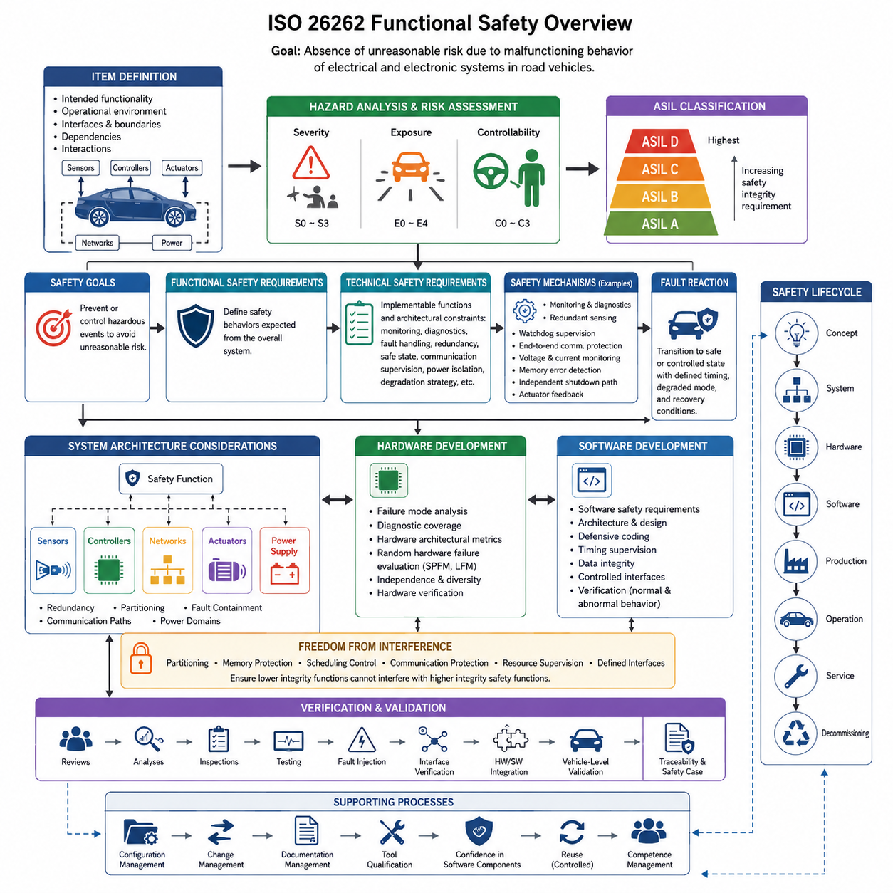
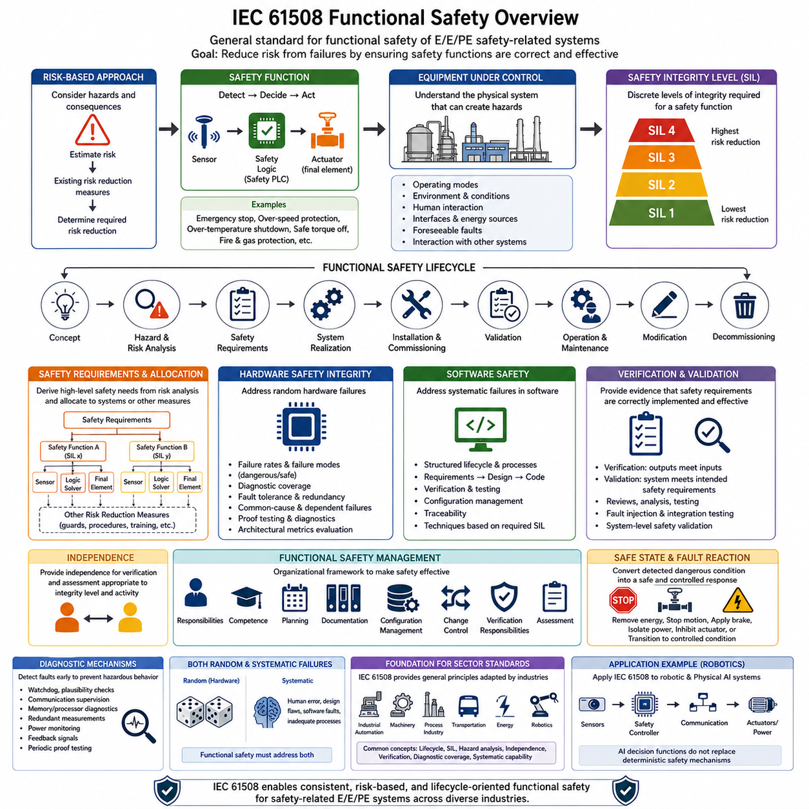
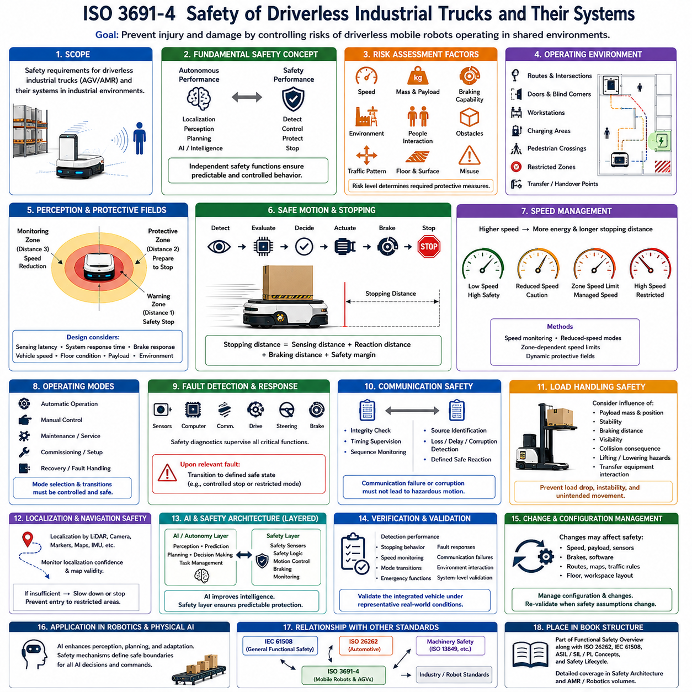
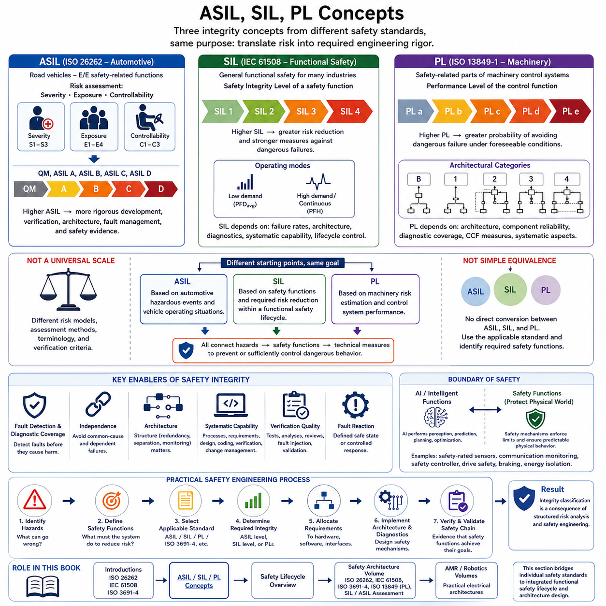
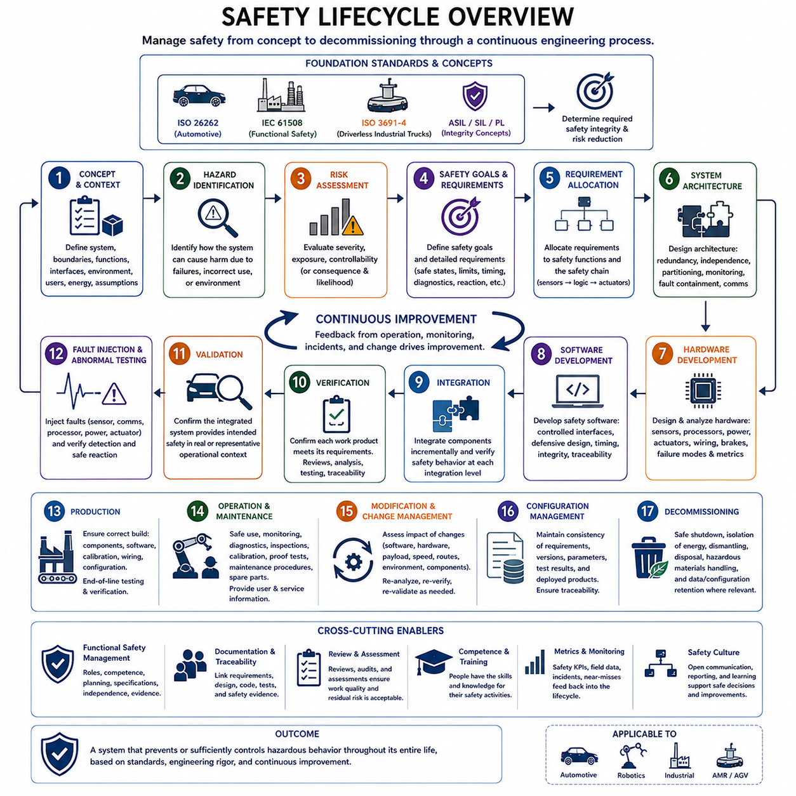
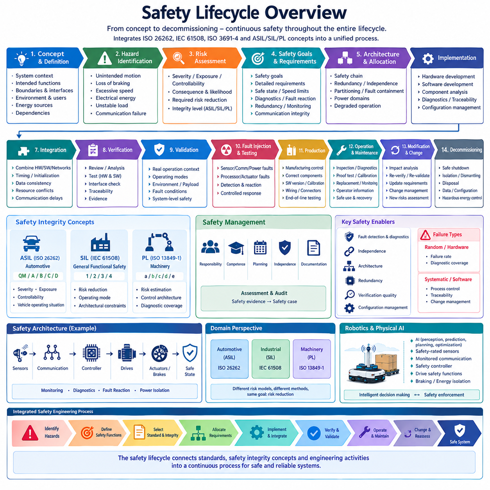

**Volume 01. Electrical Architecture Fundamentals**

# Chapter 09. Functional Safety Overview

## 09.01. ISO 26262 Introduction

{width="7.268055555555556in" height="7.268055555555556in"}

ISO 26262는 도로 차량의 전기·전자 시스템(Electrical and Electronic Systems)을 위한 국제 기능 안전 표준(Functional Safety Standard)이다. 이 표준은 안전 관련 시스템(Safety-Related Systems)의 오작동으로 인해 발생할 수 있는 위험을 체계적으로 줄이기 위한 프레임워크를 제공한다. 특정 부품 자체가 본질적으로 안전한지를 규정하기보다, 위험원(Hazard)을 식별하고 안전 요구사항(Safety Requirements)을 정의하며 적절한 제어 수단을 개발하고 잔여 위험(Residual Risk)이 허용 가능한 수준으로 감소했음을 입증하는 엔지니어링 프로세스를 규정한다.

이 표준은 기능 안전(Functional Safety)이라는 개념을 기반으로 하며, 이는 전기·전자 시스템의 오작동 동작(Malfunctioning Behavior)으로 발생하는 위험원으로부터 비합리적인 위험(Unreasonable Risk)이 존재하지 않는 상태를 의미한다. 이러한 개념은 기능 안전을 일반적인 제품 신뢰성(Product Reliability)과 구분한다. 어떤 부품은 매우 높은 신뢰성을 갖더라도 드문 고장이 심각한 위험을 발생시킬 수 있으며, 반대로 다른 부품은 비교적 빈번한 비치명적 고장이 발생하더라도 중대한 안전 결과를 초래하지 않을 수 있다. 따라서 안전 공학(Safety Engineering)은 고장 동작과 전체 시스템에 미치는 영향을 함께 고려한다.

ISO 26262는 초기 개념 개발(Concept Development)에서 시작하여 시스템(System), 하드웨어(Hardware), 소프트웨어(Software) 엔지니어링을 거쳐 생산(Production), 운영(Operation), 서비스(Service), 폐기(Decommissioning)에 이르는 안전 수명주기(Safety Lifecycle)를 적용한다. 따라서 안전은 설계가 완료된 이후에만 수행하는 검증 활동으로 취급되지 않는다. 안전 목표(Safety Goals), 가정(Assumptions), 요구사항(Requirements), 분석(Analyses), 검증 활동(Verification Activities), 근거 자료(Supporting Evidence)가 수명주기 전체에서 점진적으로 개발되고 유지되어야 한다.

기능 안전 분석의 기본적인 출발점은 아이템(Item)의 정의이다. 아이템은 기능 안전 분석의 대상이 되는 시스템 또는 시스템의 조합을 의미한다. 엔지니어는 위험 동작을 평가하기 전에 의도된 기능(Intended Functionality), 운영 환경(Operational Environment), 인터페이스(Interfaces), 경계(Boundaries), 의존성(Dependencies), 상호작용(Interactions)을 정의한다. 특히 분산형 전기 아키텍처(Distributed Electrical Architecture)에서는 센싱, 연산, 통신, 전력 분배, 액추에이션이 서로 다른 제어기에 의해 구현되면서 하나의 차량 수준 기능을 공동으로 수행할 수 있으므로 명확한 시스템 경계 정의가 중요하다.

위험 분석 및 위험 평가(Hazard Analysis and Risk Assessment)는 시스템의 오작동이 위험 사건(Hazardous Event)을 발생시킬 수 있는 상황을 분석한다. 평가에서는 발생 가능한 피해의 심각도(Severity), 관련 운전 상황에 노출될 확률 또는 빈도인 노출도(Exposure), 그리고 영향을 받는 사람이 해당 상황을 통제할 수 있는 통제 가능성(Controllability)을 고려한다. 이러한 요소를 바탕으로 자동차 안전 무결성 수준(Automotive Safety Integrity Level)을 분류하며, 일반적으로 ASIL A, ASIL B, ASIL C, ASIL D로 표현되고 ASIL D가 가장 높은 수준의 안전 무결성을 요구한다.

ASIL 분류는 이후 개발 활동에서 요구되는 엄격성에 영향을 준다. 더 높은 안전 무결성(Safety Integrity)은 일반적으로 더욱 엄격한 개발 절차, 특정 검증 활동에서의 높은 독립성(Independence), 보다 포괄적인 분석, 그리고 체계적 고장(Systematic Faults)과 랜덤 하드웨어 고장(Random Hardware Faults)이 적절하게 제어되고 있음을 보여주는 강력한 근거를 요구한다. ASIL의 목적은 단순히 부품에 등급을 부여하는 것이 아니라 안전 목표를 구현, 검증, 추적 및 정당화할 수 있는 구체적인 요구사항과 엔지니어링 메커니즘으로 전개하는 것이다.

안전 목표(Safety Goals)는 위험 사건으로부터 도출되며 허용할 수 없는 결과를 방지하거나 충분히 제어하기 위한 상위 수준 요구사항을 나타낸다. 이러한 목표는 전체 시스템에 요구되는 안전 동작을 설명하는 기능 안전 요구사항(Functional Safety Requirements)으로 구체화된다. 이후 기술 안전 요구사항(Technical Safety Requirements)은 이를 모니터링(Monitoring), 진단(Diagnostics), 고장 처리(Fault Handling), 이중화(Redundancy), 성능 저하 전략(Degradation Strategy), 통신 감시, 전력 차단, 정의된 안전 상태(Safe State) 또는 제어 상태로의 전환과 같은 구현 가능한 아키텍처 제약과 기능으로 변환한다.

시스템 수준(System Level)에서 기능 안전은 전기·전자 아키텍처(Electrical and Electronic Architecture)와 밀접하게 연결된다. 설계자는 안전 관련 기능이 센서(Sensor), 제어기(Controller), 통신 네트워크(Communication Network), 전원 공급 장치(Power Supply), 액추에이터(Actuator), 독립적인 모니터링 메커니즘 사이에 어떻게 분산되는지를 결정해야 한다. 이중화, 파티셔닝(Partitioning), 고장 격리(Fault Containment), 통신 경로, 전력 도메인(Power Domain)에 관한 아키텍처 결정은 단일 고장이 제한된 영역에 머무를지 또는 안전 필수 기능의 상실로 전파될지를 결정할 수 있다.

하드웨어 개발(Hardware Development)은 체계적인 설계 문제뿐만 아니라 물리적 전자 부품에서 발생하는 고장을 함께 다룬다. 엔지니어는 프로세서(Processor), 메모리(Memory), 전력 소자(Power Device), 통신 인터페이스(Communication Interface), 센서, 액추에이터 및 지원 회로의 고장 모드(Failure Mode)를 분석한다. 진단 범위(Diagnostic Coverage), 고장 검출 메커니즘(Fault Detection Mechanism), 하드웨어 아키텍처 메트릭(Hardware Architectural Metrics), 랜덤 하드웨어 고장의 확률적 평가를 통해 요구되는 안전 무결성을 충족할 수 있는 보호 수준을 평가한다.

소프트웨어 안전 공학(Software Safety Engineering)은 요구사항, 아키텍처, 구현, 통합 및 검증 과정에서 발생할 수 있는 체계적 고장을 제어함으로써 하드웨어 안전 프로세스를 보완한다. 소프트웨어 안전 요구사항(Software Safety Requirements)은 각 구성요소에 할당되며 적절한 아키텍처 원칙, 방어적 프로그래밍(Defensive Programming), 모니터링 기능, 타이밍 감시(Timing Supervision), 데이터 무결성(Data Integrity) 메커니즘, 통제된 인터페이스를 사용하여 구현된다. 검증에서는 정상 기능뿐 아니라 비정상 상태와 감지된 고장이 발생했을 때의 올바른 동작도 입증해야 한다.

간섭으로부터의 자유(Freedom from Interference)는 서로 다른 안전 책임을 가진 소프트웨어 또는 하드웨어 요소가 동일한 연산 또는 통신 자원을 공유할 때 중요해진다. 낮은 안전 무결성을 가진 기능이 더 높은 안전 무결성을 요구하는 기능의 실행, 메모리, 타이밍, 통신 또는 데이터를 손상시켜서는 안 된다. 따라서 파티셔닝, 메모리 보호(Memory Protection), 스케줄링 제어(Scheduling Control), 통신 보호, 자원 감시(Resource Supervision), 명확하게 정의된 인터페이스는 중앙집중형 고성능 컴퓨팅 플랫폼에서 중요한 아키텍처 메커니즘이 된다.

안전 메커니즘(Safety Mechanism)은 고장을 감지, 허용, 제어 또는 완화하기 위해 특별히 도입되는 엔지니어링 기능이다. 대표적인 예로 워치독 감시(Watchdog Supervision), 타당성 검사(Plausibility Checking), 중복 센싱(Redundant Sensing), 종단 간 통신 보호(End-to-End Communication Protection), 전압 모니터링(Voltage Monitoring), 메모리 오류 검출, 프로세서 락스텝(Processor Lockstep), 독립적인 셧다운 경로(Independent Shutdown Path), 액추에이터 피드백(Actuator Feedback)이 있다. 효과성은 단순한 기능의 존재 여부가 아니라 진단 범위, 독립성, 반응 시간, 고장 가정 및 고장 감지 이후의 시스템 대응에 의해 결정된다.

고장 대응(Fault Reaction)은 제어 대상 기능이 갖는 물리적 결과에 따라 설계되어야 한다. 모든 시스템에서 즉시 전원을 차단하는 것이 반드시 가장 안전한 대응은 아니다. 조향(Steering), 제동(Braking), 추진(Propulsion), 로봇 액추에이션(Robotic Actuation), 자동화된 이동 기능은 안전 상태로 진입하기 전에 제한된 시간 동안 제어된 성능 저하(Controlled Degradation) 또는 지속적인 동작이 필요할 수 있다. 따라서 기능 안전 아키텍처는 고장 검출을 명확하게 정의된 대응, 타이밍 요구사항, 성능 저하 모드(Degraded Mode), 복구 조건(Recovery Conditions)과 연결해야 한다.

검증 및 유효성 확인(Verification and Validation)은 안전 요구사항이 올바르게 구현되었으며 결과적으로 시스템이 의도한 안전 목표를 달성한다는 근거를 제공한다. 검토(Review), 분석(Analysis), 검사(Inspection), 시험(Testing), 고장 주입(Fault Injection), 인터페이스 검증, 하드웨어 및 소프트웨어 통합 시험, 차량 수준 유효성 확인 등이 이러한 근거를 구성할 수 있다. 추적성(Traceability)은 식별된 위험원을 안전 목표, 요구사항, 구현 요소, 검증 결과 및 미해결 문제와 연결하여 안전 논증(Safety Argument)이 비공식적인 엔지니어링 판단에 의존하지 않고 감사 가능한 형태로 유지되도록 한다.

지원 프로세스(Supporting Processes) 역시 중요하다. 기능 안전은 체계적인 엔지니어링 관리에 의존하기 때문이다. 형상 관리(Configuration Management)는 안전 근거가 특정 하드웨어, 소프트웨어, 요구사항 및 캘리브레이션 데이터 버전과 정확하게 대응하도록 한다. 변경 관리(Change Management)는 설계 변경이 새로운 위험을 발생시키거나 기존 분석을 무효화하는지를 평가한다. 문서 관리(Documentation Management), 필요한 경우의 도구 적격성 평가(Tool Qualification), 소프트웨어 구성요소에 대한 신뢰성 확보, 통제된 재사용(Controlled Reuse)은 복잡한 제품이 여러 개발 단계에서 진화하는 동안 안전 무결성을 유지하는 데 기여한다.

ISO 26262는 현대적인 전기·전자 아키텍처에서 특히 중요하다. 중앙집중화(Centralization), 고성능 컴퓨팅(High-Performance Computing), 이더넷 통신(Ethernet Communication), 전동화 파워트레인(Electrified Powertrain), 소프트웨어 정의 기능(Software-Defined Functionality)이 확대되면서 기존에는 독립적이었던 여러 도메인 사이에 새로운 의존성이 형성되기 때문이다. 공유 전력 레일(Shared Power Rail), 게이트웨이(Gateway), 중앙 컴퓨터(Central Computer), 통신 백본(Communication Backbone), 동기화 서비스(Synchronization Service)의 고장은 여러 기능에 동시에 영향을 줄 수 있다. 따라서 기능 안전 분석에서는 개별 ECU만이 아니라 공통 원인 고장(Common-Cause Failure), 종속 고장(Dependent Failure), 공유 자원(Shared Resources), 아키텍처 수준의 고장 격리를 함께 고려해야 한다.

로보틱스(Robotics)와 피지컬 AI(Physical AI) 시스템의 관점에서 ISO 26262는 모든 로봇에 보편적으로 적용되는 안전 표준이라기보다, 첨부 자료의 구조에서 보다 광범위한 기능 안전 기반(Functional Safety Foundation)의 일부로 이해하는 것이 적절하다. 원본 구성에서는 ISO 26262를 IEC 61508, ISO 3691-4, ASIL/SIL/PL 개념, 안전 수명주기와 함께 기능 안전 개요(Functional Safety Overview)에 배치하고 있으며, 이후 별도의 안전 아키텍처(Safety Architecture) 볼륨에서 이러한 주제를 독립적으로 확장하도록 구성되어 있다. 이러한 구조는 자동차 기능 안전 원칙과 산업 및 로봇 응용 분야에서 요구되는 서로 다른 안전 프레임워크를 비교하고 연결할 수 있도록 한다.

## 09.02. IEC 61508 Introduction

{width="7.268055555555556in" height="7.268055555555556in"}

IEC 61508은 전기·전자·프로그램 가능 전자 안전 관련 시스템(Electrical, Electronic, and Programmable Electronic Safety-Related Systems)을 위한 일반적인 프레임워크를 확립한 국제 기능 안전 표준(Functional Safety Standard)이다. 특정 산업만을 대상으로 개발된 표준과 달리 산업 자동화(Industrial Automation), 기계, 공정 플랜트(Process Plant), 운송, 에너지 및 기타 안전 필수 응용 분야(Safety-Critical Applications)에 적용할 수 있는 기본 원칙을 제공한다. 첨부된 구조에서는 ISO 26262를 보완하면서 보다 광범위한 기능 안전 공학(Functional Safety Engineering)을 이해하기 위한 중요한 기반을 제공한다.

IEC 61508의 핵심 목적은 안전 기능(Safety Function)을 수행하는 시스템의 고장과 관련된 위험(Risk)을 감소시키는 것이다. 기능 안전(Functional Safety)은 안전 관련 장비가 지정된 조건에서 요구되는 안전 기능을 올바르게 수행하고 고장이 발생했을 때 적절하게 대응함으로써 달성된다. 따라서 이 표준은 정상적인 조건에서 장비가 올바르게 동작하는지만 고려하는 것이 아니라 고장이 감지, 제어, 허용되거나 정의된 안전 동작(Safe Behavior)으로 전환되는지도 함께 고려한다.

IEC 61508은 모든 안전 기능에 동일한 수준의 엔지니어링 엄격성을 요구한다고 가정하는 대신 위험 기반 접근법(Risk-Based Approach)을 사용한다. 엔지니어는 먼저 위험 사건(Hazardous Event), 잠재적인 결과 및 발생 가능성을 고려한다. 이후 기존의 위험 감소 조치(Risk Reduction Measures)를 고려하여 안전 관련 시스템이 추가적으로 제공해야 하는 위험 감소 수준을 결정한다. 이러한 접근법은 해당 응용 분야의 위험 수준과 필요한 엔지니어링 활동을 연결한다.

안전 기능(Safety Function)은 잠재적으로 위험한 상태가 발생했을 때 제어 대상 장비(Equipment Under Control)를 안전 상태(Safe State)로 만들거나 유지하기 위해 구현되는 기능이다. 안전 기능은 비정상 상태를 감지하고, 안전 로직(Safety Logic)을 통해 상태를 평가한 후, 관련 위험을 감소시키는 출력을 명령하는 과정으로 구성될 수 있다. 따라서 일반적인 구현에는 센서(Sensor), 안전 제어기(Safety Controller) 또는 로직 솔버(Logic Solver), 통신 경로(Communication Path), 그리고 접촉기(Contactor), 브레이크, 밸브 또는 제어된 정지 장치와 같은 최종 요소(Final Element)가 포함될 수 있다.

제어 대상 장비(Equipment Under Control)의 개념은 안전 제어기만을 독립적으로 분석해서는 기능 안전을 올바르게 평가할 수 없다는 점에서 중요하다. 엔지니어는 위험을 발생시킬 수 있는 기계, 공정, 차량, 로봇 또는 기타 물리적 시스템의 동작을 이해해야 한다. 운전 모드(Operating Mode), 환경 조건(Environmental Conditions), 인간과의 상호작용, 인터페이스, 에너지원(Energy Source), 예측 가능한 고장(Foreseeable Fault), 외부 시스템과의 상호작용은 필요한 안전 기능과 그 성능 요구사항 모두에 영향을 미친다.

IEC 61508은 기능 안전 수명주기(Functional Safety Lifecycle)를 중심으로 안전 공학을 구성한다. 이 수명주기는 초기 개념(Concept)과 위험 분석(Hazard Analysis)에서 시작하여 안전 요구사항, 시스템 구현(System Realization), 설치, 시운전(Commissioning), 유효성 확인(Validation), 운영, 유지보수, 변경 및 최종 폐기(Decommissioning)에 이르는 체계적인 경로를 제공한다. 따라서 안전은 하드웨어와 소프트웨어 개발이 완료된 이후 수행하는 최종 검사가 아니라 지속적인 엔지니어링 책임으로 취급된다.

안전 요구사항(Safety Requirements)은 개발이 진행됨에 따라 점진적으로 구체화된다. 위험 및 리스크 분석(Hazard and Risk Analysis)을 통해 식별된 상위 수준의 안전 요구는 구체적인 안전 기능과 관련 무결성 요구사항(Integrity Requirements)으로 변환된다. 이후 이러한 요구사항은 전기·전자·프로그램 가능 전자 시스템 또는 기타 위험 감소 조치에 할당된다. 명확한 할당을 통해 설계자는 어떤 하위 시스템이 위험 상태를 감지하고, 안전 판단을 수행하며, 필요한 물리적 대응을 실행할 책임이 있는지를 결정할 수 있다.

IEC 61508에서 도입된 핵심 개념 중 하나는 안전 무결성 수준(Safety Integrity Level, SIL)이다. SIL은 안전 기능에 요구되는 무결성과 관련된 단계적인 수준을 나타내며 SIL 1에서 SIL 4까지 구분된다. 높은 SIL은 더 큰 위험 감소 요구와 더욱 엄격한 엔지니어링 조치에 대응한다. 따라서 SIL은 전체 제품에 단순히 부여되는 일반적인 품질 등급이 아니라 안전 기능의 성능에 요구되는 무결성을 나타내는 요구사항으로 이해해야 한다.

안전 무결성(Safety Integrity)은 랜덤 하드웨어 고장(Random Hardware Failure)과 체계적 고장(Systematic Failure)을 모두 고려한다. 랜덤 하드웨어 고장은 운전 중 확률적으로 발생할 수 있는 물리적인 고장 메커니즘에서 발생하는 반면, 체계적 고장은 잘못된 요구사항, 설계 오류, 소프트웨어 결함, 구현 오류 또는 부적절한 엔지니어링 프로세스와 같은 원인과 관련된다. 따라서 하드웨어 신뢰성만 높이는 것으로는 체계적인 설계 오류를 제거할 수 없으므로 효과적인 기능 안전은 두 가지 고장 범주를 모두 다루어야 한다.

하드웨어 안전 무결성(Hardware Safety Integrity)은 해당 안전 기능에 적합한 정량적 및 아키텍처적 관점에서 평가된다. 고장률(Failure Rate), 위험 고장 및 안전 고장 모드(Dangerous and Safe Failure Modes), 진단 범위(Diagnostic Coverage), 결함 허용성(Fault Tolerance), 진단 메커니즘의 효과는 아키텍처가 요구되는 안전 무결성을 달성할 수 있는 능력에 영향을 미친다. 이중화(Redundancy)는 결함 허용성을 향상시킬 수 있지만 여러 채널을 동시에 무력화할 수 있는 공통 원인 고장(Common-Cause Failure)과 종속 고장(Dependent Failure)도 함께 분석해야 한다.

소프트웨어(Software)는 전자 하드웨어와 같은 방식으로 랜덤한 물리적 마모에 의해 일반적으로 고장 나지 않기 때문에 다른 안전 접근법이 필요하다. 소프트웨어 고장은 주로 체계적 고장이며 요구사항, 아키텍처, 구현, 통합, 형상(Configuration) 또는 변경 과정에서 발생할 수 있다. 따라서 IEC 61508은 체계적인 개발 프로세스, 적절한 설계 방법, 검증(Verification), 시험(Testing), 추적성(Traceability), 형상 관리(Configuration Control), 그리고 요구되는 안전 무결성에 따라 선택된 엔지니어링 기법을 강조한다.

검증(Verification)과 유효성 확인(Validation)은 안전 수명주기에서 서로 구분되지만 상호 보완적인 역할을 수행한다. 검증은 특정 개발 활동의 결과물이 입력 조건과 지정된 요구사항을 올바르게 만족하는지를 평가한다. 유효성 확인은 완성된 안전 관련 시스템이 실제 또는 대표적인 응용 환경에서 의도된 안전 요구사항을 충족하는지를 평가한다. 검토(Review), 분석, 시험, 고장 주입(Fault Injection), 통합 시험(Integration Testing), 시스템 수준 안전 유효성 확인 등이 이러한 활동의 근거를 제공할 수 있다.

독립성(Independence) 역시 기능 안전 평가에서 중요한 원칙이다. 요구되는 안전 무결성과 수행되는 활동에 따라 검증 또는 평가에는 최초 개발을 담당한 인력으로부터 적절한 수준의 독립성을 가진 인력이 필요할 수 있다. 그 목적은 동일한 개발 관점이 안전 수명주기 전체에 반복적으로 적용됨으로써 가정의 오류, 구현상의 문제 또는 불완전한 해석이 발견되지 않은 상태로 남을 가능성을 줄이는 것이다.

기능 안전 관리(Functional Safety Management)는 기술적인 안전 활동을 효과적으로 수행하기 위해 필요한 조직적 프레임워크를 제공한다. 책임, 역량(Competence), 계획, 문서화, 형상 관리(Configuration Management), 변경 관리(Change Control), 검증 책임 및 평가 활동을 정의하고 관리해야 한다. 기술적으로 정교한 안전 아키텍처라도 변경 사항이 통제되지 않거나 요구사항이 일관되지 않고, 안전 근거가 손실되거나 조직 및 엔지니어링 팀 사이의 책임이 불명확하다면 신뢰할 수 있는 기능 안전을 유지하기 어렵다.

안전 상태(Safe State)와 고장 대응(Fault Reaction) 개념은 논리적인 안전 요구사항을 물리적인 시스템 동작과 연결한다. 위험한 상태가 감지되면 시스템은 에너지를 제거하거나, 움직임을 정지시키거나, 브레이크를 작동시키거나, 전원을 격리하거나, 액추에이터(Actuator)를 비활성화하거나, 다른 제어된 운전 상태로 전환해야 할 수 있다. 올바른 대응은 물리적 공정에 따라 달라지는데, 이동 질량, 저장 에너지(Stored Energy), 매달린 하중 또는 연속적으로 제어되는 공정을 포함하는 시스템에서는 즉각적인 정지 자체가 새로운 위험을 발생시킬 수 있기 때문이다.

진단 메커니즘(Diagnostic Mechanism)은 개별 고장들이 결합하여 위험한 시스템 동작으로 발전하기 전에 이를 감지하는 데 도움을 준다. 워치독(Watchdog), 타당성 검사(Plausibility Check), 통신 감시(Communication Supervision), 메모리 보호(Memory Protection), 프로세서 진단(Processor Diagnostics), 중복 측정(Redundant Measurement), 전력 모니터링(Power Monitoring), 피드백 신호(Feedback Signal), 주기적인 검증 시험(Proof Testing) 등이 고장 감지에 기여할 수 있다. 이러한 메커니즘의 효과는 검출 범위, 대응 시간, 독립성, 시험 주기 및 감지된 상태를 적절한 시스템 수준의 안전 대응으로 전환할 수 있는지에 따라 결정된다.

IEC 61508은 산업 분야별 기능 안전 표준(Sector-Specific Functional Safety Standards)을 이해하기 위한 중요한 개념적 기반도 제공한다. 각 산업은 서로 다른 운영 환경, 위험 모델(Hazard Model), 용어, 규제 요구사항 및 허용 가능한 엔지니어링 방식을 가지므로 일반적인 기능 안전 원칙은 보다 전문화된 표준으로 발전하거나 적용된다. 이러한 배경으로 인해 서로 다른 분야의 기능 안전 공학에서도 안전 수명주기, 무결성 수준, 위험 분석, 독립성, 검증, 진단 범위 및 체계적 능력(Systematic Capability)과 같은 관련 개념이 반복적으로 등장한다.

로보틱스(Robotics)와 피지컬 AI(Physical AI)의 관점에서 IEC 61508은 안전 관련 전기·전자·프로그램 가능 제어 아키텍처를 이해하기 위한 기반 표준으로 특히 유용하다. 센서는 위험 상태를 식별하고, 안전 제어기는 이를 평가하며, 통신 시스템은 안전 정보를 전달하고, 액추에이터 또는 전력 시스템은 보호 대응을 실행할 수 있다. AI 기반 판단 기능(AI-Based Decision Function)이 적용되더라도 위험한 물리적 움직임이나 에너지를 통제해야 하는 경우에는 결정론적 안전 메커니즘(Deterministic Safety Mechanism)의 필요성이 사라지지 않는다.

첨부된 책의 구조에서 IEC 61508은 ISO 26262, ISO 3691-4, ASIL/SIL/PL 개념 및 안전 수명주기(Safety Lifecycle)와 함께 소개된 후 별도의 안전 아키텍처(Safety Architecture) 볼륨으로 확장되도록 구성되어 있다. 이러한 배치는 일반적인 기능 안전 원칙과 자동차, 산업, 기계 및 로보틱스 분야에서 적용되는 안전 체계 사이의 관계를 먼저 이해하도록 하며, 이후의 장에서 각각의 프레임워크와 구체적인 구현 요구사항을 더욱 상세하게 다룰 수 있도록 한다.

## 09.03. ISO 3691-4 Introduction

{width="7.268055555555556in" height="7.268055555555556in"}

ISO 3691-4는 무인 산업용 트럭(Driverless Industrial Trucks)과 그 시스템의 안전을 다루는 국제 안전 표준(International Safety Standard)으로, 산업 환경에서 사용되는 다양한 무인운반차(Automated Guided Vehicle, AGV)와 자율이동로봇(Autonomous Mobile Robot, AMR)을 포함한다. 이 표준은 운전자가 지속적으로 탑승하지 않은 상태에서 이동 기계가 주행, 조향, 정지하고 사람이나 설비와 상호작용할 때 발생하는 위험에 중점을 둔다. 첨부된 구조에서는 ISO 26262 및 IEC 61508과 함께 이동 로봇 안전(Mobile Robot Safety)의 관점을 제공한다.

ISO 3691-4가 다루는 근본적인 안전 문제는 무인 산업용 트럭이 사람, 기계, 구조물 및 다른 차량과 공간을 공유하는 환경에서 위험한 물리적 움직임(Hazardous Physical Motion)을 발생시킬 수 있다는 점이다. 따라서 안전은 신뢰할 수 있는 내비게이션(Navigation)만으로 확보되지 않는다. 전체 시스템은 주행, 조향, 제동, 화물 취급, 예상하지 못한 장애물, 고장, 운전 모드 및 의도된 운용 환경(Intended Operating Environment)에서 발생하는 상호작용과 관련된 위험을 제어해야 한다.

자율 성능(Autonomous Performance)과 안전 성능(Safety Performance)의 차이를 구분하는 것이 중요하다. 로봇은 정교한 위치추정(Localization), 인지(Perception), 경로 계획(Path Planning), AI 기능을 갖추고 있더라도 위험한 움직임을 방지하기 위한 독립적인 안전 수단이 필요할 수 있다. 반대로 안전 시스템(Safety System)은 자율주행 시스템과 동일한 수준의 의미론적 환경 이해가 반드시 필요한 것은 아니다. 안전 시스템의 핵심 책임은 위험한 상황에서 충분히 통제되고 예측 가능한 기계 동작을 보장하는 것이다.

위험 평가(Risk Assessment)는 필요한 보호 조치가 실제 응용 환경에 따라 달라지기 때문에 필수적이다. 엔지니어는 이동 플랫폼의 특성, 속도, 질량, 제동 능력, 운반 화물, 운용 공간, 예측 가능한 장애물, 보행자와의 상호작용, 교통 패턴, 환경 조건 및 예측 가능한 오사용(Foreseeable Misuse)을 고려해야 한다. 제한된 공간에서 저속으로 이동하는 경량 로봇과 사람과 기계가 혼재된 작업 공간에서 자재를 운반하는 대형 자율 차량은 서로 다른 위험 프로파일(Risk Profile)을 가진다.

따라서 운용 환경(Operating Environment)은 단순한 배경 조건이 아니라 안전 설계(Safety Design)의 일부이다. 이동 경로, 교차로, 출입문, 사각지대, 작업대, 충전 구역, 보행자 횡단 구역, 제한 구역 및 화물 인계 위치는 이동 로봇이 직면하는 위험에 영향을 줄 수 있다. 작업장 배치나 교통 조건이 변경되면 최초 안전 개념(Safety Concept)의 기반이 되었던 가정도 달라질 수 있기 때문에 안전 공학에서는 차량과 환경의 관계를 함께 고려해야 한다.

사람 감지(Personnel Detection)와 보호 센싱(Protective Sensing)은 사람 주변에서 작동하는 무인 이동 장비의 핵심 고려사항이다. 안전 관련 센서(Safety-Related Sensor)는 차량 주변의 영역을 감시하고 위험한 접촉이 발생하기 전에 물체나 사람을 감지할 수 있다. 그러나 감지만으로는 충분하지 않다. 시스템은 감지 거리(Detection Distance)를 차량 속도, 제동 성능, 시스템 반응 시간 및 환경 조건과 연계하여 허용할 수 없는 접촉이 발생하기 전에 이동 속도를 감소시키거나 정지시킬 수 있어야 한다.

보호 필드(Protective Field)는 장애물이나 사람이 차량에 접근함에 따라 서로 다른 대응을 수행하도록 설계할 수 있다. 보다 넓은 감시 영역(Monitoring Region)에서는 속도 감소를 시작하고, 더 가까운 보호 영역에서는 안전 관련 정지(Safety-Related Stop)를 요구할 수 있다. 이러한 동작은 인지 거리와 정지 능력 사이의 관계를 형성한다. 따라서 설계에서는 센싱 지연(Sensing Latency), 제어 반응 시간, 브레이크 응답, 차량 속도, 노면 조건, 탑재 하중 및 실제 정지 거리에 영향을 미치는 기타 요소를 고려해야 한다.

속도(Speed)는 차량 속도가 증가함에 따라 운동 에너지(Kinetic Energy)와 정지 거리(Stopping Distance)가 증가하기 때문에 중요한 안전 변수이다. 특정 속도에서는 안전한 이동 로봇이라도 동일한 센싱 구성으로 더 빠르게 운행하면 충분한 보호 성능을 제공하지 못할 수 있다. 따라서 안전 개념에서는 속도 감시(Speed Monitoring), 감속 운전 모드(Reduced-Speed Mode), 구역별 속도 제한 또는 동적으로 조정되는 보호 영역을 활용하여 차량 움직임과 사용 가능한 감지 및 정지 거리 사이의 적절한 관계를 유지할 수 있다.

제동 및 정지 동작(Braking and Stopping Behavior)은 단순한 소프트웨어 명령이 아니라 물리적인 안전 기능(Physical Safety Function)으로 고려해야 한다. 위험 상태가 감지되면 시스템은 충분한 신뢰성을 가지고 요구된 시간 내에 의도된 움직임 대응을 달성해야 한다. 이를 위해 안전 센싱, 제어 로직(Control Logic), 통신, 모터 드라이브(Motor Drive), 브레이크 및 기계적 동역학(Mechanical Dynamics)이 서로 협조해야 한다. 최종 정지 동작은 보호 거리와 운전 제한을 결정할 때 사용했던 가정과 일관되어야 한다.

비상 정지(Emergency Stop)는 추가적인 보호 계층을 제공하지만 정상적인 장애물 회피를 위한 주요 메커니즘으로 취급해서는 안 된다. 비상 정지 기능은 비정상적인 위험 상황에서 신속한 개입 또는 대응을 지원하기 위한 것이다. 비상 정지 장치의 위치, 접근성, 리셋 동작(Reset Behavior), 기계 제어와의 상호작용은 작동 시 적절한 대응이 이루어지고 재시작 과정에서 새로운 위험한 움직임이 자동으로 발생하지 않도록 설계해야 한다.

운전 모드(Operating Mode)는 어떤 안전 기능이 필요한지와 기계가 어떤 방식으로 움직일 수 있는지에 영향을 준다. 자동 운전(Automatic Operation), 수동 제어(Manual Control), 유지보수, 시운전(Commissioning), 복구(Recovery) 또는 기타 서비스 조건에서는 사람이 서로 다른 위험에 노출될 수 있다. 따라서 모드 선택과 전환(Mode Transition)은 통제된 방식으로 이루어져야 한다. 정상적인 자율 운전에서는 허용되는 기능이라도 작업자가 유지보수를 수행하거나 차량을 수동으로 이동시키거나 일반적으로 보호되는 영역 내부에서 작업하는 경우에는 제한될 수 있다.

고장 감지(Fault Detection)는 센싱, 연산, 통신, 조향 또는 구동 계통에 고장이 발생한 이후에도 이동 기계가 물리적으로 위험한 상태를 유지할 수 있기 때문에 특히 중요하다. 안전 관련 진단(Safety-Related Diagnostics)은 센서, 제어기, 통신 링크, 제동 기능, 속도 정보, 조향 동작 및 기타 중요한 신호를 감시할 수 있다. 관련 고장이 감지되면 기계는 통제되지 않은 위험한 움직임이 계속되지 않도록 정의된 대응 상태로 전환되어야 한다.

안전 정보가 센서, 제어기, 드라이브 및 기타 장치 사이에 분산되어 전달되는 경우 통신(Communication)은 안전 체인(Safety Chain)의 일부가 될 수 있다. 안전 관련 메시지의 손실, 손상, 지연, 반복 또는 잘못된 순서가 감지되지 않은 채 위험한 동작으로 이어져서는 안 된다. 따라서 안전 통신 메커니즘(Safety Communication Mechanism)에는 무결성 검사(Integrity Checking), 타이밍 감시, 순서 감시(Sequence Monitoring), 송신원 식별(Source Identification), 그리고 통신을 사용할 수 없거나 신뢰할 수 없게 되었을 때의 정의된 대응이 포함될 수 있다.

화물 취급(Load Handling)은 자재를 운반, 상승, 견인 또는 조작하는 이동 로봇에 추가적인 위험을 발생시킨다. 안전 평가에서는 탑재 하중의 질량과 위치가 안정성(Stability), 제동 거리, 선회 동작, 시야 및 충돌 결과에 미치는 영향을 고려해야 한다. 리프팅 장치(Lifting Mechanism)나 부착 장치를 포함하는 시스템에서는 차량 주행뿐 아니라 화물 낙하, 의도하지 않은 움직임, 불안정성 또는 화물 이송 설비와의 상호작용에서도 위험한 상황이 발생할 수 있으므로 추가적인 안전 조치가 필요할 수 있다.

위치추정 및 내비게이션 고장(Localization and Navigation Failure) 역시 신중하게 다루어야 한다. 자율 로봇은 라이다(LiDAR), 카메라, 마커(Marker), 지도(Map), 관성 센서(Inertial Sensor) 또는 이러한 기술의 조합을 사용하여 자신의 위치를 추정할 수 있다. 위치추정 정확도가 상실되면 잘못된 경로를 실행하거나 제한 구역에 진입할 수 있다. 따라서 안전 아키텍처(Safety Architecture)는 어떤 내비게이션 가정이 안전과 관련되는지를 결정하고, 위치추정 신뢰도 또는 필요한 환경 정보가 계속 운행하기에 충분하지 않을 경우 시스템이 어떻게 대응할지를 정의해야 한다.

현대적인 자율이동로봇(AMR)에서는 일반적인 자율 인지(Autonomous Perception)와 안전 관련 보호 센싱(Safety-Related Protective Sensing)이 함께 존재하는 경우가 많다. 일반 인지 시스템은 물체를 식별하고, 사람을 분류하고, 주행 가능 공간을 추정하며, 내비게이션을 최적화할 수 있는 반면, 안전 등급 센싱(Safety-Rated Sensing)은 독립적으로 정당화된 보호 기능을 제공한다. 이러한 분리는 복잡한 AI 인지가 운영 지능(Operational Intelligence)을 향상시키면서도 위험한 물리적 접촉을 방지하는 유일한 보호 수단이 되는 것을 피할 수 있다는 점에서 중요하다.

검증 및 유효성 확인(Verification and Validation)은 보호 기능이 대표적인 조건에서 올바르게 동작한다는 것을 입증해야 한다. 시험에는 감지 성능, 정지 동작, 속도 감시, 운전 모드 전환, 비상 기능, 고장 대응, 통신 장애 및 의도된 환경과의 상호작용 등이 포함될 수 있다. 유효성 확인에서는 센싱 범위, 지연 시간, 제동 성능, 탑재 하중, 바닥 조건 및 시스템 설정이 종합적으로 최종 안전 동작을 결정하기 때문에 개별 부품이 아닌 통합 차량(Integrated Vehicle)을 고려해야 한다.

로봇 또는 운용 환경의 변경은 이전에 검증된 안전 가정(Safety Assumptions)에 영향을 줄 수 있다. 최대 속도, 탑재 하중, 센서 장착 위치, 제동 부품, 소프트웨어, 이동 경로, 바닥 조건, 교통 규칙 또는 작업 공간의 형상을 변경하면 필요한 보호 조치도 달라질 수 있다. 따라서 형상 관리(Configuration Management)와 변경 관리(Change Management)는 전체 운영 기간 동안 중요하며, 특히 초기 시운전 이후 지도, 임무, 교통 흐름 및 작업 영역이 지속적으로 변화할 수 있는 AMR 환경에서 중요성이 더욱 커진다.

로보틱스(Robotics)와 피지컬 AI(Physical AI) 아키텍처에서 ISO 3691-4는 상위 수준의 자율 지능(Autonomous Intelligence)을 물리적 움직임에 대한 결정론적 보호(Deterministic Protection)와 연결하는 데 도움을 준다. AI는 인지, 예측, 경로 선택, 작업 계획 및 적응 능력을 향상시킬 수 있으며, 안전 메커니즘(Safety Mechanism)은 이러한 기능들이 기계에 명령을 내릴 수 있는 허용 범위를 설정한다. 이를 통해 모든 AI 판단 자체가 필요한 안전 무결성(Safety Integrity)을 제공한다고 가정하지 않고도 지능형 기능을 발전시킬 수 있는 계층형 아키텍처(Layered Architecture)를 구성할 수 있다.

첨부된 책의 구조에서는 ISO 3691-4를 ISO 26262, IEC 61508, ASIL/SIL/PL 개념 및 안전 수명주기(Safety Lifecycle)와 함께 기능 안전 개요(Functional Safety Overview)에 배치하고 있다. 이후 별도의 안전 아키텍처(Safety Architecture) 볼륨에서는 ISO 3691-4를 독립적인 장으로 다루며, 별도의 AMR 및 로보틱스 볼륨에서는 실제 전기 아키텍처를 다루도록 구성되어 있다. 이러한 구성은 ISO 3691-4를 일반적인 기능 안전 원칙과 자율 이동 산업 장비(Autonomous Mobile Industrial Equipment)의 구체적인 안전 문제를 연결하는 입문 단계의 가교로 설정한다.

## 09.04. ASIL/SIL/PL Concepts

{width="7.268055555555556in" height="7.268055555555556in"}

아래와 같이 원문의 문단 구조와 순서를 그대로 유지하여 번역했습니다.

ASIL, SIL 및 PL은 서로 다른 기능 안전(Functional Safety) 및 기계 안전(Machinery Safety) 프레임워크에서 안전 관련 기능(Safety-Related Function)이 위험을 얼마나 엄격하게 감소시켜야 하는지를 나타내기 위해 사용되는 안전 무결성(Safety Integrity) 개념이다. ASIL은 주로 도로 차량을 위한 ISO 26262와 관련되며, SIL은 IEC 61508 및 관련 산업별 표준의 핵심 개념이고, PL은 ISO 13849-1과 같은 기계 안전 표준에서 사용된다. 첨부된 구조에서 이러한 개념은 앞서 소개한 자동차, 일반 기능 안전 및 이동 로봇 안전을 서로 연결한다.

ASIL, SIL 및 PL은 함께 비교되어 표현되는 경우가 많지만 하나의 보편적인 안전 척도에서 서로 교환 가능한 등급으로 해석해서는 안 된다. 각각은 고유한 적용 범위, 용어, 위험 평가 방법(Risk Evaluation Method), 아키텍처 요구사항(Architectural Requirements), 검증 요구사항(Verification Expectations)을 가진 서로 다른 평가 프레임워크에 속한다. 공통적인 목적은 위험을 엔지니어링 엄격성(Engineering Rigor)으로 변환하는 것이지만, 필요한 안전 무결성을 결정하고 입증하는 방법은 각 표준마다 상당한 차이가 있다.

자동차 안전 무결성 수준(Automotive Safety Integrity Level, ASIL)은 ISO 26262에서 정의되며 도로 차량의 안전 관련 전기·전자 기능에 사용된다. 위험 분석 및 위험 평가(Hazard Analysis and Risk Assessment)는 심각도(Severity), 노출도(Exposure), 통제 가능성(Controllability)을 사용하여 위험 사건(Hazardous Event)을 평가한다. 그 결과는 품질 관리(Quality Management, QM) 또는 ASIL A부터 ASIL D까지의 분류로 이어질 수 있으며, 일반적으로 ASIL이 높아질수록 개발, 검증, 아키텍처, 고장 관리 및 안전 근거(Safety Evidence)에 더욱 엄격한 조치가 요구된다.

심각도(Severity)는 위험 사건과 관련하여 발생할 수 있는 피해의 잠재적인 크기를 나타내며, 노출도(Exposure)는 관련 운전 상황이 얼마나 자주 발생할 수 있는지를 고려한다. 통제 가능성(Controllability)은 영향을 받는 사람이 발생하는 피해를 회피하거나 통제할 수 있는 능력을 평가한다. 이러한 요소들은 ISO 26262의 분류 방법에 따라 결합된다. 따라서 ASIL은 단순히 전자 부품이 고장 날 확률을 의미하는 것이 아니라 특정 자동차 위험 사건의 상황으로부터 도출된 안전 무결성 요구사항을 나타낸다.

안전 무결성 수준(Safety Integrity Level, SIL)은 IEC 61508의 핵심 개념이다. SIL은 안전 기능(Safety Function)에 요구되는 무결성과 관련되며 SIL 1부터 SIL 4까지 구분된다. 높은 SIL은 더 큰 위험 감소 요구와 위험 고장(Dangerous Failure)에 대응하기 위한 더욱 강력한 조치를 의미한다. 자동차의 ASIL 방식과 달리 SIL 결정은 산업, 공정, 기계, 에너지, 운송 및 기타 안전 관련 응용 분야에 적용할 수 있는 보다 광범위한 기능 안전 프레임워크에서 출발한다.

SIL 평가는 안전 기능에 요구되는 성능과 밀접하게 연결된다. IEC 61508에서는 위험 고장 확률을 고려할 때 저요구 작동 모드(Low-Demand Mode)와 고요구 또는 연속 작동 모드(High-Demand or Continuous Mode)와 같은 운전 특성을 구분한다. 정량적 목표(Quantitative Target)는 아키텍처 제약 및 체계적인 안전 조치와 함께 고려된다. 따라서 특정 SIL을 달성했다는 사실은 고장률 수치만으로 입증할 수 없으며 하드웨어 아키텍처, 진단, 개발 프로세스, 검증, 역량 및 수명주기 관리도 함께 고려해야 한다.

성능 수준(Performance Level, PL)은 기계 제어 시스템의 안전 관련 부분(Safety-Related Parts of Control Systems)을 위한 ISO 13849-1과 밀접하게 관련되어 있다. 일반적으로 PLr로 표기되는 요구 성능 수준(Required Performance Level)은 기계 위험을 고려하여 결정하며, 달성된 성능은 PL a부터 PL e까지 표현된다. 더 높은 성능 수준은 예측 가능한 운전 및 고장 조건에서 안전 관련 제어 기능이 요구되는 위험 감소를 제공할 수 있는 더 높은 능력을 의미한다.

PL 평가는 제어 아키텍처(Control Architecture), 부품 신뢰성(Component Reliability), 진단 범위(Diagnostic Coverage), 공통 원인 고장(Common-Cause Failure)에 대한 대책 및 체계적인 측면과 같은 요소를 고려한다. B, 1, 2, 3, 4와 같은 아키텍처 카테고리(Architectural Category)는 안전 관련 제어 시스템의 구조적 특성을 나타내며, 달성된 PL을 결정할 때 정량적인 신뢰성 및 진단 매개변수와 함께 작용한다. 이러한 특성으로 인해 PL은 안전 릴레이(Safety Relay), 안전 PLC(Safety PLC), 센서, 인터록(Interlock), 드라이브 및 보호 장치를 사용하는 기계 아키텍처에 특히 실용적이다.

따라서 세 가지 개념은 서로 다른 산업 영역의 관점에서 유사한 엔지니어링 문제에 접근한다. ASIL은 자동차 위험 사건과 차량 운전 상황에서 출발한다. SIL은 일반적인 기능 안전 수명주기(Functional Safety Lifecycle)와 요구되는 위험 감소를 기반으로 안전 기능에 초점을 맞춘다. PL은 위험 추정과 제어 시스템 성능을 통해 기계의 안전 관련 제어 기능을 다룬다. 각각의 프레임워크는 궁극적으로 식별된 위험을 위험한 동작을 방지하거나 충분히 통제하는 기술적 조치와 연결한다.

더 높은 무결성 등급(Integrity Classification)이 단순히 더 많은 이중화 하드웨어(Redundant Hardware)를 설치해야 한다는 의미는 아니다. 이중화(Redundancy)는 가능한 안전 메커니즘 중 하나일 뿐이다. 안전 무결성은 고장 감지(Fault Detection), 진단 범위, 독립성(Independence), 아키텍처 제약, 체계적인 개발 관리, 검증 품질, 형상 관리(Configuration Management), 적절한 고장 대응(Fault Reaction)에도 의존한다. 공통 설계 오류나 공통 원인 고장을 포함한 이중화 아키텍처는 외형적인 하드웨어 중복이 의미하는 것보다 훨씬 적은 안전 개선 효과를 제공할 수 있다.

랜덤 하드웨어 고장(Random Hardware Failure)과 체계적 고장(Systematic Failure) 역시 서로 다른 방식으로 다루어진다. 하드웨어 부품은 확률적인 물리적 메커니즘에 의해 고장 날 수 있으므로 고장률(Failure Rate)과 진단 범위를 정량적 평가에 활용할 수 있다. 소프트웨어 결함과 많은 설계 오류는 랜덤 고장이 아니라 체계적 고장이다. 따라서 이러한 고장을 제어하려면 수명주기 규율(Lifecycle Discipline), 요구사항 품질, 아키텍처, 코딩 방법, 검증, 독립성, 추적성(Traceability), 변경 관리(Change Management) 및 기타 프로세스 중심의 조치가 중요하다.

진단 범위(Diagnostic Coverage)는 안전 아키텍처가 위험 고장이 허용할 수 없는 결과를 발생시키기 전에 이를 감지하는 데 의존하는 경우가 많기 때문에 중요하다. 워치독(Watchdog), 중복 측정(Redundant Measurement), 타당성 검사(Plausibility Check), 통신 감시(Communication Monitoring), 메모리 보호(Memory Protection), 피드백 신호 및 드라이브 진단(Drive Diagnostics)은 서로 다른 종류의 고장을 감지할 수 있다. 그러나 진단 메커니즘의 가치는 어떤 고장을 감지하는지, 얼마나 신속하게 감지하는지, 그리고 이후 시스템이 적절한 안전 대응을 수행할 수 있는지에 따라 결정된다.

공통 원인 고장(Common-Cause Failure)과 종속 고장(Dependent Failure)은 안전성을 향상하기 위해 여러 채널을 사용하는 경우 반드시 고려해야 한다. 두 개의 센서, 제어기, 통신 경로 또는 전원 공급 장치를 사용하더라도 동일한 환경 조건, 설계 결함, 소프트웨어 오류, 전원, 커넥터 또는 통신 의존성이 두 채널을 동시에 무력화할 수 있다면 진정한 의미에서 독립적이라고 할 수 없다. 따라서 기능 안전 분석에서는 단순히 중복 구성이 의도된 무결성 향상을 제공한다고 가정하지 않고 독립성과 공유 의존성(Shared Dependency)을 분석해야 한다.

요구되는 안전 무결성은 기본적으로 전체 기계나 차량의 모든 부품에 자동으로 적용되는 것이 아니라 안전 기능과 그 구현 환경에 적용된다. 복잡한 시스템에는 서로 다른 안전 요구사항을 가진 기능과 비안전 기능(Non-Safety Function)이 함께 존재할 수 있다. 적절한 파티셔닝(Partitioning), 인터페이스, 통신 보호 및 간섭으로부터의 자유(Freedom from Interference)를 적용하면 이러한 요소들이 함께 동작하면서도 안전 관련 기능에 요구되는 무결성을 유지할 수 있다.

따라서 ASIL, SIL 및 PL을 단순한 등가 변환표(Equivalence Table)를 통해 직접 변환해서는 안 된다. 상대적인 엔지니어링 엄격성을 이해하기 위한 비공식적인 비교는 유용할 수 있지만, 각각의 위험 모델과 적합성 기준(Compliance Criteria)이 서로 다르기 때문에 ASIL D가 특정 SIL 또는 PL과 항상 동일하다고 선언할 수는 없다. 자동차, 산업 및 로보틱스 영역을 넘나드는 시스템에서는 무결성 수준을 직접 수치 변환하기보다 적용되는 안전 기능과 관련 표준을 식별해야 한다.

이러한 구분은 자율이동로봇(Autonomous Mobile Robot, AMR)에서 특히 중요하다. AMR에는 PL과 관련된 표준이 적용되는 기계 안전 기능, SIL 기반 원칙의 영향을 받는 전기 또는 프로그램 가능 안전 기능, 그리고 ASIL 중심 아키텍처와 개념적으로 유사한 자율주행 기술이 함께 포함될 수 있다. ISO 3691-4는 무인 산업용 트럭(Driverless Industrial Truck)에 대한 응용 분야별 요구사항을 제공하며, 그 기반이 되는 안전 아키텍처는 여러 안전 프레임워크에서 발전한 기술과 엔지니어링 원칙을 함께 사용할 수 있다.

피지컬 AI(Physical AI) 시스템에서 이러한 무결성 프레임워크는 지능형 의사결정(Intelligent Decision Making)과 안전 강제(Safety Enforcement) 사이의 중요한 경계를 설정한다. AI는 인지(Perception), 예측(Prediction), 계획(Planning), 최적화(Optimization), 적응 제어(Adaptive Control)를 수행할 수 있지만, 안전 관련 기능에는 예측 가능한 고장 대응을 가진 독립적으로 정당화된 메커니즘이 필요할 수 있다. 안전 등급 센서(Safety-Rated Sensor), 감시되는 통신, 안전 제어기, 드라이브 안전 기능, 제동 메커니즘 및 에너지 차단(Energy Isolation)은 지능형 동작이 불확실하거나 안전하지 않을 때 물리적인 행동을 제한할 수 있다.

따라서 실용적인 안전 아키텍처(Practical Safety Architecture)는 ASIL, SIL 또는 PL을 제품의 기능으로 먼저 선택하는 것이 아니라 위험원(Hazard)과 필요한 위험 감소(Required Risk Reduction)에서 출발한다. 엔지니어는 위험한 동작을 식별하고, 안전 기능을 정의하며, 적용되는 표준을 결정하고, 요구되는 무결성을 설정한 후, 요구사항을 하드웨어와 소프트웨어에 할당하고 적절한 아키텍처와 진단 기능을 구현하여 전체 안전 체인(Safety Chain)을 검증한다. 무결성 등급은 이러한 체계적인 위험 분석과 안전 공학의 결과로 결정된다.

첨부된 책의 구조에서 ASIL/SIL/PL 개념은 ISO 26262, IEC 61508 및 ISO 3691-4에 대한 입문 장들의 뒤에 위치하며 안전 수명주기 개요(Safety Lifecycle Overview)에 앞서 배치되어 있다. 더 큰 로보틱스 전기·하드웨어 구조(Robotics Electrical and Hardware Tree)에서는 별도의 안전 아키텍처(Safety Architecture) 볼륨에 ISO 26262, IEC 61508, ISO 3691-4, ISO 13849 PL 및 SIL/ASIL 평가를 독립적으로 배치하고 있다. 이러한 구성에서 현재 절은 개별 안전 표준의 이해에서 통합된 기능 안전 수명주기와 안전 아키텍처 설계로 넘어가기 위한 개념적 가교(Conceptual Bridge)의 역할을 한다.

## 09.05. Safety Lifecycle Overview

{width="7.268055555555556in" height="7.268055555555556in"}

{width="7.268055555555556in" height="7.268055555555556in"}

안전 수명주기(Safety Lifecycle)는 시스템의 초기 개념(Concept) 단계부터 개발, 생산, 운영, 유지보수, 변경 및 최종 폐기(Decommissioning)에 이르기까지 안전을 관리하기 위해 사용되는 체계적인 엔지니어링 프레임워크(Engineering Framework)이다. 그 목적은 설계가 완료된 후 안전 기능을 추가하는 것이 아니라 전체 과정에서 안전을 지속적으로 설계하는 데 있다. 첨부된 구조에서 안전 수명주기는 앞서 다룬 ISO 26262, IEC 61508, ISO 3691-4 및 ASIL/SIL/PL 개념을 하나의 공통 프로세스 관점으로 통합한다.

안전 수명주기는 시스템의 상황을 설정하고 개발 대상이 무엇인지 정의하는 것에서 시작한다. 엔지니어는 의도된 기능(Intended Function), 시스템 경계(System Boundary), 인터페이스, 운용 환경(Operating Environment), 사용자, 에너지원(Energy Source), 의존성(Dependency), 합리적으로 예측 가능한 운전 조건을 식별한다. 안전 요구사항은 시스템이 물리적으로 무엇을 할 수 있으며 어디에서 운용되는지에 따라 달라지므로 명확한 정의가 필수적이다. 잘못된 경계 설정은 중요한 상호작용을 제외하여 이후 분석에서도 발견하기 어려운 안전상의 공백을 만들 수 있다.

위험원 식별(Hazard Identification)은 부품이 고장 나거나, 기능이 잘못 동작하거나, 작업자가 예측 가능한 오류를 범하거나, 환경 조건이 예상과 달라질 때 시스템이 어떻게 피해를 발생시킬 수 있는지를 분석한다. 위험원은 의도하지 않은 움직임, 제동 기능 상실, 과도한 속도, 전기 에너지, 불안정한 화물, 통신 고장, 잘못된 센싱 또는 제어 상실 등에서 발생할 수 있다. 목적은 단순히 부품 고장의 목록을 작성하는 것이 아니라 위험한 시스템 동작(Hazardous System Behavior)과 그 결과를 이해하는 것이다.

위험 평가(Risk Assessment)는 식별된 위험 상황을 평가하여 추가적인 위험 감소(Risk Reduction)가 필요한지를 결정한다. 서로 다른 표준은 자동차 분야의 심각도(Severity), 노출도(Exposure), 통제 가능성(Controllability)과 같은 서로 다른 분류 방법이나 산업 안전 분야에서 사용하는 결과와 발생 가능성의 조합을 사용한다. 이러한 평가 결과는 모든 기능에 동일한 보호 수단을 적용하는 대신 필요한 안전 무결성(Safety Integrity)을 결정하고 적절한 안전 대책을 선택하기 위한 기반을 제공한다.

안전 목표(Safety Goal)와 안전 요구사항(Safety Requirement)은 위험 분석 결과를 명확한 엔지니어링 의무사항으로 변환한다. 상위 수준의 안전 목표는 어떤 위험한 동작을 방지하거나 통제해야 하는지를 설명하며, 점진적으로 구체화되는 요구사항은 시스템이 그 목표를 어떻게 달성해야 하는지를 규정한다. 요구사항에는 안전 상태(Safe State), 속도 제한, 정지 성능, 진단 동작, 고장 대응 시간(Fault Reaction Time), 이중화(Redundancy), 모니터링, 통신 무결성(Communication Integrity), 전력 차단 및 허용 가능한 위험을 달성하기 위해 필요한 기타 제약 조건이 포함될 수 있다.

안전 요구사항은 각각의 보호 기능에 대한 책임이 명확하게 정의되도록 시스템 아키텍처(System Architecture) 전체에 할당된다. 완전한 안전 체인(Safety Chain)은 위험 상태를 감지하는 센서, 안전 정보를 전달하는 통신 경로, 상태를 평가하는 제어기, 그리고 보호 동작을 실행하는 액추에이터(Actuator) 또는 전력 장치를 포함할 수 있다. 또한 공유 전원, 네트워크, 클록(Clock), 프로세서 또는 소프트웨어 서비스의 고장이 여러 안전 기능에 동시에 영향을 줄 수 있으므로 요구사항 할당에서는 이러한 의존성도 고려해야 한다.

시스템 아키텍처(System Architecture)는 안전 요구사항을 실제 구현 가능한 기술 구조로 변환한다. 설계자는 이중화, 독립성(Independence), 파티셔닝(Partitioning), 고장 격리(Fault Containment), 모니터링, 통신 보호, 전력 도메인(Power Domain), 성능 저하 운전 전략(Degraded Operating Strategy)을 결정한다. 아키텍처 분석에서는 개별 고장 또는 여러 고장의 조합이 안전 요구사항을 위반할 수 있는지를 평가한다. 또한 정상 제어 시스템의 일부를 사용할 수 없거나 잘못 동작할 때에도 안전 메커니즘(Safety Mechanism)이 효과적으로 유지되는지를 평가한다.

하드웨어 개발(Hardware Development)은 안전 관련 기능의 물리적인 구현을 다룬다. 엔지니어는 센서, 프로세서, 메모리, 전력 전자 장치(Power Electronics), 통신 장치, 배선, 브레이크, 액추에이터 및 기타 부품의 관련 고장 모드(Failure Mode)를 분석한다. 적용되는 안전 프레임워크와 요구되는 무결성에 따라 고장률(Failure Rate), 진단 범위(Diagnostic Coverage), 결함 허용성(Fault Tolerance), 공통 원인 고장(Common-Cause Failure), 종속 고장(Dependent Failure), 환경 영향 및 아키텍처 제약을 고려한다.

소프트웨어 개발(Software Development)은 요구사항, 아키텍처, 구현, 통합, 형상(Configuration), 변경 과정에서 발생할 수 있는 체계적 고장(Systematic Failure)을 다룬다. 안전 관련 소프트웨어에는 통제된 인터페이스, 필요한 경우의 결정론적 동작(Deterministic Behavior), 방어적 설계(Defensive Design), 타이밍 감시(Timing Supervision), 데이터 무결성(Data Integrity), 오류 처리(Error Handling), 추적성(Traceability)이 요구된다. 결함이 최종 시스템 시험 단계에서만 발견되는 것이 아니라 결함이 발생한 개발 단계에 가까운 시점에서 발견될 수 있도록 개발 전체에 걸쳐 검증 활동을 수행한다.

통합(Integration)은 하드웨어, 소프트웨어, 통신 네트워크, 센서, 제어기 및 액추에이터를 점진적으로 결합하여 더 큰 기능적 시스템을 구성하는 과정이다. 독립적으로 올바르게 작동하는 구성요소라도 서로 연결된 후에는 잘못 상호작용할 수 있기 때문에 각 관련 통합 수준에서 안전 동작을 검증해야 한다. 타이밍, 초기화(Initialization), 데이터 일관성(Data Consistency), 자원 충돌, 통신 지연, 전원 전환 및 고장 전파(Fault Propagation)는 통합된 시스템에서만 발견될 수 있는 대표적인 문제이다.

검증(Verification)은 각각의 엔지니어링 결과물이 지정된 입력 요구사항을 올바르게 만족하는지를 확인한다. 요구사항의 완전성과 일관성을 검토하고, 아키텍처가 안전 요구사항을 충족하는지 분석하며, 소프트웨어와 하드웨어를 각각의 사양에 따라 시험하고, 인터페이스가 올바르게 동작하는지를 확인할 수 있다. 추적성은 이러한 활동을 서로 연결하여 각 안전 요구사항을 어떤 근거가 뒷받침하는지를 입증하고 아직 충분하게 검증되지 않은 요구사항을 식별할 수 있도록 한다.

유효성 확인(Validation)은 완성된 시스템이 실제 또는 대표적인 운용 환경에서 의도된 안전 동작을 제공하는지라는 다른 질문을 다룬다. 따라서 유효성 확인에서는 통합된 기계 또는 차량, 현실적인 운전 모드, 환경 조건, 사용자, 탑재 하중, 속도, 고장 조건 및 주변 설비와의 상호작용을 고려한다. 특정 기능이 개별 부품 사양을 만족하더라도 실제 시스템의 동역학(System Dynamics)과 환경 조건을 함께 고려하면 충분한 안전성을 제공하지 못할 수 있다.

고장 주입(Fault Injection)과 비정상 조건 시험(Abnormal-Condition Testing)은 많은 안전 메커니즘이 정상 운전에서는 거의 발생하지 않아야 하는 상황을 위해 특별히 설계되므로 중요한 근거를 제공한다. 엔지니어는 센서 고장, 통신 손실, 손상된 정보, 프로세서 고장, 전원 이상, 액추에이터 고장 또는 진단 조건을 의도적으로 발생시켜 감지 및 대응 동작을 검증할 수 있다. 시험에서는 단순히 고장이 감지되는지만 확인하는 것이 아니라 그 결과로 발생하는 시스템 대응이 적절하게 통제되는지도 확인해야 한다.

생산(Production)은 검증된 설계라도 제조와 조립이 일관되지 않으면 의도된 안전 특성을 잃을 수 있기 때문에 또 다른 안전 수명주기 단계가 된다. 생산 관리는 올바른 부품, 소프트웨어 버전, 캘리브레이션 데이터(Calibration Data), 배선, 커넥터, 센서 및 안전 설정이 적용되도록 지원한다. 생산 종료 시험(End-of-Line Testing)과 형상 검증(Configuration Verification)은 제조된 시스템이 개발 과정에서 설정된 안전 관련 설계 기준선(Safety-Relevant Design Baseline)과 일치한다는 근거를 제공할 수 있다.

운영 및 유지보수(Operation and Maintenance)는 시스템이 배치된 이후에도 안전 수명주기를 계속 이어간다. 안전 관련 시스템에는 검사, 진단 확인, 검증 시험(Proof Test), 캘리브레이션(Calibration), 교체 주기, 유지보수 절차 또는 현장 고장 모니터링이 필요할 수 있다. 운영자와 서비스 담당자는 안전한 사용, 고장 표시, 복구 절차 및 금지된 변경에 대한 적절한 정보를 제공받아야 한다. 따라서 안전은 시스템의 전체 운용 수명 동안 기술적 및 조직적 관리에 계속 의존한다.

변경(Modification)은 이전의 안전 가정(Safety Assumption)을 무효화할 수 있기 때문에 특별한 주의가 필요하다. 소프트웨어 업데이트, 새로운 센서, 변경된 탑재 하중, 더 높은 속도, 변경된 경로, 대체 부품, 통신 변경 또는 수정된 운용 환경은 기존 위험원과 안전 기능에 영향을 줄 수 있다. 변경 관리(Change Management)는 이전에 입증된 안전성이 자동으로 계속 유지된다고 가정하는 대신 어떤 분석, 요구사항, 검증 활동 및 유효성 확인 근거를 다시 수행해야 하는지를 결정해야 한다.

형상 관리(Configuration Management)는 안전 요구사항, 하드웨어 버전, 소프트웨어 릴리스(Software Release), 캘리브레이션 파라미터, 시험 결과, 분석 기록 및 실제 배치된 제품 사이의 일관성을 유지한다. 형상이 통제되지 않으면 안전 근거가 실제 운용 중인 시스템과 다른 버전을 대상으로 할 수 있다. 따라서 추적성과 형상 관리를 통해 엔지니어는 특정 안전 결정이 왜 이루어졌는지, 어떤 구현이 해당 요구사항을 만족하는지, 어떤 근거가 적합성을 입증하는지를 재구성할 수 있다.

폐기(Decommissioning) 역시 안전 수명주기의 일부이다. 시스템을 운용에서 제거하는 과정에서도 저장된 전기 에너지(Stored Electrical Energy), 배터리, 기계적 하중, 위험 물질 또는 의도하지 않은 재활성화(Unintended Reactivation)와 관련된 위험이 발생할 수 있기 때문이다. 따라서 필요한 경우 안전한 정지, 격리(Isolation), 해체, 폐기 및 데이터나 형상의 처리까지 고려해야 한다. 폐기를 포함한다는 것은 안전에 대한 책임이 개발 및 정상적인 운용 단계를 넘어 시스템의 전체 수명에 걸쳐 지속된다는 원칙을 보여준다.

기능 안전 관리(Functional Safety Management)는 모든 수명주기 단계에 걸쳐 적용되며 책임, 역량(Competence), 계획, 독립성, 문서화, 평가 및 안전 근거(Safety Evidence)를 조정한다. 안전 활동에는 명확한 책임자와 완료 기준이 정의되어야 한다. 검토와 평가는 필요한 활동이 수행되었는지 그리고 해결되지 않은 문제가 허용 가능한 상태인지를 판단하기 위한 점검 지점(Checkpoint)을 제공한다. 그 결과 형성되는 안전 사례(Safety Case) 또는 이에 상응하는 근거 체계는 시스템이 안전 목표를 달성한다는 구조화된 논증을 지원한다.

로보틱스(Robotics)와 피지컬 AI(Physical AI)에서 안전 수명주기는 빠르게 발전하는 지능형 기능과 통제된 물리적 안전 사이에 특히 중요한 경계를 제공한다. 인지(Perception), 월드 모델(World Model), 계획(Planning), AI 정책(AI Policy)은 소프트웨어 개발을 통해 변경될 수 있지만, 제동, 속도 제한, 보호 센싱(Protective Sensing), 에너지 차단(Energy Isolation), 고장 대응은 기존에 설정된 안전 요구사항을 계속 만족해야 한다. 따라서 중요한 AI 또는 시스템 업데이트가 이루어질 때마다 물리적 안전을 지배하는 가정에 어떤 영향을 미치는지를 평가해야 한다.

첨부된 구조에서 안전 수명주기 개요(Safety Lifecycle Overview)는 ISO 26262, IEC 61508, ISO 3691-4 및 ASIL/SIL/PL 개념에 이어 Chapter 09를 마무리한다. 더 큰 로보틱스 전기·하드웨어 구조(Robotics Electrical and Hardware Tree)에서는 이후 별도의 안전 아키텍처(Safety Architecture) 볼륨을 통해 이러한 표준과 평가 방법을 더욱 상세하게 다룬다. 이러한 구성에서 안전 수명주기는 위험원 식별, 무결성 분류(Integrity Classification), 아키텍처, 구현, 검증, 운영 및 변경 관리를 하나의 연속적인 안전 엔지니어링 프로세스(Continuous Safety Engineering Process)로 연결하는 통합 프레임워크의 역할을 한다.
