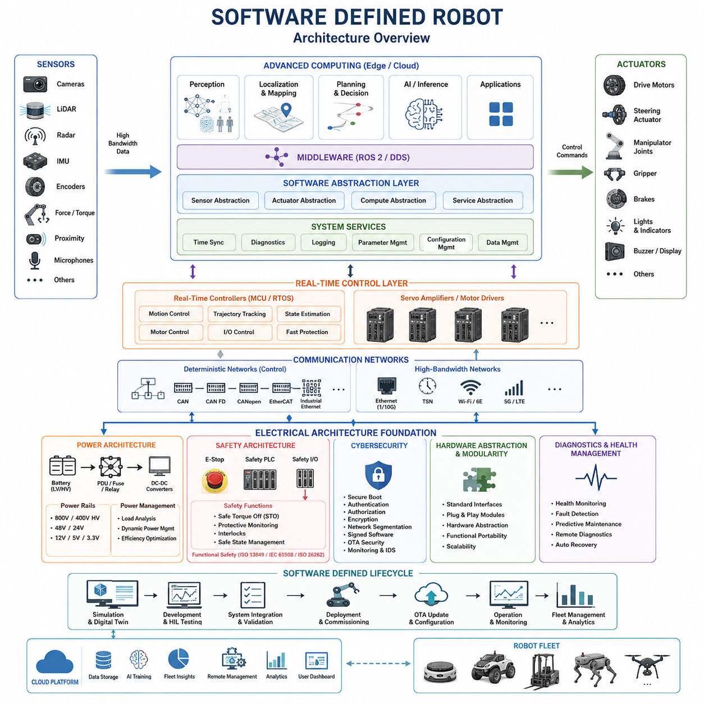
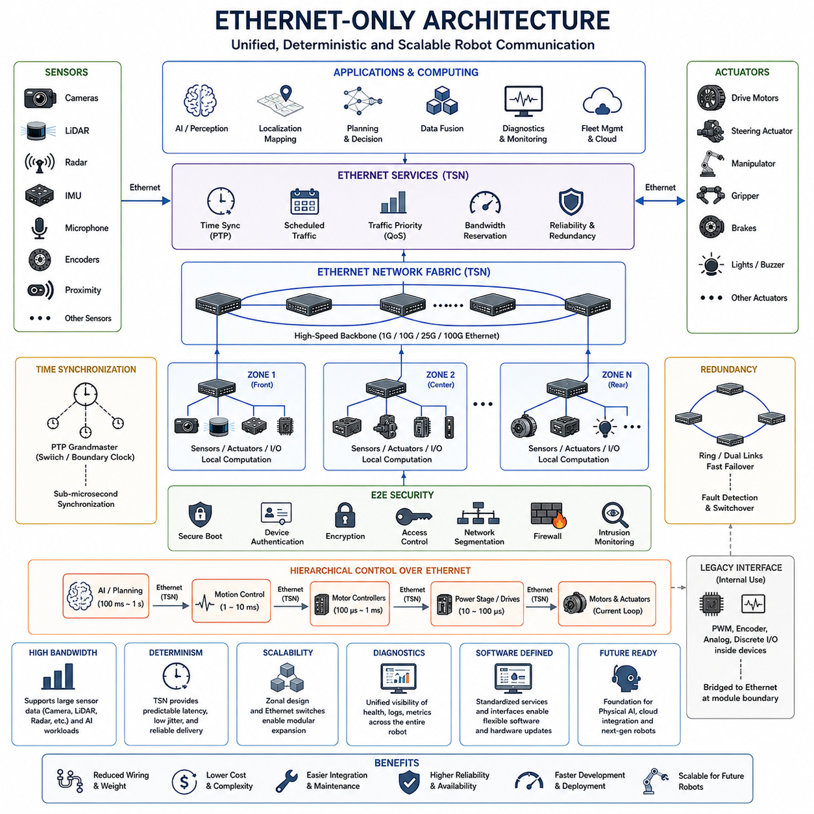
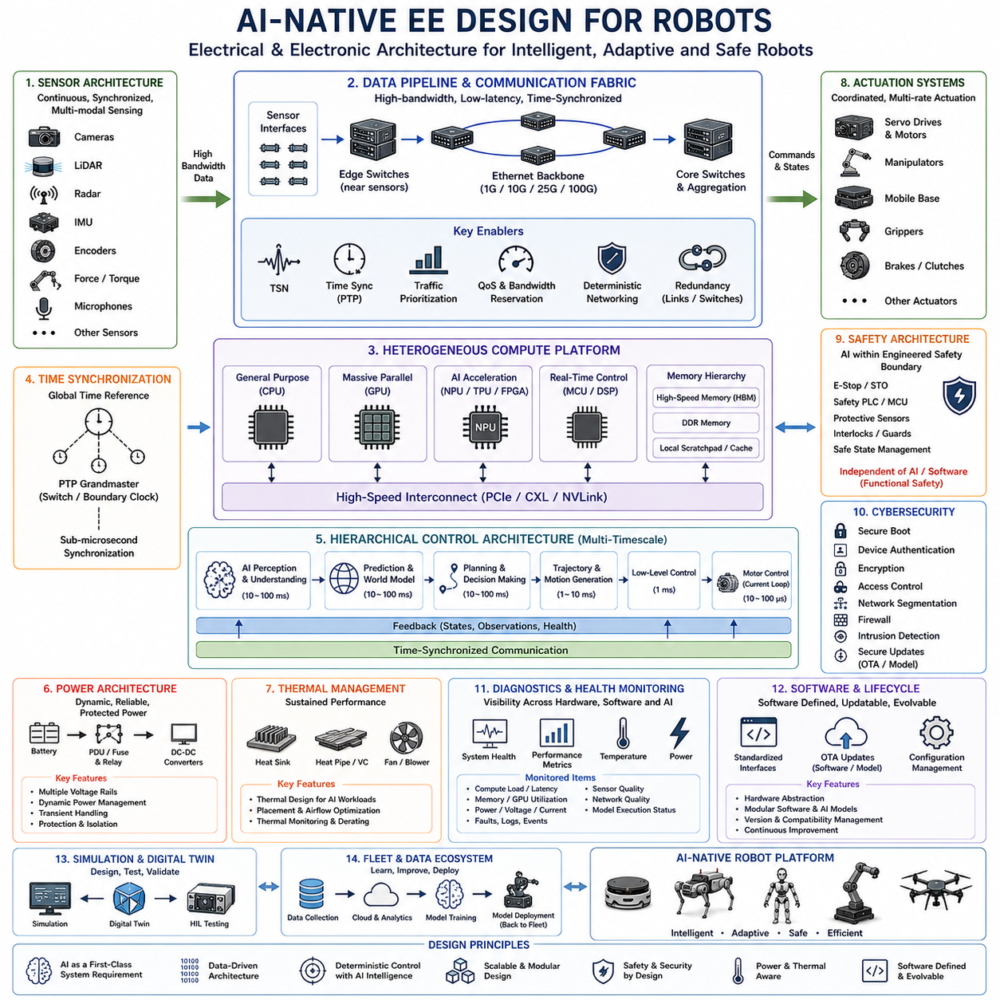
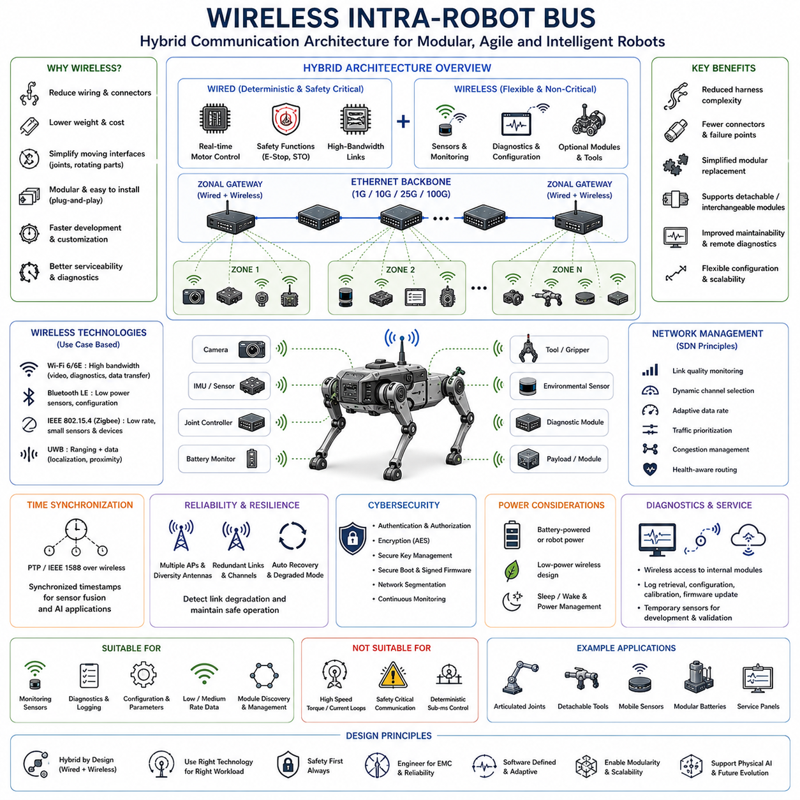
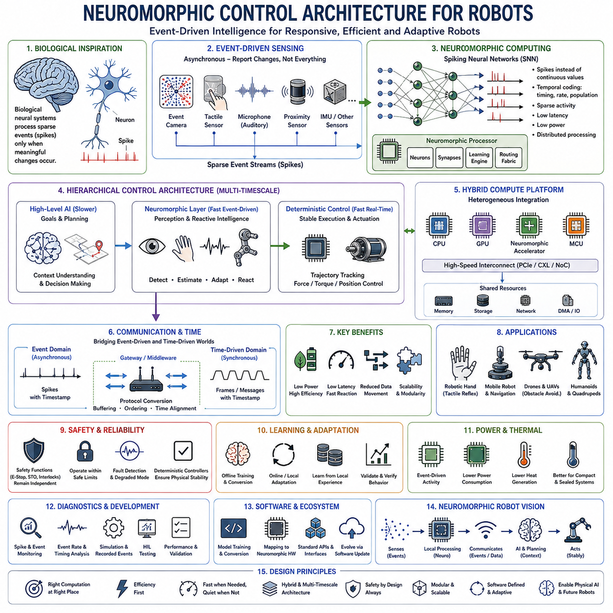

**Volume 01. Electrical Architecture Fundamentals**

# Chapter 10. Future Trends

## 10.01. Software Defined Robot

{width="7.268055555555556in" height="7.268055555555556in"}

A Software Defined Robot represents a shift from hardware-centered robot design toward an architecture in which software determines a large portion of system behavior, capability, configuration, and lifecycle evolution. This concept extends the software-defined approach already seen in modern vehicles and computing platforms into robotics, where sensing, computation, communication, motion control, and safety must operate together as one physical system.

In conventional robots, functionality is often tightly coupled to specific controllers, sensors, actuators, and proprietary interfaces. Changing a robot function may therefore require hardware replacement, controller modification, or extensive system integration. A Software Defined Robot reduces this coupling by introducing standardized interfaces and abstraction layers so that applications can evolve while much of the underlying electrical and mechanical platform remains unchanged.

The electrical architecture provides the physical foundation for this separation. Power distribution, communication networks, sensor interfaces, actuator networks, safety circuits, and computing nodes must be designed so that software-controlled functions can be deployed without compromising deterministic control or electrical safety. This connects the Software Defined Robot directly with the broader evolution of robotics electrical architecture described throughout the volume structure.

A typical architecture separates high-level intelligence from low-level deterministic control. Edge computers or high-performance processors execute perception, localization, planning, AI inference, and application logic, while MCUs, motor controllers, and servo drives maintain faster control loops for torque, velocity, position, and device protection. Software definition therefore does not imply that every function is centralized into one computer; instead, functions are distributed according to timing and safety requirements.

Middleware is essential because software components must communicate independently of specific hardware implementations. Technologies such as ROS 2 and DDS can provide message-oriented interfaces between perception, planning, localization, diagnostics, and control functions. Below this level, deterministic networks such as CAN, CAN FD, CANopen, EtherCAT, or industrial Ethernet can connect embedded controllers and actuators, while Ethernet provides high-bandwidth communication among computing and sensing systems.

Hardware abstraction allows applications to interact with logical capabilities rather than individual electrical devices. A navigation application, for example, should consume localization and obstacle information without depending directly on the electrical implementation of a particular LiDAR or encoder. Similarly, motion commands can be expressed through standardized control interfaces while device-specific drivers translate those commands into the protocol and timing required by individual motor controllers.

This separation enables functional portability. When a camera, LiDAR, compute module, motor controller, or communication interface is replaced, higher-level applications can remain largely unchanged if the hardware abstraction and software interfaces are preserved. The engineering objective is therefore not complete hardware independence, which is unrealistic for physical systems, but controlled dependency through explicitly defined electrical, communication, timing, and software boundaries.

Software-defined functionality also changes the robot lifecycle. Capabilities can be introduced, corrected, calibrated, or optimized after deployment through controlled software updates. Navigation algorithms may improve, perception models may be replaced, energy-management strategies may be adjusted, and diagnostic functions may be extended without redesigning the entire electrical platform. The robot consequently becomes an evolving computing system attached to a persistent physical platform rather than a fixed-function machine.

Over-the-air update mechanisms become particularly important in fleet environments. Software packages, configuration parameters, AI models, calibration data, and diagnostic rules can be distributed to multiple robots through managed deployment processes. Robust implementations require version management, compatibility checking, secure authentication, rollback capability, update integrity verification, and staged deployment so that an unsuccessful update does not disable an operational fleet.

Configuration management allows one common robot platform to support multiple products or missions. The same electrical architecture may operate as an inspection robot, logistics AMR, security platform, mapping vehicle, or specialized autonomous system by changing sensors, software packages, parameters, and mission applications. Product differentiation can therefore move partially from physical redesign toward controlled combinations of modular hardware and software-defined capability.

The Software Defined Robot also creates a natural foundation for Physical AI. Sensor data can be processed by heterogeneous computing resources containing CPUs, GPUs, NPUs, and real-time controllers, while AI models transform observations into representations, predictions, plans, or actions. The electrical architecture must consequently support high sensor bandwidth, synchronized data acquisition, sufficient compute power, deterministic actuator interfaces, and appropriate power and thermal budgets for AI workloads.

Real-time behavior remains a fundamental constraint despite increased software flexibility. Perception and AI inference may operate at relatively moderate rates, while trajectory execution, servo regulation, current control, and protection functions can require substantially faster cycles. A well-designed system therefore uses hierarchical multi-rate control, allowing slower intelligent software to establish goals or references while embedded controllers continuously execute stable and deterministic physical control between high-level updates.

Safety must remain architecturally separated from unrestricted software-defined behavior. Emergency stop circuits, protective monitoring, safe torque off, safety controllers, interlocks, and other critical functions cannot simply depend on general application software. Software-defined capability must operate inside a safety envelope established by independent or sufficiently protected mechanisms so that an application failure, AI error, network interruption, or software update cannot directly create uncontrolled hazardous motion.

Cybersecurity becomes equally important because greater software connectivity increases the robot\'s attack surface. Remote management, fleet communication, cloud interfaces, OTA updates, and downloadable applications create pathways that must be protected through authentication, authorization, encryption, secure boot, signed software, network segmentation, and monitoring. Software flexibility is valuable only when the architecture can establish which software is trusted and which resources each component is permitted to access.

Diagnostics evolve from simple fault-code reporting toward continuous software-visible health management. Computing nodes can monitor voltage rails, communication errors, processor utilization, temperatures, sensor status, actuator faults, battery conditions, and timing performance. These observations can be combined with logs and fleet data to support predictive maintenance, remote troubleshooting, degradation detection, and increasingly automated recovery strategies before failures cause complete mission interruption.

Digital twins and simulation further strengthen the software-defined approach because software functions can be developed against virtual representations before deployment to physical robots. Interfaces shared between simulation and hardware allow perception, planning, control, and mission applications to progress through simulation, hardware-in-the-loop testing, controlled robot testing, and fleet deployment. This reduces the dependency of software development on continuous access to complete physical prototypes.

The long-term significance of the Software Defined Robot is therefore architectural rather than merely computational. Power systems, networks, computing platforms, sensors, actuators, middleware, safety mechanisms, cybersecurity, diagnostics, and AI must be designed around stable interfaces that permit controlled evolution. As these boundaries mature, robot capability increasingly becomes something that can be deployed and improved through software while the physical machine provides a reusable execution platform.

This direction also establishes the foundation for subsequent architectural trends. Ethernet-oriented communication can consolidate high-bandwidth interfaces, AI-native electrical design can optimize systems around intelligent workloads, wireless links may selectively reduce physical communication wiring, and emerging computing technologies may introduce new control paradigms. The Software Defined Robot is thus a transition point between conventional robotic electrical architecture and increasingly adaptive, connected, and intelligence-centered physical machines.

## 10.02. Ethernet Only Architecture

{width="7.268055555555556in" height="7.268055555555556in"}

Ethernet-Only Architecture represents a long-term direction in which Ethernet becomes the primary communication backbone connecting most computational, sensing, control, diagnostic, and service domains of a robot. Instead of maintaining many independent buses for different subsystems, the architecture progressively consolidates communication around a common packet-based network while preserving the timing and reliability required by physical control.

Traditional robots often combine several communication technologies because individual subsystems evolved independently. CAN or CANopen may connect motor controllers, EtherCAT may support deterministic servo networks, Ethernet may connect high-performance computers, and dedicated interfaces may serve cameras or sensors. Although practical, this heterogeneous structure increases gateways, protocol conversion, wiring complexity, integration effort, diagnostic boundaries, and lifecycle maintenance.

An Ethernet-oriented robot reduces these boundaries by providing a common networking foundation from sensors to computing platforms and increasingly toward actuators. Cameras, LiDARs, radar units, edge computers, safety controllers, I/O modules, motor controllers, and diagnostic devices can progressively adopt Ethernet-compatible interfaces. The result is not simply a faster network but an electrical architecture in which communication resources can be designed and managed more consistently.

Bandwidth is one of the strongest motivations for this transition. Modern robots generate large volumes of data from high-resolution cameras, 3D LiDAR, radar, audio, and other intelligent sensors. AI-based perception and sensor fusion require these data streams to reach edge computing systems with sufficiently low latency. Gigabit and multi-gigabit Ethernet provide substantially greater scalability for such workloads than conventional low-bandwidth control buses.

However, raw bandwidth alone cannot satisfy robotic control requirements. Motion systems depend on predictable communication timing, bounded latency, controlled jitter, synchronization, and reliable packet delivery. Standard best-effort Ethernet was not originally designed for deterministic machine control, so an Ethernet-Only Architecture must incorporate real-time networking mechanisms, appropriate scheduling, traffic prioritization, synchronization, and carefully engineered network topology.

Time-Sensitive Networking, commonly called TSN, extends Ethernet with mechanisms intended to support deterministic communication. Time synchronization, scheduled traffic, traffic shaping, prioritization, and resource reservation can allow critical control messages to coexist with high-bandwidth sensor data. This makes it possible to envision one physical networking family supporting both AI-oriented data traffic and timing-sensitive robotic control while maintaining defined quality-of-service requirements.

Precise time synchronization is particularly important because a robot combines information generated by many distributed devices. Camera frames, LiDAR scans, IMU measurements, encoder values, actuator states, and control commands must often be interpreted relative to a common time reference. Ethernet-based synchronization mechanisms such as Precision Time Protocol can distribute accurate timing information and improve sensor fusion, state estimation, coordinated motion, and diagnostic reconstruction.

Network topology also becomes a central electrical architecture decision. Instead of connecting every device to one central controller, Ethernet switches can create hierarchical, zonal, star, ring, or redundant network structures. Local devices may connect to nearby switches while high-capacity backbone links connect zones to central computing resources. This approach can reduce long point-to-point wiring and support modular robot construction as system complexity increases.

Zonal architecture is especially compatible with Ethernet consolidation. A mobile robot, quadruped, humanoid, autonomous vehicle, or manipulator can be divided into physical zones containing sensors, actuators, I/O, and local controllers. Each zone aggregates communication through a local network node, while a high-speed Ethernet backbone connects the zones. Physical wiring organization can therefore become more closely aligned with mechanical packaging rather than functional ECU boundaries.

Ethernet-Only Architecture does not necessarily mean that every low-level electrical signal disappears. PWM, encoder signals, analog sensing, discrete I/O, and internal chip-level interfaces may still exist locally inside devices or modules. The architectural objective is that communication between major distributed modules increasingly converges on Ethernet, while specialized electrical interfaces remain contained within the components where they are technically appropriate.

Motor and servo control represent one of the most demanding areas of this transition. Conventional robots commonly rely on CANopen, EtherCAT, or proprietary real-time networks because actuator coordination requires deterministic timing. Future Ethernet-based motor controllers can expose standardized network interfaces while retaining local high-frequency current, torque, velocity, and position loops. The network then carries coordinated references and state information without replacing every internal control loop.

This hierarchical control principle is important for maintaining stability. A high-performance computer may perform perception and planning at relatively slow rates, while trajectory controllers operate faster and motor electronics execute current regulation at much higher frequencies. Ethernet connects these computational layers, but each layer retains control responsibilities appropriate to its timing requirements. Ethernet consolidation therefore concerns communication architecture rather than forcing all control computation into a single cycle.

Traffic engineering becomes necessary when heterogeneous workloads share the same network. High-resolution video can consume large amounts of bandwidth, while control packets may contain only a few bytes but require predictable delivery. Diagnostic logs, software updates, AI model transfers, and fleet communication create additional traffic classes. Network design must therefore consider priority, bandwidth reservation, congestion behavior, latency limits, and fault containment instead of treating all packets equally.

Redundancy is also required for robots whose operation cannot tolerate a single network failure. Dual links, redundant switches, alternative communication paths, ring structures, and duplicated computing interfaces can maintain communication when individual components or cables fail. Fault detection must identify degraded links and trigger controlled switchover without introducing unacceptable interruption to safety-critical or motion-critical communication.

Safety communication introduces another important requirement. Safety-related information such as emergency states, protective sensor status, safe motion commands, and actuator shutdown requests must maintain defined integrity even when transmitted through shared networking infrastructure. An Ethernet-oriented architecture must therefore separate ordinary application communication from safety functions logically or physically and provide mechanisms capable of detecting corruption, delay, duplication, loss, or incorrect sequencing.

Cybersecurity becomes more significant as Ethernet reaches deeper into the robot. A unified IP-capable network simplifies integration with edge computers, fleet systems, diagnostic tools, and cloud infrastructure, but it can also create broader paths between previously isolated subsystems. Secure boot, device authentication, encrypted communication, access control, network segmentation, firewalling, intrusion monitoring, and signed software become fundamental elements of the electrical and communication architecture.

Diagnostics can benefit substantially from network convergence. When devices share a common communication framework, health information, network statistics, fault records, firmware versions, temperatures, voltage conditions, and performance metrics can be collected through standardized services. Engineers can observe the robot as one distributed system rather than accessing numerous proprietary buses separately, improving commissioning, troubleshooting, predictive maintenance, and fleet-level analysis.

Ethernet convergence also supports the Software Defined Robot because standardized networking makes hardware resources more accessible through software abstractions. Sensors and actuators can expose discoverable services, computing workloads can move between processors, and software components can communicate through stable interfaces. Hardware replacement becomes easier when new devices preserve the expected network behavior, data models, timing contracts, and functional interfaces.

The transition toward Ethernet-Only Architecture will therefore occur progressively rather than through immediate elimination of existing protocols. CAN, CAN FD, CANopen, EtherCAT, and specialized interfaces will continue to be useful where cost, determinism, installed hardware, or simplicity favors them. Gateways and hybrid networks will remain common during the transition while Ethernet expands from high-bandwidth computing networks toward increasingly distributed sensing and control domains.

In future Physical AI systems, this convergence can create a unified nervous system for the robot. Large sensor streams can travel toward AI computing resources, synchronized state information can support world modeling and planning, and coordinated commands can propagate toward distributed controllers and actuators. The same infrastructure can simultaneously support diagnostics, configuration, OTA updates, logging, simulation interfaces, and fleet connectivity.

Ethernet-Only Architecture should therefore be understood as an architectural convergence target rather than a literal requirement that every electrical connection use Ethernet. Its significance lies in replacing fragmented communication domains with a scalable, synchronized, manageable, and increasingly deterministic networking foundation. Combined with zonal design, heterogeneous computing, software-defined functionality, and AI-native systems, it can become a core communication architecture for future intelligent robots.

## 10.03. AI Native EE Design

{width="7.268055555555556in" height="7.268055555555556in"}

AI-native electrical and electronic design treats artificial intelligence as a fundamental system requirement rather than an application added after the robot hardware has been completed. The electrical architecture is therefore planned from the beginning around continuous sensing, high-volume data movement, heterogeneous computation, intelligent decision making, and coordinated actuation. This extends the Physical AI electrical architecture concepts established earlier in the volume toward future robot platforms.

Conventional robot electrical systems are commonly organized around predefined control functions. Sensors provide measurements, controllers execute programmed algorithms, and actuators perform deterministic commands. AI-native design changes this assumption because perception, prediction, planning, and learned control can become major computational workloads. Electrical resources must consequently support both conventional real-time control and computationally intensive AI functions within one coordinated architecture.

The sensor architecture becomes a primary design input because AI performance depends strongly on the quality, diversity, synchronization, and availability of observations. Cameras, LiDAR, radar, IMUs, encoders, force sensors, microphones, and other sensing devices may continuously generate multimodal data. Their bandwidth, sampling rates, latency, power consumption, synchronization accuracy, physical placement, and failure characteristics must be considered before the computing architecture is selected.

AI-native robots therefore require a high-bandwidth sensor-to-compute pipeline. Large perception streams must move efficiently from distributed sensors toward processing resources without excessive copying, conversion, congestion, or latency. High-speed Ethernet and other suitable interfaces can form the data backbone, while synchronized acquisition allows observations from different sensors to be associated with a common physical state. Communication architecture becomes part of AI performance rather than merely a connectivity function.

Computing resources are typically heterogeneous because different workloads have different execution characteristics. CPUs are effective for general system logic and orchestration, GPUs provide massive parallel processing for neural networks and perception, NPUs or dedicated accelerators can improve inference efficiency, and MCUs or real-time processors maintain deterministic low-level control. AI-native design assigns workloads to these resources according to latency, throughput, determinism, power, thermal, and safety requirements.

This heterogeneous structure naturally creates multiple computational timescales. AI perception and planning may execute at tens of milliseconds or slower depending on workload complexity, while motion control may operate at millisecond-level periods and motor current regulation at microsecond-level periods. The electrical architecture must connect these layers without assuming that one processor or one execution rate can control the complete physical system.

A hierarchical control architecture is therefore essential. AI computing determines higher-level representations, predictions, goals, trajectories, or actions, while embedded controllers transform these outputs into deterministic actuator commands. Servo drives and motor electronics execute the fastest physical control loops locally. This separation allows learned intelligence to influence robot behavior without requiring neural-network inference to replace every conventional feedback controller.

Memory architecture also becomes important because AI workloads repeatedly move large tensors, images, point clouds, feature maps, and model parameters. Compute performance can be limited by memory bandwidth and data transfer even when processors provide sufficient arithmetic capability. AI-native electrical design must therefore consider memory capacity, memory bandwidth, processor interconnects, direct data paths, buffering, and data locality as system-level engineering parameters.

Power architecture must be designed around dynamic AI workloads rather than fixed average consumption alone. GPUs and accelerators can rapidly change power demand as perception, inference, training, mapping, or planning workloads vary. Sensors and communication devices add additional loads, while motors may simultaneously create large transient demands. Power distribution must maintain stable voltage rails and appropriate protection across these interacting electrical domains.

Dynamic power management can coordinate these demands by monitoring system state and allocating energy according to operational priority. Compute frequencies may be adjusted, inactive accelerators may enter lower-power states, sensor modes may change, and noncritical workloads may be reduced when battery capacity or thermal margin becomes limited. AI itself can eventually participate in energy optimization, but electrical protection and fundamental power stability must remain independent of learned behavior.

Thermal engineering is closely coupled with the electrical power budget. High-performance processors can generate concentrated heat inside compact robot enclosures where airflow may be restricted by environmental sealing, mechanical packaging, or weight constraints. Cooling capacity, heat spreading, processor placement, sensor temperature sensitivity, and thermal derating must therefore be considered together. Sustained AI performance is determined by thermal capability as much as peak processor specifications.

Communication networks must simultaneously support high-volume AI data and deterministic control traffic. Camera and LiDAR streams can consume substantial bandwidth, whereas actuator commands may contain little data but require predictable latency and low jitter. Ethernet-oriented architectures, traffic prioritization, time synchronization, and deterministic networking technologies such as TSN can help separate these requirements while maintaining a more unified communication infrastructure.

Time synchronization is particularly important for Physical AI because intelligence depends on understanding how observations correspond to physical events. Sensor measurements, actuator states, localization estimates, AI outputs, and control commands should share sufficiently accurate timestamps. A synchronized architecture improves multimodal sensor fusion, state estimation, trajectory reconstruction, dataset generation, fault analysis, and the alignment between perception and physical action.

AI-native design must also recognize uncertainty and degradation. Sensors may become obstructed, communication may experience faults, computational workloads may miss deadlines, and AI models may produce uncertain or incorrect outputs. Electrical architecture should provide health monitoring, redundant sensing where required, watchdogs, fault containment, degraded operating modes, and independent protective mechanisms. Intelligent behavior must therefore exist within an engineered operational envelope.

Functional safety remains distinct from AI capability. Emergency stopping, safe torque off, protective sensing, interlocks, power isolation, and other critical mechanisms should not depend exclusively on probabilistic AI decisions. The architecture must establish clear boundaries between learned functions and safety functions so that failures in perception, planning, software, communication, or computing cannot directly produce uncontrolled hazardous behavior.

Cybersecurity becomes equally fundamental because AI-native robots depend heavily on software, models, data, and networked computing resources. Secure boot, authenticated devices, signed firmware, protected AI models, encrypted communication, access control, network segmentation, and secure update mechanisms protect both conventional control software and learned components. Model replacement or configuration changes must be managed with the same discipline as other safety-relevant software changes.

Diagnostics should extend beyond conventional electrical fault detection into AI and compute health monitoring. The system can observe processor load, memory utilization, inference latency, dropped sensor frames, network congestion, synchronization quality, accelerator temperature, power consumption, and model execution status. These measurements provide engineers with visibility into whether reduced robot performance originates from hardware, networking, software, or AI workload behavior.

Software-defined functionality complements AI-native electrical design because AI models and applications will evolve much faster than the robot\'s mechanical platform. Standardized interfaces and hardware abstraction allow perception models, planning systems, accelerators, sensors, and computing modules to change without redesigning the entire robot. OTA updates can distribute improved models and software, while compatibility management ensures that updates remain consistent with available hardware resources.

Simulation and digital twins can become part of the electrical development process rather than remaining purely software tools. Virtual sensors, computing workloads, communication delays, actuator interfaces, power conditions, and failure scenarios can be modeled before physical deployment. Hardware-in-the-loop testing can then connect real controllers and computing devices to simulated environments, creating a progression from AI development to electrical integration and finally physical robot validation.

At fleet scale, AI-native architecture enables individual robots to become distributed data and learning nodes. Operational data can be collected, analyzed, and used to improve models, while updated intelligence can later return to deployed machines through controlled software and model deployment. The electrical platform must therefore support not only local autonomy but also data logging, storage, connectivity, diagnostics, configuration management, and lifecycle evolution.

AI-native EE design ultimately changes the engineering question from how to attach AI computing to an existing robot into how the entire electrical system should be constructed for continuous machine intelligence. Sensors, compute, networks, power, thermal management, actuators, safety, diagnostics, and software interfaces become mutually dependent design domains. This convergence provides the electrical foundation for increasingly adaptive, software-defined, and Physical AI-centered robotic systems.

## 10.04. Wireless Intra Robot Bus

{width="7.268055555555556in" height="7.268055555555556in"}

A Wireless Intra-Robot Bus represents a future communication architecture in which selected data links inside a robot are replaced or complemented by short-range wireless connections. Instead of requiring a dedicated communication cable between every distributed sensor, controller, actuator, and diagnostic module, suitable devices can exchange information through managed wireless networks while the electrical architecture preserves wired connections where determinism, safety, bandwidth, or reliability demands them.

Traditional robot architectures depend heavily on physical communication wiring such as CAN, CAN FD, CANopen, EtherCAT, Ethernet, serial buses, and discrete signal lines. These technologies provide reliable communication but require connectors, harness branches, shielding, routing space, mounting structures, and assembly processes. As robots gain more sensors, joints, and intelligent modules, communication harnesses can become increasingly complex and contribute significant weight, cost, packaging difficulty, and maintenance effort.

Wireless intra-robot communication aims to reduce this complexity by creating local radio links between distributed electronic modules. A central or zonal communication node may exchange data with sensors and peripheral controllers without dedicated point-to-point data wiring. Power cables may still be required, but eliminating selected communication conductors can simplify harness topology, reduce connector pin counts, and make modular components easier to install, replace, or relocate during robot development.

The concept is especially attractive for highly articulated robots. Manipulators, quadrupeds, and humanoids contain rotating joints and moving mechanical structures where cables repeatedly bend, twist, and experience mechanical stress. Wireless communication can potentially reduce the number of signal conductors crossing these moving interfaces. Slip rings, flexible harnesses, cable chains, and complex routing mechanisms may therefore be simplified for appropriate noncritical communication functions.

Modularity is another important motivation. A wireless sensor or intelligent module can potentially join the robot network through discovery, authentication, configuration, and logical addressing rather than requiring a dedicated physical communication path. Optional cameras, environmental sensors, diagnostic modules, tools, grippers, or payload devices could be installed with less communication rewiring, supporting configurable robot platforms and faster product customization.

Several wireless technologies can contribute depending on application requirements. Wi-Fi can provide relatively high bandwidth for cameras, diagnostics, configuration, and software transfer, while Bluetooth Low Energy can support low-power sensors and configuration interfaces. IEEE 802.15.4-class technologies can serve low-rate distributed devices, and ultra-wideband can provide communication together with ranging capabilities. No single wireless technology is optimal for every intra-robot function.

Bandwidth requirements vary greatly across robotic subsystems. Video and other rich sensor streams may require high-throughput links, while temperature sensors, switches, battery monitors, or diagnostic devices transmit relatively small amounts of data. Wireless architecture must therefore match communication technology to workload instead of connecting all devices through one radio mechanism. Capacity planning must also account for simultaneous traffic, retransmissions, protocol overhead, and interference.

Latency and determinism present greater challenges. Wired real-time networks can provide tightly controlled communication behavior, whereas wireless channels are affected by contention, interference, fading, obstruction, and retransmission. These effects can create variable latency and packet loss. Consequently, conventional wireless links are generally better suited to monitoring, diagnostics, configuration, and noncritical sensing than to the fastest torque, current, or safety-control loops.

A practical architecture therefore follows a hybrid principle. High-speed deterministic motor control, emergency functions, and critical safety communication can remain wired, while suitable sensing, monitoring, service, and configuration traffic migrates toward wireless links. The Wireless Intra-Robot Bus should not be interpreted as an immediate replacement for every cable, but as a selective architectural tool for reducing wiring where wireless behavior satisfies the required timing and reliability envelope.

Zonal architecture can provide an effective framework for this hybrid approach. Local wired networks can connect critical devices inside each physical zone, while wireless links connect selected peripheral modules or provide secondary communication paths. A zonal gateway can aggregate wireless traffic and forward it onto the robot\'s Ethernet backbone. This keeps radio complexity localized and allows the rest of the computing system to interact with devices through standardized network services.

Time synchronization remains important even when data is transmitted wirelessly. Sensor measurements must be associated with the physical time at which they were captured rather than simply the time at which packets arrive. Local clocks, synchronized timestamps, buffering, and timing correction can therefore help maintain useful temporal relationships among wireless sensors, wired sensors, actuator states, and computing systems, particularly for sensor fusion and Physical AI applications.

Reliability engineering must consider the robot itself as a changing radio environment. Motors, inverters, switching power converters, high-current cables, processors, metallic structures, batteries, and moving joints can affect electromagnetic conditions and signal propagation. Robot posture can alter antenna orientation or create temporary obstruction. Wireless performance must therefore be evaluated across operating configurations rather than only under ideal laboratory conditions.

Electromagnetic compatibility becomes closely connected with wireless design. Existing electrical systems generate conducted and radiated emissions, while intentional radio transmitters introduce additional electromagnetic energy. Antenna placement, grounding, shielding, filtering, frequency planning, transmit power, cable routing, and enclosure design must be engineered together. Wireless integration is consequently an electrical and EMC problem as much as a networking problem.

Redundancy can improve resilience where wireless communication performs important but recoverable functions. Multiple access points, diversity antennas, alternative channels, redundant radios, or wired fallback paths can reduce dependence on a single radio link. The system should detect deteriorating communication quality and transition to an appropriate degraded mode rather than allowing unpredictable network conditions to propagate directly into unsafe robot behavior.

Cybersecurity becomes particularly significant because wireless communication removes the physical boundary created by a cable. Devices must authenticate before joining the robot network, and communication should be protected against unauthorized access, spoofing, replay, modification, and eavesdropping. Encryption, secure key management, device identity, access control, secure boot, signed firmware, network segmentation, and continuous monitoring become fundamental design requirements.

Power consumption must also be considered. Removing communication wires does not eliminate the need to power sensors and controllers. Battery-powered wireless modules may simplify installation but introduce charging, replacement, lifetime, and maintenance requirements. Devices already connected to robot power can use wireless communication while retaining power wiring. The actual benefit therefore depends on whether reduced data wiring outweighs radio power consumption and added electronic complexity.

Diagnostics can benefit strongly from wireless connectivity. Service tools may connect to internal modules without opening enclosures or attaching diagnostic cables, allowing engineers to inspect status, retrieve logs, configure parameters, perform calibration, or update firmware. Temporary wireless sensors can also be installed during development and validation, making the technology useful even when production control networks remain predominantly wired.

Wireless links can support rotating or detachable robot modules particularly well. Tool changers, interchangeable end effectors, removable payloads, service panels, mobile sensor packages, and modular batteries can establish communication automatically when installed. Combined with device discovery and standardized software interfaces, this approach can support plug-and-play robotics in which the system identifies a module, loads its configuration, and exposes its capabilities to higher-level software.

Software-defined networking concepts can further improve wireless intra-robot communication. The robot can monitor link quality, congestion, latency, device state, and application priority, then adapt channel selection, routing, transmission rate, or traffic allocation. Noncritical traffic can be delayed during interference, while higher-priority data receives greater communication resources. Such adaptation makes the wireless network an actively managed part of robot operation.

Physical AI introduces additional opportunities because intelligent systems can use network health as part of their operational context. A robot may recognize that a wireless sensor has degraded reliability, reduce dependence on its measurements, switch to alternative sensing, or adjust its behavior until communication improves. However, these intelligent responses should complement rather than replace deterministic fault handling and independent safety mechanisms.

Safety-critical functions require particularly conservative treatment. Emergency stop, safe torque off, protective sensing, and other functions with strict integrity and timing requirements should use communication mechanisms demonstrated to satisfy the applicable safety requirements. General-purpose wireless communication should not automatically be assumed suitable for such functions merely because average latency or packet delivery appears adequate during normal operation.

The long-term direction is therefore likely to combine high-speed Ethernet backbones, deterministic wired control networks, local electrical interfaces, and selectively deployed wireless links. Each communication technology can occupy the layer where its characteristics provide the greatest engineering benefit. Wireless connections reduce harness complexity and increase modularity, while wired networks preserve predictable behavior for demanding control and safety functions.

A Wireless Intra-Robot Bus should ultimately be viewed as part of the broader evolution toward software-defined, modular, AI-native electrical architecture rather than as a goal of eliminating wiring completely. When applied selectively, it can reduce communication harnesses, simplify moving interfaces, improve serviceability, enable detachable modules, and increase configuration flexibility while maintaining the deterministic wired foundation required for reliable physical control.

## 10.05. Neuromorphic Control

{width="7.268055555555556in" height="7.268055555555556in"}

Neuromorphic control represents a future robotics approach in which sensing, computation, and control are designed using principles inspired by biological nervous systems. Instead of continuously processing every signal through conventional clock-driven processors, neuromorphic systems can represent information as sparse events and process changes only when meaningful activity occurs. This approach offers a potential path toward highly responsive and energy-efficient control for future intelligent robots.

Conventional robotic computing relies primarily on CPUs, GPUs, MCUs, and digital signal processors executing instructions according to clocks and predefined computational sequences. These architectures are extremely capable, but continuous sensing and AI processing can consume substantial energy and memory bandwidth. Neuromorphic computing explores a different model in which distributed processing elements communicate through event-driven signals resembling the spike-based communication found in biological neural systems.

Spiking Neural Networks, commonly called SNNs, are a central computational model in neuromorphic systems. Instead of transmitting continuously valued activations at every processing step, artificial neurons generate discrete spikes when their internal state reaches defined conditions. Information can be represented through spike timing, frequency, population activity, or combinations of these mechanisms, allowing computation to remain sparse when the physical environment changes slowly.

Event-driven sensors naturally complement this architecture. Conventional cameras repeatedly transmit complete image frames even when most pixels remain unchanged, whereas event cameras report local brightness changes asynchronously. Similar event-oriented principles can potentially be applied to tactile sensing, auditory processing, proximity detection, and other robotic observations. The sensor-to-compute pipeline can therefore react directly to physical changes instead of continuously transferring redundant measurements.

This event-driven behavior can reduce communication and memory requirements because inactive information does not need to move repeatedly through the system. A conventional perception pipeline may continuously transfer frames into memory and execute large neural networks, while a neuromorphic pipeline can process only relevant events. For battery-powered mobile robots, humanoids, quadrupeds, drones, and distributed intelligent sensors, reduced data movement can translate into meaningful improvements in energy efficiency.

Low latency is another important potential advantage. Events can propagate through a neuromorphic processing system immediately after a physical change is detected rather than waiting for the next camera frame or scheduled processing cycle. This characteristic can support rapid reactions to collisions, slipping, contact changes, fast-moving objects, or unexpected disturbances. Neuromorphic processing is therefore particularly interesting for reflex-like robotic functions where response speed matters.

Neuromorphic control should not be interpreted as replacing every conventional feedback controller. Motor current loops, torque regulation, velocity control, position control, and safety functions already have mature deterministic implementations. A practical architecture can instead place neuromorphic processing above or beside these controllers, using event-driven intelligence to detect conditions, estimate states, generate adaptive references, or initiate rapid behavioral responses while conventional controllers maintain physical stability.

This creates a hierarchical control structure similar to biological motor systems. High-level AI can determine goals and plans, neuromorphic processing can provide rapid event-driven perception and reactive behavior, and deterministic embedded controllers can execute trajectories and regulate actuators. Each computational layer operates according to a different timescale and computational principle, allowing the robot to combine reasoning, fast reaction, and precise physical control.

Neuromorphic processors are designed to execute these event-driven neural workloads efficiently. Rather than concentrating all computation in a small number of powerful cores, many architectures distribute computation and memory across large populations of neuron-like processing elements. Keeping state close to computation can reduce repeated transfers between processors and external memory, addressing one of the major energy costs associated with conventional AI acceleration.

The electrical architecture must change when neuromorphic processors become part of the robot. Sensor interfaces, processor interconnects, power rails, timing mechanisms, memory resources, and communication networks must support both conventional and event-driven computing. A robot may contain CPUs and GPUs for planning and large AI models, neuromorphic accelerators for sparse perception and reactive processing, and MCUs for deterministic real-time control, forming a highly heterogeneous computing platform.

Communication between these domains requires carefully defined interfaces. Frame-based sensor data, event streams, conventional software messages, actuator states, and control commands may use different representations and timing models. Gateways or middleware can translate between event-driven and time-triggered domains. The architecture must preserve timestamps and event ordering so that asynchronous information remains meaningful when combined with conventional synchronized sensor and control data.

Time has a particularly important meaning in neuromorphic systems because the timing of an event can itself carry information. Instead of treating time only as a scheduling parameter, neural processing may use temporal relationships between spikes as part of the computation. Accurate timestamping, controlled communication latency, and synchronization between neuromorphic and conventional computing domains therefore become important when event-driven perception interacts with physical robot motion.

Learning can also occur differently in neuromorphic architectures. Spiking networks may use conventional offline training followed by conversion or deployment, while other approaches explore local learning rules and temporal adaptation. In future robots, neuromorphic processors could potentially adapt selected behaviors from local sensory experience without continuously transferring large datasets to centralized processors. However, learning stability, validation, and predictable behavior remain important engineering challenges.

Power architecture is one of the strongest reasons to investigate neuromorphic computing. Event-driven processors can remain relatively inactive when little useful information changes and become computationally active when events occur. This contrasts with continuously executing high-rate perception pipelines. For robots operating from batteries, lower average compute power can increase operating time, reduce battery capacity requirements, and decrease the electrical load allocated to cooling systems.

Thermal management can benefit from the same efficiency. High-performance GPUs can produce substantial concentrated heat, requiring heat sinks, fans, heat pipes, or other cooling structures. Low-power neuromorphic accelerators may allow selected perception and reactive workloads to operate with lower thermal output. This can be valuable in compact joints, sensor modules, sealed enclosures, small mobile robots, or other locations where conventional high-performance computing cannot easily be installed.

Distributed intelligence becomes possible when low-power neuromorphic processing is placed near sensors or actuators. A smart camera, tactile module, robotic hand, joint controller, or proximity sensor could perform local event processing before sending information to the main computer. Instead of transmitting raw data continuously, the module could communicate detected features, changes, hazards, or compact neural events, reducing backbone traffic and central computational load.

Robotic manipulation provides an interesting application because contact interaction produces rapid and highly localized sensory changes. Event-driven tactile processing could detect initial contact, slip, vibration, texture changes, or unexpected force transitions and trigger fast local responses. A robotic hand could therefore combine slower vision-based planning with faster neuromorphic tactile reflexes while conventional servo controllers maintain stable force and joint control.

Mobile robots and autonomous vehicles can similarly benefit from rapid event-based perception. Event cameras can capture high-speed motion and large illumination changes without requiring conventional frame exposure. Neuromorphic processing could detect approaching obstacles, motion boundaries, or sudden environmental changes with low latency. These capabilities can complement conventional cameras, LiDAR, radar, localization, and AI perception rather than necessarily replacing them.

Safety boundaries remain essential because neuromorphic computation is still an intelligent processing mechanism rather than an inherently safe control architecture. Emergency stop, safe torque off, protective sensing, interlocks, and other safety-critical functions must continue to satisfy defined functional safety requirements independently of experimental neural behavior. Neuromorphic outputs should therefore operate inside controlled safety and actuator limits.

Diagnostics and validation introduce new challenges because event-driven neural systems do not behave like conventional sequential software. Engineers must observe spike activity, event rates, timing distributions, neural states, power consumption, processing latency, and output confidence while relating these measurements to physical robot behavior. Simulation, recorded event streams, hardware-in-the-loop testing, and controlled physical experiments become important tools for verifying system performance.

Software tools must also bridge conventional AI development and neuromorphic deployment. Models may need to be trained, converted, quantized, mapped onto specialized hardware, and evaluated under hardware-specific constraints. Standard interfaces will be important so that neuromorphic accelerators can evolve without forcing complete redesign of perception and control software. This aligns neuromorphic computing with the broader direction of software-defined robotic platforms.

Neuromorphic control therefore represents a complementary computational layer within future AI-native electrical architecture rather than a universal replacement for CPUs, GPUs, networks, or embedded controllers. Conventional processors provide flexible computation, GPUs handle large neural workloads, MCUs maintain deterministic control, and neuromorphic processors can specialize in sparse, asynchronous, low-latency intelligence. The engineering value emerges from assigning each workload to the architecture best suited to it.

The long-term vision is a robot whose electrical and computing architecture resembles a distributed artificial nervous system. Sensors generate meaningful events, local processors interpret them near their source, communication networks propagate relevant information, higher-level AI develops context and plans, and deterministic controllers translate decisions into stable physical action. Neuromorphic control can become one enabling technology for robots that are more responsive, distributed, adaptive, and energy-efficient.
